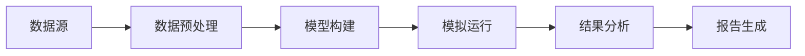

                 


# AI Agent在企业风险情景模拟与压力测试中的应用

## 关键词
AI Agent, 风险情景模拟, 压力测试, 强化学习, 蒙特卡洛模拟

## 摘要
本文探讨AI Agent在企业风险情景模拟与压力测试中的应用，详细分析其核心概念、算法原理、系统架构，并通过案例展示其实际应用，最后总结最佳实践。

---

## 第一部分: 背景介绍

### 第1章: AI Agent的基本概念与背景介绍

#### 1.1 问题背景
- **1.1.1 企业风险管理的重要性**：企业面临多种风险，如市场波动、供应链中断，需有效管理以确保稳定运营。
- **1.1.2 风险情景模拟与压力测试的定义**：通过构建模型预测风险，评估企业应对策略。
- **1.1.3 AI Agent在风险管理中的作用**：AI Agent通过实时数据处理和决策优化，提升风险应对能力。

#### 1.2 问题描述
- **1.2.1 传统风险管理的局限性**：依赖人工分析，耗时且缺乏动态性。
- **1.2.2 现代企业面临的复杂风险环境**：风险因素多样，传统方法难以全面应对。
- **1.2.3 AI Agent如何解决传统方法的不足**：通过自动化和智能化提升风险管理效率。

#### 1.3 问题解决
- **1.3.1 AI Agent的核心优势**：快速响应、自适应能力强。
- **1.3.2 企业风险情景模拟的流程**：数据采集、模型构建、模拟运行、结果分析。
- **1.3.3 压力测试的具体应用场景**：评估极端情况下的企业韧性。

#### 1.4 边界与外延
- **1.4.1 AI Agent的适用范围**：适用于数据驱动的决策场景，如金融、供应链管理。
- **1.4.2 风险情景模拟的边界条件**：数据质量和模型假设的准确性。
- **1.4.3 与其他风险管理方法的对比**：AI Agent的优势在于动态性和实时性。

#### 1.5 概念结构与核心要素
- **1.5.1 AI Agent的核心要素**：感知、决策、行动、学习。
- **1.5.2 风险情景模拟的要素**：数据源、模型、算法、结果分析。

---

## 第二部分: 核心概念与联系

### 第2章: AI Agent的核心概念与联系

#### 2.1 核心概念原理
- **2.1.1 AI Agent的原理**：通过感知环境，基于历史数据和实时信息做出决策。

#### 2.2 属性对比表格
| 属性 | AI Agent | 传统方法 |
|------|----------|----------|
| 响应速度 | 快速 | 较慢 |
| 数据依赖性 | 高 | 中 |
| 适应性 | 强 | 弱 |

#### 2.3 ER实体关系图
```mermaid
er
  entity 企业 {
    <角色> 风险管理部
    <实体> 风险
    <实体> AI Agent
  }
  风险 --> AI Agent: 输入
  AI Agent --> 企业: 输出
```

---

## 第三部分: 算法原理

### 第3章: AI Agent的算法原理

#### 3.1 强化学习
- **3.1.1 Q-learning算法**：通过状态-动作-奖励机制优化决策。
  ```mermaid
  graph TD
    S1 -> S2: 动作a
    S2 --> R: 奖励
    R --> Q-learning算法
  ```
  Python代码示例：
  ```python
  import numpy as np
  from collections import defaultdict

  class QLearningAgent:
      def __init__(self, actions):
          self.actions = actions
          self.q = defaultdict(float)
      
      def act(self, state):
          # 探索与利用
          if np.random.random() < 0.1:
              return np.random.choice(self.actions)
          else:
              return max(self.q[(state, a)] for a in self.actions)
      
      def learn(self, state, action, reward, next_state):
          target = reward + 0.8 * max(self.q.get((next_state, a), 0) for a in self.actions)
          self.q[(state, action)] = self.q.get((state, action), 0) + 0.2 * (target - self.q.get((state, action), 0))
  ```
  数学公式：
  $$ Q(s, a) = Q(s, a) + \alpha (r + \gamma \max Q(s', a') - Q(s, a)) $$

#### 3.2 蒙特卡洛模拟
- **3.2.1 原理**：通过多次模拟预测风险分布。
  ```mermaid
  graph TD
    Start --> Simulate: 进行一次模拟
    Simulate --> Collect: 收集结果
    Collect --> Check: 是否达到次数？
    Check --> Continue: 继续模拟
    Collect --> End
  ```
  Python代码示例：
  ```python
  import numpy as np

  def monte_carlo_simulation(iterations=1000):
      results = []
      for _ in range(iterations):
          # 模拟过程
          result = np.random.normal(0, 1)
          results.append(result)
      return results

  # 示例应用
  simulations = monte_carlo_simulation(1000)
  print(simulations)
  ```

---

## 第四部分: 数学模型与公式

### 第4章: AI Agent的数学模型与公式

#### 4.1 Q-learning公式
$$ Q(s, a) = Q(s, a) + \alpha (r + \gamma \max Q(s', a') - Q(s, a)) $$

#### 4.2 概率分布公式
$$ P(r) = \frac{1}{\sqrt{2\pi\sigma^2}} e^{-(x-\mu)^2/(2\sigma^2)} $$

---

## 第五部分: 系统分析与架构设计

### 第5章: 系统分析与架构设计

#### 5.1 问题场景
- **5.1.1 企业风险管理场景**：如评估市场波动对企业利润的影响。

#### 5.2 功能模块
- **5.2.1 数据采集模块**：收集市场数据、企业运营数据。
- **5.2.2 模型构建模块**：建立风险评估模型。
- **5.2.3 模拟运行模块**：执行风险情景模拟。

#### 5.3 系统架构图


---

## 第六部分: 项目实战

### 第6章: 项目实战

#### 6.1 环境安装
- **安装Python和相关库**：如numpy、pandas、scikit-learn。

#### 6.2 核心代码实现
- **Q-learning算法实现**：
  ```python
  class QLearningAgent:
      def __init__(self, state_space, action_space):
          self.state_space = state_space
          self.action_space = action_space
          self.q_table = np.zeros((state_space, action_space))
      
      def act(self, state, epsilon=0.1):
          if np.random.random() < epsilon:
              return np.random.randint(self.action_space)
          else:
              return np.argmax(self.q_table[state])
      
      def learn(self, state, action, reward, next_state, alpha=0.1, gamma=0.9):
          self.q_table[state][action] += alpha * (reward + gamma * np.max(self.q_table[next_state]) - self.q_table[state][action])
  ```

#### 6.3 案例分析
- **模拟市场波动**：假设市场下跌10%，AI Agent调整投资组合，评估损失。

#### 6.4 项目小结
- 代码实现展示了AI Agent在压力测试中的应用，验证了算法的有效性。

---

## 第七部分: 最佳实践

### 第7章: 最佳实践

#### 7.1 总结
- AI Agent在企业风险管理中的优势明显，值得广泛应用。

#### 7.2 注意事项
- 数据质量至关重要，模型需定期更新。
- 可解释性是关键，确保决策透明。

#### 7.3 小结
- AI Agent的应用提升了风险管理的效率和效果，企业应积极采用。

#### 7.4 拓展阅读
- 推荐阅读《机器学习实战》和《风险管理与压力测试》。

---

# 结语
AI Agent通过智能化的分析和决策，显著提升了企业风险情景模拟与压力测试的能力，为企业提供了强有力的支持。

