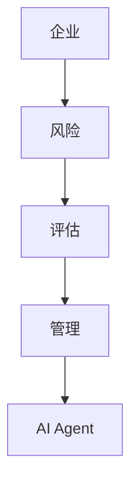
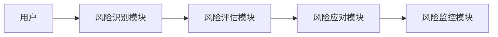
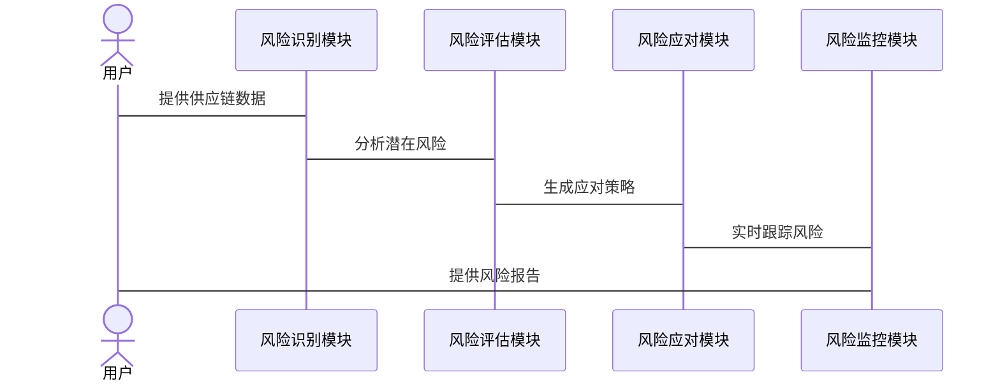

                 


# AI Agent在企业风险评估与管理中的应用

## 关键词：AI Agent, 企业风险管理, 人工智能, 风险评估, 系统架构, 项目实战

## 摘要：  
本文探讨了AI Agent在企业风险评估与管理中的应用，从理论基础到实际应用，详细分析了AI Agent的核心概念、算法原理、系统架构设计以及项目实战案例。文章通过丰富的图示和代码示例，深入剖析了AI Agent在企业风险管理中的优势和挑战，并给出了最佳实践建议。

---

## 第一部分: AI Agent在企业风险管理中的应用概述

### 第1章: AI Agent与企业风险管理概述

#### 1.1 企业风险管理的基本概念

##### 1.1.1 企业风险管理的定义  
企业风险管理（Enterprise Risk Management，ERM）是识别、评估和应对可能影响企业目标实现的各种风险的过程。它旨在通过降低风险敞口，确保企业稳健运营。

##### 1.1.2 企业风险管理的核心要素  
- **风险识别**：识别可能影响企业目标的风险因素。  
- **风险评估**：量化风险的严重性和可能性。  
- **风险应对**：制定策略以降低或接受风险。  
- **风险监控**：持续跟踪风险状态并调整管理策略。

##### 1.1.3 企业风险管理的目标与挑战  
- **目标**：保障企业战略目标的实现，提高企业抗风险能力。  
- **挑战**：  
  1. 数据复杂性：企业面临海量数据，传统方法难以高效处理。  
  2. 动态性：市场环境变化快，风险因素动态调整。  
  3. 人为因素：传统管理依赖主观判断，存在偏差。

---

#### 1.2 AI Agent的基本概念与特点

##### 1.2.1 AI Agent的定义  
AI Agent（人工智能代理）是指能够感知环境、自主决策并执行任务的智能实体。它可以基于数据和模型做出决策，并通过反馈不断优化自身行为。

##### 1.2.2 AI Agent的核心特点  
- **自主性**：无需外部干预，自主完成任务。  
- **反应性**：能够实时感知环境变化并做出反应。  
- **学习能力**：通过数据和反馈不断优化决策模型。  
- **可扩展性**：适用于多种场景和规模。

##### 1.2.3 AI Agent与传统管理工具的区别  
| 特性         | AI Agent             | 传统管理工具       |
|--------------|----------------------|-------------------|
| 决策方式     | 数据驱动，自主决策   | 依赖人工判断       |
| 处理速度     | 高效，实时响应       | 较慢，依赖人工操作 |
| 灵活性       | 高，适应环境变化     | 较低，固定流程     |

---

#### 1.3 AI Agent在企业风险管理中的应用前景

##### 1.3.1 AI Agent的潜在应用场景  
- **风险识别**：通过自然语言处理（NLP）分析文本数据，识别潜在风险。  
- **风险评估**：利用机器学习模型量化风险的严重性和可能性。  
- **风险应对**：基于预测结果，推荐最优的风险应对策略。  
- **风险监控**：实时跟踪风险状态，动态调整管理策略。

##### 1.3.2 企业采用AI Agent的优势  
- **高效性**：AI Agent能够快速处理海量数据，显著提高效率。  
- **准确性**：通过数据驱动的决策，降低人为判断的偏差。  
- **实时性**：实时监控和响应，提升风险应对的及时性。  

##### 1.3.3 AI Agent应用的挑战与机遇  
- **挑战**：数据隐私、模型解释性、技术门槛。  
- **机遇**：提升企业竞争力，实现智能化管理。

---

### 第2章: 企业风险管理中的AI Agent核心概念

#### 2.1 AI Agent的核心概念原理

##### 2.1.1 AI Agent的决策机制  
AI Agent的决策过程通常包括以下步骤：  
1. **感知环境**：通过传感器或数据输入获取信息。  
2. **分析数据**：利用机器学习模型对数据进行分析和推理。  
3. **制定决策**：基于分析结果生成决策方案。  
4. **执行决策**：将决策转化为具体行动。

##### 2.1.2 AI Agent的学习能力  
AI Agent可以通过监督学习、无监督学习和强化学习等方法不断优化自身的决策模型。例如，使用神经网络模型进行风险预测时，可以通过历史数据进行训练，逐步提高预测准确性。

##### 2.1.3 AI Agent的自适应能力  
AI Agent能够根据环境变化自动调整自身行为。例如，在市场波动加剧时，AI Agent可以动态调整风险评估模型，以更准确地预测潜在风险。

---

#### 2.2 核心概念属性特征对比表  
| 概念       | 特性       | 描述                                                                 |
|------------|------------|----------------------------------------------------------------------|
| AI Agent   | 决策能力   | 基于数据和模型进行决策                                             |
|            | 学习能力   | 能够通过数据进行自我优化                                           |
|            | 自适应能力 | 能够根据环境变化调整行为                                           |

---

#### 2.3 ER实体关系图  


---

### 第3章: AI Agent的算法原理与数学模型

#### 3.1 AI Agent的算法原理

##### 3.1.1 基于规则的推理算法  
基于规则的推理算法通过预定义的规则进行决策。例如，在风险评估中，可以设置以下规则：  
- 如果销售额连续三个月下降，则触发市场风险预警。

##### 3.1.2 基于概率的推理算法  
基于概率的推理算法利用概率论进行风险评估。例如，使用贝叶斯网络模型预测某个风险发生的概率。

##### 3.1.3 强化学习算法  
强化学习算法通过试错机制不断优化决策策略。例如，在金融投资领域，AI Agent可以通过不断尝试不同的投资组合，找到最优的风险收益平衡点。

---

#### 3.2 数学模型

##### 3.2.1 贝叶斯定理  
贝叶斯定理用于计算在已知某些条件下，某个事件发生的概率。其公式为：  
$$ P(A|B) = \frac{P(B|A) \cdot P(A)}{P(B)} $$  
其中，$P(A|B)$表示在事件B发生的情况下，事件A发生的概率。

##### 3.2.2 逻辑回归模型  
逻辑回归模型用于分类问题，其概率函数为：  
$$ P(y=1|x) = \frac{e^{\beta x}}{1 + e^{\beta x}} $$  
其中，$\beta$是模型参数，$x$是输入特征。

---

## 第4章: 系统分析与架构设计方案

### 4.1 问题场景介绍  
本文以制造业供应链风险评估为例，设计一个基于AI Agent的风险管理方案。

### 4.2 系统功能设计  
- **风险识别模块**：通过NLP技术分析供应链文档，识别潜在风险。  
- **风险评估模块**：利用机器学习模型量化风险的严重性和可能性。  
- **风险应对模块**：基于评估结果，推荐最优的风险应对策略。  
- **风险监控模块**：实时跟踪风险状态，动态调整管理策略。

---

### 4.3 系统架构设计  


---

### 4.4 系统接口设计  
- **输入接口**：接收供应链数据和用户指令。  
- **输出接口**：输出风险评估结果和应对策略。

---

### 4.5 系统交互设计  


---

## 第5章: 项目实战

### 5.1 环境安装  
- **Python**：安装Python 3.8及以上版本。  
- **库依赖**：安装`numpy`, `pandas`, `scikit-learn`, `tensorflow`等库。

### 5.2 核心代码实现  

#### 5.2.1 风险识别模块  
```python
import numpy as np
import pandas as pd

# 加载数据
data = pd.read_csv('supply_chain.csv')

# 基于NLP进行风险识别
from sklearn.feature_extraction.text import TfidfVectorizer
vectorizer = TfidfVectorizer()
tfidf = vectorizer.fit_transform(data['text'])
```

#### 5.2.2 风险评估模块  
```python
from sklearn.naive_bayes import GaussianNB

# 训练模型
model = GaussianNB()
model.fit(X_train, y_train)

# 预测风险
y_pred = model.predict(X_test)
```

#### 5.2.3 风险应对模块  
```python
# 基于强化学习推荐应对策略
import tensorflow as tf

model = tf.keras.Sequential([
    tf.keras.layers.Dense(64, activation='relu'),
    tf.keras.layers.Dense(1, activation='sigmoid')
])
model.compile(optimizer='adam', loss='binary_crossentropy')
model.fit(X_train, y_train, epochs=10)
```

---

### 5.3 代码应用解读与分析  
通过上述代码，我们可以实现风险识别、评估和应对的全过程。例如，在供应链风险评估中，AI Agent可以通过NLP技术识别潜在风险，利用机器学习模型评估风险的严重性，并通过强化学习推荐最优的应对策略。

---

### 5.4 实际案例分析  
以某制造企业的供应链为例，AI Agent可以帮助识别原材料供应风险，并根据历史数据和市场趋势预测风险的严重性，从而制定相应的应对策略。

---

### 5.5 项目小结  
通过本项目实战，我们可以看到AI Agent在企业风险管理中的巨大潜力。它不仅能够提高效率，还能显著降低人为判断的偏差，为企业提供更精准的风险管理支持。

---

## 第6章: 最佳实践与总结

### 6.1 最佳实践  

#### 6.1.1 数据隐私与安全  
在处理企业数据时，必须确保数据的隐私和安全，避免数据泄露风险。

#### 6.1.2 模型解释性  
AI Agent的决策过程需要具有较高的解释性，以便企业管理层能够理解和信任模型的输出。

#### 6.1.3 模型更新  
定期更新AI Agent的模型，以适应市场环境的变化。

---

### 6.2 小结  
本文详细探讨了AI Agent在企业风险管理中的应用，从理论基础到实际应用，为读者提供了全面的指导。通过AI Agent的应用，企业可以显著提高风险管理的效率和准确性。

---

### 6.3 注意事项  
- 在实际应用中，需注意模型的泛化能力，避免过拟合。  
- 定期进行模型验证，确保AI Agent的决策准确性。  

---

### 6.4 拓展阅读  
- 《机器学习实战》  
- 《深度学习》  
- 《风险管理：理论与实践》  

---

## 结语  
AI Agent作为一项前沿技术，在企业风险管理中的应用前景广阔。通过本文的探讨，我们相信，随着技术的不断进步，AI Agent将为企业风险管理带来更大的价值。

