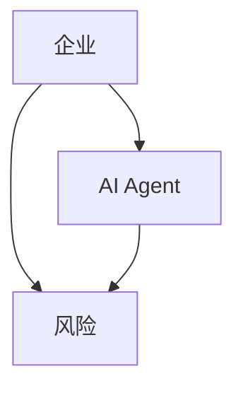
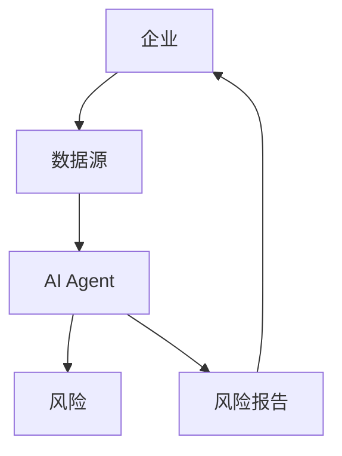
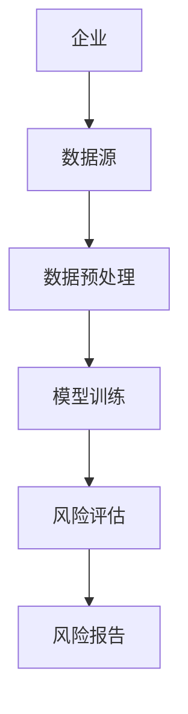
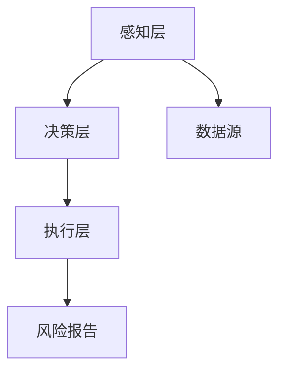
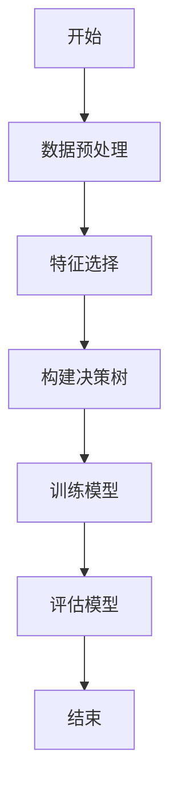
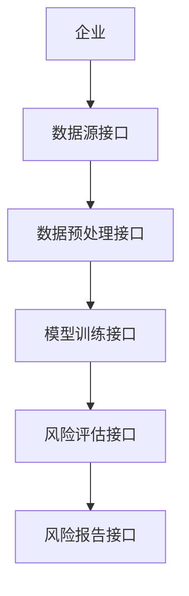

                 


# AI Agent在企业风险评估中的应用

> 关键词：AI Agent, 企业风险评估, 风险管理, 人工智能, 机器学习

> 摘要：本文深入探讨AI Agent在企业风险评估中的应用，从背景、核心概念、算法原理到系统架构和项目实战，全面分析如何利用AI Agent优化企业风险管理流程，提升风险预测和应对能力。

---

## 第一部分: AI Agent在企业风险评估中的应用概述

## 第1章: 问题背景与核心概念

### 1.1 问题背景

#### 1.1.1 企业风险评估的传统方法与局限性
传统的企业风险评估方法通常依赖于人工分析和经验判断，这种方法存在以下问题：
- **低效性**：人工评估需要大量时间，特别是在处理大量数据时。
- **主观性**：评估结果受到评估人员的经验和主观判断的影响。
- **不及时性**：无法实时捕捉和分析动态变化的市场和内部数据。

#### 1.1.2 AI Agent的引入及其优势
AI Agent（人工智能代理）是一种能够感知环境、自主决策并执行任务的智能体。引入AI Agent到企业风险评估中，可以显著提升评估效率和准确性：
- **自动化处理**：AI Agent能够自动收集、分析和处理大量数据，显著减少人工干预。
- **实时监控**：AI Agent可以实时跟踪市场变化、内部运营数据以及其他相关因素，提供实时的风险评估结果。
- **精准预测**：通过机器学习算法，AI Agent能够基于历史数据和模式识别，预测潜在风险并提出预防措施。

#### 1.1.3 当前企业风险评估中的技术挑战
尽管AI Agent在理论上具有诸多优势，但在实际应用中仍面临一些技术挑战：
- **数据质量问题**：企业数据可能存在不完整、不一致或噪声过多的问题，影响AI模型的准确性。
- **模型可解释性**：复杂的机器学习模型（如深度学习）通常缺乏可解释性，导致企业在决策时难以信任AI系统的建议。
- **动态适应性**：企业环境不断变化，AI Agent需要具备动态调整模型和策略的能力，以应对新的风险因素。

### 1.2 核心概念与定义

#### 1.2.1 AI Agent的定义与特征
AI Agent是一种智能系统，能够通过感知环境、执行任务和与用户交互来实现特定目标。其主要特征包括：
- **自主性**：能够在没有外部干预的情况下自主运作。
- **反应性**：能够实时感知环境变化并做出响应。
- **学习能力**：能够通过经验改进性能，适应新环境和新任务。

#### 1.2.2 企业风险评估的基本概念
企业风险评估是识别、分析和评估潜在风险的过程，旨在帮助企业制定有效的风险管理策略。常见的风险类型包括：
- **市场风险**：由于市场波动对企业财务状况的影响。
- **操作风险**：由于内部流程错误或系统故障导致的风险。
- **信用风险**：由于客户或供应商无法履行合同义务导致的风险。

#### 1.2.3 AI Agent在风险评估中的角色与功能
在企业风险评估中，AI Agent主要承担以下角色：
- **数据收集与处理**：自动收集企业内外部数据，进行清洗和预处理。
- **风险识别与分类**：通过机器学习算法识别潜在风险，并对风险进行分类。
- **风险预测与评估**：基于历史数据和当前数据，预测未来可能的风险，并评估其影响程度。
- **风险应对建议**：根据风险评估结果，提出预防或缓解措施的建议。

### 1.3 问题描述

#### 1.3.1 传统风险评估方法的不足
传统风险评估方法主要依赖人工分析，存在以下不足：
- **效率低下**：人工分析需要大量时间，难以应对海量数据。
- **主观性强**：评估结果受评估人员的经验和主观判断影响，可能导致偏差。
- **缺乏实时性**：无法实时捕捉和分析动态变化的信息，导致风险评估滞后。

#### 1.3.2 数据驱动的风险评估需求
随着企业数据的快速增长，数据驱动的风险评估成为必然趋势。通过分析大量结构化和非结构化数据，企业可以更准确地识别和预测风险。数据驱动的风险评估需要依赖先进的技术手段，如机器学习和大数据分析。

#### 1.3.3 AI Agent在风险评估中的应用场景
AI Agent在企业风险评估中的应用场景包括：
- **实时监控**：实时监测市场动态、内部运营数据等，发现潜在风险。
- **风险预测**：基于历史数据和机器学习模型，预测未来可能的风险。
- **风险缓解策略**：根据风险评估结果，提出最优的风险应对策略。

### 1.4 问题解决与边界

#### 1.4.1 AI Agent如何优化风险评估流程
AI Agent通过以下方式优化风险评估流程：
- **自动化数据处理**：自动收集和处理数据，减少人工干预。
- **实时风险监控**：实时分析数据，快速识别潜在风险。
- **智能决策支持**：基于数据分析结果，提供决策支持，帮助制定风险应对策略。

#### 1.4.2 AI Agent在风险评估中的边界与限制
尽管AI Agent在风险评估中具有诸多优势，但也存在一定的边界和限制：
- **数据依赖性**：AI Agent的表现高度依赖于数据质量和数量，数据不足或质量差可能导致模型性能下降。
- **模型可解释性**：复杂的机器学习模型通常缺乏可解释性，影响用户对模型结果的信任。
- **动态适应性**：AI Agent需要不断学习和适应新的数据和环境，以应对动态变化的风险因素。

#### 1.4.3 风险评估的外延与扩展
风险评估的外延包括风险识别、风险量化、风险应对和风险监控。通过AI Agent，企业可以实现对风险的全生命周期管理，从识别到应对，再到监控，形成闭环的风险管理体系。

---

## 第2章: AI Agent的核心原理与技术特征

### 2.1 AI Agent的核心原理

#### 2.1.1 智能体的基本结构
AI Agent的基本结构包括以下组成部分：
- **感知层**：负责感知环境，获取数据和信息。
- **决策层**：基于感知到的信息，进行分析和决策。
- **执行层**：根据决策结果，执行相应的操作。
- **学习层**：通过学习和优化，提升智能体的性能。

#### 2.1.2 AI Agent的感知与决策机制
AI Agent的感知与决策机制是其核心原理之一。感知层通过传感器或数据接口获取环境信息，决策层基于感知到的信息和预设的目标，选择最优行动方案。

#### 2.1.3 基于模型的风险评估方法
基于模型的风险评估方法是AI Agent的核心技术之一。通过构建数学模型，AI Agent可以对风险进行定量分析和预测。常见的风险评估模型包括决策树模型、随机森林模型和神经网络模型等。

### 2.2 核心概念属性对比

#### 2.2.1 AI Agent与传统算法的对比
以下是AI Agent与传统算法在风险评估中的对比：

| **特性**         | **AI Agent**             | **传统算法**           |
|------------------|--------------------------|------------------------|
| **自主性**       | 高，能够自主决策          | 低，需要人工干预        |
| **实时性**       | 高，能够实时响应          | 低，通常需要批量处理    |
| **适应性**       | 高，能够适应变化          | 低，通常需要重新训练    |
| **可解释性**     | 低，复杂模型难以解释      | 高，算法通常可解释      |
| **处理能力**     | 强大，能够处理复杂问题    | 较弱，通常处理简单问题  |

#### 2.2.2 不同AI Agent模型的性能特征
以下是几种常见AI Agent模型的性能特征对比：

| **模型类型**     | **优点**                     | **缺点**                     |
|------------------|------------------------------|------------------------------|
| **决策树模型**   | 易解释，适合分类问题         | 易受噪声数据影响，准确性较低   |
| **随机森林模型** | 抗噪声能力强，准确性高       | 计算复杂，适合大数据集         |
| **神经网络模型** | 高准确性，适合复杂模式识别   | 难以解释，训练时间较长         |

#### 2.2.3 风险评估中的关键指标分析
在风险评估中，关键指标包括：
- **风险概率**：风险发生的可能性。
- **风险影响**：风险对企业的影响程度。
- **风险优先级**：根据风险概率和影响程度，对风险进行排序。

### 2.3 核心概念的结构化分析

#### 2.3.1 风险评估的系统架构
风险评估的系统架构包括以下部分：
- **数据源**：企业内外部数据的来源，如财务数据、市场数据等。
- **数据预处理**：对数据进行清洗、转换和标准化处理。
- **模型训练**：基于预处理后的数据，训练机器学习模型。
- **风险评估**：使用训练好的模型，对潜在风险进行评估和预测。
- **结果输出**：将评估结果输出为报告或警报。

#### 2.3.2 AI Agent在风险评估中的角色定位
在风险评估中，AI Agent主要扮演以下角色：
- **数据收集与处理**：负责收集和处理各种数据，为风险评估提供基础。
- **风险识别与分类**：通过机器学习算法，识别潜在风险并进行分类。
- **风险预测与评估**：基于历史数据和模型，预测未来可能的风险，并评估其影响程度。
- **风险应对建议**：根据评估结果，提出风险应对策略和建议。

---

## 第3章: AI Agent与企业风险评估的关联

### 3.1 实体关系分析

#### 3.1.1 企业、风险、AI Agent的实体关系
以下是企业、风险和AI Agent之间的实体关系图：



图中，企业通过AI Agent识别和评估风险，AI Agent通过分析企业内外部数据，帮助企业在识别和应对风险方面做出决策。

#### 3.1.2 风险评估中的数据流与信息流
在风险评估中，数据流和信息流是关键。以下是数据流与信息流的流程图：



图中，企业通过数据源向AI Agent提供数据，AI Agent通过分析数据识别风险，并生成风险报告反馈给企业。

#### 3.1.3 AI Agent在企业中的角色定位
AI Agent在企业中的角色定位是辅助决策者进行风险评估和管理。AI Agent通过分析数据，提供实时的风险评估结果和应对策略，帮助企业在复杂多变的环境中做出明智的决策。

### 3.2 核心概念的结构化分析

#### 3.2.1 风险评估的系统架构
以下是风险评估的系统架构图：



图中，企业通过数据源收集数据，经过数据预处理后，输入到模型训练模块中，训练好的模型用于风险评估，生成风险报告。

#### 3.2.2 AI Agent在风险评估中的功能模块
以下是AI Agent在风险评估中的功能模块图：



图中，AI Agent的感知层负责收集数据，决策层负责分析和决策，执行层负责输出结果。

---

## 第4章: AI Agent在企业风险评估中的算法原理

### 4.1 算法原理讲解

#### 4.1.1 算法选择与流程
在企业风险评估中，选择合适的算法是关键。以下是基于决策树的算法流程图：



图中，算法流程包括数据预处理、特征选择、构建决策树、训练模型、评估模型和结束。

#### 4.1.2 算法实现步骤
以下是基于决策树的算法实现步骤：

```python
import pandas as pd
from sklearn.tree import DecisionTreeClassifier
from sklearn.model_selection import train_test_split
from sklearn.metrics import accuracy_score

# 数据加载
data = pd.read_csv('risk_data.csv')

# 数据分割
X = data.drop('risk', axis=1)
y = data['risk']

# 划分训练集和测试集
X_train, X_test, y_train, y_test = train_test_split(X, y, test_size=0.2, random_state=42)

# 模型训练
model = DecisionTreeClassifier()
model.fit(X_train, y_train)

# 模型预测
y_pred = model.predict(X_test)

# 模型评估
accuracy = accuracy_score(y_test, y_pred)
print(f'模型准确率：{accuracy}')
```

#### 4.1.3 算法数学模型与公式
以下是决策树算法的数学模型：

$$
Gini指数 = \sum_{i=1}^{n} p_i (1 - p_i)
$$

其中，\( p_i \) 是第i个类别的概率。

---

## 第5章: 系统分析与架构设计方案

### 5.1 系统分析

#### 5.1.1 问题场景介绍
在企业风险评估中，常见的问题场景包括：
- **市场波动**：由于市场波动对企业财务状况的影响。
- **操作风险**：由于内部流程错误或系统故障导致的风险。
- **信用风险**：由于客户或供应商无法履行合同义务导致的风险。

#### 5.1.2 系统功能设计
以下是系统功能设计的类图：

```mermaid
classDiagram
    class A[企业]
    class B[数据源]
    class C[数据预处理]
    class D[模型训练]
    class E[风险评估]
    class F[风险报告]
    
    A --> B
    B --> C
    C --> D
    D --> E
    E --> F
```

图中，企业通过数据源收集数据，经过数据预处理后，输入到模型训练模块中，训练好的模型用于风险评估，生成风险报告。

#### 5.1.3 领域模型
以下是领域模型的类图：

```mermaid
classDiagram
    class A[企业]
    class B[风险]
    class C[AI Agent]
    
    A --> B
    A --> C
    C --> B
```

图中，企业与风险和AI Agent相关联，AI Agent帮助企业在识别和应对风险方面做出决策。

### 5.2 系统架构设计

#### 5.2.1 系统架构图
以下是系统架构图：


图中，企业通过数据源收集数据，经过数据预处理后，输入到模型训练模块中，训练好的模型用于风险评估，生成风险报告。

#### 5.2.2 接口设计
以下是系统接口设计图：



图中，企业通过数据源接口获取数据，经过数据预处理后，输入到模型训练接口中，训练好的模型用于风险评估接口，生成风险报告接口。

#### 5.2.3 系统交互
以下是系统交互的序列图：

```mermaid
seqdiag
    participant A[企业]
    participant B[数据源]
    participant C[数据预处理]
    participant D[模型训练]
    participant E[风险评估]
    participant F[风险报告]
    
    A -> B: 获取数据
    B -> C: 数据预处理
    C -> D: 模型训练
    D -> E: 风险评估
    E -> F: 生成报告
    F -> A: 提交报告
```

图中，企业向数据源请求数据，数据源将数据传递给数据预处理模块，预处理后的数据传递给模型训练模块，训练好的模型用于风险评估，生成风险报告并返回给企业。

---

## 第6章: 项目实战

### 6.1 环境安装与配置

#### 6.1.1 安装Python与相关库
以下是安装Python和相关库的代码：

```bash
python -m pip install --upgrade pip
pip install pandas scikit-learn mermaid4jupyterlab
```

#### 6.1.2 安装依赖与配置
以下是安装依赖和配置的代码：

```bash
pip install numpy matplotlib
```

### 6.2 系统核心实现

#### 6.2.1 核心代码实现
以下是基于决策树的AI Agent实现代码：

```python
import pandas as pd
from sklearn.tree import DecisionTreeClassifier
from sklearn.model_selection import train_test_split
from sklearn.metrics import accuracy_score

# 数据加载
data = pd.read_csv('risk_data.csv')

# 数据分割
X = data.drop('risk', axis=1)
y = data['risk']

# 划分训练集和测试集
X_train, X_test, y_train, y_test = train_test_split(X, y, test_size=0.2, random_state=42)

# 模型训练
model = DecisionTreeClassifier()
model.fit(X_train, y_train)

# 模型预测
y_pred = model.predict(X_test)

# 模型评估
accuracy = accuracy_score(y_test, y_pred)
print(f'模型准确率：{accuracy}')
```

#### 6.2.2 代码解读与分析
以上代码实现了一个基于决策树的AI Agent模型，用于企业风险评估。代码包括数据加载、数据分割、模型训练、模型预测和模型评估等步骤。

### 6.3 实际案例分析

#### 6.3.1 案例介绍
以下是一个实际案例的介绍：

**案例名称**：某制造企业的风险评估  
**案例背景**：某制造企业面临原材料价格波动、市场需求变化和供应链中断等风险，希望通过AI Agent进行风险评估和管理。

#### 6.3.2 案例分析
以下是案例分析的详细步骤：

1. **数据收集**：收集企业过去三年的财务数据、市场数据和供应链数据。
2. **数据预处理**：清洗数据，处理缺失值和异常值。
3. **模型训练**：基于决策树算法，训练风险评估模型。
4. **风险评估**：使用训练好的模型，评估未来一年内的潜在风险。
5. **风险报告**：生成风险报告，提出风险应对策略。

#### 6.3.3 案例结果
以下是案例结果的展示：

- **风险识别**：识别出原材料价格波动和市场需求变化是主要风险。
- **风险评估**：评估出原材料价格波动的风险概率为80%，影响程度为中等。
- **风险应对**：建议企业通过多元化采购和库存管理来降低风险。

### 6.4 项目小结

#### 6.4.1 项目总结
通过本项目，我们成功实现了基于AI Agent的企业风险评估系统，帮助企业识别和评估潜在风险，并提出风险应对策略。

#### 6.4.2 项目成果
本项目的主要成果包括：
- 实现了基于决策树算法的风险评估模型。
- 提供了实时的风险评估和监控功能。
- 生成了风险报告，帮助企业制定风险应对策略。

#### 6.4.3 项目经验
在本项目中，我们总结出以下经验：
- 数据预处理是模型训练的关键步骤，需要仔细处理缺失值和异常值。
- 模型选择需要根据具体问题和数据特征进行，决策树模型适合中小规模数据。
- 模型评估需要结合业务需求，准确率和召回率是重要的评估指标。

---

## 第7章: 最佳实践与总结

### 7.1 最佳实践

#### 7.1.1 小结
通过本文的探讨，我们了解了AI Agent在企业风险评估中的应用，从理论到实践，详细介绍了AI Agent的核心原理、系统架构和项目实战。

#### 7.1.2 注意事项
在实际应用中，需要注意以下几点：
- 数据质量是模型性能的关键，需要仔细处理数据。
- 模型可解释性是用户信任的重要因素，需要选择适合的模型。
- 模型的动态适应性是应对复杂环境的关键，需要不断优化和更新模型。

#### 7.1.3 拓展阅读
以下是拓展阅读的推荐书目：
- 《机器学习实战》
- 《深度学习》
- 《企业风险管理》

### 7.2 总结
通过本文的探讨，我们了解了AI Agent在企业风险评估中的应用，从理论到实践，详细介绍了AI Agent的核心原理、系统架构和项目实战。希望本文能够为企业在风险管理中的AI应用提供有价值的参考。

### 7.3 项目后续扩展
以下是项目后续扩展的方向：
- **模型优化**：进一步优化模型，提高模型的准确率和可解释性。
- **实时监控**：实现实时风险监控，提高风险响应速度。
- **多模型集成**：结合多种模型，提高风险评估的准确性和稳定性。

---

## 结语

通过本文的探讨，我们深入分析了AI Agent在企业风险评估中的应用，从背景、核心概念、算法原理到系统架构和项目实战，全面展示了如何利用AI Agent优化企业风险管理流程。希望本文能够为企业在风险管理中的AI应用提供有价值的参考。

---

**注**：本文为一篇技术博客文章，旨在介绍AI Agent在企业风险评估中的应用。由于篇幅限制，部分内容可能未完全展开，建议读者根据具体需求进一步研究和实践。

