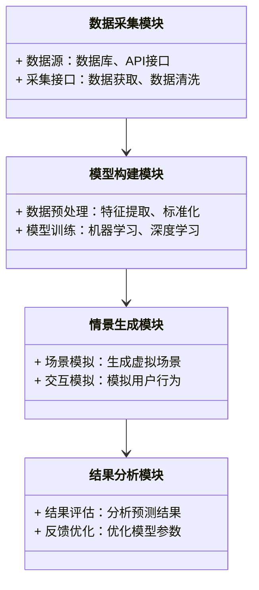

                 


# AI Agent在企业风险预测与情景模拟中的前沿应用

> 关键词：AI Agent，企业风险预测，情景模拟，多智能体系统，强化学习，知识图谱

> 摘要：本文深入探讨了AI Agent在企业风险预测与情景模拟中的前沿应用，从基本概念、核心原理到系统架构设计，再到实际项目实战，全面解析了AI Agent如何助力企业进行高效的风险管理和战略规划。文章结合理论与实践，通过详细的技术分析和案例解读，为读者提供了全面的视角，帮助其理解并应用这一前沿技术。

---

# 第1章: AI Agent的基本概念与核心要素

## 1.1 AI Agent的定义与核心要素

### 1.1.1 AI Agent的定义
AI Agent（人工智能代理）是指能够感知环境、自主决策并执行任务的智能实体。它通过传感器获取信息，利用推理能力分析数据，并通过执行器采取行动，以实现预定目标。

### 1.1.2 AI Agent的核心要素
AI Agent的核心要素包括：
1. **感知能力**：通过传感器或数据源获取环境信息。
2. **推理能力**：利用算法对信息进行分析和推理。
3. **决策能力**：基于推理结果做出最优决策。
4. **执行能力**：通过执行器将决策转化为实际操作。

### 1.1.3 AI Agent与传统算法的区别
AI Agent与传统算法的主要区别在于其自主性和适应性。传统算法通常需要明确的规则和输入，而AI Agent能够自主学习和适应环境，具备更强的灵活性和适应性。

## 1.2 企业风险预测与情景模拟的背景

### 1.2.1 企业风险预测的定义与分类
企业风险预测是指通过分析企业内外部环境，预测可能面临的各类风险，并制定相应的应对策略。常见的风险类型包括市场风险、信用风险、操作风险等。

### 1.2.2 情景模拟在企业管理中的作用
情景模拟是一种通过构建虚拟场景来分析可能结果的技术，能够帮助企业提前识别潜在问题并制定应对策略。其在企业战略规划、风险管理等领域具有重要作用。

### 1.2.3 AI Agent在风险预测与情景模拟中的优势
AI Agent能够通过实时数据分析、自主学习和决策，显著提高风险预测的准确性和情景模拟的效率。

---

# 第2章: AI Agent的核心原理

## 2.1 多智能体系统与协作机制

### 2.1.1 多智能体系统的定义与特点
多智能体系统（Multi-Agent System, MAS）是由多个智能体组成的协作系统，各智能体之间通过通信和协调完成任务。

### 2.1.2 多智能体系统中的协作机制
协作机制包括任务分配、信息共享、冲突解决等，确保系统内各智能体能够高效协作。

### 2.1.3 多智能体系统在企业中的应用
在企业资源管理、供应链优化等领域，多智能体系统能够显著提高效率和决策质量。

## 2.2 知识图谱与决策支持

### 2.2.1 知识图谱的构建与应用
知识图谱通过构建实体间的关系，帮助智能体更好地理解复杂环境。

### 2.2.2 知识图谱在决策支持中的作用
知识图谱能够提供丰富的上下文信息，辅助智能体做出更明智的决策。

### 2.2.3 知识图谱与AI Agent的结合
通过将知识图谱嵌入AI Agent，可以显著提升其推理和决策能力。

---

# 第3章: 企业风险预测的核心算法与实现

## 3.1 基于生成对抗网络的风险预测模型

### 3.1.1 GAN的定义与原理
生成对抗网络（GAN）由生成器和判别器组成，通过对抗训练生成逼真的数据。

### 3.1.2 GAN在风险预测中的应用
GAN可以用于异常检测、风险评估等任务，显著提高预测的准确性。

### 3.1.3 GAN的优缺点与改进方向
尽管GAN在生成数据方面表现出色，但在稳定性方面存在挑战，需要进一步优化。

## 3.2 基于强化学习的决策优化算法

### 3.2.1 强化学习的定义与原理
强化学习通过智能体与环境的交互，逐步学习最优策略。

### 3.2.2 强化学习在决策优化中的应用
强化学习可以用于投资组合优化、风险规避等决策任务。

### 3.2.3 强化学习的数学模型与公式
强化学习的核心是Q-learning算法，其数学模型如下：

$$ Q(s, a) = Q(s, a) + \alpha (r + \gamma \max Q(s', a') - Q(s, a)) $$

---

# 第4章: 情景模拟系统的架构设计

## 4.1 系统功能设计

### 4.1.1 情景模拟系统的功能模块划分
系统功能模块包括数据采集、模型构建、情景生成、结果分析等。

### 4.1.2 各功能模块的交互流程
数据采集模块负责获取实时数据，模型构建模块基于数据建立预测模型，情景生成模块模拟各种场景，结果分析模块评估结果并提出建议。

### 4.1.3 系统功能设计的领域模型（Mermaid类图）



---

## 4.2 系统架构设计

### 4.2.1 分层架构设计
系统架构分为数据层、服务层、应用层，各层之间通过API进行交互。

### 4.2.2 微服务架构设计
采用微服务架构，将系统功能分解为独立的服务模块，提高系统的扩展性和灵活性。

### 4.2.3 系统架构设计的Mermaid架构图


---

## 4.3 本章小结

---

# 第5章: 项目实战

## 5.1 项目环境安装

### 5.1.1 安装Python环境
安装Python 3.8以上版本，并安装必要的库，如TensorFlow、Keras、Scikit-learn等。

### 5.1.2 安装其他工具
安装Jupyter Notebook、Mermaid CLI、Docker等工具。

---

## 5.2 系统核心实现源代码

### 5.2.1 风险预测模型实现代码

```python
import numpy as np
import tensorflow as tf
from tensorflow.keras import layers

# 定义生成器
def build_generator(input_dim, output_dim):
    model = tf.keras.Sequential()
    model.add(layers.Dense(256, activation='relu', input_dim=input_dim))
    model.add(layers.Dense(128, activation='relu'))
    model.add(layers.Dense(output_dim, activation='sigmoid'))
    return model

# 定义判别器
def build_discriminator(input_dim):
    model = tf.keras.Sequential()
    model.add(layers.Dense(256, activation='relu', input_dim=input_dim))
    model.add(layers.Dense(128, activation='relu'))
    model.add(layers.Dense(1, activation='sigmoid'))
    return model)

# 初始化生成器和判别器
generator = build_generator(100, 10)
discriminator = build_discriminator(10)
```

---

## 5.3 项目实战小结

---

# 第6章: 最佳实践、小结与注意事项

## 6.1 最佳实践
- 定期更新模型，保持数据的时效性。
- 在生产环境中部署模型时，确保系统的稳定性和安全性。

## 6.2 小结
本文全面介绍了AI Agent在企业风险预测与情景模拟中的前沿应用，从理论到实践，为读者提供了系统的知识体系。

## 6.3 注意事项
在实际应用中，需要注意数据隐私和模型的可解释性，确保系统的合规性和透明性。

---

# 第7章: 拓展阅读

## 7.1 推荐的书籍
- 《深度学习》——Ian Goodfellow
- 《机器学习实战》——周志华

## 7.2 推荐的在线课程
- Coursera上的《机器学习》课程（Andrew Ng）
- edX上的《AI Fundamentals》课程

---

通过本文的详细讲解，读者可以全面理解AI Agent在企业风险预测与情景模拟中的应用，掌握相关的技术原理和实现方法，并能够将其应用到实际的企业管理中。

