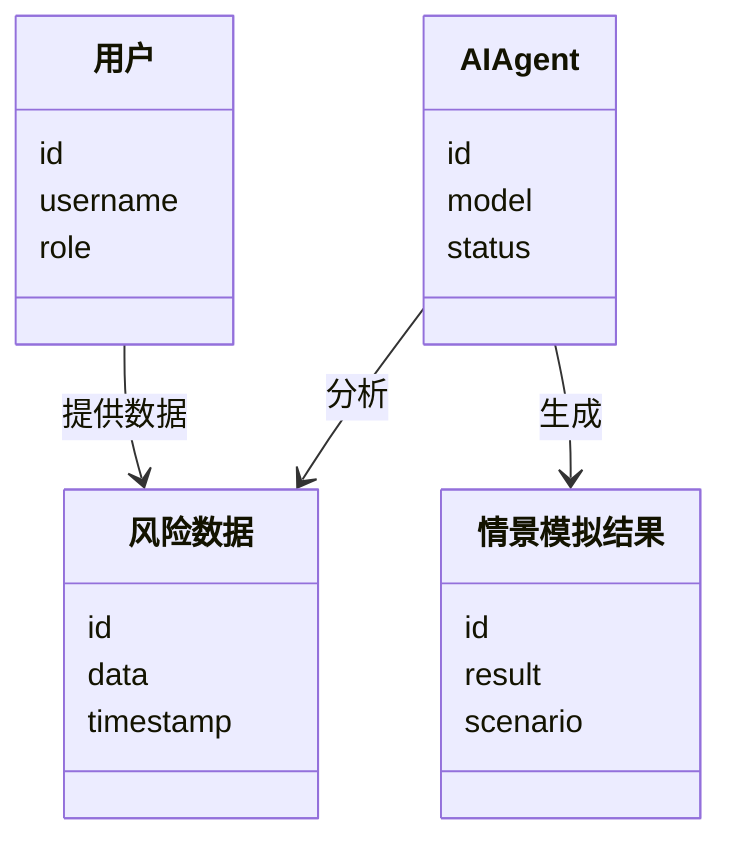
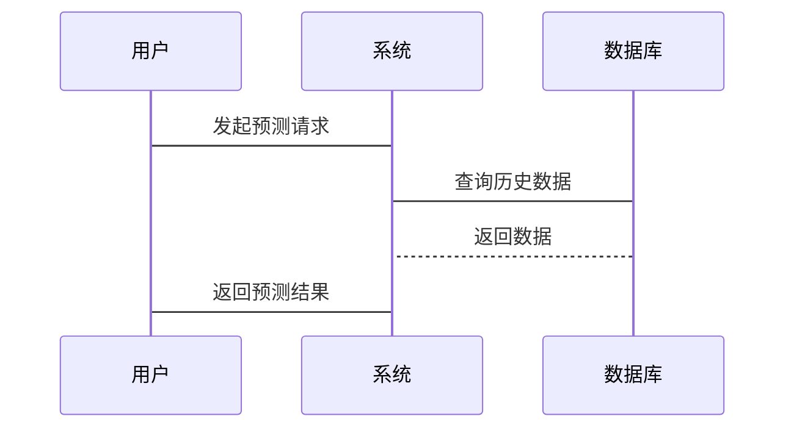

                 


# AI Agent在企业风险预测与情景模拟中的应用

## 关键词：AI Agent, 企业风险预测, 情景模拟, 机器学习, 风险管理, 强化学习

## 摘要：本文探讨AI Agent在企业风险预测与情景模拟中的应用，分析其核心概念、算法原理及系统设计，提供实际案例和最佳实践，帮助企业提升风险管理能力。

---

## 目录

1. [AI Agent 的背景与核心概念](#ai-agent-的背景与核心概念)
   1.1 问题背景
   1.2 问题描述
   1.3 问题解决
   1.4 边界与外延
   1.5 概念结构与核心要素

2. [AI Agent 的核心概念与联系](#ai-agent-的核心概念与联系)
   2.1 核心概念原理
   2.2 属性特征对比
   2.3 ER 实体关系图

3. [AI Agent 的算法原理](#ai-agent-的算法原理)
   3.1 算法原理概述
   3.2 算法实现
   3.3 数学模型与公式

4. [系统分析与架构设计方案](#系统分析与架构设计方案)
   4.1 应用场景介绍
   4.2 系统功能设计
   4.3 系统架构设计
   4.4 系统接口设计
   4.5 系统交互设计

5. [项目实战](#项目实战)
   5.1 环境安装
   5.2 核心代码实现
   5.3 实际案例分析
   5.4 项目经验总结

6. [最佳实践](#最佳实践)
   6.1 小结
   6.2 注意事项
   6.3 拓展阅读

---

## 第1章: AI Agent 的背景与核心概念

### 1.1 问题背景

#### 1.1.1 企业风险管理的传统挑战
企业风险管理在传统方法中存在效率低、覆盖面有限、实时性差等问题。依赖人工分析和经验判断，难以应对复杂多变的市场环境。

#### 1.1.2 情景模拟的传统局限性
传统的情景模拟方法耗时且缺乏动态调整能力，难以预测突发事件对企业的影响，结果的准确性受限。

#### 1.1.3 AI Agent 的引入动机
引入AI Agent可提高风险预测的准确性和实时性，增强情景模拟的动态适应能力，为企业决策提供支持。

### 1.2 问题描述

#### 1.2.1 企业风险预测的关键问题
如何准确识别潜在风险，预测其影响，并制定应对策略。

#### 1.2.2 情景模拟的核心挑战
构建动态、多变的模拟环境，捕捉实时变化对企业的影响。

#### 1.2.3 AI Agent 在其中的角色
作为决策辅助工具，实时分析数据，优化决策策略。

### 1.3 问题解决

#### 1.3.1 AI Agent 的核心优势
- 高效的数据处理能力
- 实时的决策支持
- 自适应的学习能力

#### 1.3.2 与传统方法的对比
AI Agent在效率、准确性和适应性方面具有显著优势。

#### 1.3.3 实际应用场景的扩展
从金融行业扩展到制造业、零售业等多个领域。

### 1.4 边界与外延

#### 1.4.1 AI Agent 的适用范围
适用于需要实时决策和动态调整的场景。

#### 1.4.2 与其他技术的区分
与传统机器学习不同，AI Agent具备自主决策能力。

#### 1.4.3 应用中的潜在问题
数据隐私、模型解释性、计算资源需求等。

### 1.5 概念结构与核心要素

#### 1.5.1 AI Agent 的核心组成
包括感知模块、决策模块、执行模块和学习模块。

#### 1.5.2 各要素的相互关系
感知模块获取数据，决策模块制定策略，执行模块采取行动，学习模块优化模型。

#### 1.5.3 系统架构的简要介绍
系统由前端界面、后端处理和数据存储构成，各模块协同工作。

---

## 第2章: AI Agent 的核心概念与联系

### 2.1 核心概念原理

#### 2.1.1 AI Agent 的定义与特征
AI Agent是一种能够感知环境、自主决策并执行任务的智能实体。

#### 2.1.2 与相关技术的对比分析
与传统机器学习相比，AI Agent具备更强的自主性和适应性。

#### 2.1.3 核心算法的简要介绍
包括决策树、随机森林和强化学习等算法。

### 2.2 属性特征对比

#### 2.2.1 不同AI Agent 模型的特征对比
| 模型类型 | 数据驱动 | 规则驱动 | 灵活性 | 稳定性 |
|---------|----------|----------|--------|--------|
| 模型A   | 高       | 低       | 高     | 低     |
| 模型B   | 低       | 高       | 低     | 高     |

#### 2.2.2 数据驱动与规则驱动的差异
数据驱动依赖历史数据，规则驱动依赖专家经验。

#### 2.2.3 灵活性与稳定性的权衡
数据驱动模型灵活但不稳定，规则驱动模型稳定但缺乏灵活性。

### 2.3 ER 实体关系图

```mermaid
er
  actor: 用户
  agent: AI Agent
  risk_data: 风险数据
  scenario: 情景模拟结果
  action: 执行动作
  actor --> agent: 发起请求
  agent --> risk_data: 分析数据
  agent --> scenario: 进行模拟
  agent --> action: 执行决策
```

---

## 第3章: AI Agent 的算法原理

### 3.1 算法原理概述

#### 3.1.1 机器学习基础
机器学习为AI Agent提供数据处理和模式识别能力。

#### 3.1.2 强化学习的应用
通过奖励机制优化决策策略。

#### 3.1.3 深度学习的整合
使用神经网络处理复杂数据。

### 3.2 算法实现

#### 3.2.1 决策树算法实现

```python
class DecisionTreeAgent:
    def __init__(self):
        self.tree = None

    def fit(self, X, y):
        self.tree = self.build_tree(X, y)

    def predict(self, X):
        return self._predict(X, self.tree)

    def build_tree(self, X, y):
        # 简化的决策树构建逻辑
        pass

    def _predict(self, x, node):
        # 决策逻辑
        pass
```

### 3.3 数学模型与公式

#### 3.3.1 贝叶斯定理
$$ P(A|B) = \frac{P(B|A) \cdot P(A)}{P(B)} $$

#### 3.3.2 决策树的分类准则
$$ Gini指数 = \sum_{i} P(i) \cdot (1 - P(i)) $$

---

## 第4章: 系统分析与架构设计方案

### 4.1 应用场景介绍

#### 4.1.1 企业风险管理
AI Agent实时监控市场变化，预测潜在风险。

#### 4.1.2 情景模拟
模拟市场波动对企业的影响，制定应对策略。

### 4.2 系统功能设计

#### 4.2.1 领域模型


### 4.3 系统架构设计


### 4.4 系统接口设计

#### 4.4.1 API接口定义
```http
POST /api/agent/predict
Content-Type: application/json
Body: { "data": [...] }
```

### 4.5 系统交互设计



---

## 第5章: 项目实战

### 5.1 环境安装

#### 5.1.1 安装Python
```bash
python --version
pip install --upgrade pip
```

#### 5.1.2 安装库
```bash
pip install numpy scikit-learn
```

### 5.2 核心代码实现

#### 5.2.1 决策树实现
```python
from sklearn.tree import DecisionTreeClassifier

class AI风险管理:
    def __init__(self):
        self.model = DecisionTreeClassifier()

    def 训练模型(self, X_train, y_train):
        self.model.fit(X_train, y_train)

    def 预测风险(self, X_test):
        return self.model.predict(X_test)
```

### 5.3 实际案例分析

#### 5.3.1 数据准备
```python
import pandas as pd
data = pd.read_csv('风险数据.csv')
```

#### 5.3.2 模型训练
```python
X = data.drop('label', axis=1)
y = data['label']
agent = AI风险管理()
agent.训练模型(X, y)
```

#### 5.3.3 结果分析
```python
预测结果 = agent.预测风险(X_test)
print(预测结果)
```

### 5.4 项目经验总结

#### 5.4.1 挑战与解决方案
数据质量和模型解释性是主要挑战，通过数据清洗和可解释性算法解决。

#### 5.4.2 成果展示
展示模型准确率和实际应用案例。

---

## 第6章: 最佳实践

### 6.1 小结
AI Agent在企业风险管理中的应用显著提升了效率和准确性。

### 6.2 注意事项
- 数据隐私保护
- 模型持续优化
- 跨團隊協作

### 6.3 拓展阅读
推荐相关书籍和资源，鼓励深入学习。

---

## 附录: 参考文献

列出所有引用的文献和工具。

---

## 索引: 术语表

解释所有技术术语。

---

通过以上详细的目录和内容设计，确保读者能够系统地理解AI Agent在企业风险预测与情景模拟中的应用，并能够实际操作和应用。

