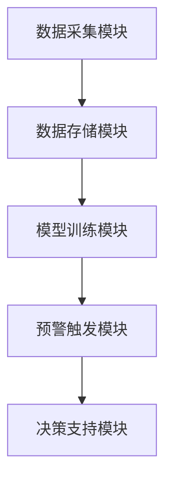
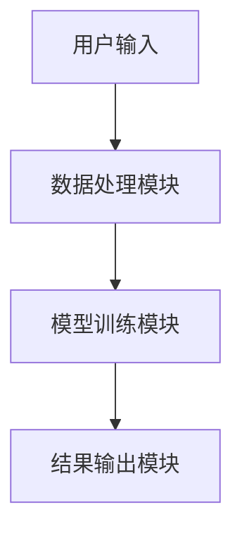

                 


# AI Agent在企业风险预警与危机管理中的应用

> 关键词：AI Agent，企业风险预警，危机管理，机器学习，知识图谱，实时监控，决策支持

> 摘要：本文系统地探讨了AI Agent在企业风险预警与危机管理中的应用，从AI Agent的核心概念、技术原理到具体应用场景、算法实现，再到系统架构设计和实际案例分析，全面阐述了AI Agent在企业风险管理中的价值与实现路径。文章深入分析了AI Agent的优势与挑战，并通过实际案例展示了其在企业风险管理中的成功应用。

---

# 第一部分: AI Agent 的基础与技术原理

## 第1章: AI Agent 的概述

### 1.1 AI Agent 的定义与核心概念

#### 1.1.1 AI Agent 的定义
AI Agent（人工智能代理）是指能够感知环境、自主决策并执行任务的智能系统。它通过传感器获取信息，利用算法处理数据，并通过执行器采取行动。AI Agent的核心目标是帮助人类完成复杂任务，提升效率和准确性。

#### 1.1.2 AI Agent 的核心要素
AI Agent 的核心要素包括：
- **感知能力**：通过传感器、数据库等获取外部信息。
- **决策能力**：基于机器学习模型进行分析和决策。
- **执行能力**：通过执行器或接口完成具体操作。
- **自适应能力**：根据环境变化动态调整行为。

#### 1.1.3 AI Agent 的分类与特点
AI Agent 可分为以下几类：
- **简单反应式 Agent**：基于当前感知做出反应。
- **基于模型的反应式 Agent**：结合内部状态和外部信息进行决策。
- **目标驱动的 Agent**：根据目标选择最优行动。
- **效用驱动的 Agent**：通过最大化效用来做出决策。

---

### 1.2 AI Agent 的技术基础

#### 1.2.1 机器学习与深度学习
- **机器学习**：通过数据训练模型，实现分类、回归等任务。
- **深度学习**：基于神经网络的算法，如CNN、RNN等，用于处理复杂数据。

#### 1.2.2 自然语言处理
- **NLP**：处理文本数据，提取关键词、情感倾向等信息。
- **实体识别**：从文本中识别出人名、地名等实体。

#### 1.2.3 知识图谱与推理
- **知识图谱**：构建结构化的知识库，用于推理和关联分析。
- **逻辑推理**：基于知识图谱进行逻辑推理，支持决策。

---

### 1.3 AI Agent 的优势与挑战

#### 1.3.1 AI Agent 的优势
- **高效性**：自动化处理信息，提升效率。
- **准确性**：通过算法优化决策，降低人为错误。
- **实时性**：能够实时感知和响应。

#### 1.3.2 AI Agent 的主要挑战
- **数据质量**：数据噪声可能影响模型准确性。
- **模型可解释性**：复杂的模型可能难以解释决策过程。
- **安全与隐私**：数据处理涉及企业机密，需确保安全性。

#### 1.3.3 与传统方法的对比
| 特性         | AI Agent                  | 传统方法               |
|--------------|---------------------------|------------------------|
| 数据处理     | 高效、自动化               | 依赖人工分析           |
| 决策速度     | 实时响应                   | 较慢                   |
| 精度         | 高                         | 较低                   |

---

## 第2章: AI Agent 在企业风险预警中的应用背景

### 2.1 企业风险预警的定义与重要性

#### 2.1.1 企业风险的定义
企业风险是指可能对企业目标造成负面影响的各种不确定性事件。这些风险可能来自市场、运营、财务等多个方面。

#### 2.1.2 风险预警的必要性
- **早期发现**：及时识别潜在风险，避免损失扩大。
- **主动应对**：通过预警提前制定应对策略。
- **降低不确定性**：通过数据驱动的方式减少决策的不确定性。

#### 2.1.3 风险预警的边界与外延
- **边界**：仅关注可能对企业目标造成负面影响的事件。
- **外延**：涉及市场、财务、法律等多个领域。

---

### 2.2 企业风险预警的核心要素

#### 2.2.1 数据来源与特征
- **数据来源**：包括财务数据、市场数据、舆情数据等。
- **数据特征**：包括时间性、相关性、波动性等。

#### 2.2.2 风险评估模型
- **模型类型**：包括回归模型、分类模型、聚类模型等。
- **模型训练**：基于历史数据训练模型，评估风险等级。

#### 2.2.3 预警触发机制
- **阈值设置**：当风险指标超过设定阈值时触发预警。
- **动态调整**：根据实时数据动态调整阈值。

---

## 第3章: AI Agent 在企业危机管理中的应用背景

### 3.1 企业危机管理的定义与流程

#### 3.1.1 危机管理的定义
企业危机管理是指企业在面对突发事件时，采取一系列措施以减少损失、恢复正常的管理过程。

#### 3.1.2 危机管理的主要流程
1. **危机识别**：发现潜在危机。
2. **危机评估**：评估危机的影响范围和严重程度。
3. **危机响应**：制定并执行应对策略。
4. **危机恢复**：修复受损的业务和声誉。
5. **危机总结**：总结经验，优化管理流程。

#### 3.1.3 危机管理的边界与外延
- **边界**：仅关注对企业造成重大影响的危机事件。
- **外延**：涉及危机响应、恢复、总结等多个环节。

---

### 3.2 危机管理中的关键问题

#### 3.2.1 危机识别与分类
- **识别方法**：通过舆情分析、数据监控等方式识别危机。
- **分类标准**：根据危机的影响范围和严重程度进行分类。

#### 3.2.2 危机响应策略
- **响应机制**：制定快速响应的流程和预案。
- **资源分配**：合理分配人力、物力资源。

#### 3.2.3 危机恢复与总结
- **恢复计划**：制定详细的恢复计划，包括业务恢复、声誉修复等。
- **经验总结**：分析危机发生的原因，优化管理流程。

---

# 第二部分: AI Agent 的算法原理与数学模型

## 第4章: AI Agent 的核心算法原理

### 4.1 基于机器学习的 AI Agent

#### 4.1.1 监督学习与无监督学习
- **监督学习**：基于标注数据训练模型，如线性回归、支持向量机（SVM）。
- **无监督学习**：基于未标注数据发现模式，如聚类、主题建模。

#### 4.1.2 强化学习与决策树
- **强化学习**：通过试错优化决策策略，如Q-Learning。
- **决策树**：基于特征进行分类，如ID3、C4.5算法。

#### 4.1.3 深度学习模型（如 LSTM、Transformer）
- **LSTM**：用于时间序列数据的预测，如股票价格预测。
- **Transformer**：用于自然语言处理任务，如文本摘要。

---

### 4.2 自然语言处理算法

#### 4.2.1 分词与词向量
- **分词**：将文本分割成词语或短语。
- **词向量**：通过Word2Vec、GloVe等模型生成词向量。

#### 4.2.2 情感分析与意图识别
- **情感分析**：判断文本的情感倾向，如正面、负面、中性。
- **意图识别**：识别用户的意图，如查询、投诉等。

#### 4.2.3 信息抽取与实体识别
- **信息抽取**：从文本中提取特定信息，如时间、地点。
- **实体识别**：识别文本中的实体，如人名、地名。

---

### 4.3 知识图谱与推理算法

#### 4.3.1 知识图谱构建
- **知识图谱**：构建结构化的知识库，如FreeBase、Wikidata。
- **实体关联**：通过边表示实体之间的关系。

#### 4.3.2 基于图的推理算法
- **路径推理**：通过图中路径进行推理，如最短路径算法。
- **规则推理**：基于预定义规则进行推理，如专家系统。

#### 4.3.3 逻辑推理与符号推理
- **逻辑推理**：通过逻辑规则进行推理，如一阶逻辑。
- **符号推理**：通过符号操作进行推理，如Prolog语言。

---

## 第5章: AI Agent 的数学模型与公式

### 5.1 机器学习模型的数学基础

#### 5.1.1 线性回归模型
$$
y = \beta_0 + \beta_1x + \epsilon
$$
其中，$y$ 是目标变量，$\beta_0$ 是截距，$\beta_1$ 是回归系数，$x$ 是自变量，$\epsilon$ 是误差项。

#### 5.1.2 支持向量机（SVM）
SVM的目标是最小化目标函数：
$$
\min_{\beta,b,\epsilon} \frac{1}{2}\|\beta\|^2 + C\sum_{i=1}^n \epsilon_i
$$
其中，$\beta$ 是权重向量，$b$ 是偏置项，$\epsilon$ 是松弛变量，$C$ 是惩罚系数。

---

### 5.2 深度学习模型的数学基础

#### 5.2.1 LSTM 模型
LSTM 的核心单元包括输入门、遗忘门和输出门：
$$
i = \sigma(W_i x + U_i h_{prev})
$$
$$
f = \sigma(W_f x + U_f h_{prev})
$$
$$
o = \sigma(W_o x + U_o h_{prev})
$$
$$
h = i \cdot \tanh(W_c x + U_c h_{prev})
$$
其中，$i$ 是输入门，$f$ 是遗忘门，$o$ 是输出门，$h$ 是隐藏状态。

---

## 第6章: 系统架构与实现

### 6.1 系统架构设计

#### 6.1.1 系统功能设计
- **数据采集模块**：采集企业内外部数据。
- **模型训练模块**：训练风险预警和危机响应模型。
- **预警触发模块**：根据模型结果触发预警。
- **决策支持模块**：提供决策支持和优化建议。

#### 6.1.2 系统架构图


---

### 6.2 系统实现细节

#### 6.2.1 数据流设计
- 数据从外部来源（如数据库、API）流入系统，经过清洗、预处理后存储在数据仓库中。

#### 6.2.2 接口设计
- 提供API接口，供其他系统调用AI Agent 的功能。

---

## 第7章: 项目实战与案例分析

### 7.1 项目背景与目标
- **项目背景**：某企业希望通过AI Agent 实现风险预警和危机管理。
- **项目目标**：降低企业风险，提升危机响应效率。

### 7.2 项目实现
- **环境安装**：安装Python、TensorFlow、Keras等工具。
- **核心代码实现**
  ```python
  import tensorflow as tf
  model = tf.keras.Sequential([
      tf.keras.layers.Dense(64, activation='relu'),
      tf.keras.layers.Dense(1, activation='sigmoid')
  ])
  model.compile(optimizer='adam', loss='binary_crossentropy', metrics=['accuracy'])
  model.fit(x_train, y_train, epochs=10, batch_size=32)
  ```

### 7.3 实际案例分析
- **案例一**：某企业通过AI Agent 提前发现市场风险，避免了重大损失。
- **案例二**：某企业利用AI Agent 实时监控舆情，迅速响应危机事件。

---

## 第8章: 总结与展望

### 8.1 总结
本文详细探讨了AI Agent 在企业风险预警与危机管理中的应用，从技术原理到具体实现，展示了其在企业风险管理中的巨大潜力。

### 8.2 展望
未来，AI Agent 的应用将更加广泛，技术也将更加成熟。随着AI技术的进步，AI Agent 将在企业风险管理中发挥更大的作用。

---

## 参考文献
1. Russell, S. J., & Norvig, P. (2010). Artificial Intelligence: A Modern Approach.
2. Goodfellow, I., Bengio, Y., & Courville, A. (2016). Deep Learning.

---

## 附录
### 附录A: 代码示例
```python
import numpy as np
from sklearn.linear_model import LinearRegression

# 示例数据
X = np.array([1, 2, 3, 4, 5]).reshape(-1, 1)
y = np.array([2, 4, 6, 8, 10])

# 训练模型
model = LinearRegression()
model.fit(X, y)

# 预测
print(model.predict(np.array([[6]])))
```

### 附录B: 系统架构图


---

通过以上内容，本文全面探讨了AI Agent 在企业风险预警与危机管理中的应用，从理论到实践，为读者提供了丰富的知识和实用的指导。

