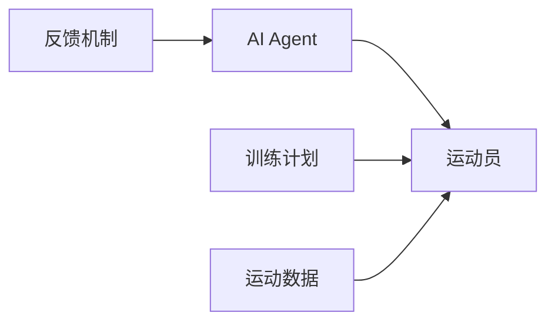
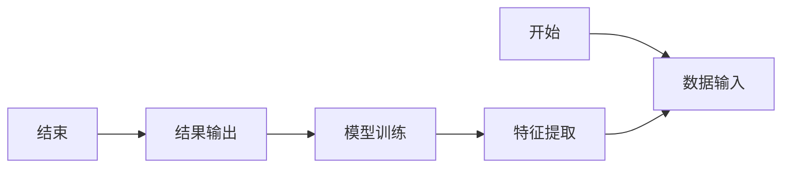
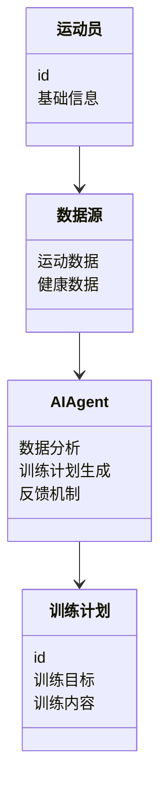
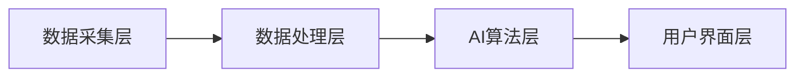
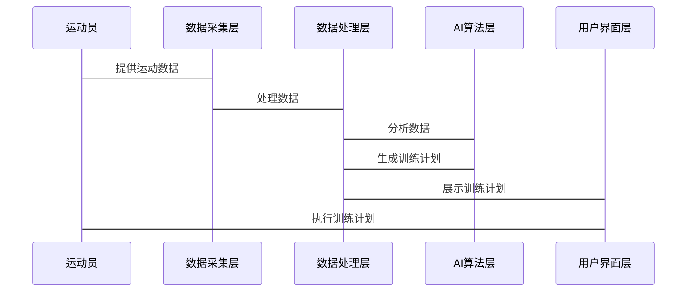

                 


# AI Agent在体育训练中的应用：个性化训练计划制定

> 关键词：AI Agent，体育训练，个性化训练计划，机器学习，数据分析

> 摘要：随着人工智能技术的迅速发展，AI Agent在体育训练中的应用日益广泛。本文深入探讨了AI Agent在体育训练中的应用，特别是如何利用AI Agent制定个性化训练计划。文章从AI Agent的基本概念、算法原理、系统架构设计到实际案例分析进行了全面阐述，为体育训练的智能化提供了新的思路和解决方案。

---

## 第一部分: AI Agent在体育训练中的应用概述

### 第1章: AI Agent与体育训练的背景介绍

#### 1.1 AI Agent的基本概念

##### 1.1.1 AI Agent的定义
AI Agent（人工智能代理）是指能够感知环境、自主决策并执行任务的智能体。AI Agent通过传感器获取信息，利用算法进行分析和推理，做出最优决策，并通过执行器与环境互动。AI Agent的核心在于其自主性和智能性，能够根据实时数据动态调整行为。

##### 1.1.2 AI Agent的核心特征
- **自主性**：AI Agent能够在没有外部干预的情况下自主运行。
- **反应性**：能够实时感知环境变化并做出响应。
- **学习能力**：通过机器学习算法不断优化自身的决策能力。
- **社交能力**：能够与其他AI Agent或人类进行有效交互。

##### 1.1.3 AI Agent在体育领域的潜力
AI Agent在体育领域的应用前景广阔。通过分析运动员的数据，AI Agent可以实时调整训练计划，优化训练效果，预防运动损伤。AI Agent还可以模拟对手行为，帮助运动员制定应对策略，提升竞技能力。

#### 1.2 体育训练的基本知识

##### 1.2.1 体育训练的定义与分类
体育训练是指通过科学的方法和手段，提高运动员身体素质、技术能力和心理素质的过程。根据训练目标的不同，可以分为力量训练、耐力训练、速度训练、灵活性训练等。

##### 1.2.2 个性化训练计划的重要性
个性化训练计划是根据运动员的个体特点（如身体条件、技术水平、运动能力等）制定的专属训练方案。它能够最大化运动员的潜力，减少训练中的风险，提高训练效率。

##### 1.2.3 传统体育训练的局限性
传统体育训练往往依赖教练的经验和主观判断，难以全面考虑运动员的个体差异。这种方法可能导致训练强度不当、训练内容单一，无法有效提升运动员的综合能力。

#### 1.3 AI Agent在体育训练中的应用背景

##### 1.3.1 体育训练中的数据化趋势
随着科技的发展，体育训练逐渐走向数据化。通过传感器和穿戴设备，运动员的生理数据、运动数据等可以实时采集和分析，为AI Agent提供了丰富的数据支持。

##### 1.3.2 技术进步推动AI在体育领域的应用
人工智能技术的快速发展为体育训练带来了新的可能性。AI Agent可以通过深度学习、强化学习等技术，分析大量数据，制定科学的训练计划。

##### 1.3.3 个性化训练计划的市场需求
现代运动员和教练团队对个性化训练计划的需求日益增加。AI Agent能够根据运动员的实时数据，动态调整训练计划，满足个性化需求。

#### 1.4 本章小结
本章介绍了AI Agent的基本概念和核心特征，并探讨了其在体育训练中的潜力。同时，分析了体育训练的基本知识和个性化训练计划的重要性，指出了传统训练的局限性以及AI Agent的应用背景。

---

## 第二部分: AI Agent的核心概念与原理

### 第2章: AI Agent的核心概念与联系

#### 2.1 AI Agent的核心原理

##### 2.1.1 知识表示与推理
知识表示是AI Agent理解世界的基础。通过符号逻辑、语义网络等方法，AI Agent能够将知识表示为数据结构，并进行推理和决策。

##### 2.1.2 行为决策机制
AI Agent的行为决策机制是其智能性的重要体现。通过强化学习、决策树等算法，AI Agent能够在复杂环境中做出最优决策。

##### 2.1.3 与体育训练的结合方式
AI Agent在体育训练中的应用主要体现在个性化训练计划的制定、运动数据分析、实时反馈等方面。AI Agent能够根据运动员的实时数据，动态调整训练计划，优化训练效果。

#### 2.2 核心概念对比表

| **核心概念** | **AI Agent** | **传统算法** | **区别** |
|--------------|--------------|--------------|----------|
| 自主性       | 高           | 低           | AI Agent能够自主决策和执行任务 |
| 学习能力     | 强           | 有限         | AI Agent能够通过机器学习不断优化 |
| 适应性       | 强           | 低           | AI Agent能够快速适应环境变化 |

#### 2.3 ER实体关系图



#### 2.4 本章小结
本章详细讲解了AI Agent的核心原理，包括知识表示与推理、行为决策机制，并通过对比表和实体关系图展示了AI Agent与传统算法的区别及其在体育训练中的结合方式。

---

## 第三部分: AI Agent的算法原理与数学模型

### 第3章: AI Agent的算法原理

#### 3.1 强化学习算法

##### 3.1.1 强化学习的基本原理
强化学习是一种通过试错机制来学习策略的方法。AI Agent通过与环境互动，不断尝试不同的动作，根据反馈（奖励或惩罚）调整行为，最终找到最优策略。

##### 3.1.2 Q-learning算法的实现
Q-learning是一种常用的强化学习算法，其核心是通过更新Q值表来记录状态-动作对的期望奖励。公式如下：

$$ Q(s, a) = Q(s, a) + \alpha [r + \max Q(s', a') - Q(s, a)] $$

其中，\( \alpha \) 是学习率，\( r \) 是奖励，\( s' \) 是下一个状态。

##### 3.1.3 算法在训练计划中的应用
在体育训练中，强化学习可以用于制定训练策略。例如，AI Agent可以根据运动员的实时状态（如疲劳程度、技术表现）选择最优的训练动作，并根据反馈调整训练计划。

#### 3.2 监督学习算法

##### 3.2.1 监督学习的定义
监督学习是一种通过标注数据训练模型的方法。模型通过输入数据和目标输出，学习输入与输出之间的映射关系。

##### 3.2.2 线性回归与分类算法
线性回归是一种简单的监督学习算法，用于预测连续型变量。例如，可以通过线性回归预测运动员的最佳恢复时间。

##### 3.2.3 在运动数据分析中的应用
监督学习可以用于分析运动员的运动数据，预测其表现。例如，通过监督学习模型预测运动员在比赛中的最佳表现时间。

#### 3.3 算法流程图



#### 3.4 数学模型与公式

##### 3.4.1 强化学习的Q值更新公式
$$ Q(s, a) = Q(s, a) + \alpha [r + \max Q(s', a') - Q(s, a)] $$

##### 3.4.2 线性回归模型
$$ y = \beta x + \epsilon $$

#### 3.5 本章小结
本章介绍了强化学习和监督学习的基本原理，并通过算法流程图和数学公式详细讲解了这些算法在体育训练中的应用。

---

## 第四部分: 体育训练中的系统分析与架构设计

### 第4章: 体育训练系统的分析与设计

#### 4.1 问题场景介绍

##### 4.1.1 个性化训练计划的需求分析
个性化训练计划需要根据运动员的个体特征（如年龄、性别、身体条件）和训练目标（如力量、耐力）制定专属的训练方案。

##### 4.1.2 系统目标与范围
系统的目标是通过AI Agent制定个性化训练计划，优化运动员的训练效果。系统的范围包括数据采集、训练计划制定、实时反馈等功能。

#### 4.2 系统功能设计

##### 4.2.1 领域模型设计



##### 4.2.2 系统架构设计



##### 4.2.3 系统接口设计
系统需要与传感器、数据库等外部系统进行交互。例如，通过API接口获取运动员的实时数据。

##### 4.2.4 系统交互流程图



#### 4.3 本章小结
本章通过领域模型设计和系统架构设计，详细描述了体育训练系统的结构和功能。同时，通过交互流程图展示了系统的操作流程。

---

## 第五部分: 项目实战

### 第5章: 项目实战

#### 5.1 环境安装
首先，需要安装必要的开发环境和库。例如，Python的安装及以下库的安装：

- NumPy
- Pandas
- Scikit-learn
- TensorFlow

#### 5.2 核心代码实现

##### 5.2.1 数据预处理

```python
import pandas as pd
import numpy as np

# 读取数据
data = pd.read_csv('athlete_data.csv')

# 数据清洗
data.dropna(inplace=True)
data = data[~data['age'].isnull()]
```

##### 5.2.2 强化学习模型实现

```python
class AI_Agent:
    def __init__(self, state_space, action_space):
        self.state_space = state_space
        self.action_space = action_space
        self.q_table = np.zeros((state_space, action_space))

    def take_action(self, state):
        # 随机选择动作
        if np.random.random() < 0.9:
            action = np.argmax(self.q_table[state])
        else:
            action = np.random.randint(self.action_space)
        return action

    def update_q_table(self, state, action, reward, next_state):
        self.q_table[state, action] += 0.1 * (reward + np.max(self.q_table[next_state]) - self.q_table[state, action])
```

##### 5.2.3 训练计划生成

```python
# 示例：生成训练计划
def generate_training_plan(data):
    # 分析数据，生成训练计划
    plan = []
    for athlete in data['id']:
        # 根据运动员数据生成个性化训练计划
        plan.append({'id': athlete, 'plan': '...'})
    return plan
```

#### 5.3 案例分析
以一名举重运动员为例，AI Agent可以根据其力量、体重、训练数据等，制定个性化的训练计划。例如，AI Agent会建议增加力量训练的频率，或者调整训练强度以避免受伤。

#### 5.4 项目总结
本项目展示了如何利用AI Agent制定个性化训练计划，优化运动员的训练效果。通过实际案例分析，验证了AI Agent在体育训练中的有效性。

---

## 第六部分: 总结与展望

### 第6章: 总结与展望

#### 6.1 总结
本文详细探讨了AI Agent在体育训练中的应用，特别是个性化训练计划的制定。通过算法原理、系统架构设计和项目实战，展示了AI Agent在体育训练中的巨大潜力。

#### 6.2 未来展望
未来，随着AI技术的不断进步，AI Agent在体育训练中的应用将更加广泛。例如，结合边缘计算和物联网技术，AI Agent可以实时分析运动员的数据，提供更加精准的训练建议。

---

## 参考文献

（此处列出参考文献）

---

通过以上内容，我们全面探讨了AI Agent在体育训练中的应用，特别是在个性化训练计划制定方面的技术细节和实际应用。希望这篇文章能够为体育训练的智能化提供新的思路和解决方案。

