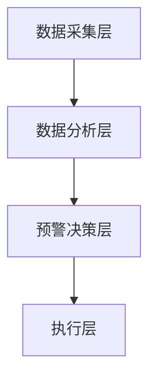
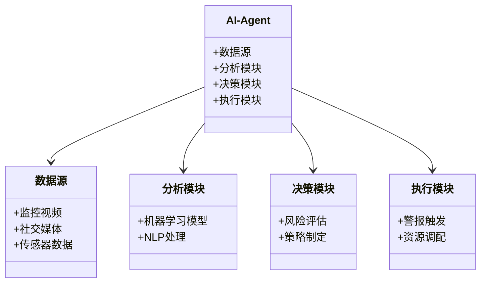
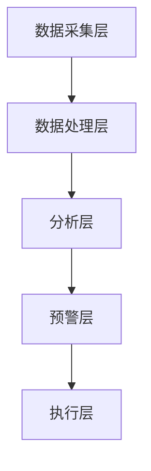
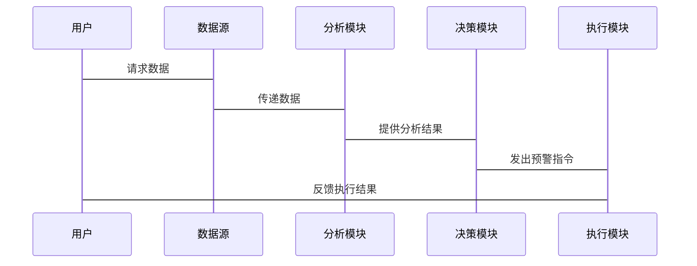

                 


# AI Agent在公共安全领域的预警系统

## 关键词
AI Agent, 公共安全, 预警系统, 人工智能, 安全预警, 机器学习, 多Agent系统

## 摘要
随着人工智能技术的迅速发展，AI Agent在公共安全领域的应用日益广泛。本文详细探讨了AI Agent在公共安全预警系统中的作用，分析了其核心技术与原理，设计了系统架构，并通过实战项目展示了其应用效果。文章还讨论了系统的优化与扩展，为未来的公共安全预警系统提供了参考。

## 第一部分: AI Agent在公共安全领域的背景与概念

### 第1章: AI Agent的基本概念与特点

#### 1.1 AI Agent的定义与特点
##### 1.1.1 AI Agent的定义
AI Agent是一种能够感知环境并采取行动以实现目标的智能实体。它具备自主性、反应性、社会性和学习性等特性，能够独立解决问题。

##### 1.1.2 AI Agent的核心特点
- **自主性**：AI Agent能够自主决策，无需外部干预。
- **反应性**：能够实时感知环境变化并做出反应。
- **社会性**：可以与其他Agent或人类进行协作和通信。
- **学习性**：通过机器学习不断提升自身的智能水平。

##### 1.1.3 AI Agent与传统AI的区别
AI Agent不仅具备数据处理能力，还能主动与环境互动，实现目标。而传统AI主要侧重于数据处理和分析。

#### 1.2 AI Agent在公共安全中的应用
##### 1.2.1 公共安全领域的AI Agent应用场景
- **犯罪预防**：通过分析历史数据预测犯罪高发区域。
- **反恐**：识别潜在恐怖活动的迹象。
- **应急响应**：在紧急情况下协调资源，优化救援行动。

##### 1.2.2 AI Agent在犯罪预防中的作用
AI Agent可以实时监控社交媒体和监控录像，识别异常行为模式，提前预警潜在犯罪。

##### 1.2.3 AI Agent在反恐中的应用
通过分析大量数据，识别恐怖袭击的潜在迹象，协助制定预防策略。

#### 1.3 公共安全预警系统的需求与挑战
##### 1.3.1 公共安全预警系统的定义
公共安全预警系统是一种通过实时数据监测和分析，提前预警潜在安全风险的系统。

##### 1.3.2 当前公共安全预警系统存在的问题
- 数据来源单一，覆盖面有限。
- 系统响应速度慢，预警不及时。
- 数据分析能力有限，难以处理复杂场景。

##### 1.3.3 AI Agent如何解决这些问题
AI Agent能够整合多源数据，利用机器学习提升分析能力，实现快速响应和精准预警。

#### 1.4 AI Agent在公共安全中的优势与挑战
##### 1.4.1 AI Agent的优势
- 提升预警系统的准确性和效率。
- 实现多部门协作，优化资源配置。
- 能够处理复杂场景，提高应对能力。

##### 1.4.2 AI Agent在公共安全中的挑战
- 数据隐私问题：如何保护公民隐私，避免数据泄露。
- 模型准确性：确保AI Agent的决策准确，避免误报和漏报。
- 技术复杂性：需要高度专业化的技术团队进行开发和维护。

## 第2章: AI Agent的核心技术与原理

### 2.1 知识表示与推理
#### 2.1.1 知识表示的定义与方法
知识表示是将现实世界中的信息转化为计算机可处理的形式，常用的方法包括概念图、语义网络和知识图谱。

#### 2.1.2 推理机制的原理
推理机制通过逻辑推理或机器学习方法，从已知信息推导出新的结论，帮助AI Agent做出决策。

#### 2.1.3 知识图谱的构建与应用
知识图谱是一种结构化的知识表示形式，用于存储实体及其关系，支持复杂的语义查询和推理。

### 2.2 多Agent系统
#### 2.2.1 多Agent系统的定义与结构
多Agent系统由多个相互协作的Agent组成，每个Agent负责特定任务，共同完成复杂目标。

#### 2.2.2 多Agent系统的通信与协作
通过消息传递和协议协商，多个Agent可以协同工作，实现信息共享和任务分配。

#### 2.2.3 多Agent系统在复杂环境中的应用
在公共安全领域，多Agent系统可以协调多个部门和资源，优化应急响应流程。

### 2.3 自然语言处理
#### 2.3.1 自然语言处理的定义与作用
自然语言处理（NLP）是让计算机理解人类语言的技术，用于文本分析、信息提取和情感分析。

#### 2.3.2 文本信息抽取与分析
通过NLP技术，AI Agent可以从新闻、社交媒体等文本数据中提取有用信息，辅助预警系统决策。

#### 2.3.3 自然语言生成
生成自然流畅的文本，用于报告撰写和信息传递，提升预警系统的沟通效率。

### 2.4 机器学习与深度学习
#### 2.4.1 机器学习的定义与分类
机器学习是一种数据驱动的算法，通过训练数据学习模式，实现预测和分类任务。

#### 2.4.2 深度学习的定义与特点
深度学习是一种多层神经网络技术，能够处理复杂的数据模式，如图像和语音识别。

#### 2.4.3 机器学习与深度学习在公共安全中的应用
- 利用机器学习进行犯罪模式分析和预测。
- 使用深度学习技术进行视频监控和人脸识别，识别潜在威胁。

## 第3章: AI Agent的系统设计与实现

### 3.1 系统架构设计
#### 3.1.1 系统架构概述
AI Agent预警系统通常采用分层架构，包括数据采集层、分析层、决策层和执行层。

#### 3.1.2 系统功能模块设计
- 数据采集模块：收集多源数据，如监控视频、社交媒体、传感器数据。
- 数据分析模块：利用机器学习和NLP技术分析数据，识别异常模式。
- 预警决策模块：基于分析结果，生成预警信息并制定应对策略。
- 执行反馈模块：执行决策并收集反馈，优化系统性能。

#### 3.1.3 系统架构图


### 3.2 问题场景与项目介绍
#### 3.2.1 问题场景介绍
以城市犯罪预警为例，系统需要实时监控城市各区域的犯罪风险，提前预警。

#### 3.2.2 项目目标
通过AI Agent实现犯罪风险的实时监测和预警，协助警方优化资源配置，提升反应速度。

### 3.3 系统功能设计
#### 3.3.1 领域模型设计


#### 3.3.2 系统架构设计


#### 3.3.3 系统接口设计
- 数据接口：与监控系统、数据库等进行数据交互。
- API接口：提供外部系统调用的接口，如RESTful API。

#### 3.3.4 系统交互流程


### 3.4 系统实现与代码
#### 3.4.1 环境搭建
需要安装Python、TensorFlow、Keras、Flask等工具。

#### 3.4.2 核心代码实现
```python
import tensorflow as tf
from tensorflow.keras import layers

model = tf.keras.Sequential([
    layers.Conv2D(32, (3,3), activation='relu', input_shape=(64, 64, 3)),
    layers.MaxPooling2D((2,2)),
    layers.Conv2D(64, (3,3), activation='relu'),
    layers.MaxPooling2D((2,2)),
    layers.Flatten(),
    layers.Dense(128, activation='relu'),
    layers.Dense(10, activation='softmax')
])
```

#### 3.4.3 代码解读与分析
上述代码定义了一个卷积神经网络模型，用于图像分类任务，适用于视频监控中的目标识别。

#### 3.4.4 系统实现流程
1. 数据预处理：清洗和标注数据。
2. 模型训练：使用训练数据训练AI Agent。
3. 模型部署：将训练好的模型部署到预警系统中。
4. 系统测试：测试系统的准确性和响应速度。

### 3.5 案例分析
#### 3.5.1 案例背景
假设某城市发生了连环盗窃案，AI Agent通过分析历史数据和当前监控视频，识别出犯罪高发区域。

#### 3.5.2 系统应用效果
AI Agent成功预测了下一犯罪点，并协助警方及时布控，成功抓获犯罪嫌疑人。

## 第4章: AI Agent的优化与扩展

### 4.1 系统优化
#### 4.1.1 模型优化策略
- 使用迁移学习提升模型性能。
- 采用在线学习，实时更新模型参数。

#### 4.1.2 系统性能优化
- 优化数据处理流程，提升系统响应速度。
- 使用分布式计算，提高数据处理能力。

### 4.2 系统扩展
#### 4.2.1 系统扩展性设计
- 模块化设计，便于功能扩展。
- 支持多种数据源接入，提升系统的数据处理能力。

#### 4.2.2 系统可扩展性实现
- 增加新的数据源类型，如新增传感器数据。
- 扩展系统功能，如加入更多AI算法模型。

### 4.3 其他技术结合
#### 4.3.1 区块链技术
- 结合区块链技术，确保数据的安全性和不可篡改性。

#### 4.3.2 边缘计算
- 利用边缘计算技术，提升系统的实时性和响应速度。

#### 4.3.3 大数据分析技术
- 结合大数据分析技术，提升数据处理能力和预测准确性。

### 4.4 未来发展方向
#### 4.4.1 智能化水平提升
- 进一步提升AI Agent的自主决策能力，实现更智能的预警和响应。

#### 4.4.2 多模态数据融合
- 综合处理文本、图像、语音等多种数据类型，提升系统的综合分析能力。

#### 4.4.3 面向特定场景优化
- 根据不同安全场景的需求，定制化AI Agent功能，提升系统的适用性。

## 第5章: 项目实战与总结

### 5.1 项目实战
#### 5.1.1 项目背景与目标
以城市犯罪预警系统为例，目标是通过AI Agent实现犯罪风险的实时监测和预警。

#### 5.1.2 环境搭建与数据准备
安装必要的开发工具和库，收集和整理相关数据，进行数据预处理。

#### 5.1.3 模型训练与优化
选择合适的机器学习模型，进行训练和优化，提升模型的准确性和效率。

#### 5.1.4 系统实现与测试
编写系统代码，实现数据采集、分析、预警和执行功能，进行系统测试和优化。

#### 5.1.5 实际案例分析
通过具体案例分析，展示系统的实际应用效果和优势。

### 5.2 项目总结与经验分享
#### 5.2.1 项目总结
总结项目的实施过程，分析系统的优缺点，提出改进建议。

#### 5.2.2 经验与教训
分享项目中的经验教训，为后续项目提供参考。

### 5.3 优化建议与未来展望
#### 5.3.1 系统优化建议
从算法、架构、数据处理等方面提出优化建议，提升系统的性能和稳定性。

#### 5.3.2 未来展望
展望AI Agent在公共安全领域的未来发展方向，预测技术趋势和应用场景。

## 附录

### 附录A: 工具安装指南
详细说明开发环境的搭建步骤，包括安装Python、TensorFlow等工具的教程。

### 附录B: 数据集说明
列出项目中使用的数据集，描述数据格式和获取方式。

### 附录C: 系统接口文档
提供系统接口的详细说明，包括接口名称、输入输出参数、调用方式等。

### 附录D: 参考文献
列出本文参考的相关文献和资料，提供详细的引用信息。

---

通过以上步骤，您可以根据需要逐步完成每个部分的具体内容，确保文章结构清晰、内容详实，为读者提供有价值的技术信息和实践指导。

