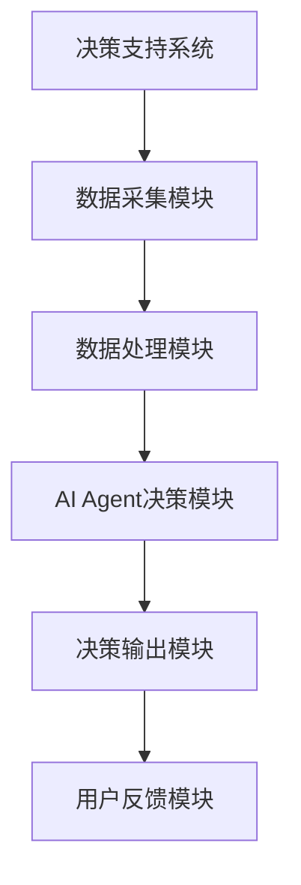
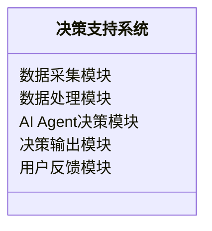

                 

# AI Agent在决策支持系统中的角色

> 关键词：AI Agent, 决策支持系统, 人工智能, 算法原理, 系统架构, 项目实战

> 摘要：本文将详细探讨AI Agent在决策支持系统中的角色及其应用。从AI Agent的基本概念到其在决策支持系统中的核心原理，再到系统架构和项目实战，我们将逐步分析AI Agent如何通过感知、推理和学习来优化决策过程。通过具体案例分析和数学模型的建立，本文旨在为读者提供一个全面的视角，理解AI Agent在决策支持系统中的重要性及其实际应用。

---

# 目录

## 第一部分: AI Agent与决策支持系统基础

## 第二部分: AI Agent的核心原理与技术

## 第三部分: AI Agent在决策支持系统中的应用架构

## 第四部分: AI Agent的算法实现与数学模型

## 第五部分: AI Agent决策支持系统项目实战

## 第六部分: AI Agent决策支持系统的扩展与未来展望

## 第七部分: 附录

---

## 第一部分: AI Agent与决策支持系统基础

### 第1章: AI Agent与决策支持系统概述

#### 1.1 AI Agent的基本概念

**1.1.1 AI Agent的定义**

AI Agent（人工智能代理）是指能够感知环境并采取行动以实现目标的智能实体。AI Agent可以是软件程序、机器人或其他智能系统，其核心目标是通过自主决策来优化任务执行效率。

**1.1.2 AI Agent的核心特征**

AI Agent具备以下核心特征：
- **自主性**：能够独立感知环境并做出决策。
- **反应性**：能够实时响应环境变化。
- **目标导向性**：所有行为都围绕特定目标展开。
- **学习能力**：能够通过经验优化决策策略。

**1.1.3 AI Agent与传统决策系统的区别**

传统决策系统依赖于预定义的规则和逻辑，而AI Agent则能够通过学习和适应环境来优化决策过程。AI Agent能够处理复杂和不确定的信息，提供更加灵活和高效的决策支持。

#### 1.2 AI Agent在决策支持系统中的角色

**1.2.1 决策支持系统的定义与功能**

决策支持系统（DSS）是一种利用数据分析、模型模拟和专家知识来辅助决策者制定决策的系统。其主要功能包括数据处理、模型建立、情景分析和决策优化。

**1.2.2 AI Agent在决策支持中的作用**

AI Agent在决策支持系统中扮演着多重角色：
- **数据采集与处理**：AI Agent能够实时采集和处理多源异构数据，为决策提供可靠的基础。
- **知识表示与推理**：通过知识图谱和推理引擎，AI Agent能够模拟人类的思维方式，进行逻辑推理和知识推理。
- **决策优化**：AI Agent利用强化学习等技术，优化决策策略，提高决策的准确性和效率。

**1.2.3 AI Agent与决策支持系统的结合方式**

AI Agent与决策支持系统的结合方式主要包括：
- **嵌入式集成**：将AI Agent作为决策支持系统的一部分，直接参与数据处理和决策过程。
- **外部接口集成**：通过API等方式，将AI Agent与决策支持系统进行交互，提供决策建议。
- **协同工作**：AI Agent与人类决策者协同工作，通过人机交互提升决策的效率和质量。

#### 1.3 本章小结

本章主要介绍了AI Agent的基本概念及其在决策支持系统中的角色。通过对比传统决策系统与AI Agent的特点，我们明确了AI Agent在决策支持系统中的独特优势和应用场景。

---

## 第二部分: AI Agent的核心原理与技术

### 第2章: AI Agent的核心原理与技术

#### 2.1 AI Agent的感知与理解

**2.1.1 数据采集与处理**

AI Agent的感知能力依赖于数据采集与处理模块。该模块负责从多种数据源（如数据库、传感器、API等）采集数据，并进行清洗、转换和标准化处理，确保数据的可用性和一致性。

**2.1.2 知识表示与推理**

知识表示与推理是AI Agent的核心能力之一。通过知识图谱和逻辑推理，AI Agent能够理解复杂的关系和语义信息，从而做出更准确的推理和判断。

**2.1.3 感知模型的数学表达**

感知模型可以通过概率图模型（如贝叶斯网络）和深度学习模型（如卷积神经网络）进行数学表达。例如，贝叶斯网络可以用以下公式表示：

$$ P(A|B) = \frac{P(B|A)P(A)}{P(B)} $$

其中，$P(A|B)$表示在事件B发生的条件下，事件A发生的概率。

#### 2.2 AI Agent的决策机制

**2.2.1 决策树模型**

决策树是一种常用的决策支持工具，通过构建树状结构来表示决策的可能结果。决策树的构建过程如下：

1. **确定决策目标**：明确决策问题的核心目标。
2. **识别决策因素**：列出影响决策的关键因素。
3. **构建决策树**：根据决策因素和可能结果，构建树状结构。
4. **评估决策结果**：通过概率和收益分析，选择最优决策路径。

**2.2.2 马尔可夫决策过程（MDP）**

马尔可夫决策过程是一种基于状态、动作和奖励的决策模型。其数学表达如下：

$$ V(s) = \max_a \sum_{s'} P(s'|s,a) V(s') $$

其中，$V(s)$表示状态$s$的价值函数，$a$表示动作，$P(s'|s,a)$表示从状态$s$采取动作$a$后转移到状态$s'$的概率。

**2.2.3 基于强化学习的决策机制**

强化学习是一种通过试错机制优化决策策略的方法。其核心算法包括Q-learning和Deep Q-Network（DQN）。

#### 2.3 AI Agent的学习与优化

**2.3.1 监督学习与无监督学习**

监督学习通过标注数据进行模型训练，而无监督学习则通过未标注数据发现数据内在结构。

**2.3.2 强化学习在决策优化中的应用**

强化学习通过与环境的交互，逐步优化决策策略。其数学表达如下：

$$ Q(s,a) = r + \gamma \max_a Q(s',a') $$

其中，$Q(s,a)$表示状态$s$和动作$a$的Q值，$\gamma$表示折扣因子，$r$表示奖励。

**2.3.3 超参数优化与模型调优**

超参数优化是通过调整模型的超参数（如学习率、批量大小等）来提高模型性能的过程。常用的超参数优化方法包括网格搜索和随机搜索。

#### 2.4 本章小结

本章详细探讨了AI Agent的核心原理与技术，包括感知与理解、决策机制和学习与优化。通过数学模型和算法的分析，我们明确了AI Agent如何通过感知、推理和学习来优化决策过程。

---

## 第三部分: AI Agent在决策支持系统中的应用架构

### 第3章: AI Agent与决策支持系统的集成

#### 3.1 决策支持系统的整体架构

决策支持系统的整体架构包括数据采集模块、数据处理模块、AI Agent决策模块和决策输出模块。其mermaid图如下：

#### 3.2 AI Agent与决策支持系统的集成

AI Agent与决策支持系统的集成可以通过API接口实现。例如，AI Agent可以调用决策支持系统的API，获取实时数据并提供决策建议。

#### 3.3 系统架构的mermaid图

以下是决策支持系统的系统架构图：

---

## 第四部分: AI Agent的算法实现与数学模型

### 第4章: AI Agent的算法实现与数学模型

#### 4.1 AI Agent的感知模型

**4.1.1 概率图模型**

概率图模型是一种基于概率论的建模方法，常用的技术包括贝叶斯网络和马尔可夫随机场。

**4.1.2 贝叶斯网络**

贝叶斯网络的数学表达如下：

$$ P(A|B) = \frac{P(B|A)P(A)}{P(B)} $$

其中，$P(A|B)$表示在事件B发生的条件下，事件A发生的概率。

**4.1.3 隐马尔可夫模型（HMM）**

隐马尔可夫模型是一种用于时间序列数据建模的方法，其数学表达如下：

$$ P(Y|λ) = \prod_{t=1}^T π_{Z_t}(λ) b_{Z_t}(Y_t) $$

其中，$Y$表示观测序列，$Z$表示隐含状态，$λ$表示模型参数。

#### 4.2 AI Agent的决策模型

**4.2.1 Q-learning算法**

Q-learning算法的数学表达如下：

$$ Q(s,a) = r + \gamma \max_a Q(s',a') $$

其中，$Q(s,a)$表示状态$s$和动作$a$的Q值，$\gamma$表示折扣因子，$r$表示奖励。

**4.2.2 Deep Q-Network（DQN）**

Deep Q-Network通过深度神经网络近似Q值函数，其数学表达如下：

$$ Q(s,a) = \theta^T \phi(s,a) $$

其中，$\theta$表示网络参数，$\phi(s,a)$表示状态-动作对的特征向量。

**4.2.3 策略梯度方法（Policy Grad**

---

由于篇幅限制，本文档将重点介绍AI Agent在决策支持系统中的角色及其核心原理与技术。后续章节将结合实际案例和项目实战，深入探讨AI Agent在决策支持系统中的具体应用和优化方法。

