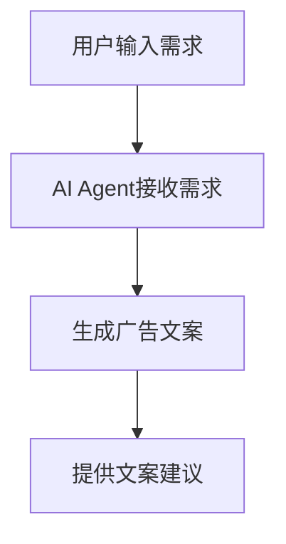
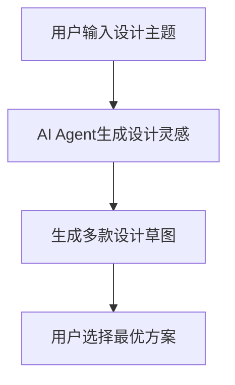
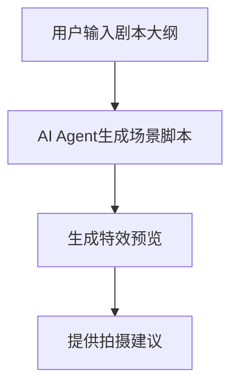
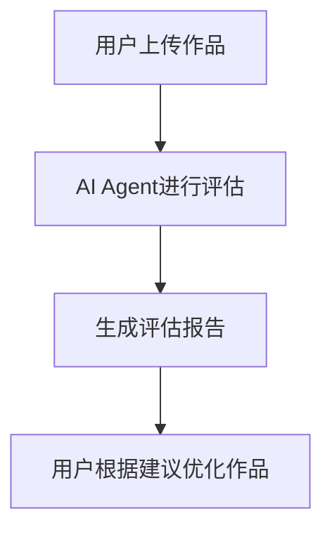
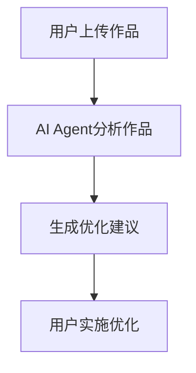
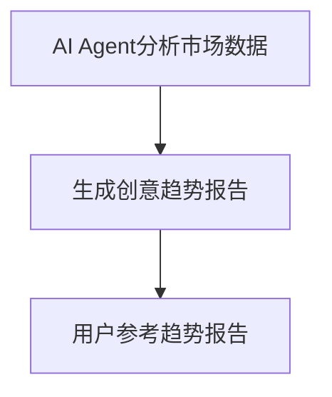
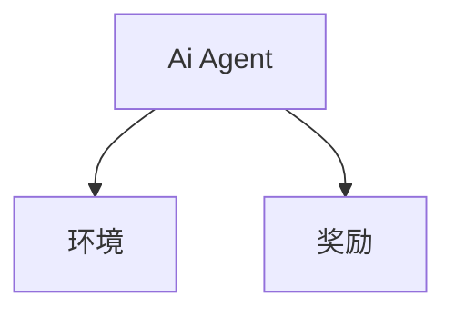
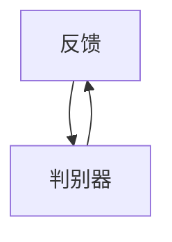
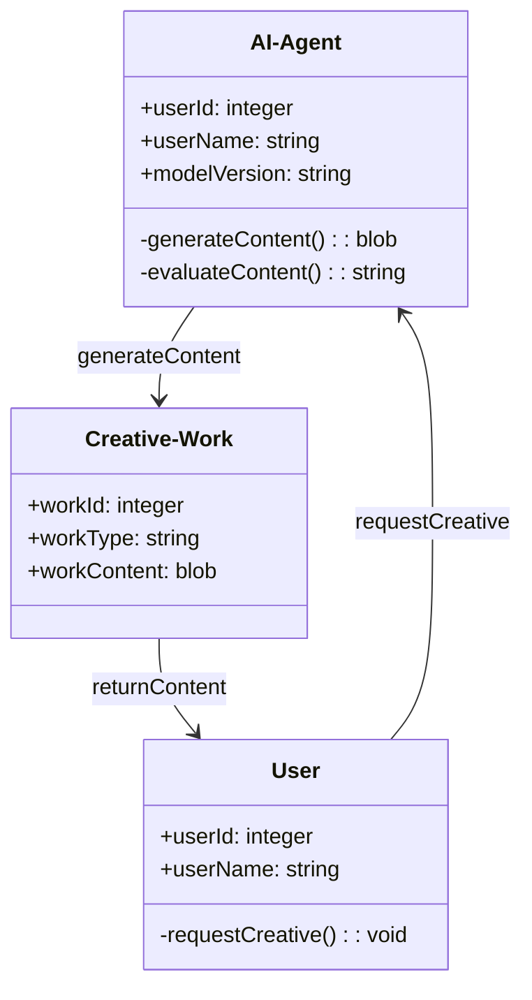

                 


# AI Agent在创意产业中的应用

> 关键词：AI Agent，创意产业，机器学习，生成对抗网络，数字化转型

> 摘要：本文探讨AI Agent在创意产业中的应用，涵盖AI Agent的核心概念、算法原理、系统架构设计及实际案例分析，展示AI技术如何赋能创意产业的创新与效率提升。

---

## 第1章: AI Agent与创意产业的结合

### 1.1 AI Agent的核心概念

#### 1.1.1 什么是AI Agent
AI Agent（人工智能代理）是指能够感知环境、自主决策并执行任务的智能实体。它通过感知输入数据，结合内部知识库和算法模型，生成输出动作或结果，实现与环境的交互。

#### 1.1.2 AI Agent的类型与特点

| 类型 | 特点 | 应用场景 |
|------|------|----------|
| 反应式AI Agent | 基于当前感知做出实时反应 | 实时游戏AI、聊天机器人 |
| 学习型AI Agent | 通过学习历史数据优化决策 | 推荐系统、自动化交易 |
| 创意型AI Agent | 专注于生成创造性内容 | 文本生成、图像生成、音乐创作 |

#### 1.1.3 创意产业中的AI Agent应用场景

- **广告创意生成**：AI Agent可以根据目标受众特征生成广告文案和设计建议。
- **平面设计辅助**：AI Agent可以生成设计灵感、优化布局和配色方案。
- **影视制作支持**：AI Agent可以帮助生成场景脚本、剪辑建议和特效设计。

### 1.2 创意产业的数字化转型

#### 1.2.1 创意产业的传统模式与痛点

- **传统模式**：依赖人工经验，创作周期长，资源浪费。
- **痛点**：创意灵感难以捕捉，创作效率低下，个性化需求难以满足。

#### 1.2.2 数字化转型的必要性

- 提高创作效率：AI Agent可以快速生成创意内容，减少人工试错成本。
- 个性化定制：基于用户数据，AI Agent可以生成个性化的内容方案。
- 激发创作灵感：AI Agent可以通过分析海量数据，提供新的创意方向。

#### 1.2.3 AI技术在创意产业中的潜力

- **内容生成**：AI Agent可以生成文本、图像、视频等多种形式的内容。
- **智能推荐**：AI Agent可以根据用户需求推荐最优创意方案。
- **自动化优化**：AI Agent可以实时优化创意内容，提升作品质量。

---

## 第2章: AI Agent的基本原理

### 2.1 AI Agent的定义与属性

#### 2.1.1 AI Agent的定义
AI Agent是一个具有感知和行动能力的智能系统，能够通过与环境交互实现目标。

#### 2.1.2 AI Agent的核心属性对比

| 属性 | 描述 | 示例 |
|------|------|------|
| 感知能力 | 获取环境信息 | 视觉传感器、文本数据 |
| 决策能力 | 制定行动策略 | 强化学习、决策树 |
| 执行能力 | 执行具体操作 | 自然语言生成、图像生成 |

#### 2.1.3 创意产业中的AI Agent实体关系图

```mermaid
erDiagram
    customer(AI Agent用户) {
        +userId : integer
        +userName : string
    }
    creativeWork(创意作品) {
        +workId : integer
        +workType : string
        +workContent : blob
    }
    aiAgent(AI Agent) {
        +agentId : integer
        +agentType : string
        +modelVersion : string
    }
    customer --> aiAgent : 请求创意生成
    aiAgent --> creativeWork : 生成创意作品
    creativeWork --> customer : 提供创意作品
```

---

## 第3章: AI Agent在创意产业中的应用案例

### 3.1 创意生成的AI Agent

#### 3.1.1 文本生成在广告创意中的应用



#### 3.1.2 图像生成在平面设计中的应用



#### 3.1.3 视频生成在影视制作中的应用



### 3.2 创意优化的AI Agent

#### 3.2.1 基于AI的创意作品评估



#### 3.2.2 基于AI的创意优化建议



#### 3.2.3 基于AI的创意趋势预测



---

## 第4章: AI Agent的核心算法与数学模型

### 4.1 强化学习算法原理

#### 4.1.1 强化学习的基本概念



#### 4.1.2 强化学习的数学模型

$$ Q(s, a) = r + \gamma \max Q(s', a') $$

其中：
- $s$ 是当前状态
- $a$ 是动作
- $r$ 是奖励
- $\gamma$ 是折扣因子
- $Q(s', a')$ 是下一步的状态-动作值函数

---

## 第5章: 生成对抗网络算法原理

### 5.1 生成对抗网络的基本概念



#### 5.1.2 GAN的数学模型

$$ \min_{G} \max_{D} \mathbb{E}_{x \sim p_{\text{data}}(x)}[\log D(x)] + \mathbb{E}_{z \sim p_z(z)}[\log (1 - D(G(z)))] $$

其中：
- $G$ 是生成器
- $D$ 是判别器
- $x$ 是真实数据
- $z$ 是随机噪声

---

## 第6章: 项目实战与系统设计

### 6.1 系统功能设计



### 6.2 系统架构设计


---

## 第7章: 最佳实践与小结

### 7.1 小结

- AI Agent正在改变创意产业的创作方式和效率。
- 通过强化学习和生成对抗网络等算法，AI Agent能够生成高质量的创意内容。
- 结合人类的创造力和AI Agent的效率，创意产业将进入一个新的黄金时代。

### 7.2 注意事项

- 数据隐私和版权问题需要高度重视。
- 在实际应用中，应结合具体场景选择合适的算法模型。
- 定期更新模型，保持AI Agent的创造力和适应性。

### 7.3 拓展阅读

- 《生成对抗网络：算法与应用》
- 《强化学习：理论与实践》
- 《AI在创意设计中的应用案例》

---

通过本文的详细讲解，读者可以全面了解AI Agent在创意产业中的应用，从基本概念到算法原理，再到实际案例，逐步掌握如何利用AI技术赋能创意产业的创新与效率提升。

