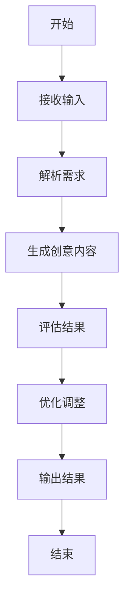
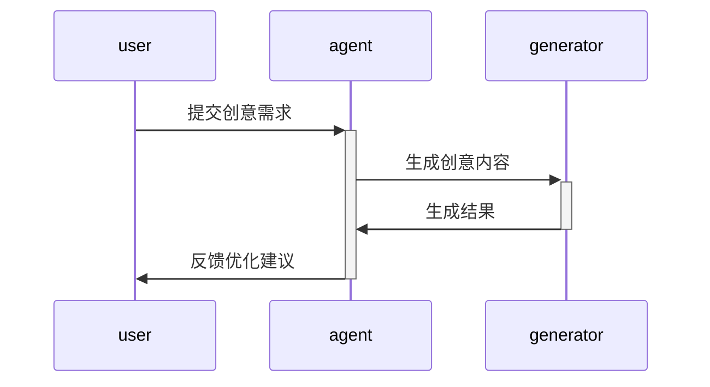

                 


# AI Agent在创意产业中的应用与限制

## 关键词：
AI Agent，创意产业，人工智能，算法原理，系统架构，项目实战

## 摘要：
本文详细探讨了AI Agent在创意产业中的应用与限制。从AI Agent的基本概念和背景入手，分析其在创意产业中的应用场景、算法原理和系统架构，结合实际案例，展示AI Agent在创意产业中的潜力与挑战。最后，提出了AI Agent在创意产业中的最佳实践和未来发展方向。

---

# 第一部分: AI Agent 的背景与核心概念

## 第1章: AI Agent 的基本概念与背景介绍

### 1.1 AI Agent 的定义与核心要素
#### 1.1.1 AI Agent 的定义
AI Agent（人工智能代理）是指能够感知环境、自主决策并执行任务的智能体。它通过学习和适应，能够在复杂环境中完成特定目标。

#### 1.1.2 AI Agent 的核心要素
- **感知能力**：通过传感器或数据输入获取环境信息。
- **决策能力**：基于感知信息，选择最优行动方案。
- **执行能力**：通过动作或输出实现决策。
- **学习能力**：通过经验优化自身性能。

#### 1.1.3 AI Agent 的类型与特点
- **反应式AI Agent**：实时感知并做出反应。
- **认知式AI Agent**：具备推理和规划能力。
- **协作式AI Agent**：能够与其他AI Agent或人类协作。

### 1.2 创意产业的现状与挑战
#### 1.2.1 创意产业的定义与范围
创意产业包括广告、设计、影视、音乐、游戏等多个领域，强调创意和创新。

#### 1.2.2 创意产业的传统模式与痛点
- **效率低下**：创意过程耗时长，资源浪费。
- **灵感依赖**：创意高度依赖人类灵感。
- **个性化需求**：客户对定制化要求高，难以标准化。

#### 1.2.3 创意产业的数字化转型趋势
随着AI技术的发展，创意产业逐渐向数字化、智能化方向转型。

### 1.3 AI Agent 进入创意产业的背景
#### 1.3.1 AI 技术的发展与成熟
AI技术的快速发展为AI Agent在创意产业中的应用提供了技术基础。

#### 1.3.2 创意产业对智能化工具的需求
创意产业需要更高效、更智能的工具来提升创作效率和质量。

#### 1.3.3 AI Agent 在创意产业中的定位与角色
AI Agent在创意产业中扮演辅助者和创新者的双重角色，帮助人类实现创意构想。

---

## 第2章: AI Agent 与创意产业的核心概念

### 2.1 AI Agent 的核心原理
#### 2.1.1 AI Agent 的感知与决策机制
AI Agent通过感知环境信息，利用算法进行决策。

#### 2.1.2 AI Agent 的学习与进化能力
通过机器学习算法，AI Agent能够不断优化自身的性能。

#### 2.1.3 AI Agent 的自主性与适应性
AI Agent能够在复杂环境中自主适应并完成任务。

### 2.2 创意产业中的 AI Agent 应用场景
#### 2.2.1 文案创作与内容生成
AI Agent可以辅助生成广告文案、营销策略等。

#### 2.2.2 视觉设计与艺术创作
AI Agent可以生成图形、设计建议，甚至创作数字艺术作品。

#### 2.2.3 音乐创作与表演辅助
AI Agent可以生成音乐、编写歌词，甚至辅助音乐制作。

#### 2.2.4 互动体验与用户行为分析
AI Agent可以分析用户行为，优化互动体验设计。

### 2.3 AI Agent 的核心概念与属性对比
#### 2.3.1 AI Agent 与传统工具的对比分析
| 特性         | 传统工具       | AI Agent         |
|--------------|----------------|------------------|
| 智能性       | 低             | 高               |
| 学习能力     | 无             | 有               |
| 自适应性     | 无             | 有               |
| 创新性       | 有限           | 强               |

#### 2.3.2 创意产业中 AI Agent 的独特性
AI Agent能够提供个性化的解决方案，突破传统工具的限制。

#### 2.3.3 AI Agent 的优势与局限性
- **优势**：高效、智能、创新。
- **局限性**：缺乏人类情感，难以完全替代人类创造力。

---

## 第3章: AI Agent 的算法原理与数学模型

### 3.1 AI Agent 的核心算法
#### 3.1.1 基于强化学习的 AI Agent
通过奖励机制优化决策策略。

#### 3.1.2 基于生成对抗网络的 AI Agent
通过生成和对抗过程，生成高质量内容。

#### 3.1.3 基于知识图谱的 AI Agent
通过知识图谱进行推理和决策。

### 3.2 AI Agent 的数学模型
#### 3.2.1 强化学习的数学模型
$$ V(s) = \max_{a} [r + V(s') ] $$
其中，$V(s)$ 是状态价值函数，$r$ 是奖励，$s'$ 是下一个状态。

#### 3.2.2 生成对抗网络的数学模型
$$ G \text{ 和 } D \text{ 的损失函数} $$
生成器（$G$）和判别器（$D$）通过对抗训练优化生成内容。

#### 3.2.3 知识图谱的表示学习
通过向量表示知识节点，计算节点间的关系。

### 3.3 AI Agent 的算法流程图


---

## 第4章: 创意产业中 AI Agent 的系统架构

### 4.1 系统架构设计
#### 4.1.1 系统功能模块划分
- **输入模块**：接收创意需求。
- **处理模块**：生成创意内容。
- **输出模块**：输出结果并反馈优化建议。

#### 4.1.2 系统架构的层次结构
- **用户层**：用户输入需求。
- **算法层**：AI Agent处理需求。
- **输出层**：展示结果。

#### 4.1.3 系统交互流程设计


### 4.2 系统接口设计
#### 4.2.1 用户端接口
- 提供用户输入界面。
- 展示生成内容和优化建议。

#### 4.2.2 后台处理接口
- 接收用户输入。
- 调用AI算法生成内容。

#### 4.2.3 第三方服务接口
- 调用外部API进行内容生成。

### 4.3 系统交互流程图


---

## 第5章: 创意产业中的 AI Agent 项目实战

### 5.1 项目背景
以广告文案生成为例，展示AI Agent的应用。

### 5.2 系统核心实现
#### 5.2.1 环境安装
```bash
pip install numpy matplotlib tensorflow
```

#### 5.2.2 核心代码实现
```python
def generate_creative_content(prompt):
    # 使用生成对抗网络生成内容
    content = generator.generate(prompt)
    return content
```

### 5.3 案例分析
分析一个实际项目，展示AI Agent在广告文案生成中的应用。

### 5.4 经验总结
总结项目中的经验教训，提出改进建议。

---

## 第6章: 总结与展望

### 6.1 总结
AI Agent在创意产业中的潜力巨大，但也面临技术和人类接受度的挑战。

### 6.2 展望
未来，AI Agent将与人类共创，推动创意产业的进一步发展。

---

通过以上内容，我们详细探讨了AI Agent在创意产业中的应用与限制，从理论到实践，为读者提供了全面的视角。

