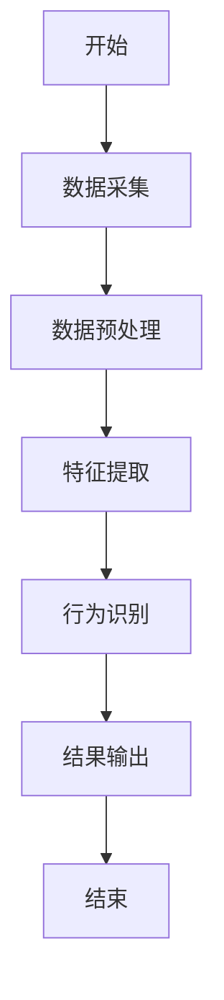
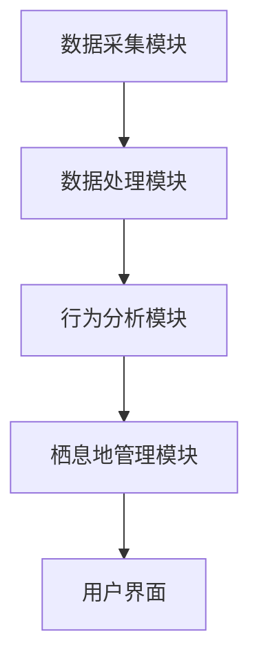

                 

# AI Agent在动物保护中的应用：行为分析与栖息地管理

---

## 关键词  
AI Agent, 动物保护, 行为分析, 栖息地管理, 人工智能, 机器学习

---

## 摘要  
随着人工智能技术的飞速发展，AI Agent（人工智能代理）在动物保护领域展现出巨大的潜力。本文将探讨AI Agent在动物行为分析与栖息地管理中的应用，结合实际案例与系统设计，分析其在保护野生动物和维护生态平衡中的重要作用。通过深入解析AI Agent的核心技术、算法原理和系统架构，本文为读者提供全面的技术视角，展现AI Agent如何助力动物保护工作。

---

## 第1章: AI Agent的基本概念与应用潜力

### 1.1 AI Agent的定义与分类  
AI Agent是一种智能实体，能够感知环境、自主决策并执行任务。在动物保护中，AI Agent可以分为以下几类：  
1. **行为分析型AI Agent**：用于分析动物行为模式。  
2. **栖息地管理型AI Agent**：用于监测和保护动物栖息地。  
3. **实时监控型AI Agent**：用于实时跟踪和保护濒危动物。  

### 1.2 AI Agent的核心技术基础  
AI Agent在动物保护中的应用依赖于以下核心技术：  
1. **机器学习**：用于模式识别和行为预测。  
2. **深度学习**：用于图像和视频分析。  
3. **计算机视觉**：用于实时监控和行为检测。  

### 1.3 动物保护中的AI Agent应用背景  
动物保护面临诸多挑战，如栖息地破坏、非法捕猎等。AI Agent通过实时监测、数据分析和智能决策，为解决这些问题提供了高效解决方案。

---

## 第2章: AI Agent在动物行为分析中的应用  

### 2.1 动物行为分析的背景与挑战  
动物行为分析是理解动物生态学和保护策略的基础。传统方法依赖人工观察，效率低且覆盖面有限。AI Agent通过自动化分析，显著提升了行为研究的效率。

#### 2.1.1 动物行为分析的核心概念  
- **行为数据**：包括动物的运动轨迹、活动频率等。  
- **行为识别**：通过算法识别特定行为类型。  
- **行为预测**：基于历史数据预测未来行为。  

### 2.2 基于AI Agent的行为数据采集与处理  
#### 2.2.1 数据采集技术  
- **图像采集**：使用摄像头捕捉动物行为。  
- **视频分析**：通过视频流提取行为数据。  

#### 2.2.2 数据预处理与特征提取  
- **数据清洗**：去除噪声数据。  
- **特征提取**：提取关键行为特征，如速度、方向等。  

#### 2.2.3 数据存储与管理  
- **数据库设计**：存储行为数据和分析结果。  
- **数据可视化**：通过图表展示行为分析结果。  

### 2.3 基于AI Agent的行为分析算法  
#### 2.3.1 行为识别的算法原理  
- **监督学习**：基于标注数据训练分类器。  
- **无监督学习**：发现数据中的隐含模式。  

#### 2.3.2 行为识别的数学模型  
$$ P(y|x) = \frac{P(x|y)P(y)}{P(x)} $$  
其中，$P(y|x)$ 是后验概率，$P(x|y)$ 是似然概率，$P(y)$ 是先验概率，$P(x)$ 是边际概率。  

#### 2.3.3 行为分析的流程图  

---

## 第3章: AI Agent在动物栖息地管理中的应用  

### 3.1 栖息地管理的背景与挑战  
栖息地破坏是威胁野生动物生存的主要因素。AI Agent通过实时监测和智能决策，帮助保护和恢复栖息地。

#### 3.1.1 栖息地管理的核心概念  
- **栖息地监测**：实时监控栖息地状态。  
- **保护规划**：制定栖息地保护策略。  
- **生态修复**：通过技术手段恢复栖息地。  

### 3.2 基于AI Agent的栖息地监测与保护  
#### 3.2.1 栖息地监测技术  
- **遥感技术**：利用卫星图像监测栖息地变化。  
- **无人机巡护**：通过无人机获取高分辨率图像。  

#### 3.2.2 栖息地保护规划  
- **地理信息系统（GIS）**：用于空间数据分析。  
- **生态模型**：模拟栖息地变化趋势。  

---

## 第4章: AI Agent在动物保护中的系统设计与实现  

### 4.1 系统设计概述  
#### 4.1.1 系统架构设计  

#### 4.1.2 系统功能设计  
- **数据采集**：采集动物行为和栖息地数据。  
- **行为分析**：识别动物行为并预测趋势。  
- **栖息地管理**：监测栖息地状态并制定保护策略。  

### 4.2 系统实现与优化  
#### 4.2.1 系统实现  
- **环境安装**：安装Python、TensorFlow等开发工具。  
- **核心代码实现**：实现行为识别和栖息地监测算法。  

---

## 第5章: 结论与展望  

### 5.1 结论  
AI Agent在动物保护中的应用为行为分析和栖息地管理提供了高效解决方案。通过技术手段，AI Agent显著提升了动物保护工作的效率和精度。

### 5.2 展望  
未来，随着AI技术的不断发展，AI Agent将在动物保护中发挥更大作用。例如，结合物联网技术，实现更智能化的保护方案。

---

## 最佳实践 Tips  
1. 在行为分析中，确保数据的多样性和代表性。  
2. 在栖息地管理中，结合GIS技术进行空间分析。  
3. 定期更新AI模型，以适应新的数据和保护需求。  

通过本文的系统分析与实践，AI Agent在动物保护中的应用前景将更加广阔，为生态平衡和生物多样性保护做出重要贡献。

