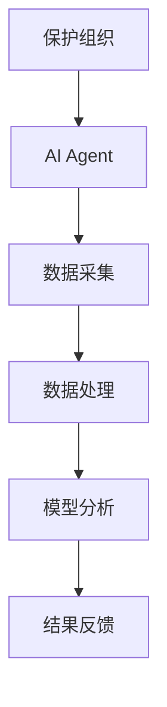
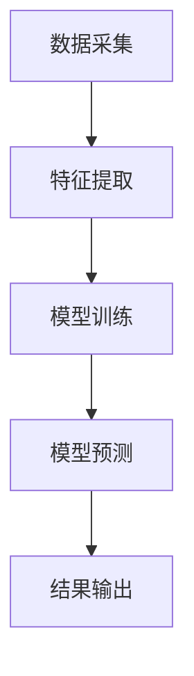
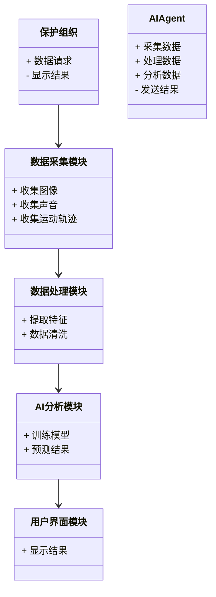

                 


# AI Agent在动物保护中的监测与追踪

## 关键词：AI Agent、动物保护、监测与追踪、生态保护、机器学习、数据采集

## 摘要：  
本文探讨了AI Agent在动物保护中的应用，特别是监测与追踪技术。通过分析AI Agent的核心原理、算法模型和系统架构，结合实际案例，展示了如何利用AI技术提高动物保护的效率和准确性。文章还总结了AI Agent在动物保护中的优势，并提出了未来的研究方向。

---

# 第1章: AI Agent与动物保护的背景介绍

## 1.1 AI Agent的基本概念  
AI Agent（人工智能代理）是指能够感知环境、自主决策并执行任务的智能实体。它具备以下核心特征：  
- **自主性**：无需外部干预，自主完成任务。  
- **反应性**：能够实时感知环境变化并做出响应。  
- **学习能力**：通过数据和经验不断优化自身性能。  

## 1.2 动物保护的现状与挑战  
### 1.2.1 动物保护的主要问题  
- **栖息地破坏**：人类活动导致野生动物栖息地减少。  
- **非法捕猎**：非法猎杀野生动物行为猖獗。  
- **生态监测难度大**：传统监测手段效率低，覆盖范围有限。  

### 1.2.2 传统动物监测方法的局限性  
- **人工监测**：耗时长、成本高，且容易受到主观因素影响。  
- **传感器技术**：依赖固定设备，无法实时追踪个体动物。  

### 1.2.3 AI Agent在动物保护中的优势  
- **高效性**：AI Agent能够快速处理大量数据，提高监测效率。  
- **准确性**：通过机器学习算法，AI Agent能够精准识别和追踪目标动物。  
- **实时性**：AI Agent能够实时感知环境变化，及时采取行动。  

## 1.3 AI Agent在动物保护中的应用前景  
- **目标定位**：AI Agent可以精确定位野生动物的位置，帮助保护组织进行实时监测。  
- **行为分析**：通过分析动物的行为模式，AI Agent能够预测潜在的危险行为，提前采取干预措施。  
- **数据积累**：AI Agent可以长期积累动物行为数据，为生态研究提供科学依据。  

---

# 第2章: AI Agent的核心概念与联系

## 2.1 AI Agent的核心原理  
AI Agent通过以下步骤实现动物监测与追踪：  
1. **数据采集**：利用传感器、摄像头等设备收集动物行为数据。  
2. **特征提取**：从原始数据中提取关键特征，如动物的运动轨迹、行为模式等。  
3. **模型训练**：基于机器学习算法，训练AI Agent识别和分类动物行为。  
4. **实时追踪**：AI Agent根据模型输出结果，实时调整监测策略。  

## 2.2 核心概念对比分析  
以下表格对比了AI Agent与其他动物监测技术的核心特征：  

| 技术 | 数据采集方式 | 决策能力 | 实时性 | 成本 |
|------|--------------|----------|--------|------|
| 传统传感器 | 固定传感器 | 无 | 低 | 高 |
| AI Agent | 多模态数据 | 自主决策 | 高 | 中 |

## 2.3 实体关系图与流程图  
### 2.3.1 实体关系图  
```mermaid
er
actor: 保护组织
agent: AI Agent
animal: 目标动物
environment: 生态环境
```

### 2.3.2 AI Agent监测流程图  


---

# 第3章: AI Agent的算法原理与数学模型

## 3.1 数据采集与特征提取  
### 3.1.1 数据采集方法  
- **视觉数据**：使用摄像头拍摄动物图像，提取图像特征。  
- **声音数据**：通过麦克风采集动物的声音，分析声音特征。  
- **运动数据**：利用传感器记录动物的运动轨迹。  

### 3.1.2 特征提取技术  
- **图像特征提取**：使用卷积神经网络（CNN）提取图像中的目标特征。  
- **声音特征提取**：通过音频处理技术提取声音中的有效信息。  

## 3.2 AI Agent的决策模型  
### 3.2.1 概率模型与贝叶斯定理  
贝叶斯定理用于计算条件概率，公式为：  
$$ P(A|B) = \frac{P(B|A)P(A)}{P(B)} $$  
其中，$P(A|B)$ 表示在事件B发生的条件下，事件A发生的概率。  

### 3.2.2 分类算法与  
- **支持向量机（SVM）**：用于分类问题，通过构建超平面将数据分成不同类别。  
- **随机森林**：基于决策树的集成学习方法，适用于特征较多的分类任务。  

## 3.3 算法流程图  


---

# 第4章: 系统架构与实现方案

## 4.1 系统功能设计  
### 4.1.1 数据采集模块  
负责收集动物行为数据，包括图像、声音和运动轨迹。  

### 4.1.2 数据处理模块  
对采集到的数据进行预处理，提取有效特征。  

### 4.1.3 AI分析模块  
利用机器学习算法对数据进行分类和预测，生成监测结果。  

### 4.1.4 用户界面模块  
将监测结果以可视化形式呈现给保护组织。  

## 4.2 系统架构图  


---

# 第5章: 项目实战与案例分析

## 5.1 环境搭建  
- **硬件环境**：安装摄像头、麦克风和传感器设备。  
- **软件环境**：安装Python、TensorFlow、OpenCV等工具。  

## 5.2 核心代码实现  
```python
import tensorflow as tf
from tensorflow.keras import layers

# 数据预处理
def preprocess_data(data):
    # 提取图像特征
    features = data[:, :100]
    labels = data[:, 100]
    return features, labels

# 模型训练
def train_model(features, labels):
    model = tf.keras.Sequential([
        layers.Dense(64, activation='relu'),
        layers.Dense(10, activation='softmax')
    ])
    model.compile(optimizer='adam', loss='sparse_categorical_crossentropy', metrics=['accuracy'])
    model.fit(features, labels, epochs=10, batch_size=32)
    return model

# 模型预测
def predict(model, new_data):
    predictions = model.predict(new_data)
    return predictions
```

## 5.3 案例分析  
以监测濒危物种为例，AI Agent通过图像识别技术，精准识别动物位置，并实时追踪其运动轨迹。通过模型优化，AI Agent能够准确区分不同物种，提高监测效率。

---

# 第6章: 总结与展望

## 6.1 总结  
AI Agent在动物保护中的应用为生态保护提供了新的技术手段。通过高效的数据处理和智能决策，AI Agent能够显著提高动物监测的效率和准确性。  

## 6.2 注意事项  
- 数据隐私保护：在采集和处理动物数据时，需确保数据的安全性。  
- 技术伦理：AI Agent的应用需遵守相关法律法规，避免对动物造成额外伤害。  

## 6.3 未来研究方向  
- 开发更高效的AI算法，提升监测精度。  
- 探索多模态数据融合技术，提高监测系统的综合能力。  

## 6.4 拓展阅读  
- 《人工智能在生态保护中的应用》  
- 《机器学习算法在动物行为分析中的实践》  

---

通过本文的详细分析，读者可以全面了解AI Agent在动物保护中的监测与追踪技术，并为实际应用提供参考。

