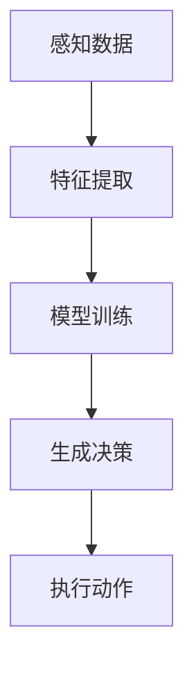
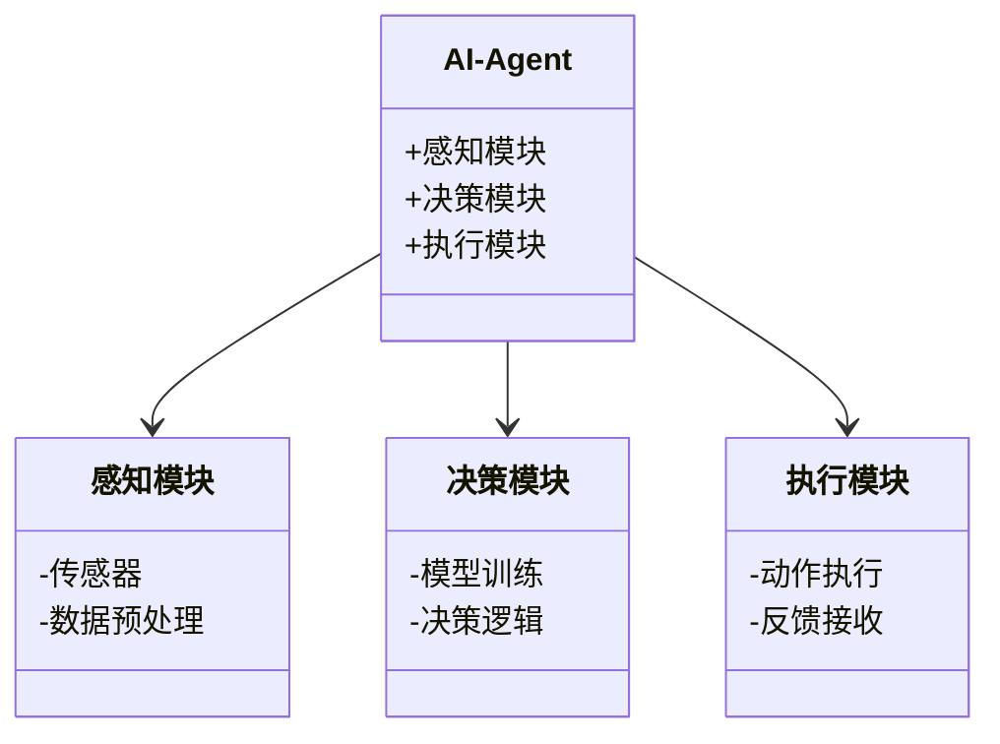

                 

# AI Agent在各行业中的应用场景

## 关键词：AI Agent、人工智能、应用场景、行业应用、技术实现

## 摘要：AI Agent作为一种智能体，能够在多种行业中实现自动化决策和执行任务。本文从AI Agent的基本概念和原理入手，分析其在金融、医疗和教育等行业的应用场景，并详细介绍技术实现过程，包括算法原理、系统架构设计和项目实战案例，最后总结AI Agent的优势与挑战，并展望其未来发展方向。

---

# 第一部分: AI Agent 的核心概念与技术原理

## 第1章: AI Agent 的背景与定义

### 1.1 AI Agent 的概念与背景

#### 1.1.1 什么是 AI Agent
AI Agent（人工智能代理）是一种能够感知环境、自主决策并执行任务的智能系统。它可以看作是连接用户与服务的桥梁，通过学习和适应，优化用户的体验和系统的效率。

#### 1.1.2 AI Agent 的历史发展
AI Agent的概念起源于20世纪60年代，经历了从简单规则驱动到复杂学习驱动的演变。随着机器学习和深度学习的快速发展，AI Agent在近年来取得了显著进展。

#### 1.1.3 AI Agent 的应用场景
AI Agent广泛应用于各个行业，如金融、医疗、教育、交通等。它可以在智能助手、推荐系统、自动驾驶等领域发挥重要作用。

### 1.2 AI Agent 的核心概念

#### 1.2.1 AI Agent 的定义与分类
AI Agent可以根据智能水平分为简单反射型、基于模型型和目标驱动型。它还可以根据应用场景分为服务型、决策型和协作型。

#### 1.2.2 AI Agent 的核心特征
AI Agent具备自主性、反应性、目标导向性和学习能力。这些特征使其能够适应复杂环境并完成多样化任务。

#### 1.2.3 AI Agent 的体系结构
AI Agent的体系结构包括感知层、决策层和执行层。感知层负责数据收集，决策层进行分析和决策，执行层完成任务。

### 1.2.4 AI Agent 的核心要素对比

| 核心要素 | 简单反射型 | 基于模型型 | 目标驱动型 |
|----------|-------------|-------------|-------------|
| 智能水平 | 低          | 中          | 高          |
| 学习能力 | 无          | 有          | 强          |
| 适应性   | 低          | 中          | 高          |

---

## 第2章: AI Agent 的技术原理

### 2.1 AI Agent 的感知与决策

#### 2.1.1 感知模块
感知模块负责接收环境数据，如传感器输入或用户指令。常见的感知技术包括自然语言处理和计算机视觉。

#### 2.1.2 决策模块
决策模块基于感知数据，利用机器学习算法进行分析和决策。常用算法包括随机森林和神经网络。

#### 2.1.3 执行模块
执行模块负责根据决策结果执行动作，如发送邮件或调整设备参数。

### 2.2 AI Agent 的算法基础

#### 2.2.1 机器学习算法
机器学习算法用于模式识别和预测。例如，随机森林用于分类，神经网络用于图像识别。

#### 2.2.2 强化学习算法
强化学习用于决策优化，通过试错和奖励机制，提升AI Agent的策略。

#### 2.2.3 自然语言处理技术
NLP技术用于理解和生成人类语言，如情感分析和机器翻译。

### 2.2.4 算法流程图（Mermaid）

---

## 第3章: AI Agent 的系统架构

### 3.1 AI Agent 的模块化设计

#### 3.1.1 感知模块设计
设计感知模块时，需选择合适的传感器和数据预处理方法，确保数据的准确性和实时性。

#### 3.1.2 决策模块设计
决策模块应结合具体应用场景，选择适合的算法框架，如TensorFlow或PyTorch。

#### 3.1.3 执行模块设计
执行模块需要与外部系统接口对接，确保动作执行的可靠性和可追溯性。

### 3.2 AI Agent 的通信与协作

#### 3.2.1 多 Agent 通信协议
采用MQTT或HTTP协议进行通信，确保数据传输的高效性和安全性。

#### 3.2.2 多 Agent 协作机制
通过分布式架构和共识算法，实现多 Agent 的协调与协作。

#### 3.2.3 系统架构图（Mermaid）

---

# 第二部分: AI Agent 在各行业中的应用场景

## 第4章: 金融行业的 AI Agent 应用

### 4.1 金融行业的 AI Agent 应用场景

#### 4.1.1 智能投顾
AI Agent通过分析市场数据和用户需求，提供个性化的投资建议。

#### 4.1.2 风险评估
AI Agent利用机器学习模型，评估客户的信用风险和市场风险。

#### 4.1.3 信用评分
AI Agent结合多种数据源，生成客户的信用评分，辅助信贷决策。

### 4.2 金融行业中的 AI Agent 技术实现

#### 4.2.1 数据收集与处理
从多个数据源获取金融数据，进行清洗和特征提取。

#### 4.2.2 模型训练与部署
使用XGBoost或LSTM模型进行训练，并部署到生产环境。

#### 4.2.3 系统集成与测试
集成各模块，进行功能测试和性能调优，确保系统的稳定运行。

---

## 第5章: 医疗行业的 AI Agent 应用

### 5.1 医疗行业的 AI Agent 应用场景

#### 5.1.1 疾病诊断
AI Agent辅助医生进行疾病诊断，提高诊断的准确性和效率。

#### 5.1.2 病案管理
AI Agent自动整理和分析病历数据，优化医疗流程。

#### 5.1.3 药物研发
AI Agent加速药物研发过程，降低研发成本。

### 5.2 医疗行业中的 AI Agent 技术实现

#### 5.2.1 医疗数据处理
处理结构化和非结构化数据，利用NLP技术提取关键信息。

#### 5.2.2 模型优化与验证
使用深度学习模型进行疾病预测，并通过真实数据验证模型的准确性。

#### 5.2.3 系统安全与隐私保护
采用数据加密和访问控制技术，确保医疗数据的安全性和隐私性。

---

## 第6章: 教育行业的 AI Agent 应用

### 6.1 教育行业的 AI Agent 应用场景

#### 6.1.1 智能教学
AI Agent根据学生的学习情况，提供个性化的教学方案。

#### 6.1.2 学生评估
AI Agent自动评估学生的作业和表现，提供反馈和改进建议。

#### 6.1.3 资源推荐
AI Agent根据学生的需求，推荐合适的教材和学习资源。

### 6.2 教育行业中的 AI Agent 技术实现

#### 6.2.1 教育数据收集
收集学生的学习数据，包括在线行为和作业成绩。

#### 6.2.2 模型训练与部署
使用聚类算法对学生进行分组，训练推荐系统，并部署到教育平台。

#### 6.2.3 系统交互设计
设计直观的用户界面，确保学生和教师能够方便地与AI Agent交互。

---

# 第三部分: 总结与展望

## 第7章: 总结与展望

### 7.1 AI Agent 的优势与挑战

- **优势**：提高效率、降低成本、增强决策能力。
- **挑战**：数据隐私、模型解释性、多 Agent 协作。

### 7.2 未来的发展方向

- 深度学习的进一步应用。
- 多 Agent 协作的优化。
- 边缘计算与AI Agent的结合。

### 7.3 最佳实践 tips

- 数据安全是关键，确保数据加密和访问控制。
- 模型的可解释性需要重视，避免“黑箱”问题。
- 多 Agent 系统的设计需考虑通信协议和协作机制。

---

通过以上内容，我们可以看到AI Agent在金融、医疗和教育等行业的广泛应用，以及其背后的技术实现。AI Agent作为人工智能的重要组成部分，将继续在更多领域发挥重要作用，推动智能化社会的发展。

