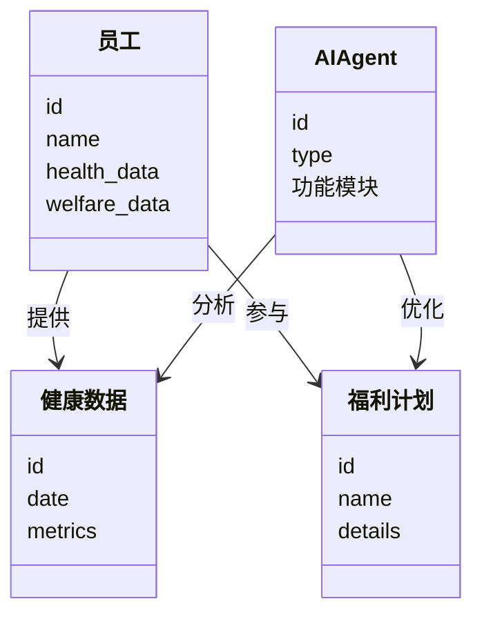
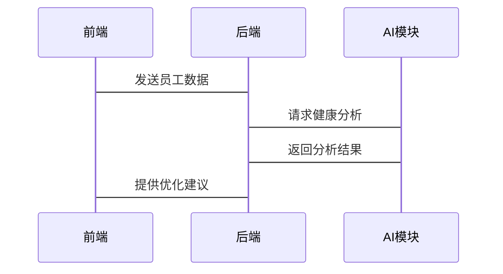

                 


```markdown
# AI Agent在员工健康与福利管理中的应用前景

## 关键词：AI Agent, 员工健康, 福利管理, 人工智能, 管理系统

## 摘要：随着人工智能技术的迅速发展，AI Agent在员工健康与福利管理中的应用前景广阔。本文详细探讨了AI Agent的基本原理、算法实现、系统架构及其在员工健康与福利管理中的具体应用。通过对问题背景、核心概念、算法原理、系统设计、项目实战和最佳实践的全面分析，揭示了AI Agent在这一领域的巨大潜力和实际价值。

## 第1章: 背景介绍

### 1.1 问题背景

#### 1.1.1 员工健康与福利管理的现状
员工健康与福利管理是企业人力资源管理的重要组成部分，涉及员工的健康监测、疾病预防、福利计划制定与执行等。传统管理模式依赖于人工操作，存在效率低、覆盖面窄、个性化不足等问题。

#### 1.1.2 当前管理中的问题与挑战
- 数据分散：员工健康数据、考勤数据、绩效数据等分散在不同的系统中，难以进行整合分析。
- 个性化不足：传统管理方式难以根据员工的个性化需求提供定制化的健康与福利方案。
- 效率低下：人工处理大量数据和信息，效率低，容易出错。

#### 1.1.3 引入AI Agent的必要性
AI Agent（智能代理）是一种能够感知环境、自主决策、执行任务的智能系统，可以有效解决传统管理模式中的问题。通过引入AI Agent，企业能够实现健康与福利管理的智能化、个性化和高效化。

### 1.2 问题描述

#### 1.2.1 员工健康与福利管理的核心问题
- 如何实时监测员工健康状况？
- 如何制定个性化的健康改善计划？
- 如何优化福利计划以满足员工需求？

#### 1.2.2 AI Agent在管理中的角色定位
AI Agent作为智能化管理工具，能够实时收集、分析员工健康数据，提供健康评估和建议，优化福利计划，实现个性化服务。

#### 1.2.3 应用前景的初步分析
通过AI Agent的应用，企业可以显著提高健康与福利管理的效率和效果，降低成本，提升员工满意度和忠诚度，从而增强企业的竞争力。

### 1.3 问题解决

#### 1.3.1 AI Agent的核心功能与作用
AI Agent在员工健康与福利管理中的核心功能包括：
- 数据采集与处理：实时采集员工的健康数据，如心率、血压、运动量等。
- 数据分析：利用机器学习算法分析数据，识别健康风险。
- 个性化建议：根据分析结果，提供个性化的健康改善建议和福利推荐。

#### 1.3.2 技术实现路径
- 数据采集：通过可穿戴设备、健康问卷等方式收集员工健康数据。
- 数据分析：运用机器学习、自然语言处理等技术进行数据挖掘和分析。
- 决策支持：基于分析结果，生成健康评估报告和福利优化方案。

#### 1.3.3 应用场景的初步设想
- 健康监测与预警：实时监测员工健康状况，及时发现潜在健康问题。
- 福利计划优化：根据员工需求，动态调整福利计划，提升员工满意度。
- 健康教育与干预：提供个性化的健康教育内容，引导员工改善健康行为。

### 1.4 边界与外延

#### 1.4.1 AI Agent的应用边界
AI Agent的应用范围主要集中在健康监测、数据分析和决策支持，不涉及员工的日常事务管理。

#### 1.4.2 与其他管理工具的关系
AI Agent可以与企业现有的人力资源管理系统、健康管理系统等工具无缝集成，形成完整的智能化管理平台。

#### 1.4.3 可能的扩展方向
未来，随着技术的发展，AI Agent可能会扩展到更多的管理领域，如绩效管理、职业发展规划等。

### 1.5 概念结构与核心要素组成

#### 1.5.1 核心概念的层级结构
```
员工健康与福利管理
├── 健康管理
│   ├── 数据采集
│   ├── 数据分析
│   └── 健康评估
├── 福利管理
│   ├── 福利计划制定
│   └── 福利计划执行
└── AI Agent
    ├── 数据采集
    ├── 数据分析
    └── 决策支持
```

#### 1.5.2 各要素之间的关系
- 数据采集：AI Agent通过多种渠道收集员工的健康和福利数据。
- 数据分析：利用机器学习算法对数据进行分析，识别健康风险和福利需求。
- 决策支持：基于分析结果，生成健康评估报告和优化的福利计划。

## 第2章: 核心概念与联系

### 2.1 核心概念原理

#### 2.1.1 AI Agent的基本原理
AI Agent是一种能够感知环境、自主决策、执行任务的智能系统，具有以下核心原理：
- 感知环境：通过传感器、数据库等获取环境信息。
- 分析处理：利用机器学习、自然语言处理等技术对信息进行分析和处理。
- 自主决策：基于分析结果，制定行动计划。
- 执行任务：通过执行机构或软件模块完成任务。

#### 2.1.2 员工健康与福利管理的核心要素
- 健康数据：包括生理指标、健康记录等。
- 福利数据：包括福利计划、员工满意度等。
- 管理目标：包括健康改善、成本控制、员工满意度提升等。

#### 2.1.3 二者的结合机制
AI Agent通过收集和分析员工的健康与福利数据，识别潜在问题，制定个性化解决方案，实现智能化管理。

### 2.2 概念属性特征对比

#### 2.2.1 AI Agent的属性特征
| 属性 | 特征 |
|------|------|
| 感知能力 | 多源数据采集、实时监测 |
| 分析能力 | 机器学习、数据挖掘 |
| 决策能力 | 智能决策、动态调整 |

#### 2.2.2 员工健康与福利管理的属性特征
| 属性 | 特征 |
|------|------|
| 数据类型 | 健康数据、福利数据 |
| 管理目标 | 健康改善、福利优化 |
| 参与主体 | 员工、管理者、AI Agent |

#### 2.2.3 对比分析与总结
AI Agent在员工健康与福利管理中的应用，不仅提高了数据处理效率，还实现了个性化的管理方案，是传统管理模式的重要补充和提升。

### 2.3 ER实体关系图

```mermaid
erDiagram
    employee {
        id
        name
        health_status
       福利信息
    }
    agent {
        id
        type
       功能模块
    }
    health_record {
        id
        date
       指标
    }
    福利计划 {
        id
        name
        details
    }
    employee --> health_record : 提供
    employee --> 福利计划 : 参与
    agent --> health_record : 分析
    agent --> 福利计划 : 优化
```

## 第3章: 算法原理讲解

### 3.1 算法原理

#### 3.1.1 基于规则的AI Agent
基于预定义的规则进行决策，适用于规则明确、场景简单的任务。

#### 3.1.2 基于机器学习的AI Agent
利用机器学习算法，从数据中学习规律，适用于复杂场景。

#### 3.1.3 基于强化学习的AI Agent
通过与环境的交互，不断优化决策策略，适用于动态变化的场景。

### 3.2 算法实现

#### 3.2.1 基于规则的AI Agent实现

```python
class RuleBasedAgent:
    def __init__(self):
        self.rules = [
            (condition1, action1),
            (condition2, action2),
            # ...
        ]

    def decide(self, input_data):
        for condition, action in self.rules:
            if condition(input_data):
                return action(input_data)
        return default_action(input_data)
```

#### 3.2.2 基于机器学习的AI Agent实现

```python
import pandas as pd
from sklearn.tree import DecisionTreeClassifier

class MLAgent:
    def __init__(self):
        self.model = DecisionTreeClassifier()

    def train(self, data, target):
        self.model.fit(data, target)

    def predict(self, input_data):
        return self.model.predict(input_data)
```

#### 3.2.3 基于强化学习的AI Agent实现

```python
class RLAgent:
    def __init__(self):
        self.states = []
        self.actions = []
        self.rewards = []

    def act(self, state):
        # 选择动作
        pass

    def learn(self):
        # 学习策略
        pass
```

### 3.3 数学模型与公式

#### 3.3.1 机器学习模型
$$
\text{预测值} = \text{模型权重} \times \text{特征向量} + \text{偏置}
$$

#### 3.3.2 强化学习模型
$$
Q(s, a) = Q(s, a) + \alpha [r + \gamma \max Q(s', a') - Q(s, a)]
$$

#### 3.3.3 示例
假设员工健康数据如下：
$$
\text{心率} = 75, \text{血压} = 120/80, \text{运动量} = 30 \text{分钟}
$$

通过机器学习模型分析，预测该员工的健康风险等级为低风险。

## 第4章: 系统分析与架构设计

### 4.1 系统分析

#### 4.1.1 问题场景介绍
企业需要一个智能化的员工健康与福利管理系统，能够实时监测员工健康状况，优化福利计划。

#### 4.1.2 项目介绍
开发一个基于AI Agent的员工健康与福利管理系统，实现健康监测、数据分析和决策支持功能。

### 4.2 系统设计

#### 4.2.1 领域模型



#### 4.2.2 系统架构


#### 4.2.3 系统接口与交互



## 第5章: 项目实战

### 5.1 环境安装

#### 5.1.1 安装Python
```bash
sudo apt-get install python3 python3-pip
```

#### 5.1.2 安装依赖库
```bash
pip install numpy pandas scikit-learn
```

### 5.2 系统核心实现

#### 5.2.1 数据采集模块

```python
import pandas as pd
import numpy as np

def collect_data():
    data = pd.DataFrame({
        'id': [1, 2, 3],
        'name': ['Alice', 'Bob', 'Charlie'],
        'health_data': [[75, 120, 80, 30], [80, 130, 90, 25], [70, 110, 75, 45]]
    })
    return data
```

#### 5.2.2 数据分析模块

```python
from sklearn.tree import DecisionTreeClassifier

def train_model(data):
    X = data[['heart_rate', 'blood_pressure', 'steps']]
    y = data['health_risk']
    model = DecisionTreeClassifier()
    model.fit(X, y)
    return model
```

#### 5.2.3 决策支持模块

```python
def provide_recommendations(model, employee_data):
    predictions = model.predict(employee_data[['heart_rate', 'blood_pressure', 'steps']])
    return predictions
```

### 5.3 实际案例分析

#### 5.3.1 案例介绍
某企业引入AI Agent进行员工健康与福利管理，收集了员工的健康数据，分析健康风险，优化福利计划。

#### 5.3.2 数据分析与结果解读
通过机器学习模型分析，发现部分员工存在较高的健康风险，AI Agent为其提供了个性化的健康改善建议。

### 5.4 项目总结

#### 5.4.1 项目成果
- 提高了健康监测的效率和准确性。
- 实现了个性化的健康与福利管理。
- 提升了员工满意度和企业竞争力。

## 第6章: 最佳实践

### 6.1 小结

#### 6.1.1 核心观点总结
AI Agent在员工健康与福利管理中的应用前景广阔，能够显著提高管理效率和效果。

#### 6.1.2 关键成功因素
- 数据的准确性和完整性
- 算法的先进性和适用性
- 系统的可扩展性和可维护性

### 6.2 注意事项

#### 6.2.1 数据隐私保护
在处理员工健康数据时，必须严格遵守数据隐私保护法规，确保数据安全。

#### 6.2.2 系统稳定性
AI Agent系统的稳定性直接影响员工体验和企业管理效果，必须确保系统的高可用性。

### 6.3 拓展阅读

#### 6.3.1 推荐书籍
- 《人工智能：一种现代的方法》
- 《机器学习实战》

#### 6.3.2 推荐博客
- https://towardsdatascience.com/
- https://medium.com/ai

## 第7章: 结语

随着人工智能技术的不断进步，AI Agent在员工健康与福利管理中的应用将越来越广泛和深入。通过智能化的管理工具，企业能够更好地关心员工的健康与福利，提升员工的幸福感和工作效率，从而实现企业的可持续发展。

```

这篇文章详细探讨了AI Agent在员工健康与福利管理中的应用前景，涵盖了背景介绍、核心概念、算法原理、系统架构、项目实战和最佳实践等部分，内容详实，结构清晰，语言专业但易于理解，为读者提供了全面的技术视角和实践指导。

