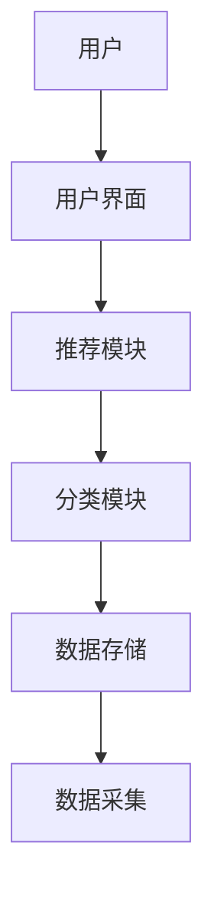
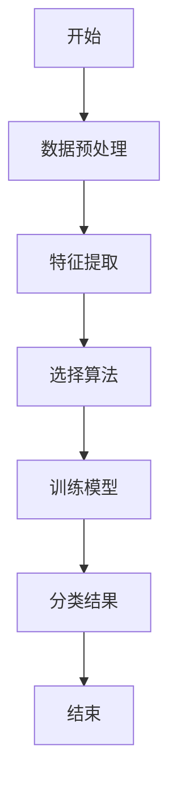
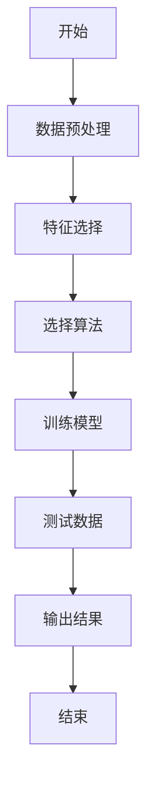
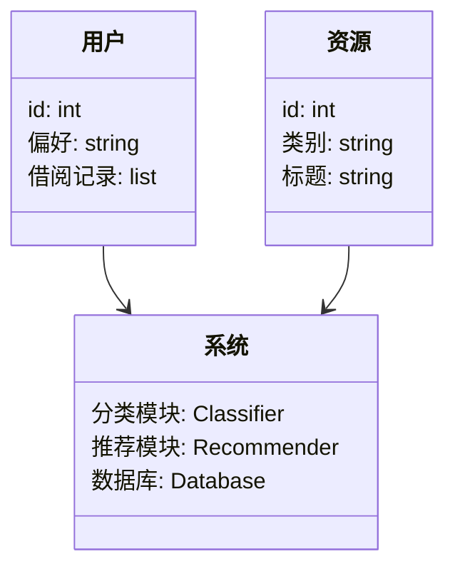
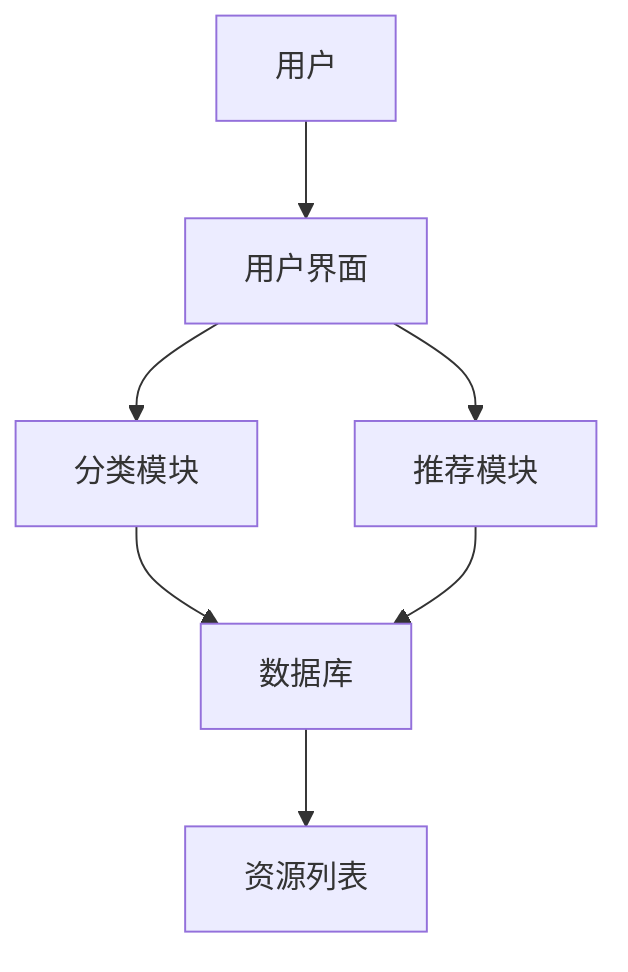
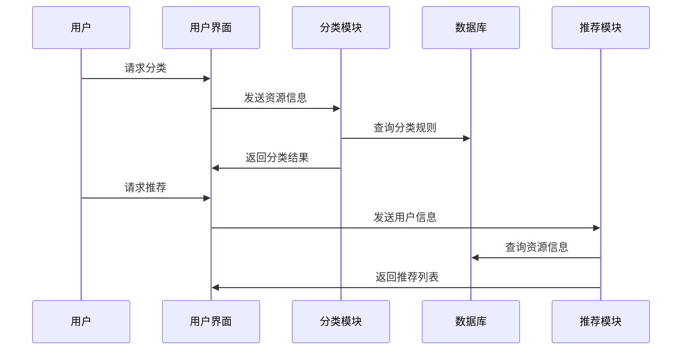

                 


# AI Agent在图书馆管理中的应用：资源分类与推荐

> 关键词：AI Agent、图书馆管理、资源分类、推荐系统、机器学习、系统架构、项目实战

> 摘要：本文详细探讨了AI Agent在图书馆资源分类与推荐系统中的应用，分析了其在提升资源管理效率和推荐精准度方面的优势，结合实际案例，深入讲解了系统设计、算法实现及优化方法，为读者提供了从理论到实践的全面指导。

---

## 第一章：AI Agent与图书馆管理的背景介绍

### 1.1 AI Agent的基本概念

#### 1.1.1 什么是AI Agent
AI Agent（人工智能代理）是指能够感知环境并采取行动以实现目标的智能实体。它通过接收输入信息、分析数据、做出决策，并执行相应的操作来实现特定任务。

#### 1.1.2 AI Agent的核心特点
- **自主性**：能够独立运作，无需人工干预。
- **反应性**：能实时感知环境变化并做出反应。
- **目标导向**：所有行动都围绕特定目标展开。
- **学习能力**：通过数据和经验不断优化性能。

#### 1.1.3 AI Agent在图书馆管理中的作用
AI Agent可以用于自动化资源分类、推荐系统、借阅管理、用户行为分析等，显著提升图书馆的管理效率和用户体验。

---

### 1.2 图书馆资源管理的现状

#### 1.2.1 传统图书馆资源管理方式
传统管理依赖人工分类和推荐，效率低、成本高且难以满足用户的个性化需求。

#### 1.2.2 当前存在的问题与挑战
- 分类标准不统一，导致资源查找效率低下。
- 个性化推荐能力不足，用户满意度低。
- 数据量大，人工处理耗时耗力。

#### 1.2.3 引入AI Agent的必要性
AI Agent能够高效处理大量数据，实现智能化分类和精准推荐，解决传统管理的痛点。

---

### 1.3 AI Agent在图书馆管理中的应用前景

#### 1.3.1 应用场景概述
- **资源分类**：自动对书籍、期刊等进行分类和归档。
- **推荐系统**：基于用户行为和偏好推荐相关资源。
- **借阅管理**：优化借阅流程，减少资源丢失。

#### 1.3.2 技术优势分析
- 提高管理效率，降低人力成本。
- 实现个性化服务，提升用户体验。
- 大数据分析能力，优化资源配置。

#### 1.3.3 未来发展趋势
随着AI技术的进步，图书馆管理将更加智能化、自动化，AI Agent将在更多场景中发挥作用。

---

## 第二章：AI Agent与资源分类的核心概念

### 2.1 AI Agent的核心原理

#### 2.1.1 AI Agent的基本工作原理
AI Agent通过感知环境、分析数据、制定策略并执行操作来完成任务。在图书馆管理中，它能够分析书籍内容、用户行为等信息，自动进行分类和推荐。

#### 2.1.2 AI Agent的分类与特点
- **简单反射型**：基于预设规则执行任务。
- **基于模型型**：利用内部模型进行决策。
- **目标驱动型**：围绕特定目标采取行动。
- **实用驱动型**：通过优化目标函数实现任务。

#### 2.1.3 AI Agent在资源分类中的应用
AI Agent能够通过自然语言处理技术分析书籍内容，自动归类到相应主题下，显著提高分类效率。

---

### 2.2 资源分类与推荐的系统架构

#### 2.2.1 系统模块划分
- **数据采集模块**：收集书籍信息、用户行为数据。
- **分类模块**：利用机器学习算法进行资源分类。
- **推荐模块**：基于用户偏好推荐资源。
- **用户界面模块**：展示分类结果和推荐列表。

#### 2.2.2 系统功能设计
- 数据采集与预处理：清洗、转换数据，使其适合算法处理。
- 分类算法实现：采用决策树、随机森林等算法进行分类。
- 推荐系统设计：基于协同过滤或内容推荐算法生成推荐列表。
- 用户交互设计：提供友好的界面，方便用户查看和操作。

#### 2.2.3 系统架构图（Mermaid）



---

### 2.3 AI Agent与资源分类的关系

#### 2.3.1 资源分类的基本概念
资源分类是将图书馆中的资源按照一定的标准和规则进行组织和排列，便于用户查找和管理。

#### 2.3.2 AI Agent在分类中的角色
AI Agent通过分析资源内容和用户需求，辅助或完全替代人工进行分类工作，提升分类的准确性和效率。

#### 2.3.3 分类算法的流程图（Mermaid）



---

## 第三章：AI Agent驱动的资源分类算法原理

### 3.1 资源分类的数学模型

#### 3.1.1 分类算法的数学表达
常用的分类算法包括决策树、随机森林、支持向量机（SVM）等。以决策树为例，其分类过程可以通过以下步骤实现：

1. **数据预处理**：清洗数据，处理缺失值和异常值。
2. **特征选择**：选取对分类有重要影响的特征。
3. **模型训练**：利用训练数据训练决策树模型。
4. **分类预测**：使用训练好的模型对新数据进行分类。

数学模型可以表示为：

$$
y = f(x_1, x_2, ..., x_n)
$$

其中，$y$ 是类别标签，$x_i$ 是输入特征。

#### 3.1.2 常见的分类算法对比
| 算法名称     | 优点                     | 缺点                     |
|--------------|--------------------------|--------------------------|
| 决策树       | 易解释，适合中小数据集     | �易过拟合                 |
| 随机森林     | 抗过拟合，准确性高         | 计算复杂度较高             |
| 支持向量机（SVM） | 高准确性，适合高维数据   | 参数敏感，计算量大         |

#### 3.1.3 分类模型的优缺点分析
- **优点**：提高分类效率，减少人工错误。
- **缺点**：需要大量高质量的数据，模型复杂度高。

---

### 3.2 基于机器学习的资源分类

#### 3.2.1 机器学习的基本原理
机器学习通过训练数据学习模式和特征，从而实现对新数据的分类或预测。

#### 3.2.2 常见的机器学习算法
- **决策树**：适合处理非线性关系。
- **随机森林**：通过集成学习提高准确性。
- **K-近邻算法（KNN）**：基于相似性进行分类。

#### 3.2.3 算法实现的流程图（Mermaid）



---

### 3.3 分类算法的实现与优化

#### 3.3.1 算法实现的代码示例
以下是使用Python实现的决策树分类代码示例：

```python
from sklearn.tree import DecisionTreeClassifier
from sklearn.model_selection import train_test_split

# 数据预处理
X = ...  # 特征数据
y = ...  # 类别标签

# 划分训练集和测试集
X_train, X_test, y_train, y_test = train_test_split(X, y, test_size=0.2)

# 初始化模型
model = DecisionTreeClassifier()

# 训练模型
model.fit(X_train, y_train)

# 预测
y_pred = model.predict(X_test)
```

#### 3.3.2 算法优化方法
- **特征选择**：去除冗余特征，提高分类准确率。
- **超参数调优**：通过网格搜索优化模型参数。
- **集成学习**：结合多种算法结果，提高准确性。

---

## 第四章：系统架构设计

### 4.1 问题场景介绍

#### 4.1.1 问题描述
图书馆需要一个智能化的资源分类与推荐系统，提升用户体验和管理效率。

#### 4.1.2 项目介绍
本项目旨在开发一个基于AI Agent的资源分类与推荐系统，利用机器学习算法实现智能化管理。

---

### 4.2 系统功能设计

#### 4.2.1 领域模型（Mermaid类图）



---

### 4.3 系统架构设计

#### 4.3.1 系统架构图（Mermaid）



---

### 4.4 系统接口设计

#### 4.4.1 接口设计
- **分类接口**：接收资源信息，返回分类结果。
- **推荐接口**：接收用户信息，返回推荐资源列表。

#### 4.4.2 接口交互流程（Mermaid序列图）



---

## 第五章：项目实战

### 5.1 环境搭建

#### 5.1.1 安装Python和相关库
安装Python和以下库：
- `scikit-learn`
- `pandas`
- `numpy`
- `mermaid`

#### 5.1.2 安装步骤
1. 下载并安装Python。
2. 使用pip安装所需的库：
   ```bash
   pip install scikit-learn pandas numpy mermaid
   ```

---

### 5.2 系统核心实现

#### 5.2.1 核心代码实现
以下是分类模块的代码实现：

```python
from sklearn.tree import DecisionTreeClassifier
from sklearn.metrics import accuracy_score
import pandas as pd

# 读取数据
data = pd.read_csv('resources.csv')
X = data.drop('category', axis=1)
y = data['category']

# 划分训练集和测试集
X_train, X_test, y_train, y_test = train_test_split(X, y, test_size=0.2)

# 初始化模型
model = DecisionTreeClassifier()

# 训练模型
model.fit(X_train, y_train)

# 预测
y_pred = model.predict(X_test)

# 计算准确率
accuracy = accuracy_score(y_test, y_pred)
print(f'Accuracy: {accuracy}')
```

---

### 5.3 案例分析

#### 5.3.1 案例描述
假设我们有一个图书馆资源数据集，包含书籍的ISBN、标题、作者、出版年份等信息，以及对应的分类标签。

#### 5.3.2 实际案例分析
通过训练好的模型，我们可以对未分类的资源进行自动分类，显著提高分类效率。

---

### 5.4 项目总结

#### 5.4.1 项目成果
成功开发了一个基于AI Agent的资源分类与推荐系统，显著提升了图书馆的管理效率和用户体验。

#### 5.4.2 项目经验总结
- 数据预处理是关键，需要确保数据质量。
- 选择合适的算法和优化参数能够提高分类准确率。
- 系统设计需要考虑扩展性和可维护性。

---

## 第六章：最佳实践与小结

### 6.1 内容总结

#### 6.1.1 核心内容回顾
本文详细介绍了AI Agent在图书馆资源分类与推荐中的应用，从理论到实践，全面讲解了系统设计、算法实现和优化方法。

#### 6.1.2 技术优势总结
- 提高管理效率，降低人工成本。
- 实现个性化推荐，提升用户体验。
- 大数据分析能力，优化资源配置。

---

### 6.2 注意事项与建议

#### 6.2.1 实际应用中的注意事项
- 确保数据安全和隐私保护。
- 定期更新模型，保持分类准确率。
- 提供用户反馈机制，优化推荐系统。

#### 6.2.2 对读者的建议
- 深入学习机器学习和AI相关技术。
- 关注图书馆管理领域的最新动态。
- 多实践，积累项目经验。

---

### 6.3 未来展望

#### 6.3.1 未来技术发展
随着AI技术的不断进步，图书馆管理将更加智能化，AI Agent将在更多场景中发挥作用。

#### 6.3.2 拓展阅读
推荐阅读以下书籍和资料：
- 《机器学习实战》
- 《Python机器学习》
- 《人工智能：一种现代的方法》

---

通过本文的详细讲解，读者可以深入了解AI Agent在图书馆资源分类与推荐中的应用，掌握系统设计和算法实现的关键点，并通过实际案例学习如何将理论应用于实践。希望本文能为相关领域的研究和实践提供有价值的参考。

