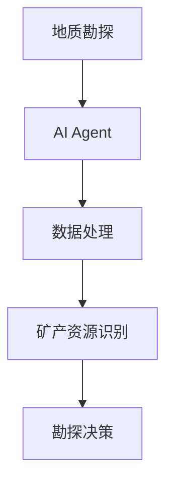
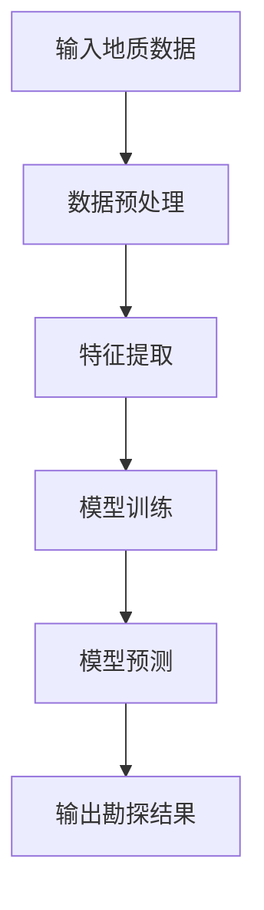
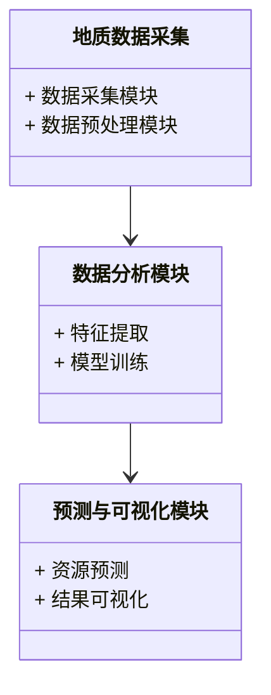

                 


# AI Agent在地质勘探中的应用：矿产资源识别

> 关键词：AI Agent，地质勘探，矿产资源识别，强化学习，监督学习，系统架构

> 摘要：本文详细探讨了AI Agent在地质勘探中的应用，特别是矿产资源识别方面。通过分析地质勘探的传统方法与挑战，结合AI Agent的核心概念与算法原理，展示了如何利用强化学习和监督学习提升矿产资源识别的效率与准确性。文章还详细介绍了系统架构设计与实际项目案例，为读者提供了从理论到实践的全面指导。

---

## 第一部分：地质勘探与AI Agent的背景介绍

### 第1章：地质勘探的基本概念

#### 1.1 地质勘探的定义与目的

- **地质勘探**：通过对地球表面或地下地质结构的调查，获取矿产资源、石油、天然气等自然资源的分布、储量和质量信息的过程。
- **矿产资源识别**：地质勘探的核心任务之一，旨在通过数据分析和模型预测，确定地下潜在的矿产资源分布区域。
- **传统方法的局限性**：
  - 数据采集成本高、周期长。
  - 依赖专家经验，难以快速处理海量数据。
  - 精确度受限，特别是在复杂地质结构中。

#### 1.2 矿产资源识别的重要性

- 矿产资源是国家经济发展的基础，其勘探直接关系到资源开发和经济发展。
- 准确识别矿产资源分布可以降低勘探成本，提高资源利用效率。
- 现代地质勘探需要结合多源数据（如地震数据、岩石样本、地理信息等）进行综合分析。

#### 1.3 地质勘探的传统方法与挑战

- **传统方法**：
  - 勘探钻探：通过钻探获取岩石样本，分析其成分和结构。
  - 地震勘探：利用地震波反射原理，分析地下结构。
  - 化学分析：通过对岩石样本的化学成分分析，判断矿产类型。
- **挑战**：
  - 数据量大，处理复杂。
  - 地质结构复杂，传统方法难以覆盖所有区域。
  - 需要大量专业人才，成本高昂。

---

### 第2章：AI Agent的基本概念与应用

#### 2.1 AI Agent的定义与特点

- **AI Agent**：智能体，是指能够感知环境、自主决策并执行任务的智能系统。
- **核心特点**：
  - 智能性：能够通过学习和推理解决问题。
  - 自主性：无需外部干预，能够独立运行。
  - 适应性：能够根据环境变化调整行为。

#### 2.2 AI Agent在地质勘探中的应用前景

- **潜在应用领域**：
  - 数据处理与分析：AI Agent可以快速处理海量地质数据，提取关键特征。
  - 矿产资源预测：通过机器学习模型，预测潜在的矿产资源分布。
  - 自动化勘探：AI Agent可以辅助或替代部分传统勘探工作。
- **企业采用AI Agent的优势**：
  - 提高勘探效率，降低人工成本。
  - 提升数据处理能力，发现更多潜在资源。
  - 支持决策优化，提高勘探成功率。

#### 2.3 AI Agent应用的挑战与机遇

- **挑战**：
  - 数据质量：地质数据的不完整性和噪声可能影响AI模型的准确性。
  - 算法复杂性：复杂的地质结构需要更复杂的算法支持。
  - 伦理与安全：AI Agent的自主性可能引发数据泄露和隐私问题。
- **机遇**：
  - 技术进步：深度学习和强化学习的快速发展为AI Agent提供了强大的技术支持。
  - 数据共享：大数据技术推动了地质数据的共享与整合。
  - 政策支持：政府对科技创新的鼓励为AI Agent的应用提供了政策保障。

---

## 第三部分：AI Agent与地质勘探的核心概念联系

### 第3章：AI Agent的核心原理

#### 3.1 AI Agent的核心原理

- **强化学习**：通过与环境交互，学习最优策略以最大化累积奖励。
- **监督学习**：基于标注数据，训练模型进行分类或回归任务。
- **无监督学习**：在无标签数据中发现隐藏模式和结构。

#### 3.2 AI Agent与地质勘探的实体关系图



#### 3.3 AI Agent在地质勘探中的算法流程图



---

## 第四部分：AI Agent的算法原理与数学模型

### 第4章：强化学习在AI Agent中的应用

#### 4.1 强化学习的基本原理

- **Q-learning算法**：
  $$ Q(s, a) = Q(s, a) + \alpha \left( r + \gamma \max_{a'} Q(s', a') - Q(s, a) \right) $$
  其中：
  - \( Q(s, a) \)：状态 \( s \) 下动作 \( a \) 的价值。
  - \( \alpha \)：学习率。
  - \( \gamma \)：折扣因子。
  - \( r \)：奖励值。

#### 4.2 强化学习在矿产资源识别中的应用

- **应用场景**：AI Agent通过与地质环境交互，逐步学习如何选择最优的勘探区域。
- **优势**：能够适应复杂的地质结构，动态调整勘探策略。

---

### 第5章：监督学习在AI Agent中的应用

#### 5.1 监督学习的基本原理

- **分类任务**：
  $$ y = f(X) $$
  其中：
  - \( X \)：输入特征。
  - \( y \)：输出类别。
- **回归任务**：
  $$ y = \beta_0 + \beta_1 x_1 + \beta_2 x_2 + \dots + \beta_n x_n $$
  其中：
  - \( \beta_i \)：回归系数。
  - \( x_i \)：输入变量。

#### 5.2 监督学习在地质勘探中的应用

- **案例分析**：利用监督学习模型对地质数据进行分类，识别潜在的矿产资源分布区域。
- **优势**：基于标注数据，能够快速训练出高精度的分类模型。

---

## 第五部分：系统分析与架构设计

### 第6章：系统架构设计

#### 6.1 项目场景介绍

- **目标**：开发一个基于AI Agent的矿产资源识别系统，提高地质勘探效率。
- **关键功能**：
  - 数据采集与预处理。
  - 特征提取与模型训练。
  - 矿产资源预测与可视化。

#### 6.2 系统功能设计



---

## 第六部分：项目实战与案例分析

### 第7章：项目实战

#### 7.1 环境配置

- **工具与库**：
  - Python：编程语言。
  - TensorFlow/PyTorch：深度学习框架。
  - Pandas/Numpy：数据处理库。
  - Matplotlib/Seaborn：可视化库。

#### 7.2 系统核心实现源代码

```python
import numpy as np
import pandas as pd
from sklearn.model_selection import train_test_split
from sklearn.ensemble import RandomForestClassifier

# 数据加载与预处理
data = pd.read_csv('geological_data.csv')
X = data.drop('target', axis=1)
y = data['target']

# 数据分割
X_train, X_test, y_train, y_test = train_test_split(X, y, test_size=0.2)

# 模型训练
model = RandomForestClassifier()
model.fit(X_train, y_train)

# 模型预测
y_pred = model.predict(X_test)

# 模型评估
accuracy = np.mean(y_pred == y_test)
print(f'Accuracy: {accuracy}')
```

---

## 第七部分：最佳实践与小结

### 第8章：总结与展望

#### 8.1 最佳实践 tips

- 数据预处理是关键：确保数据的完整性和准确性。
- 模型选择要结合业务需求：分类任务优先选择高精度模型。
- 系统设计要注重可扩展性：方便后续功能的添加与优化。

#### 8.2 小结

本文详细探讨了AI Agent在地质勘探中的应用，从理论到实践，全面分析了如何利用AI技术提升矿产资源识别的效率与准确性。通过算法原理、系统架构设计和项目实战的讲解，为读者提供了从理论到实践的完整指导。

#### 8.3 注意事项

- 数据隐私：地质数据可能涉及国家机密，需注意数据安全。
- 模型解释性：复杂的模型可能导致解释性差，需结合领域知识进行验证。
- 算法选择：根据具体场景选择合适的算法，避免盲目追求模型精度。

#### 8.4 拓展阅读

- 推荐阅读《深度学习实战》和《机器学习实战》，深入理解AI算法的核心原理。
- 关注地质勘探领域的最新技术动态，探索更多AI技术的应用场景。

---

以上是《AI Agent在地质勘探中的应用：矿产资源识别》的技术博客文章的完整目录与内容框架，希望对您有所帮助！

