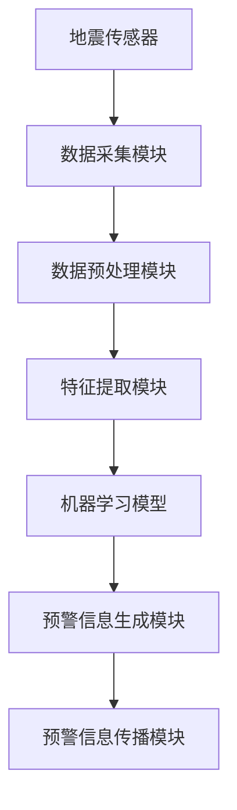

                 


# AI Agent在地震预警中的数据分析应用

> 关键词：AI Agent，地震预警，数据分析，机器学习，实时响应

> 摘要：本文探讨了AI Agent在地震预警中的数据分析应用，分析了地震预警的重要性，详细介绍了AI Agent的核心概念、工作原理、数据分析流程、算法原理以及系统架构设计。通过实际案例分析，展示了AI Agent在地震预警中的实际应用价值和优化方向。

---

## 第1章：地震预警与AI Agent的背景介绍

### 1.1 地震预警的重要性

地震是一种严重的自然灾害，给人类社会和经济带来巨大损失。地震预警系统能够提前几秒到几十秒发出警报，为人们争取宝贵的逃生时间，从而减少人员伤亡和财产损失。传统的地震预警系统依赖于地震传感器和地震波传播速度模型，但存在数据处理延迟和预测精度不足的问题。

AI Agent（人工智能代理）作为一种智能化的计算实体，能够通过感知环境、自主决策和执行任务，为地震预警系统提供更高效的数据分析和实时响应能力。

---

### 1.2 AI Agent的核心概念

AI Agent是一种能够感知环境、自主决策并执行任务的智能实体。它具有以下核心特征：

1. **自主性**：AI Agent能够自主完成任务，无需人工干预。
2. **反应性**：能够实时感知环境变化并做出反应。
3. **社会性**：能够与其他智能体或系统进行协作。
4. **学习能力**：通过数据学习和优化模型，提高预测精度。

---

### 1.3 AI Agent在地震预警中的作用

AI Agent在地震预警中的主要作用包括：

1. **数据收集与预处理**：AI Agent能够实时采集地震传感器数据，并进行初步处理。
2. **数据分析与预测**：通过机器学习算法，分析地震数据并预测地震的发生概率。
3. **实时响应**：根据预测结果，快速发出预警信息，并协调其他系统进行应急响应。

---

### 1.4 数据分析在地震预警中的重要性

地震预警系统的准确性依赖于高质量的数据分析。以下是数据分析在地震预警中的关键作用：

1. **数据来源**：地震数据包括地震波信号、地壳活动数据、地质数据等。
2. **特征提取**：从原始数据中提取有用的特征，如地震波频率、震源深度等。
3. **数据预处理**：清洗数据，处理噪声和缺失值。
4. **数据可视化**：通过可视化工具，帮助研究人员更好地理解地震数据。

---

## 第2章：AI Agent的核心概念与工作原理

### 2.1 AI Agent的基本原理

AI Agent的工作原理可以分为以下几个步骤：

1. **感知环境**：通过传感器或其他数据源获取地震相关数据。
2. **数据处理**：对数据进行预处理和特征提取。
3. **决策与推理**：基于机器学习模型，分析数据并做出预测。
4. **执行任务**：根据预测结果，执行预警或应急响应。

---

### 2.2 多智能体系统与协作

地震预警系统通常由多个AI Agent组成，形成一个多智能体系统。这些智能体之间需要通过通信协议进行协作，共同完成数据处理和预测任务。

1. **多智能体系统概述**：多智能体系统由多个智能体组成，每个智能体负责特定的任务。
2. **智能体之间的通信与协作**：通过通信协议，智能体之间可以共享数据和协调任务。
3. **协作机制与协议**：定义智能体之间的协作规则和通信协议。

---

### 2.3 AI Agent在地震预警中的具体应用

1. **数据收集与预处理**：AI Agent实时采集地震数据，并进行初步处理。
2. **数据分析与模式识别**：通过机器学习算法，识别地震前兆特征。
3. **预警信息的生成与传播**：根据预测结果，快速生成预警信息，并通过多种渠道传播。

---

## 第3章：地震预警中的数据分析流程

### 3.1 数据来源与特征提取

1. **数据来源**：地震数据来源包括地震传感器、地质数据、历史地震记录等。
2. **特征提取**：从原始数据中提取有用的特征，如地震波频率、震源深度、地壳活动强度等。
3. **数据预处理**：清洗数据，处理噪声和缺失值，确保数据质量。

---

### 3.2 数据分析与模型训练

1. **数据分析方法**：使用统计分析、机器学习和深度学习等方法进行数据分析。
2. **机器学习模型的训练**：通过训练数据，优化模型参数，提高预测精度。
3. **模型优化与调优**：通过交叉验证和超参数调优，进一步优化模型性能。

---

## 第4章：AI Agent的算法原理

### 4.1 算法原理概述

AI Agent在地震预警中的算法主要包括数据处理、特征提取、模型训练和预测等步骤。以下是具体的算法流程：

1. **数据预处理**：清洗数据，处理噪声和缺失值。
2. **特征提取**：提取地震数据的特征，如地震波频率、震源深度等。
3. **模型训练**：使用机器学习算法，如随机森林、支持向量机（SVM）等，进行模型训练。
4. **模型预测**：基于训练好的模型，预测地震的发生概率。

---

### 4.2 算法实现代码

以下是一个简单的地震预警模型的Python代码示例：

```python
import pandas as pd
from sklearn.ensemble import RandomForestClassifier
from sklearn.metrics import accuracy_score

# 加载数据
data = pd.read_csv('earthquake_data.csv')

# 特征提取
X = data[['magnitude', 'depth', 'distance']]
y = data['prediction']

# 模型训练
model = RandomForestClassifier()
model.fit(X, y)

# 模型预测
y_pred = model.predict(X)
print('模型准确率:', accuracy_score(y, y_pred))
```

---

## 第5章：系统设计与架构

### 5.1 系统架构设计

以下是地震预警系统的架构图：



---

### 5.2 系统功能设计

1. **数据采集模块**：负责采集地震相关数据。
2. **数据预处理模块**：对数据进行清洗和处理。
3. **特征提取模块**：提取地震数据的特征。
4. **机器学习模型**：基于特征数据，训练并预测地震概率。
5. **预警信息生成模块**：根据预测结果，生成预警信息。
6. **预警信息传播模块**：通过多种渠道传播预警信息。

---

## 第6章：项目实战与优化

### 6.1 项目实战

以下是地震预警系统的实战代码示例：

```python
import pandas as pd
from sklearn.ensemble import RandomForestClassifier
from sklearn.metrics import accuracy_score

# 加载数据
data = pd.read_csv('earthquake_data.csv')

# 特征提取
X = data[['magnitude', 'depth', 'distance']]
y = data['prediction']

# 模型训练
model = RandomForestClassifier()
model.fit(X, y)

# 模型预测
y_pred = model.predict(X)
print('模型准确率:', accuracy_score(y, y_pred))
```

---

### 6.2 优化与扩展

1. **模型优化**：通过超参数调优和模型集成，进一步提高预测精度。
2. **多源数据融合**：引入更多的数据源，如卫星数据、气象数据等，提高预测的准确性。
3. **边缘计算**：在边缘设备上部署AI Agent，实现数据的实时处理和预测。

---

## 第7章：总结与展望

### 7.1 总结

本文详细介绍了AI Agent在地震预警中的数据分析应用，探讨了地震预警的重要性、AI Agent的核心概念、数据分析流程、算法原理以及系统架构设计。通过实际案例分析，展示了AI Agent在地震预警中的实际应用价值。

### 7.2 展望

未来，随着人工智能技术的不断发展，AI Agent在地震预警中的应用将更加广泛和深入。我们可以进一步优化算法，引入更多的数据源，提高地震预测的精度和实时性。此外，还可以研究AI Agent在其他自然灾害预警中的应用，为人类的安全和防护提供更有力的支持。

---

通过本文的分析，我们可以看到，AI Agent在地震预警中的数据分析应用具有重要的现实意义和广阔的发展前景。希望本文能够为相关领域的研究者和从业者提供有价值的参考和启示。

