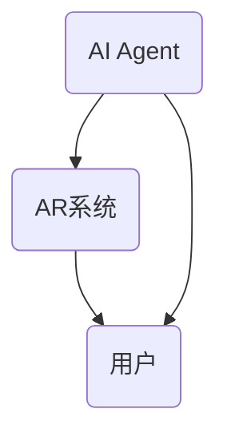
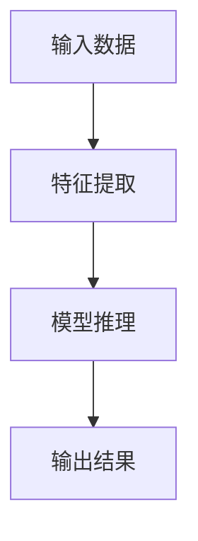
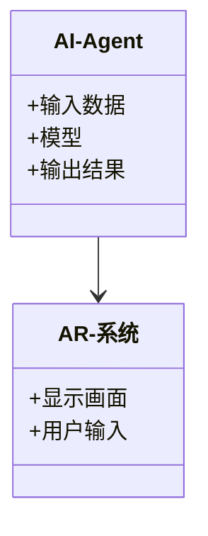
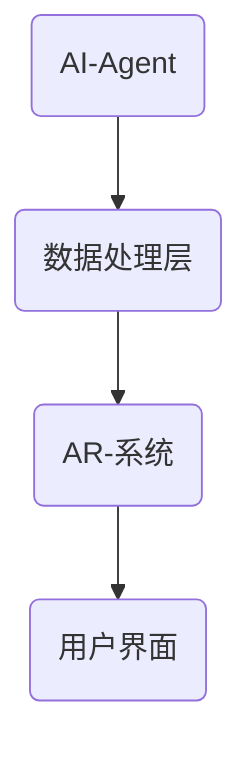

                 


# AI Agent在增强现实中的应用：实时信息叠加与交互

> 关键词：AI Agent, 增强现实, 实时信息叠加, 交互设计, 机器学习

> 摘要：本文探讨AI Agent在增强现实中的应用，重点分析实时信息叠加与交互的技术细节。通过背景介绍、核心概念对比、算法原理、系统设计和项目实战，全面阐述AI Agent如何提升AR体验。文章结合理论与实践，为技术开发者提供深度指导。

---

## 第1章: AI Agent与增强现实概述

### 1.1 AI Agent的基本概念

#### 1.1.1 AI Agent的定义
AI Agent是一种智能实体，能够感知环境、自主决策并执行任务。它通过接收输入数据，利用算法处理信息，输出行动指令或结果。

#### 1.1.2 AI Agent的核心特征
- **自主性**：无需外部干预，自主完成任务。
- **反应性**：实时感知并响应环境变化。
- **学习能力**：通过数据优化决策模型。

#### 1.1.3 AI Agent与传统AI的区别
| 特性 | AI Agent | 传统AI |
|------|----------|--------|
| 执行能力 | 具备行动能力 | 仅提供决策或分析 |

### 1.2 增强现实的基本概念

#### 1.2.1 AR的定义
AR通过计算机生成的视觉元素，增强用户对真实环境的感知。

#### 1.2.2 AR核心技术
- **图形渲染**：将虚拟物体叠加到真实场景。
- **定位与跟踪**：利用摄像头和传感器确定物体位置。
- **交互技术**：通过手势或语音实现用户与虚拟物体的互动。

#### 1.2.3 AR的应用场景
- **教育**：虚拟教学辅助工具。
- **游戏**：如《Pokémon Go》。
- **工业**：设备维护和培训。

### 1.3 AI Agent在增强现实中的应用背景

#### 1.3.1 AR中的信息处理需求
- **实时性**：快速处理用户输入和环境数据。
- **准确性**：确保信息叠加精准无误。
- **交互性**：支持多样化的用户互动方式。

#### 1.3.2 AI Agent在AR中的角色
AI Agent作为信息处理的核心，负责实时分析数据并生成反馈，提升用户体验。

#### 1.3.3 技术局限性与解决方案
当前AR技术在实时性和交互性上存在不足，AI Agent通过优化算法和提升处理能力，解决这些问题。

---

## 第2章: AI Agent与增强现实的核心概念

### 2.1 AI Agent的原理与实现

#### 2.1.1 感知与决策机制
AI Agent通过多模态数据输入，利用深度学习模型进行分析和决策。

#### 2.1.2 行为规划与执行
基于决策结果，AI Agent规划行动路径并执行任务。

#### 2.1.3 自学习能力
通过强化学习，AI Agent不断优化决策模型，提升处理效率。

### 2.2 增强现实的核心技术

#### 2.2.1 图形渲染
使用OpenGL或DirectX等技术，将虚拟物体精准叠加到真实场景。

#### 2.2.2 定位与跟踪
通过SLAM技术实现物体精确定位，确保AR内容准确叠加。

#### 2.2.3 用户交互
支持手势识别、语音识别等多种交互方式，提升用户体验。

### 2.3 AI Agent与增强现实的结合原理

#### 2.3.1 信息处理流程
用户输入→AI Agent分析→生成反馈→AR系统呈现。

#### 2.3.2 实时信息叠加机制
AI Agent实时处理环境数据，生成叠加内容并发送至AR系统。

#### 2.3.3 协同工作
AI Agent与AR系统协同，确保信息处理与呈现无缝衔接。

### 2.4 核心概念对比与ER实体关系图

#### 2.4.1 核心概念对比
| 概念 | AI Agent | 增强现实 |
|------|----------|----------|
| 核心目标 | 执行任务 | 提供增强信息 |
| 输入 | 多模态数据 | 图像、视频 |
| 输出 | 行动指令 | 增强内容 |

#### 2.4.2 实体关系图


---

## 第3章: AI Agent在增强现实中的算法原理

### 3.1 算法流程

#### 3.1.1 算法流程图


#### 3.1.2 算法实现代码
```python
def process_input(input_data):
    # 特征提取
    features = extract_features(input_data)
    # 模型推理
    result = model.predict(features)
    return result
```

### 3.2 数学模型与公式

#### 3.2.1 模型公式
$$ y = f(x) $$

其中，$x$ 是输入数据，$y$ 是输出结果，$f$ 是深度学习模型。

#### 3.2.2 示例
假设输入数据为图像，模型$f$为卷积神经网络，输出结果为物体位置坐标。

---

## 第4章: 系统分析与架构设计

### 4.1 项目场景介绍

#### 4.1.1 项目背景
开发一个基于AI Agent的AR应用，实现实时信息叠加与交互。

### 4.2 系统功能设计

#### 4.2.1 功能模块
- 数据采集模块：获取环境数据。
- 信息处理模块：AI Agent处理数据。
- AR呈现模块：显示叠加信息。

#### 4.2.2 领域模型


### 4.3 系统架构设计

#### 4.3.1 架构图


### 4.4 接口与交互设计

#### 4.4.1 接口设计
- AI Agent与AR系统通过API接口通信。

#### 4.4.2 交互流程
用户输入→AR系统接收→AI Agent处理→AR系统反馈结果。

---

## 第5章: 项目实战

### 5.1 环境安装

#### 5.1.1 开发工具
- Python 3.8+
- TensorFlow 2.0+
- AR框架（如OpenCV）

### 5.2 核心代码实现

#### 5.2.1 代码实现
```python
import cv2
import numpy as np

def main():
    cap = cv2.VideoCapture(0)
    while cap.isOpened():
        ret, frame = cap.read()
        # 数据处理
        processed_frame = process(frame)
        # 显示结果
        cv2.imshow('AR', processed_frame)
        if cv2.waitKey(1) & 0xFF == ord('q'):
            break
    cap.release()
    cv2.destroyAllWindows()

if __name__ == "__main__":
    main()
```

#### 5.2.2 代码解读
- `cap`：摄像头捕获视频流。
- `process(frame)`：AI Agent处理帧数据。
- `cv2.imshow`：显示处理后的画面。

### 5.3 案例分析与总结

#### 5.3.1 实际案例
开发一个AR游戏，用户通过手势操作与虚拟物体互动。

#### 5.3.2 总结
项目成功实现了AI Agent在增强现实中的应用，验证了技术的有效性。

---

## 第6章: 总结与展望

### 6.1 最佳实践
- 优化AI Agent的学习算法，提升处理效率。
- 改进AR系统的定位精度，确保信息叠加准确。

### 6.2 小结
本文详细探讨了AI Agent在增强现实中的应用，分析了其实现原理和系统架构，提供了实际案例和总结。

### 6.3 注意事项
- 数据安全：保护用户隐私。
- 系统稳定性：确保实时处理的稳定性。

### 6.4 拓展阅读
建议阅读相关领域的最新研究论文和技术博客，深入了解AI Agent和AR的最新进展。

---

# 结语

AI Agent在增强现实中的应用前景广阔，随着技术的不断进步，实时信息叠加与交互将更加智能化和精准化。通过本文的分析与实践，读者可以深入了解这一领域的核心技术与实现方法，为未来的研究和开发奠定基础。

--- 

希望这篇文章能满足您的需求！如果需要进一步调整或补充，请随时告诉我。

