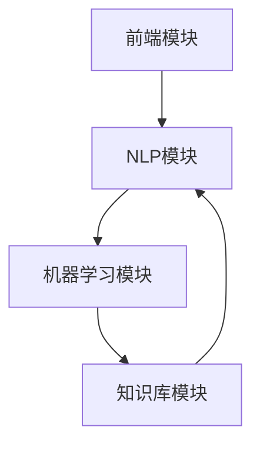
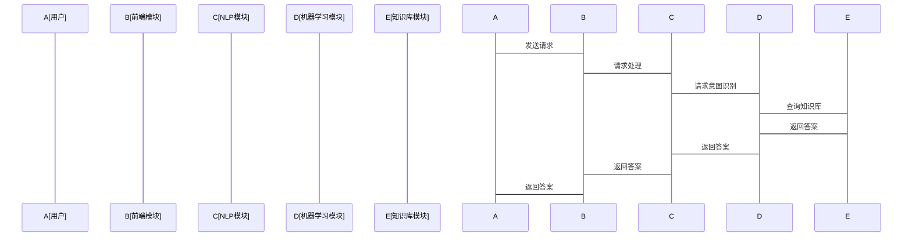

                 


# AI Agent在客户服务中的应用：提升响应速度与质量

## 关键词：AI Agent, 客户服务, 自然语言处理, 机器学习, 情感分析, 意图识别, 对话系统

## 摘要：本文探讨AI Agent在客户服务中的应用，分析其如何通过自然语言处理和机器学习技术提升响应速度与服务质量。文章从背景、原理、系统架构到实际案例，全面解析AI Agent的优势与实现。

---

# 第一部分：引言

## 第1章：背景与问题描述

### 1.1 AI Agent在客户服务中的背景

#### 1.1.1 客户服务的传统模式与挑战
传统的客户服务模式依赖人工坐席执行，存在以下问题：
- **响应速度慢**：人工坐席执行无法同时处理大量请求。
- **服务质量不一致**：人员素质参差不齐，导致服务质量不稳定。
- **成本高**：需要大量人力资源，运营成本高昂。
- **数据孤岛**：不同渠道的数据难以整合，影响整体服务质量。

#### 1.1.2 AI技术如何改变客户服务
AI技术的引入，特别是AI Agent（智能客服机器人），为解决上述问题提供了新思路。通过自然语言处理（NLP）、机器学习和深度学习等技术，AI Agent能够实现24/7的实时响应，提高服务效率和质量。

#### 1.1.3 AI Agent的核心优势
AI Agent的核心优势体现在以下几个方面：
- **快速响应**：无需人工干预，客户问题可以实时得到处理。
- **一致的服务质量**：AI Agent不受情绪影响，始终保持一致的服务水平。
- **多渠道支持**：能够同时处理来自电话、邮件、聊天等多种渠道的客户请求。
- **数据驱动的优化**：通过分析大量客户数据，不断优化服务策略。

### 1.2 问题背景与目标

#### 1.2.1 客户服务中的主要问题
- **客户等待时间长**：传统客服系统在高峰时段响应速度慢。
- **客户满意度低**：人工服务可能因为情绪波动导致服务质量下降。
- **资源浪费**：大量人力资源投入低价值的工作。

#### 1.2.2 引入AI Agent的目标
- **提升客户满意度**：通过快速响应和准确解决问题提高客户满意度。
- **降低运营成本**：减少对人工坐席执行的依赖，降低人力成本。
- **增强业务连续性**：AI Agent可以7x24小时工作，确保服务不中断。

#### 1.2.3 AI Agent的边界与外延
- **边界**：AI Agent主要处理标准化的客户咨询和问题解决，不涉及需要复杂决策的任务。
- **外延**：AI Agent可以通过与后端系统的集成，处理更多复杂任务，如订单处理、支付确认等。

### 1.3 应用价值与前景

#### 1.3.1 提升响应速度的意义
快速响应能够显著提高客户满意度，缩短客户等待时间，降低客户流失率。

#### 1.3.2 提高服务质量的关键作用
AI Agent通过智能化的对话管理和情感分析，能够更好地理解客户需求，提供个性化的服务。

#### 1.3.3 未来的应用趋势
随着AI技术的不断进步，AI Agent将更加智能化，能够处理更多复杂任务，甚至实现自主学习和优化。

---

# 第二部分：AI Agent的核心概念与原理

## 第2章：AI Agent的基本概念

### 2.1 AI Agent的定义与分类

#### 2.1.1 AI Agent的定义
AI Agent是一种能够理解和响应用户请求的智能系统，通常通过自然语言处理技术实现与用户的交互。

#### 2.1.2 基于任务的AI Agent分类
- **信息查询类**：处理客户的查询请求，如产品信息、公司信息等。
- **问题解决类**：帮助客户解决具体问题，如故障排除、订单处理等。
- **情感支持类**：提供情感支持和心理疏导。

#### 2.1.3 基于智能水平的AI Agent分类
- **规则驱动型**：基于预设规则进行响应，适用于简单的任务。
- **数据驱动型**：通过机器学习模型进行预测和决策，适用于复杂任务。
- **混合型**：结合规则和机器学习模型，兼顾灵活性和准确性。

### 2.2 AI Agent的工作原理

#### 2.2.1 信息感知与理解
AI Agent通过自然语言处理技术，将客户的文本或语音请求转化为可理解的结构化数据。

#### 2.2.2 意图识别与决策
基于意图识别模型，AI Agent能够识别客户的主要需求，并根据预设的策略做出响应。

#### 2.2.3 行动执行与反馈
AI Agent根据识别的意图，执行相应的操作，并通过反馈机制不断优化自身性能。

### 2.3 AI Agent与传统客服系统的对比

#### 2.3.1 传统客服系统的局限性
- **响应速度慢**：依赖人工操作，无法同时处理大量请求。
- **服务质量不稳定**：受人工因素影响，服务质量不稳定。
- **成本高**：需要大量人力资源，运营成本高昂。

#### 2.3.2 AI Agent的核心优势
- **快速响应**：AI Agent能够实时处理客户的请求，显著缩短等待时间。
- **一致的服务质量**：AI Agent不受情绪影响，始终保持一致的服务水平。
- **多渠道支持**：AI Agent可以同时处理来自多种渠道的客户请求。

#### 2.3.3 两者的协同与融合
在实际应用中，AI Agent可以与传统客服系统协同工作，例如在处理复杂问题时，AI Agent可以将问题转交给人工坐席执行，实现无缝衔接。

---

## 第3章：AI Agent的核心技术

### 3.1 自然语言处理（NLP）基础

#### 3.1.1 NLP的基本概念
自然语言处理（NLP）是计算机科学、人工智能、语言学的交叉学科，致力于让计算机能够理解、处理和生成人类语言。

#### 3.1.2 常见的NLP任务
- **文本分词**：将连续的文本分割成有意义的词语。
- **词性标注**：给每个词语标注其词性。
- **句法分析**：分析句子的语法结构。
- **文本分类**：将文本归类到预设的类别中。
- **情感分析**：判断文本的情感倾向（正面、负面、中性）。

#### 3.1.3 NLP在客服中的应用
- **关键词提取**：从客户的问题中提取关键信息。
- **意图识别**：识别客户的主要需求。
- **对话管理**：根据对话历史管理对话流程。

### 3.2 机器学习与深度学习

#### 3.2.1 机器学习的基本原理
机器学习是一种通过数据训练模型，使其能够从经验中学习并做出预测或决策的技术。

#### 3.2.2 深度学习的核心技术
深度学习是一种基于人工神经网络的机器学习技术，能够处理复杂的非线性关系。

#### 3.2.3 机器学习在客服中的应用
- **客户情绪分析**：通过机器学习模型识别客户情绪。
- **意图识别**：通过训练模型识别客户的意图。
- **对话历史预测**：根据对话历史预测下一步对话内容。

### 3.3 情感分析与意图识别

#### 3.3.1 情感分析的定义与方法
情感分析是通过文本内容判断文本的情感倾向。常用方法包括基于规则的方法、基于词典的方法和基于机器学习的方法。

#### 3.3.2 意图识别的原理与技术
意图识别是通过分析客户的语言内容，识别其背后的目的或需求。常用技术包括基于关键词的意图识别和基于机器学习的意图识别。

#### 3.3.3 情感分析与意图识别在客服中的应用
- **客户情绪监控**：实时监控客户情绪，及时调整服务策略。
- **个性化服务**：根据客户意图提供个性化的服务。
- **服务质量优化**：通过分析客户情绪和意图，优化服务质量。

---

## 第4章：AI Agent的核心算法与实现

### 4.1 意图识别算法

#### 4.1.1 基于规则的意图识别
基于规则的意图识别方法通过预设规则匹配客户的问题，识别其意图。

#### 4.1.2 基于机器学习的意图识别
基于机器学习的意图识别方法通过训练模型，识别客户的意图。

#### 4.1.3 深度学习的意图识别
深度学习的意图识别方法通过多层神经网络模型，识别客户的意图。

### 4.2 情感分析算法

#### 4.2.1 基于词典的情感分析
基于词典的情感分析方法通过匹配文本中的情感词汇，判断文本的情感倾向。

#### 4.2.2 基于机器学习的情感分析
基于机器学习的情感分析方法通过训练模型，预测文本的情感倾向。

#### 4.2.3 基于深度学习的情感分析
基于深度学习的情感分析方法通过多层神经网络模型，预测文本的情感倾向。

### 4.3 对话系统算法

#### 4.3.1 基于规则的对话系统
基于规则的对话系统通过预设规则管理对话流程。

#### 4.3.2 基于机器学习的对话系统
基于机器学习的对话系统通过训练模型，生成对话回复。

#### 4.3.3 基于深度学习的对话系统
基于深度学习的对话系统通过多层神经网络模型，生成对话回复。

---

## 第5章：AI Agent的系统架构设计

### 5.1 系统功能设计

#### 5.1.1 需求分析
- **用户需求**：客户希望快速得到问题解答，享受高质量的服务。
- **系统需求**：系统需要支持多渠道接入，实现快速响应和智能对话。

#### 5.1.2 功能模块划分
- **前端模块**：负责与用户的交互，接收用户请求。
- **后端模块**：负责处理用户请求，调用相应的服务。
- **NLP模块**：负责自然语言处理，识别客户意图。
- **机器学习模块**：负责意图识别和情感分析。
- **知识库模块**：负责存储和管理相关知识，提供答案。

### 5.2 系统架构设计

#### 5.2.1 系统架构图


#### 5.2.2 数据流设计
- **输入数据**：用户请求（文本或语音）。
- **处理流程**：前端模块接收请求，NLP模块进行分词和词性标注，机器学习模块进行意图识别，知识库模块提供答案。
- **输出结果**：前端模块返回处理结果给用户。

### 5.3 接口设计

#### 5.3.1 API接口设计
- **输入接口**：接收用户的请求。
- **输出接口**：返回处理结果。

#### 5.3.2 数据接口设计
- **数据输入**：用户请求。
- **数据输出**：处理结果。

### 5.4 交互设计

#### 5.4.1 对话流程设计


---

## 第6章：AI Agent的项目实战

### 6.1 项目环境搭建

#### 6.1.1 环境要求
- **操作系统**：Linux/Windows/MacOS
- **编程语言**：Python
- **开发工具**：Jupyter Notebook/VS Code
- **依赖库**：Numpy, Pandas, Scikit-learn, SpaCy, TensorFlow

#### 6.1.2 安装依赖
```bash
pip install numpy pandas scikit-learn spacy tensorflow
```

### 6.2 核心实现

#### 6.2.1 意图识别实现
```python
import spacy
nlp = spacy.load("en_core_web_sm")

def identify_intent(text):
    doc = nlp(text)
    keywords = [token.text for token in doc if token.pos_ in ["NOUN", "VERB"]]
    return keywords
```

#### 6.2.2 情感分析实现
```python
from sklearn.feature_extraction.text import TfidfVectorizer
from sklearn.svm import SVC

vectorizer = TfidfVectorizer()
model = SVC()

def analyze_sentiment(text):
    X = vectorizer.fit_transform([text])
    return model.predict(X)[0]
```

#### 6.2.3 对话系统实现
```python
import tensorflow as tf
from tensorflow.keras import layers

model = tf.keras.Sequential([
    layers.Dense(64, activation='relu'),
    layers.Dense(1, activation='sigmoid')
])

model.compile(optimizer='adam', loss='binary_crossentropy', metrics=['accuracy'])
```

### 6.3 项目小结

#### 6.3.1 项目总结
通过本项目，我们实现了基于自然语言处理和机器学习的AI Agent，能够进行意图识别和情感分析，提升客户服务的响应速度和质量。

#### 6.3.2 项目优化建议
- **模型优化**：引入更复杂的深度学习模型，如BERT，提升意图识别和情感分析的准确率。
- **数据优化**：增加多样化的训练数据，提升模型的泛化能力。
- **系统优化**：优化系统架构，提升系统的响应速度和稳定性。

---

## 第7章：总结与展望

### 7.1 总结

#### 7.1.1 核心内容回顾
本文详细介绍了AI Agent在客户服务中的应用，分析了其核心概念和原理，探讨了系统架构设计和项目实现。

#### 7.1.2 关键技术总结
- **自然语言处理**：实现文本理解和意图识别。
- **机器学习**：实现情感分析和对话系统。
- **系统架构**：设计高效的系统架构，提升服务响应速度和质量。

### 7.2 未来展望

#### 7.2.1 技术趋势
- **深度学习的进一步应用**：引入更复杂的深度学习模型，提升AI Agent的智能水平。
- **多模态交互**：结合视觉、听觉等多种交互方式，提升用户体验。
- **自适应学习**：实现自适应学习，提升AI Agent的灵活性和适应性。

#### 7.2.2 应用前景
随着AI技术的不断进步，AI Agent将在客户服务中发挥越来越重要的作用，成为企业提升客户满意度和忠诚度的重要工具。

---

## 第8章：最佳实践与注意事项

### 8.1 最佳实践

#### 8.1.1 数据质量管理
- **数据清洗**：确保数据的完整性和准确性。
- **数据标注**：对数据进行标注，提升模型的训练效果。

#### 8.1.2 模型优化
- **模型选择**：根据具体任务选择合适的模型。
- **模型调优**：通过参数调整和模型优化，提升模型的性能。

#### 8.1.3 系统优化
- **系统设计**：设计高效的系统架构，提升系统的响应速度和稳定性。
- **系统监控**：实时监控系统运行状态，及时发现和解决问题。

### 8.2 注意事项

#### 8.2.1 数据隐私保护
- **数据加密**：对敏感数据进行加密处理，确保数据安全。
- **数据合规性**：遵守相关数据保护法规，确保数据的合规性。

#### 8.2.2 系统稳定性
- **容错设计**：设计容错机制，确保系统在出现故障时能够正常运行。
- **备份与恢复**：制定备份和恢复策略，确保系统的数据安全。

#### 8.2.3 用户体验优化
- **界面设计**：设计友好的用户界面，提升用户体验。
- **反馈机制**：建立有效的反馈机制，及时收集用户反馈，不断优化系统。

---

## 第9章：拓展阅读与学习资源

### 9.1 拓展阅读

#### 9.1.1 推荐书籍
- 《自然语言处理入门》
- 《机器学习实战》
- 《深度学习入门》

#### 9.1.2 推荐论文
- "A Survey on Deep Learning for NLP"
- "Attention Is All You Need"

#### 9.1.3 推荐博客与技术文章
- [自然语言处理技术博客](https://example.com)
- [机器学习技术博客](https://example.com)

### 9.2 学习资源

#### 9.2.1 在线课程
- "AI Fundamentals" on Coursera
- "Deep Learning Specialization" on Coursera

#### 9.2.2 开源项目
- [Hugging Face Transformers](https://huggingface.co/transformers)
- [spaCy官方文档](https://spacy.io)

---

通过本文的详细讲解，读者可以全面了解AI Agent在客户服务中的应用，掌握其核心技术与实现方法。希望本文能够为相关领域的技术人员提供有价值的参考和启示。

