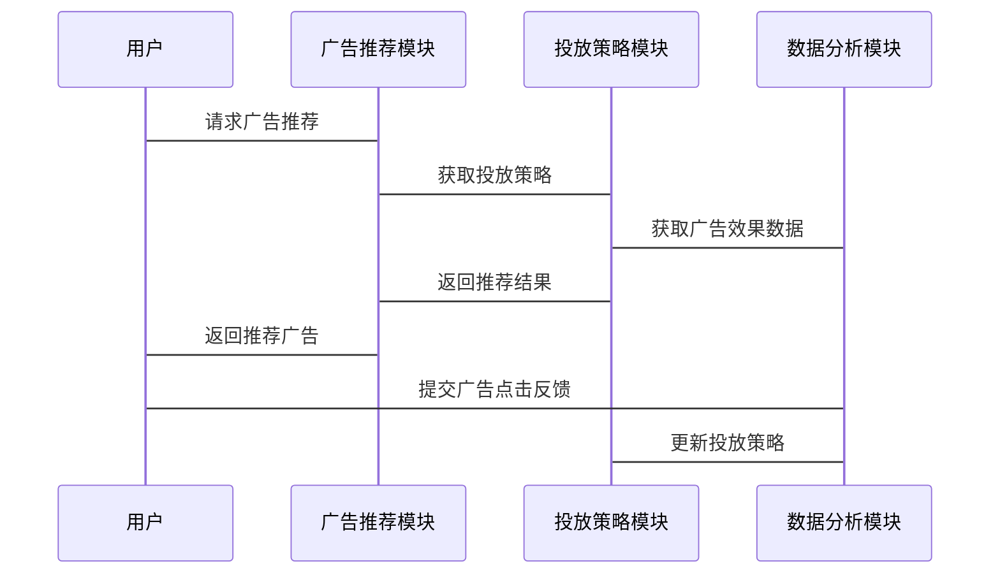

                 


# AI Agent在广告投放中的应用：精准定位与效果优化

## 关键词：
AI Agent, 广告投放, 精准定位, 效果优化, 机器学习, 点击率预测, 转化率优化

## 摘要：
本文深入探讨AI Agent在广告投放中的应用，分析其在精准定位和效果优化中的核心作用。通过结合机器学习算法、数学模型和系统架构设计，详细阐述AI Agent如何提升广告投放的效率和效果。内容涵盖AI Agent的基本概念、算法原理、系统设计、项目实战及最佳实践，帮助读者全面理解并掌握AI Agent在广告投放中的实际应用。

---

# 第1章: AI Agent与广告投放的背景

## 1.1 AI Agent的基本概念

### 1.1.1 什么是AI Agent
AI Agent（人工智能代理）是指能够感知环境、自主决策并执行任务的智能体。在广告投放中，AI Agent通常用于分析用户行为、优化广告策略并执行投放任务。

### 1.1.2 AI Agent的核心特征
- **自主性**：AI Agent能够自主决策，无需人工干预。
- **反应性**：能够实时感知环境变化并做出响应。
- **学习能力**：通过机器学习不断优化自身的决策模型。
- **协作性**：能够与其他系统或AI Agent协同工作。

### 1.1.3 AI Agent与传统广告投放的区别
- **精准性**：AI Agent能够基于实时数据和用户行为进行精准投放。
- **效率**：自动化决策和执行，显著提高投放效率。
- **动态优化**：能够根据反馈实时调整策略，传统广告投放通常基于静态策略。

## 1.2 广告投放的背景与挑战

### 1.2.1 广告投放的基本流程
广告投放通常包括以下几个步骤：
1. 用户画像与行为分析。
2. 广告素材的准备与优化。
3. 投放策略的制定。
4. 实时广告投放与效果监测。
5. 数据反馈与策略优化。

### 1.2.2 精准定位与效果优化的重要性
- **精准定位**：通过分析用户画像和行为数据，精准选择目标用户，提高广告点击率和转化率。
- **效果优化**：通过动态调整广告素材和投放策略，最大化广告效果并降低投放成本。

### 1.2.3 当前广告投放的主要挑战
- **数据复杂性**：用户行为数据多样且复杂，难以有效分析和利用。
- **实时性要求高**：广告投放需要实时决策，对系统的响应速度和处理能力要求高。
- **动态变化**：市场环境和用户行为不断变化，需要系统能够快速适应。

---

# 第2章: AI Agent在广告投放中的核心概念

## 2.1 AI Agent的核心原理

### 2.1.1 AI Agent的工作流程
AI Agent在广告投放中的工作流程可以分为以下几个步骤：
1. **数据采集**：收集用户画像、行为数据和广告素材。
2. **数据分析**：通过机器学习算法对数据进行分析和建模。
3. **决策制定**：基于分析结果，制定广告投放策略。
4. **执行投放**：根据决策结果执行广告投放。
5. **效果反馈**：实时监测广告效果并反馈到系统，用于优化下一步决策。

### 2.1.2 AI Agent的核心算法
- **监督学习**：用于基于历史数据进行分类和预测。
- **非监督学习**：用于用户分群和异常检测。
- **强化学习**：用于动态调整投放策略以最大化效果。

### 2.1.3 AI Agent的决策机制
AI Agent的决策机制通常包括以下几个方面：
- **用户画像匹配**：根据用户画像匹配最合适的广告内容。
- **广告素材优化**：根据实时数据动态调整广告素材。
- **投放策略优化**：基于反馈不断优化投放策略。

## 2.2 广告投放中的关键要素

### 2.2.1 用户画像与行为分析
- **用户画像**：基于用户的基本信息、兴趣爱好和行为习惯构建用户画像。
- **行为分析**：通过分析用户的点击、浏览和转化行为，优化广告投放策略。

### 2.2.2 广告素材的智能生成
- **文本生成**：基于用户画像生成针对性的广告文案。
- **图像生成**：利用AI技术生成与用户兴趣匹配的广告图片。
- **视频生成**：动态生成符合用户喜好的视频广告。

### 2.2.3 投放策略的动态优化
- **实时调整**：根据实时数据动态调整广告投放策略。
- **多目标优化**：在多个目标之间找到平衡点，最大化整体效果。
- **风险控制**：通过风险评估模型，降低广告投放的失败风险。

---

# 第3章: AI Agent与广告投放的结合

## 3.1 AI Agent在广告投放中的应用场景

### 3.1.1 精准用户定位
- **用户分群**：通过AI Agent对用户进行分群，精准定位目标用户。
- **用户画像匹配**：根据用户画像匹配最合适的广告内容。

### 3.1.2 广告素材优化
- **动态生成**：根据用户行为动态生成广告素材。
- **A/B测试**：通过A/B测试优化广告素材。

### 3.1.3 投放效果预测
- **效果预测模型**：基于历史数据和实时数据预测广告效果。
- **实时反馈**：根据实时数据反馈优化投放策略。

## 3.2 AI Agent的核心优势

### 3.2.1 提高广告投放效率
- **自动化决策**：AI Agent能够快速做出决策，提高投放效率。
- **实时调整**：根据实时数据动态调整策略，优化投放效果。

### 3.2.2 降低广告投放成本
- **精准定位**：通过精准定位减少无效投放，降低广告成本。
- **动态优化**：通过动态优化策略，降低广告浪费。

### 3.2.3 提升广告投放效果
- **精准匹配**：通过用户画像和行为分析，精准匹配广告内容。
- **持续优化**：通过机器学习不断优化广告策略，提升投放效果。

---

# 第4章: AI Agent的算法原理

## 4.1 基于机器学习的广告投放

### 4.1.1 监督学习在广告投放中的应用
- **点击率预测**：通过监督学习预测用户点击广告的概率。
- **转化率预测**：通过监督学习预测用户转化广告的概率。

### 4.1.2 非监督学习在广告投放中的应用
- **用户分群**：通过非监督学习对用户进行分群，优化广告投放策略。
- **异常检测**：通过非监督学习检测广告投放中的异常行为。

### 4.1.3 强化学习在广告投放中的应用
- **动态策略优化**：通过强化学习动态调整广告投放策略。
- **实时反馈**：根据实时反馈优化广告投放效果。

## 4.2 常见算法及其在广告投放中的应用

### 4.2.1 点击率预测算法
- **逻辑回归**：用于预测用户点击广告的概率。
- **随机森林**：用于预测用户点击广告的概率。
- **神经网络**：用于复杂的非线性预测。

### 4.2.2 转化率预测算法
- **逻辑回归**：用于预测用户转化广告的概率。
- **梯度提升树**：用于预测用户转化广告的概率。
- **深度学习模型**：用于复杂的非线性预测。

### 4.2.3 聚类算法在用户分群中的应用
- **K-means**：用于用户分群。
- **DBSCAN**：用于用户分群。

---

# 第5章: 广告投放中的数学模型

## 5.1 点击率预测模型

### 5.1.1 点击率预测的数学公式
点击率预测模型通常可以表示为：
$$ P(\text{点击}|x) = \frac{e^{w \cdot x + b}}{1 + e^{w \cdot x + b}} $$
其中，$x$ 是用户特征向量，$w$ 是权重向量，$b$ 是偏置项。

### 5.1.2 点击率预测的实现步骤
1. **数据预处理**：对数据进行归一化和特征选择。
2. **模型训练**：使用训练数据训练点击率预测模型。
3. **模型评估**：使用验证数据评估模型性能。
4. **模型部署**：将模型部署到广告投放系统中。

## 5.2 转化率预测模型

### 5.2.1 转化率预测的数学公式
转化率预测模型通常可以表示为：
$$ P(\text{转化}|x) = \frac{e^{w \cdot x + b}}{1 + e^{w \cdot x + b}} $$
其中，$x$ 是用户特征向量，$w$ 是权重向量，$b$ 是偏置项。

### 5.2.2 转化率预测的实现步骤
1. **数据预处理**：对数据进行归一化和特征选择。
2. **模型训练**：使用训练数据训练转化率预测模型。
3. **模型评估**：使用验证数据评估模型性能。
4. **模型部署**：将模型部署到广告投放系统中。

---

# 第6章: 系统分析与架构设计

## 6.1 系统功能设计

### 6.1.1 用户画像模块
- **功能描述**：收集和分析用户数据，构建用户画像。
- **实现步骤**：
  1. 数据采集：收集用户的基本信息、兴趣爱好和行为数据。
  2. 数据分析：通过机器学习算法对用户数据进行分析和建模。
  3. 用户画像生成：基于分析结果生成用户画像。

### 6.1.2 广告推荐模块
- **功能描述**：根据用户画像推荐合适的广告内容。
- **实现步骤**：
  1. 广告素材准备：准备多种广告素材，包括文本、图片和视频。
  2. 用户画像匹配：根据用户画像匹配最合适的广告内容。
  3. 广告推荐：基于匹配结果推荐广告内容。

### 6.1.3 投放策略模块
- **功能描述**：制定和优化广告投放策略。
- **实现步骤**：
  1. 数据分析：分析用户行为和广告效果数据。
  2. 策略制定：基于分析结果制定广告投放策略。
  3. 策略优化：根据实时反馈优化投放策略。

## 6.2 系统架构设计

### 6.2.1 分层架构设计
- **数据层**：负责数据的存储和管理。
- **业务逻辑层**：负责业务逻辑的实现。
- **用户界面层**：负责与用户的交互。

### 6.2.2 微服务架构设计
- **用户画像服务**：负责用户画像的构建和管理。
- **广告推荐服务**：负责广告推荐的实现。
- **投放策略服务**：负责投放策略的制定和优化。

### 6.2.3 可扩展性设计
- **模块化设计**：各模块独立设计，便于扩展和维护。
- **分布式部署**：通过分布式部署提高系统的可扩展性。

## 6.3 系统接口设计

### 6.3.1 用户画像接口
- **接口描述**：提供用户画像的查询和更新接口。
- **接口实现**：
  ```python
  def get_user_profile(user_id):
      # 查询用户画像
      pass

  def update_user_profile(user_id, profile):
      # 更新用户画像
      pass
  ```

### 6.3.2 广告推荐接口
- **接口描述**：提供广告推荐的接口。
- **接口实现**：
  ```python
  def recommend_ads(user_id):
      # 根据用户画像推荐广告
      pass
  ```

### 6.3.3 投放策略接口
- **接口描述**：提供投放策略的查询和更新接口。
- **接口实现**：
  ```python
  def get_campaign(campaign_id):
      # 查询投放策略
      pass

  def update_campaign(campaign_id, strategy):
      # 更新投放策略
      pass
  ```

## 6.4 系统交互设计

### 6.4.1 系统交互流程
- **用户请求广告推荐**：用户向系统请求广告推荐。
- **系统响应广告推荐**：系统根据用户画像推荐广告内容。
- **广告投放与反馈**：系统根据推荐结果执行广告投放，并实时反馈广告效果。
- **策略优化**：系统根据反馈优化投放策略。

### 6.4.2 系统交互序列图


---

# 第7章: 项目实战

## 7.1 环境安装

### 7.1.1 安装Python
- 安装Python 3.8或更高版本。
- 安装必要的Python库：
  ```bash
  pip install numpy pandas scikit-learn tensorflow
  ```

## 7.2 系统核心实现

### 7.2.1 用户画像模块实现
```python
import numpy as np
from sklearn.cluster import KMeans

def create_user_profile(users):
    # 用户特征矩阵
    X = np.array(users)
    # 用户分群
    kmeans = KMeans(n_clusters=5).fit(X)
    return kmeans.labels_
```

### 7.2.2 广告推荐模块实现
```python
import tensorflow as tf
from tensorflow.keras import layers

def build_model(input_dim):
    model = tf.keras.Sequential()
    model.add(layers.Dense(64, activation='relu', input_dim=input_dim))
    model.add(layers.Dense(1, activation='sigmoid'))
    model.compile(optimizer='adam', loss='binary_crossentropy', metrics=['accuracy'])
    return model
```

### 7.2.3 投放策略模块实现
```python
import pandas as pd
from sklearn.metrics import accuracy_score

def evaluate_strategy(true_labels, predicted_labels):
    accuracy = accuracy_score(true_labels, predicted_labels)
    return accuracy
```

## 7.3 实际案例分析

### 7.3.1 案例背景
- **公司背景**：一家互联网公司，希望通过AI Agent优化广告投放效果。
- **业务目标**：提高广告点击率和转化率，降低广告投放成本。

### 7.3.2 数据准备
- **用户数据**：包括用户的基本信息、兴趣爱好和行为数据。
- **广告数据**：包括广告素材、投放时间、投放位置等。

### 7.3.3 实施步骤
1. **用户画像构建**：基于用户数据构建用户画像。
2. **广告推荐实现**：基于用户画像推荐广告内容。
3. **投放策略优化**：通过机器学习算法优化广告投放策略。
4. **效果监测与反馈**：实时监测广告效果并反馈到系统。

## 7.4 项目小结

### 7.4.1 项目总结
通过本项目，我们成功实现了基于AI Agent的广告投放系统，显著提高了广告点击率和转化率，降低了广告投放成本。

### 7.4.2 经验与教训
- **经验**：AI Agent能够显著提高广告投放的效率和效果。
- **教训**：需要不断优化机器学习模型，以适应不断变化的市场环境。

---

# 第8章: 最佳实践与小结

## 8.1 最佳实践

### 8.1.1 数据质量管理
- **数据清洗**：确保数据的准确性和完整性。
- **数据标注**：对数据进行标注，提高模型的训练效果。

### 8.1.2 模型优化
- **模型调优**：通过交叉验证等方法优化模型参数。
- **模型融合**：通过模型融合提高预测效果。

### 8.1.3 系统优化
- **系统性能优化**：通过缓存和分布式部署提高系统性能。
- **系统安全性优化**：通过加密和权限管理提高系统安全性。

## 8.2 小结

### 8.2.1 项目总结
通过本项目，我们深入探讨了AI Agent在广告投放中的应用，分析了其在精准定位和效果优化中的核心作用。

### 8.2.2 展望未来
未来，随着AI技术的不断发展，AI Agent在广告投放中的应用将更加广泛和深入，广告投放的效果和效率将不断提高。

---

# 第9章: 注意事项与拓展阅读

## 9.1 注意事项

### 9.1.1 数据隐私保护
在广告投放中，需要注意用户数据的隐私保护，遵守相关法律法规。

### 9.1.2 系统稳定性保障
需要确保广告投放系统的稳定性和可靠性，避免因系统故障导致广告投放失败。

### 9.1.3 模型持续优化
需要持续优化机器学习模型，以适应不断变化的市场环境和用户需求。

## 9.2 拓展阅读

### 9.2.1 推荐书目
- 《机器学习实战》
- 《深度学习》
- 《广告投放与优化》

### 9.2.2 在线资源
- TensorFlow官方文档
- PyTorch官方文档
- Kaggle上的广告投放数据集

---

# 第10章: 总结

## 10.1 项目总结
通过本项目，我们深入探讨了AI Agent在广告投放中的应用，分析了其在精准定位和效果优化中的核心作用。

## 10.2 展望未来
未来，随着AI技术的不断发展，AI Agent在广告投放中的应用将更加广泛和深入，广告投放的效果和效率将不断提高。

## 10.3 结语
AI Agent作为人工智能技术的重要组成部分，将在广告投放中发挥越来越重要的作用。通过不断优化和创新，我们可以更好地利用AI Agent提升广告投放的效果和效率。

