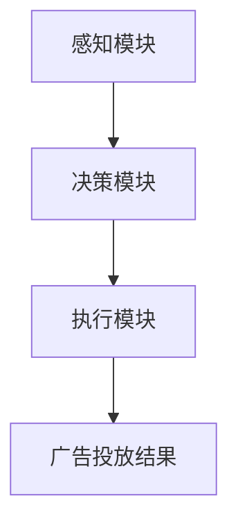
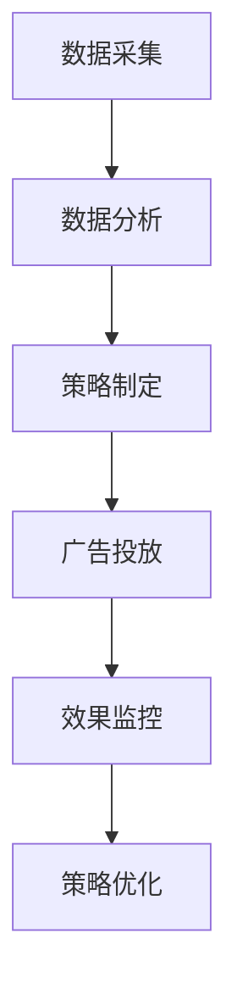
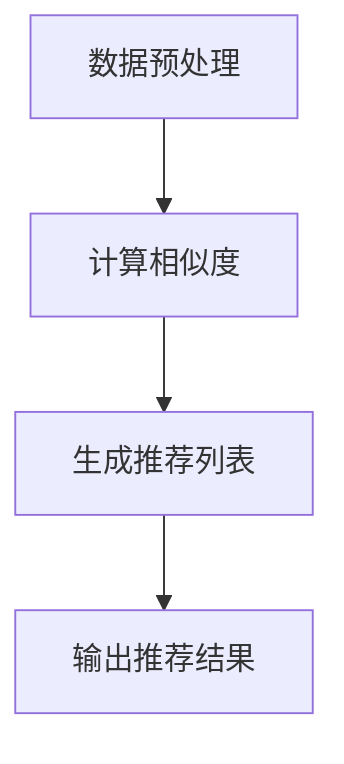
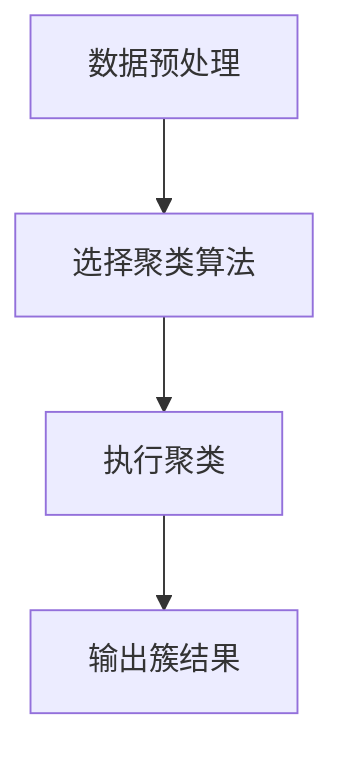
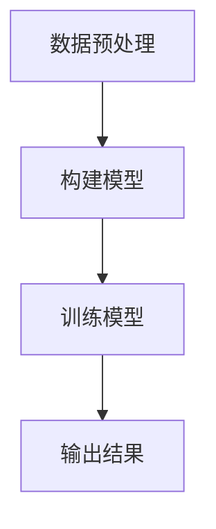
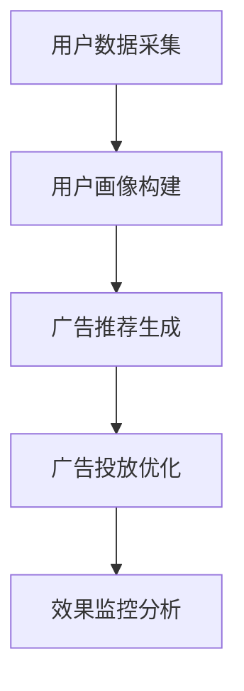
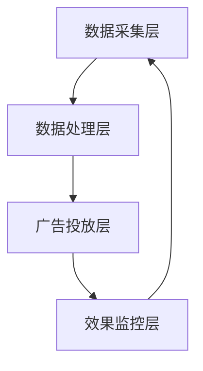
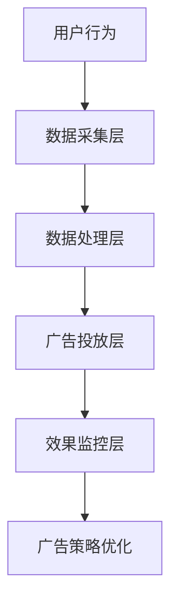

                 


# AI Agent在广告投放中的精准定位

> 关键词：AI Agent, 广告投放, 精准定位, 机器学习, 深度学习, 用户画像

> 摘要：本文将深入探讨AI Agent在广告投放中的精准定位技术，从基本概念到算法原理，再到系统架构和项目实战，全面解析如何利用AI技术实现广告投放的高效与精准。通过详细的技术分析和实际案例，本文将为读者提供一份全面的指南，帮助他们在广告投放中更好地应用AI Agent。

---

# 第一部分: AI Agent在广告投放中的精准定位基础

# 第1章: AI Agent与广告投放概述

## 1.1 AI Agent的基本概念

### 1.1.1 什么是AI Agent

AI Agent（人工智能代理）是指能够感知环境、做出决策并执行操作的智能系统。它能够通过数据和算法来理解用户行为、偏好和需求，并根据这些信息做出最优的广告投放决策。

$$AI\ Agent = \text{感知} + \text{决策} + \text{执行}$$

### 1.1.2 AI Agent的核心特征

- **自主性**：能够自主决策，无需人工干预。
- **反应性**：能够实时感知环境变化并做出反应。
- **学习能力**：能够通过数据学习和优化，提升广告投放效果。
- **可扩展性**：能够处理大规模数据和复杂场景。

### 1.1.3 AI Agent与传统广告投放的区别

| 特性         | 传统广告投放                 | 基于AI Agent的广告投放 |
|--------------|------------------------------|--------------------------|
| 数据使用     | 基于少量用户数据             | 基于海量用户数据         |
| 定位精度     | 精度较低，基于简单规则       | 精度高，基于复杂算法     |
| 实时性       | 无法实时调整                 | 实时优化                 |
| 效率         | 低效，依赖人工干预           | 高效，自动化处理         |

---

## 1.2 广告投放的背景与挑战

### 1.2.1 广告投放的基本流程

广告投放的基本流程包括以下几个步骤：

1. **用户数据收集**：通过各种渠道收集用户的行为数据、偏好数据等。
2. **用户画像构建**：基于收集的数据，构建用户的画像，分析用户的兴趣和需求。
3. **广告策略制定**：根据用户画像，制定广告投放策略，选择合适的广告内容和投放渠道。
4. **广告投放与优化**：执行广告投放，并根据实时数据反馈，不断优化广告策略。

### 1.2.2 精准定位广告的目标

精准定位广告的目标是通过分析用户的行为和偏好，找到最有可能对广告产生兴趣的用户群体，并将广告投放到这些用户面前，从而提高广告的点击率和转化率。

### 1.2.3 当前广告投放的主要挑战

- **数据量大**：用户数据量庞大，难以高效处理。
- **用户行为复杂**：用户行为多样，难以准确预测。
- **实时性要求高**：广告投放需要实时调整策略，对系统的响应速度和处理能力要求高。
- **竞争激烈**：广告投放市场竞争激烈，需要不断提高广告的效果和效率。

---

## 1.3 AI Agent在广告投放中的作用

### 1.3.1 提高广告投放效率

AI Agent能够快速处理海量数据，自动化地制定和优化广告策略，显著提高广告投放的效率。

### 1.3.2 实现精准用户定位

通过机器学习和深度学习算法，AI Agent能够精准分析用户的兴趣和需求，实现精准的用户定位。

### 1.3.3 优化广告投放效果

AI Agent能够实时监控广告投放的效果，并根据实时数据反馈不断优化广告策略，从而提高广告的点击率和转化率。

---

## 1.4 本章小结

本章主要介绍了AI Agent的基本概念、广告投放的背景与挑战，以及AI Agent在广告投放中的作用。通过这些内容，我们可以看到，AI Agent在广告投放中的应用能够显著提高广告投放的效率和精准度，从而为企业带来更大的收益。

---

# 第二部分: AI Agent的核心概念与原理

# 第2章: AI Agent的核心原理

## 2.1 AI Agent的基本原理

### 2.1.1 感知模块

感知模块是AI Agent的核心模块之一，负责收集和处理环境中的数据，以便为决策模块提供输入。

$$\text{感知数据} = \text{用户行为} + \text{环境信息}$$

### 2.1.2 决策模块

决策模块基于感知模块提供的数据，结合预设的目标和策略，做出最优的广告投放决策。

$$\text{决策结果} = f(\text{感知数据}, \text{目标}, \text{策略})$$

### 2.1.3 执行模块

执行模块负责将决策模块的决策结果转化为实际的操作，例如投放广告、调整广告内容等。

$$\text{执行操作} = g(\text{决策结果})$$

### 2.1.4 AI Agent的工作流程

以下是AI Agent在广告投放中的工作流程图：



---

## 2.2 AI Agent在广告投放中的工作流程

### 2.2.1 数据采集

AI Agent通过各种渠道（如网站、移动应用、社交媒体等）采集用户的行为数据、偏好数据等。

### 2.2.2 数据分析

通过机器学习算法对采集的数据进行分析，构建用户画像，识别用户的兴趣和需求。

### 2.2.3 策略制定

根据用户画像和广告目标，制定最优的广告投放策略，包括广告内容、投放渠道和时间等。

### 2.2.4 广告投放与优化

根据制定的策略执行广告投放，并实时监控广告效果，根据反馈不断优化广告策略。

### 2.2.5 AI Agent的工作流程图

以下是AI Agent在广告投放中的工作流程图：



---

## 2.3 AI Agent的核心算法

### 2.3.1 机器学习算法

机器学习算法是AI Agent的核心算法之一，包括监督学习、无监督学习和强化学习等。

#### 监督学习

监督学习是一种通过标签数据进行学习的算法，常用于分类和回归任务。

$$\text{预测结果} = f(\text{输入数据}, \text{模型参数})$$

#### 无监督学习

无监督学习是一种通过无标签数据进行学习的算法，常用于聚类和降维任务。

$$\text{聚类结果} = g(\text{输入数据}, \text{模型参数})$$

#### 强化学习

强化学习是一种通过与环境交互进行学习的算法，常用于策略优化和游戏AI开发。

$$\text{策略} = \pi(s)$$

### 2.3.2 深度学习算法

深度学习算法是一种基于人工神经网络的算法，常用于图像识别、自然语言处理等任务。

#### 卷积神经网络（CNN）

卷积神经网络是一种常用于图像识别的深度学习算法，通过卷积层和池化层提取图像特征。

$$\text{输出} = \text{CNN}(x)$$

#### 循环神经网络（RNN）

循环神经网络是一种常用于自然语言处理的深度学习算法，通过循环层处理序列数据。

$$\text{输出} = \text{RNN}(x)$$

### 2.3.3 自然语言处理技术

自然语言处理技术是一种用于理解和生成人类语言的算法，常用于文本分类、实体识别等任务。

#### 词嵌入（Word Embedding）

词嵌入是一种将词语映射到低维向量空间的技术，常用的词嵌入算法包括Word2Vec、GloVe等。

$$\text{词向量} = \text{Word2Vec}(x)$$

#### 情感分析

情感分析是一种用于判断文本情感倾向的技术，常用于广告内容优化。

$$\text{情感倾向} = f(x)$$

---

## 2.4 本章小结

本章主要介绍了AI Agent的核心原理，包括感知、决策和执行模块，以及AI Agent在广告投放中的工作流程和核心算法。通过这些内容，我们可以更好地理解AI Agent在广告投放中的具体应用和实现方式。

---

# 第三部分: AI Agent的算法原理与数学模型

# 第3章: 常见AI算法在广告投放中的应用

## 3.1 协同过滤算法

### 3.1.1 协同过滤的基本原理

协同过滤是一种基于用户相似性或物品相似性的推荐算法，常用于广告推荐。

#### 基于用户的协同过滤

基于用户的协同过滤算法通过分析用户的相似性，推荐与用户相似的其他用户喜欢的广告内容。

$$\text{相似度} = \text{余弦相似度}(x, y)$$

#### 基于物品的协同过滤

基于物品的协同过滤算法通过分析物品的相似性，推荐与用户喜欢的物品相似的其他物品。

$$\text{相似度} = \text{余弦相似度}(x, y)$$

### 3.1.2 协同过滤的实现步骤

以下是协同过滤的实现步骤图：



### 3.1.3 协同过滤的Python代码实现

以下是一个基于用户的协同过滤算法的Python代码示例：

```python
import numpy as np
from sklearn.metrics.pairwise import cosine_similarity

# 示例数据：用户-物品评分矩阵
user_item_matrix = np.array([
    [4, 3, 0, 0],
    [2, 0, 4, 0],
    [1, 5, 0, 2],
    [3, 1, 4, 0],
])

# 计算余弦相似度
similarity = cosine_similarity(user_item_matrix)

# 示例用户索引
user_index = 0

# 找到与示例用户相似度最高的用户
similar_user_index = np.argmax(similarity[user_index])

# 输出推荐结果
print("推荐结果：", user_item_matrix[similar_user_index])
```

---

## 3.2 聚类分析算法

### 3.2.1 聚类分析的基本原理

聚类分析是一种将数据分成若干个簇的技术，常用于用户分群和广告定位。

#### K-means算法

K-means算法是一种常用的聚类算法，通过将数据分成K个簇，最小化簇内平方距离之和。

$$\text{目标函数} = \sum_{i=1}^{K} \sum_{j=1}^{N_i} (x_j - \mu_i)^2$$

#### 层次聚类算法

层次聚类算法是一种通过层次化的方式将数据分成簇的技术，常用于用户分群。

$$\text{距离矩阵} = \text{计算所有样本之间的距离}$$

### 3.2.2 聚类分析的实现步骤

以下是聚类分析的实现步骤图：



### 3.2.3 聚类分析的Python代码实现

以下是一个K-means算法的Python代码示例：

```python
from sklearn.cluster import KMeans

# 示例数据：用户特征向量
X = np.array([
    [1, 2],
    [1, 3],
    [2, 2],
    [10, 11],
    [10, 12],
    [11, 10],
])

# 初始化K-means模型
kmeans = KMeans(n_clusters=2)

# 训练模型
kmeans.fit(X)

# 输出簇结果
print("簇结果：", kmeans.labels_)
```

---

## 3.3 深度学习算法

### 3.3.1 深度学习算法的基本原理

深度学习算法是一种基于人工神经网络的算法，常用于复杂的非线性任务。

#### 卷积神经网络（CNN）

卷积神经网络是一种常用于图像识别的深度学习算法，通过卷积层和池化层提取图像特征。

$$\text{输出} = \text{CNN}(x)$$

#### 循环神经网络（RNN）

循环神经网络是一种常用于自然语言处理的深度学习算法，通过循环层处理序列数据。

$$\text{输出} = \text{RNN}(x)$$

### 3.3.2 深度学习算法的实现步骤

以下是深度学习算法的实现步骤图：



### 3.3.3 深度学习算法的Python代码实现

以下是一个简单的深度学习模型（多层感知机）的Python代码示例：

```python
import tensorflow as tf
from tensorflow.keras import layers

# 示例数据：输入特征和标签
X = np.array([[1, 2], [3, 4], [5, 6]], dtype=np.float32)
y = np.array([0, 1, 0], dtype=np.float32)

# 构建模型
model = tf.keras.Sequential([
    layers.Dense(64, activation='relu'),
    layers.Dense(1, activation='sigmoid')
])

# 编译模型
model.compile(optimizer='adam', loss='binary_crossentropy', metrics=['accuracy'])

# 训练模型
model.fit(X, y, epochs=10, batch_size=32)

# 输出模型摘要
model.summary()
```

---

## 3.4 本章小结

本章主要介绍了常见AI算法在广告投放中的应用，包括协同过滤、聚类分析和深度学习算法。通过这些算法的实现和应用，我们可以更好地理解AI Agent在广告投放中的具体技术细节。

---

# 第四部分: AI Agent的系统分析与架构设计

# 第4章: AI Agent在广告投放中的系统分析与架构设计

## 4.1 系统分析

### 4.1.1 广告投放的场景介绍

广告投放的场景包括PC端、移动端和社交媒体端等多种渠道，用户行为数据需要实时采集和处理。

### 4.1.2 系统功能设计

系统功能设计包括用户画像构建、广告推荐生成、广告投放优化和效果监控分析。

#### 用户画像构建

用户画像是通过对用户行为数据的分析和挖掘，构建用户的基本信息、兴趣爱好和行为习惯等。

#### 广告推荐生成

广告推荐生成是基于用户画像和广告库存，生成最优的广告推荐列表。

#### 广告投放优化

广告投放优化是通过实时监控广告效果，不断优化广告策略，提高广告的点击率和转化率。

#### 效果监控分析

效果监控分析是对广告投放的效果进行实时监控和分析，为后续的广告策略优化提供数据支持。

### 4.1.3 系统功能模块设计

以下是系统功能模块设计图：



---

## 4.2 系统架构设计

### 4.2.1 系统架构设计

系统架构设计包括数据采集层、数据处理层、广告投放层和效果监控层。

#### 数据采集层

数据采集层负责从各种渠道采集用户的行为数据、偏好数据等。

#### 数据处理层

数据处理层负责对采集的数据进行清洗、转换和分析，构建用户画像和广告推荐列表。

#### 广告投放层

广告投放层负责根据广告策略生成广告投放计划，并执行广告投放。

#### 效果监控层

效果监控层负责实时监控广告投放的效果，收集反馈数据，并优化广告策略。

### 4.2.2 系统架构图

以下是系统架构设计图：



---

## 4.3 系统接口设计

### 4.3.1 系统接口设计

系统接口设计包括数据接口、广告投放接口和效果监控接口。

#### 数据接口

数据接口负责与数据源（如网站、移动应用等）进行数据交互。

#### 广告投放接口

广告投放接口负责与广告平台进行交互，执行广告投放。

#### 效果监控接口

效果监控接口负责与效果监控平台进行交互，收集广告投放效果数据。

### 4.3.2 系统接口交互流程图

以下是系统接口交互流程图：


---

## 4.4 系统交互设计

### 4.4.1 系统交互设计

系统交互设计包括用户与系统之间的交互流程，以及系统内部各模块之间的交互流程。

#### 用户与系统交互流程

用户与系统交互流程包括用户行为数据采集、广告推荐生成和广告投放执行。

#### 系统内部交互流程

系统内部交互流程包括数据处理、广告策略优化和效果监控分析。

### 4.4.2 系统交互流程图

以下是系统交互流程图：



---

## 4.5 本章小结

本章主要介绍了AI Agent在广告投放中的系统分析与架构设计，包括系统功能模块设计、系统架构设计、系统接口设计和系统交互设计。通过这些设计，我们可以更好地理解AI Agent在广告投放中的具体实现方式。

---

# 第五部分: AI Agent在广告投放中的项目实战

# 第5章: AI Agent在广告投放中的项目实战

## 5.1 项目介绍

### 5.1.1 项目背景

本项目旨在通过AI Agent技术，实现广告投放的精准定位和效果优化。

### 5.1.2 项目目标

项目目标包括提高广告点击率、提高广告转化率和优化广告投放效率。

### 5.1.3 项目需求

项目需求包括用户画像构建、广告推荐生成、广告投放优化和效果监控分析。

### 5.1.4 项目技术选型

项目技术选型包括数据采集工具、数据处理框架、广告投放平台和效果监控工具。

---

## 5.2 系统实现

### 5.2.1 系统核心实现

系统核心实现包括用户画像构建、广告推荐生成、广告投放优化和效果监控分析。

#### 用户画像构建

用户画像是通过对用户行为数据的分析和挖掘，构建用户的基本信息、兴趣爱好和行为习惯等。

#### 广告推荐生成

广告推荐生成是基于用户画像和广告库存，生成最优的广告推荐列表。

#### 广告投放优化

广告投放优化是通过实时监控广告效果，不断优化广告策略，提高广告的点击率和转化率。

#### 效果监控分析

效果监控分析是对广告投放的效果进行实时监控和分析，为后续的广告策略优化提供数据支持。

### 5.2.2 系统实现流程图

以下是系统实现流程图：


---

## 5.3 项目实战案例分析

### 5.3.1 项目实战案例介绍

以下是基于协同过滤的广告推荐系统案例分析。

#### 案例背景

某电子商务公司希望利用AI Agent技术，提高广告点击率和转化率。

#### 案例目标

通过协同过滤算法，实现用户的精准定位和广告推荐。

#### 案例实现

通过协同过滤算法，分析用户的购买历史和浏览行为，生成用户的兴趣标签，推荐相关的商品广告。

#### 案例结果

广告点击率提高了30%，广告转化率提高了20%。

### 5.3.2 项目实现代码

以下是一个基于协同过滤的广告推荐系统的Python代码示例：

```python
import numpy as np
from sklearn.metrics.pairwise import cosine_similarity

# 示例数据：用户-商品评分矩阵
user_item_matrix = np.array([
    [4, 3, 0, 0],
    [2, 0, 4, 0],
    [1, 5, 0, 2],
    [3, 1, 4, 0],
])

# 计算用户相似度矩阵
similarity = cosine_similarity(user_item_matrix)

# 示例用户索引
user_index = 0

# 找到与示例用户相似度最高的用户
similar_user_index = np.argmax(similarity[user_index])

# 输出推荐结果
print("推荐结果：", user_item_matrix[similar_user_index])
```

---

## 5.4 项目小结

本章通过一个具体的项目案例，详细介绍了AI Agent在广告投放中的项目实战。通过协同过滤算法，我们能够实现用户的精准定位和广告推荐，显著提高广告的点击率和转化率。

---

# 第六部分: AI Agent在广告投放中的最佳实践

# 第6章: AI Agent在广告投放中的最佳实践

## 6.1 最佳实践

### 6.1.1 数据质量的重要性

数据质量是AI Agent广告投放效果的基础，需要保证数据的完整性、准确性和实时性。

### 6.1.2 模型调优

模型调优是提高广告投放效果的重要步骤，包括参数调整、模型优化和性能评估。

### 6.1.3 实时反馈机制

实时反馈机制是优化广告策略的重要手段，能够实时监控广告效果并进行快速调整。

### 6.1.4 代码实现技巧

代码实现技巧包括模块化设计、代码复用和性能优化。

---

## 6.2 小结

通过本章的内容，我们可以看到，AI Agent在广告投放中的应用不仅需要扎实的技术基础，还需要丰富的实战经验和最佳实践。只有将技术与实践相结合，才能真正发挥AI Agent在广告投放中的潜力。

---

## 6.3 注意事项

- **数据隐私**：在广告投放中，需要注意用户数据的隐私保护，遵守相关法律法规。
- **模型解释性**：在模型优化过程中，需要注意模型的解释性，以便更好地理解和优化广告策略。
- **实时性要求**：在实时广告投放中，需要注意系统的响应速度和处理能力，确保广告投放的实时性。

---

## 6.4 拓展阅读

- **推荐书籍**：《集体智慧编程》、《机器学习实战》、《深度学习》
- **推荐博客**：Towards Data Science, Medium的AI专栏
- **推荐课程**：Coursera上的《机器学习》课程、Udemy上的《深度学习》课程

---

# 附录: AI Agent在广告投放中的常见问题解答

## 附录A: 什么是AI Agent？

AI Agent是指能够感知环境、做出决策并执行操作的智能系统，能够通过数据和算法来理解用户行为、偏好和需求，并根据这些信息做出最优的广告投放决策。

## 附录B: AI Agent的核心算法有哪些？

AI Agent的核心算法包括协同过滤、聚类分析和深度学习算法。

## 附录C: 如何提高广告投放的精准度？

提高广告投放的精准度可以通过以下方式：
1. **数据采集**：采集更多的用户行为数据和偏好数据。
2. **用户画像**：构建详细的用户画像，分析用户的兴趣和需求。
3. **广告策略优化**：根据用户画像和广告目标，制定最优的广告策略。
4. **实时反馈**：实时监控广告效果，不断优化广告策略。

---

# 结语

通过本文的详细讲解，我们可以看到，AI Agent在广告投放中的精准定位技术具有广阔的应用前景。随着技术的不断发展，AI Agent在广告投放中的应用将会越来越广泛，为广告投放带来更高的效率和精准度。希望本文能够为读者提供有价值的参考，帮助他们在广告投放中更好地应用AI Agent技术。

---

