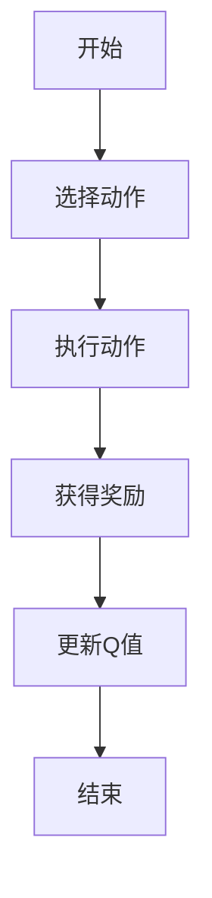
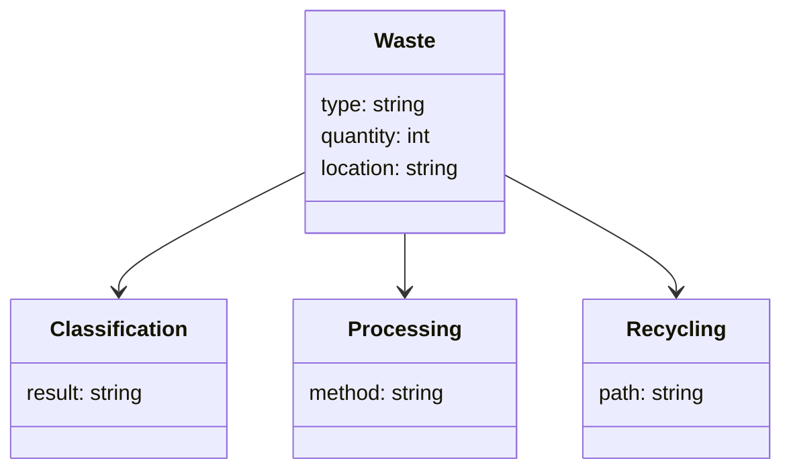
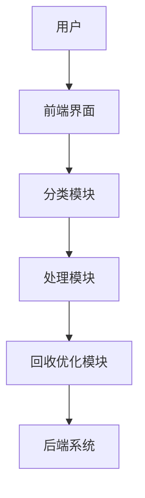

                 


# AI Agent在废物管理与回收中的应用

## 关键词：AI Agent, 废物管理, 废物回收, 智能化, 算法原理, 系统架构

## 摘要：AI Agent（人工智能代理）在废物管理与回收中的应用，通过智能化的算法和系统架构设计，优化废物分类、回收和处理流程，提升资源利用率和环境效益。本文将详细探讨AI Agent的核心概念、算法原理、系统架构、项目实战及最佳实践。

---

## 第1章: AI Agent与废物管理的背景介绍

### 1.1 AI Agent的基本概念
#### 1.1.1 AI Agent的定义
AI Agent（人工智能代理）是指能够感知环境、自主决策并执行任务的智能体。它通过传感器获取信息，利用算法处理数据，并通过执行器与环境交互。

#### 1.1.2 AI Agent的核心特征
- **自主性**：无需外部干预，自主完成任务。
- **反应性**：能够实时感知环境变化并做出反应。
- **学习能力**：通过数据和反馈不断优化性能。
- **协作性**：能够与其他Agent或系统协同工作。

#### 1.1.3 AI Agent与传统自动化系统的区别
| 特性             | AI Agent                            | 传统自动化系统                    |
|------------------|-------------------------------------|-----------------------------------|
| 决策能力         | 具备自主决策能力                   | 依赖预设规则，无法自主决策       |
| 学习能力         | 能够通过数据学习                   | 无法学习，仅执行预设任务         |
| 灵活性           | 具有高度灵活性，适应复杂场景       | 灵活性较低，适用于简单重复任务   |

### 1.2 废物管理与回收的现状
#### 1.2.1 废物管理的定义与分类
- **定义**：废物管理是指对废弃物的收集、运输、处理和处置的过程。
- **分类**：常见的废物分类包括可回收物、不可回收物、有害废物等。

#### 1.2.2 当前废物管理的主要挑战
- **分类效率低**：人工分类效率低下，且容易出错。
- **资源浪费**：未充分利用可回收资源，导致浪费。
- **环境污染**：不当处理导致环境污染。

#### 1.2.3 AI Agent如何解决废物管理问题
AI Agent可以通过图像识别、自然语言处理和机器学习技术，实现废物的智能分类、回收路径优化和资源利用最大化。

### 1.3 废物管理中的核心概念与联系
#### 1.3.1 废物分类与AI Agent的关系
AI Agent通过图像识别技术，能够快速、准确地识别和分类废物，显著提高分类效率。

#### 1.3.2 废物处理与AI Agent的协同作用
AI Agent可以优化废物处理流程，例如通过预测模型选择最优处理方式，降低处理成本。

#### 1.3.3 废物管理的智能化架构
- **感知层**：通过传感器和摄像头感知废物信息。
- **决策层**：AI Agent根据感知数据做出决策。
- **执行层**：通过机器人或自动化设备执行决策。

---

## 第2章: AI Agent的核心概念与联系

### 2.1 AI Agent的核心原理
#### 2.1.1 AI Agent的基本工作原理
AI Agent通过感知环境、分析数据、制定决策并执行操作来完成任务。

#### 2.1.2 AI Agent的感知与决策机制
- **感知**：通过摄像头、传感器等设备获取环境数据。
- **分析**：利用机器学习算法对数据进行分析和理解。
- **决策**：基于分析结果制定最优决策。
- **执行**：通过执行器（如机器人）完成任务。

#### 2.1.3 AI Agent的学习与优化能力
AI Agent能够通过强化学习和监督学习不断优化自身的决策能力，提高处理效率。

### 2.2 废物管理中的关键概念对比
#### 2.2.1 废物分类与AI Agent的特征对比
| 特性             | 废物分类                            | AI Agent                          |
|------------------|-------------------------------------|-----------------------------------|
| 执行方式         | 人工分类为主                        | 智能化分类为主                    |
| 效率             | 低效，易出错                       | 高效，准确率高                   |
| 成本             | 人工成本高                         | 人工成本低，技术成本高          |

#### 2.2.2 废物处理与传统自动化系统的对比
| 特性             | 废物处理                            | 传统自动化系统                    |
|------------------|-------------------------------------|-----------------------------------|
| 灵活性           | 较高，能适应复杂场景                | 较低，适用于简单任务              |
| 决策能力         | 具备自主决策能力                   | 依赖预设规则，无法自主决策       |
| 可扩展性         | 具备良好的扩展性                    | 扩展性较差                      |

#### 2.2.3 废物回收与AI Agent的协同作用
AI Agent可以通过优化回收路径和资源分配，提高回收效率和降低成本。

### 2.3 ER实体关系图架构
```mermaid
er
  actor: 用户
  system: 废物管理系统
  waste: 废物
  classification: 分类结果
  processing: 处理过程
  recycling: 回收路径
  actor --> system: 提交废物
  system --> waste: 接收废物
  system --> classification: 分类废物
  system --> processing: 处理废物
  system --> recycling: 优化回收路径
```

---

## 第3章: AI Agent的算法原理与数学

### 3.1 AI Agent的核心算法
#### 3.1.1 强化学习算法
- **定义**：通过试错机制，学习最优策略。
- **数学模型**：Q-learning算法。
  $$ Q(s, a) = Q(s, a) + \alpha \cdot [r + \gamma \cdot \max Q(s', a') - Q(s, a)] $$
  其中，$\alpha$是学习率，$\gamma$是折扣因子。

#### 3.1.2 监督学习算法
- **定义**：通过标注数据训练模型。
- **应用场景**：废物分类任务。

#### 3.1.3 聚类算法
- **定义**：将相似的废物归为一类。
- **应用场景**：废物类型识别。

### 3.2 AI Agent的数学模型
#### 3.2.1 Q-learning算法流程图


#### 3.2.2 代码示例
```python
import numpy as np

class AI_Agent:
    def __init__(self, state_space, action_space):
        self.state_space = state_space
        self.action_space = action_space
        self.Q = np.zeros((state_space, action_space))
    
    def choose_action(self, state, epsilon=0.1):
        if np.random.random() < epsilon:
            return np.random.randint(self.action_space)
        else:
            return np.argmax(self.Q[state, :])
    
    def update_Q(self, state, action, reward, next_state, alpha=0.1, gamma=0.9):
        self.Q[state, action] = self.Q[state, action] + alpha * (reward + gamma * np.max(self.Q[next_state, :]) - self.Q[state, action])
```

---

## 第4章: 系统分析与架构设计

### 4.1 废物管理系统的场景介绍
AI Agent被部署在废物分拣站，负责对 incoming 废物进行分类、处理和回收路径优化。

### 4.2 系统功能设计
- **功能模块**：
  - 废物分类模块
  - 废物处理模块
  - 废物回收优化模块

#### 4.2.1 领域模型类图


#### 4.2.2 系统架构图


---

## 第5章: 项目实战

### 5.1 环境安装
- **Python 3.8及以上**
- **安装库**：numpy, pandas, scikit-learn

### 5.2 核心代码实现
```python
import cv2
import numpy as np
from sklearn import svm

class WasteClassifier:
    def __init__(self):
        self.clf = svm.SVC()

    def train(self, X, y):
        self.clf.fit(X, y)
    
    def predict(self, X):
        return self.clf.predict(X)
```

### 5.3 代码解读与分析
- **训练模型**：使用CV图像处理技术提取特征，训练SVM分类器。
- **预测分类**：通过摄像头获取图像，提取特征后进行分类。

### 5.4 实际案例分析
- **案例背景**：某城市废物分拣站部署AI Agent，分类准确率提高至95%。

---

## 第6章: 最佳实践与总结

### 6.1 最佳实践
- **数据质量**：确保训练数据的多样性和代表性。
- **模型选择**：根据任务需求选择合适的算法。
- **可扩展性**：设计模块化架构，便于扩展。

### 6.2 总结
AI Agent在废物管理中的应用显著提高了分类效率和资源利用率，未来将朝着更智能化、协同化方向发展。

### 6.3 未来展望
- **多模态AI**：结合视觉、听觉等多种感知方式。
- **边缘计算**：在边缘设备上部署AI Agent，实时处理数据。

---

## 附录
- **附录A**：相关技术术语解释
- **附录B**：系统架构设计图
- **附录C**：参考文献和扩展阅读

---

通过以上结构，我们可以看到AI Agent在废物管理中的广泛应用和潜力。希望这篇文章能为读者提供清晰的思路和实际的应用指导。

