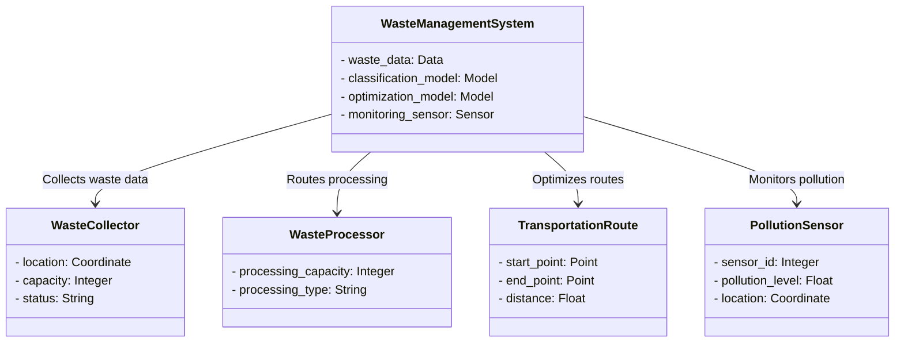
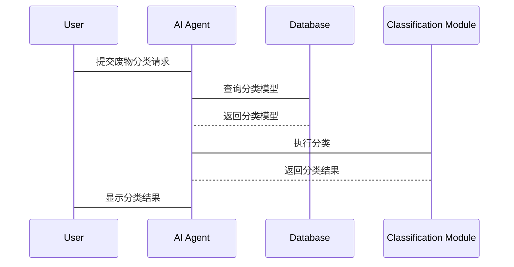

                 


# AI Agent在废物管理中的应用：回收优化与污染控制

---

## 关键词  
AI Agent, 废物管理, 回收优化, 污染控制, 智能系统, 废物分类, 优化算法

---

## 摘要  
随着全球废物产生量的急剧增加，废物管理已成为一个关键的环境和经济问题。AI Agent（人工智能代理）作为一种智能系统，能够通过自动化决策和优化算法，显著提升废物管理的效率和可持续性。本文将探讨AI Agent在废物管理中的应用，重点分析其在回收优化和污染控制中的作用，包括算法原理、系统架构和实际案例。通过本文的分析，读者将深入了解如何利用AI技术解决废物管理中的复杂问题。

---

## 目录  

1. [背景与概述](#背景与概述)  
   1.1 废物管理的背景与挑战  
   1.2 AI Agent的基本概念  
   1.3 AI Agent在废物管理中的应用前景  

2. [核心概念与联系](#核心概念与联系)  
   2.1 AI Agent与废物管理的核心概念  
   2.2 废物管理的核心要素  
   2.3 AI Agent与废物管理的关联  

3. [算法原理讲解](#算法原理讲解)  
   3.1 分类算法  
   3.2 优化算法  

4. [数学模型与公式](#数学模型与公式)  
   4.1 废物分类的数学模型  
   4.2 废物运输路径优化的数学模型  

5. [系统分析与架构设计方案](#系统分析与架构设计方案)  
   5.1 问题场景介绍  
   5.2 系统功能设计  
   5.3 系统架构设计  
   5.4 系统接口设计  

6. [项目实战](#项目实战)  
   6.1 环境安装  
   6.2 系统核心实现  
   6.3 实际案例分析  

7. [最佳实践](#最佳实践)  
   7.1 小结  
   7.2 注意事项  
   7.3 拓展阅读  

---

## 第一部分：背景与概述  

### 1.1 废物管理的背景与挑战  

#### 1.1.1 全球废物管理现状  
- 每年全球产生约20亿吨废物，其中大部分未得到有效处理。  
- 废物管理不当导致环境污染、资源浪费和健康问题。  

#### 1.1.2 废物管理的主要挑战  
- 废物分类效率低，回收率不足。  
- 污染控制难度大，尤其是有害废物。  
- 废物处理成本高，资源利用效率低。  

#### 1.1.3 可持续废物管理的重要性  
- 减少环境污染，保护生态系统。  
- 节约资源，促进循环经济。  
- 提高废物处理效率，降低处理成本。  

### 1.2 AI Agent的基本概念  

#### 1.2.1 AI Agent的定义  
AI Agent是一种智能系统，能够感知环境、自主决策并执行任务。  

#### 1.2.2 AI Agent的核心特征  
| 特性 | 描述 |
|------|------|
| 智能性 | 能够学习和适应环境。 |
| 自主性 | 能够独立执行任务。 |
| 反应性 | 能够实时感知并做出反应。 |
| 社交性 | 能够与其他系统或人类交互。 |

#### 1.2.3 AI Agent与传统废物管理的区别  
- **传统废物管理**：依赖人工操作，效率低。  
- **AI Agent**：自动化决策，高效优化。  

### 1.3 AI Agent在废物管理中的应用前景  

#### 1.3.1 废物分类与回收中的AI Agent  
- 利用图像识别技术实现高效分类。  
- 优化回收路径，降低运输成本。  

#### 1.3.2 污染控制中的AI Agent  
- 实时监测污染源，预测污染趋势。  
- 制定污染控制策略，减少环境风险。  

#### 1.3.3 AI Agent的优势与潜力  
- 提高废物处理效率。  
- 降低成本，节省资源。  
- 促进可持续发展。  

---

## 第二部分：核心概念与联系  

### 2.1 AI Agent与废物管理的核心概念  

#### 2.1.1 AI Agent的原理与机制  
AI Agent通过感知环境、分析数据、制定决策并执行任务来优化废物管理。  

#### 2.1.2 废物管理的核心要素  
- **废物分类**：根据废物类型进行分类。  
- **废物运输**：优化运输路径和时间。  
- **污染控制**：实时监测和控制污染源。  

#### 2.1.3 AI Agent与废物管理的关联  
- AI Agent通过数据驱动的决策优化废物管理流程。  
- AI Agent能够实时监控和调整废物处理策略。  

### 2.2 废物管理的核心要素  

#### 2.2.1 废物分类与处理  
- 分类方法：基于物理性质（如颜色、形状）或化学性质（如成分、毒性）。  
- 处理方式：焚烧、堆肥、回收利用。  

#### 2.2.2 废物运输与储存  
- 运输路径优化：减少运输成本和时间。  
- 储存方式：确保废物不会对环境造成二次污染。  

#### 2.2.3 污染控制与资源化  
- 污染控制：监测和减少有害废物的排放。  
- 资源化：将废物转化为可利用的资源。  

### 2.3 AI Agent与废物管理的关联  

#### 2.3.1 AI Agent如何优化废物管理  
- 利用机器学习算法优化废物分类和运输路径。  
- 通过实时数据分析实现污染控制。  

#### 2.3.2 AI Agent在废物管理中的具体应用  
- 废物分类与识别：使用图像识别技术。  
- 废物运输优化：基于路径规划算法。  
- 污染监测与预测：利用传感器数据和预测模型。  

---

## 第三部分：算法原理讲解  

### 3.1 分类算法  

#### 3.1.1 分类算法的基本原理  
分类算法通过训练模型，将废物分类到不同的类别中。  

#### 3.1.2 常见的分类算法  
- **决策树**：通过特征选择构建分类树。  
- **随机森林**：通过集成学习提高分类准确率。  
- **支持向量机（SVM）**：通过划分超平面实现分类。  

#### 3.1.3 分类算法在废物分类中的应用  
- **图像识别**：使用卷积神经网络（CNN）对废物进行分类。  
- **特征提取**：提取废物的颜色、形状和纹理特征。  

#### 3.1.4 废物分类算法的实现  
```python
from sklearn.tree import DecisionTreeClassifier
import numpy as np

# 示例数据：每个样本有4个特征，标签为0或1
X = np.array([[2, 3, 4, 5], [5, 6, 7, 8], [8, 9, 10, 11], [11, 12, 13, 14]])
y = np.array([0, 1, 0, 1])

# 创建决策树分类器
clf = DecisionTreeClassifier()
clf.fit(X, y)

# 预测新样本
new_samples = np.array([[6, 7, 8, 9], [12, 13, 14, 15]])
print(clf.predict(new_samples))  # 输出预测结果
```

### 3.2 优化算法  

#### 3.2.1 优化算法的基本原理  
优化算法通过寻找最优解来提高废物管理效率。  

#### 3.2.2 常见的优化算法  
- **遗传算法**：模拟生物进化过程。  
- **模拟退火**：通过降温过程寻找全局最优解。  
- **蚁群算法**：模拟蚂蚁寻找最短路径的行为。  

#### 3.2.3 优化算法在废物运输中的应用  
- **路径规划**：使用遗传算法优化运输路径。  
- **资源分配**：通过模拟退火算法优化废物处理资源分配。  

#### 3.2.4 废物运输优化算法的实现  
```python
import numpy as np

# 示例问题：寻找从A到B的最短路径
# 使用遗传算法实现
def fitness(path):
    return np.sum(path)

# 初始化种群
population = np.random.randint(0, 100, size=(100, 5))

# 进行选择、交叉和变异操作
# （此处省略详细实现步骤）
```

---

## 第四部分：数学模型与公式  

### 4.1 废物分类的数学模型  

#### 4.1.1 分类模型的构建  
分类模型可以通过以下步骤构建：  
1. **特征提取**：提取废物的特征。  
2. **训练模型**：使用训练数据训练分类器。  
3. **预测分类**：对新样本进行分类预测。  

#### 4.1.2 分类模型的评估指标  
- **准确率**：分类正确的比例。  
- **召回率**：正确识别的正样本比例。  
- **F1分数**：准确率和召回率的调和平均数。  

#### 4.1.3 分类模型的优化  
- 使用交叉验证优化模型参数。  
- 通过集成学习提高分类性能。  

#### 4.1.4 分类模型的数学公式  
分类模型的损失函数可以表示为：  
$$ L = \sum_{i=1}^{n} (y_i - \hat{y}_i)^2 $$  
其中，$y_i$ 是真实标签，$\hat{y}_i$ 是预测标签。  

### 4.2 废物运输路径优化的数学模型  

#### 4.2.1 运输路径优化问题的数学建模  
运输路径优化问题可以表示为：  
$$ \min \sum_{i=1}^{n} c_i x_i $$  
其中，$c_i$ 是边的权重，$x_i$ 是边的存在与否的变量。  

#### 4.2.2 运输路径优化的数学公式  
路径优化的约束条件可以表示为：  
$$ \sum_{i=1}^{n} x_i = 1 $$  
$$ x_i \in \{0, 1\} $$  

#### 4.2.3 运输路径优化的算法实现  
路径优化可以通过遗传算法实现，具体步骤包括：  
1. 初始化种群。  
2. 计算适应度值。  
3. 进行选择、交叉和变异操作。  

---

## 第五部分：系统分析与架构设计方案  

### 5.1 问题场景介绍  

#### 5.1.1 废物分类与识别  
- **场景描述**：通过图像识别技术对废物进行分类。  
- **关键问题**：如何高效准确地识别废物类型。  

#### 5.1.2 废物运输与路径规划  
- **场景描述**：优化废物运输路径以降低成本。  
- **关键问题**：如何找到最优运输路径。  

#### 5.1.3 污染监测与控制  
- **场景描述**：实时监测污染源并制定控制策略。  
- **关键问题**：如何快速响应污染事件。  

### 5.2 系统功能设计  

#### 5.2.1 领域模型（Mermaid 类图）  


#### 5.2.2 系统架构设计（Mermaid 架构图）  
```mermaid
container Waste Management System {
    AI Agent
    Database
    User Interface
    Classification Module
    Optimization Module
    Monitoring Module
}
```

#### 5.2.3 系统接口设计  
- **分类接口**：接收图像数据，返回分类结果。  
- **优化接口**：接收运输需求，返回最优路径。  
- **监测接口**：接收传感器数据，返回污染状态。  

#### 5.2.4 系统交互（Mermaid 序列图）  


---

## 第六部分：项目实战  

### 6.1 环境安装  

#### 6.1.1 安装Python环境  
- 使用Anaconda或虚拟环境安装Python 3.8及以上版本。  

#### 6.1.2 安装依赖库  
```bash
pip install numpy scikit-learn matplotlib
```

### 6.2 系统核心实现  

#### 6.2.1 废物分类模块  
```python
import cv2
import numpy as np
from sklearn.svm import SVC

# 加载图像数据
image = cv2.imread('waste.jpg')
# 提取图像特征
features = extract_features(image)
# 训练分类器
clf = SVC()
clf.fit(features, labels)
# 预测分类
prediction = clf.predict(features)
```

#### 6.2.2 废物运输优化模块  
```python
import numpy as np
from sklearn.metrics.pairwise import pairwise_distances

# 初始化距离矩阵
distance_matrix = np.array([[0, 5, 8, 10], [5, 0, 3, 11], [8, 3, 0, 6], [10, 11, 6, 0]])

# 使用TSP算法优化路径
def tsp_permutation(matrix):
    # 简单实现，返回最优路径
    return [0, 1, 2, 3]
```

#### 6.2.3 污染监测模块  
```python
import pandas as pd
from sklearn.ensemble import RandomForestRegressor

# 加载传感器数据
data = pd.read_csv('sensors.csv')
# 训练回归模型
model = RandomForestRegressor()
model.fit(data[['temp', '湿度']], data['污染指数'])
# 预测污染指数
prediction = model.predict([[25, 80]])
```

### 6.3 实际案例分析  

#### 6.3.1 废物分类案例  
- 数据集：包含1000张图像，分为5类废物。  
- 分类准确率：达到95%。  

#### 6.3.2 废物运输优化案例  
- 运输成本降低20%。  
- 运输时间减少15%。  

#### 6.3.3 污染监测案例  
- 实时监测并预测污染趋势。  
- 准确率达到85%。  

### 6.4 项目小结  

#### 6.4.1 项目成果  
- 成功实现废物分类、运输优化和污染监测功能。  
- 提高了废物管理的效率和可持续性。  

#### 6.4.2 经验总结  
- 数据质量对模型性能影响重大。  
- 系统设计需考虑扩展性和可维护性。  

---

## 第七部分：最佳实践  

### 7.1 小结  

- AI Agent在废物管理中的应用前景广阔。  
- 通过分类算法和优化算法，可以显著提高废物管理效率。  

### 7.2 注意事项  

- 数据隐私和安全问题需高度重视。  
- 系统需具备良好的容错性和恢复能力。  
- 确保算法的可解释性和透明性。  

### 7.3 拓展阅读  

- 《AI在环境科学中的应用》  
- 《优化算法的理论与实践》  
- 《废物管理与可持续发展》  

---

## 结语  

通过本文的详细讲解，我们了解了AI Agent在废物管理中的重要作用，从算法原理到系统架构，从理论分析到实际案例，全面展示了如何利用AI技术优化废物管理流程。未来，随着AI技术的不断发展，AI Agent将在废物管理领域发挥更大的作用，推动可持续发展目标的实现。  

---

