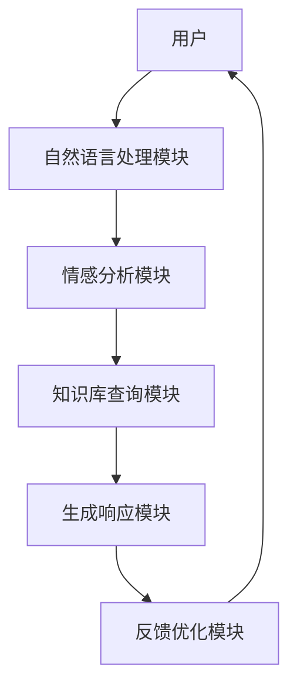
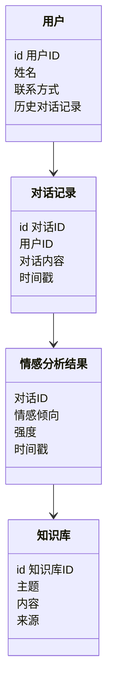

                 


# AI Agent在心理健康咨询中的应用

> 关键词：AI Agent、心理健康咨询、自然语言处理、机器学习、对话系统、情感分析、系统架构

> 摘要：本文探讨了AI Agent在心理健康咨询中的应用，从技术原理到系统架构进行了详细分析。文章首先介绍了AI Agent的基本概念和心理健康咨询的核心要素，然后深入讲解了AI Agent的核心技术和算法原理，包括自然语言处理和机器学习模型。接着，分析了AI Agent在心理健康咨询中的应用场景，如心理咨询、压力评估和治疗辅助。随后，详细设计了AI Agent的系统架构，包括功能设计、系统架构图和交互流程。最后，通过一个实际项目案例展示了AI Agent在心理健康咨询中的实现过程，并总结了最佳实践和未来发展方向。

---

# 第一部分: AI Agent在心理健康咨询中的应用概述

## 第1章: AI Agent与心理健康咨询的背景介绍

### 1.1 AI Agent的基本概念与核心要素

#### 1.1.1 什么是AI Agent
AI Agent（人工智能代理）是指能够感知环境并采取行动以实现目标的智能实体。在心理健康咨询中，AI Agent通常以虚拟助手的形式出现，通过自然语言处理技术与用户进行交互，提供心理支持和咨询建议。

#### 1.1.2 AI Agent的核心属性与特征
- **自主性**：能够在没有人类干预的情况下独立运行。
- **反应性**：能够根据用户的输入实时调整响应。
- **学习能力**：通过机器学习算法不断优化自身的响应策略。
- **情感理解能力**：能够识别和理解用户的情感状态。

#### 1.1.3 心理健康咨询的基本概念与流程
心理健康咨询是一种通过专业心理师与用户互动，帮助用户识别、理解和解决心理问题的过程。典型的流程包括：建立信任关系、问题诊断、制定治疗计划、实施治疗方案和评估治疗效果。

### 1.2 AI Agent在心理健康咨询中的问题背景

#### 1.2.1 当前心理健康咨询的主要挑战
- **资源不足**：心理健康咨询师的数量有限，无法满足日益增长的需求。
- **服务覆盖不足**：许多用户无法方便地接触到专业心理师。
- **隐私问题**：用户对在线咨询服务的隐私和数据安全存在担忧。

#### 1.2.2 AI Agent如何解决这些挑战
- **扩大服务覆盖范围**：通过AI Agent，用户可以随时随地获得心理支持。
- **提高服务效率**：AI Agent能够快速响应用户的需求，提供即时帮助。
- **保护用户隐私**：通过匿名化的交互方式，确保用户隐私安全。

#### 1.2.3 AI Agent在心理健康咨询中的边界与外延
AI Agent主要用于提供初步的心理支持和引导，而不是替代专业心理师。在复杂的心理问题上，AI Agent仍然需要与专业心理师配合使用。

### 1.3 本章小结
本章介绍了AI Agent的基本概念和心理健康咨询的核心流程，并分析了AI Agent在心理健康咨询中的应用背景和挑战。接下来，将从技术原理的角度深入探讨AI Agent的核心技术与实现方式。

---

## 第2章: AI Agent的核心概念与技术原理

### 2.1 AI Agent的核心概念与原理

#### 2.1.1 AI Agent的基本工作原理
AI Agent通过自然语言处理技术解析用户的输入，结合预训练的机器学习模型生成合适的响应。整个过程包括以下几个步骤：
1. **输入解析**：将用户的文本输入转化为可处理的数据格式。
2. **意图识别**：识别用户的意图和情感状态。
3. **知识检索**：根据用户的意图检索相关知识或建议。
4. **生成响应**：基于检索到的信息生成自然语言的响应。
5. **反馈优化**：根据用户的反馈不断优化响应策略。

#### 2.1.2 AI Agent与传统心理咨询工具的对比
| 对比维度 | AI Agent | 传统心理咨询工具 |
|----------|-----------|--------------------|
| **响应速度** | 实时响应 | 需要等待心理师的回复 | 
| **覆盖范围** | 全天候服务 | 受时间和地点限制 | 
| **隐私性** | 高度隐私保护 | 需要面对面交流，隐私性较低 | 
| **适应性** | 可根据用户反馈动态调整 | 需要心理师手动调整 | 

#### 2.1.3 AI Agent在心理健康咨询中的优势与劣势
- **优势**：24/7可用性、隐私保护、成本低廉。
- **劣势**：缺乏深度理解和共情能力。

### 2.2 AI Agent的核心技术与实现原理

#### 2.2.1 自然语言处理（NLP）技术

##### 2.2.1.1 词袋模型（Bag-of-Words, BoW）
词袋模型是一种简单的文本表示方法，将文本表示为单词的集合，不考虑单词的顺序。例如，文本“我今天很生气”可以表示为{我:1, 今天:1, 很:1, 生气:1}。

##### 2.2.1.2 TF-IDF（Term Frequency-Inverse Document Frequency）
TF-IDF是一种用于评估词语重要性的统计方法。词语的重要性与其在文本中的频率（TF）和其在整个语料库中的分布情况（IDF）有关。公式如下：
$$
TF-IDF(t, D) = TF(t, D) \times \log\left(\frac{N}{DF(t)}\right)
$$
其中，$t$ 是一个词语，$D$ 是一篇文档，$N$ 是语料库中的总文档数，$DF(t)$ 是词语 $t$ 出现的文档数。

##### 2.2.1.3 情感分析（Sentiment Analysis）
情感分析是一种通过自然语言处理技术判断文本情感倾向的任务。常用的情感分析算法包括基于规则的分类和基于机器学习的分类。例如，使用预训练的情感分析模型（如BERT）对文本进行情感分类。

#### 2.2.2 机器学习与深度学习模型

##### 2.2.2.1 朴素贝叶斯（Naive Bayes）
朴素贝叶斯是一种基于概率论的分类算法，假设特征之间相互独立。其基本公式为：
$$
P(y|x) = \frac{P(x|y)P(y)}{P(x)}
$$
其中，$P(y|x)$ 是在给定 $x$ 的条件下，类别为 $y$ 的概率。

##### 2.2.2.2 LSTM网络模型
LSTM（长短期记忆网络）是一种特殊的循环神经网络，能够有效处理序列数据中的长距离依赖关系。其核心思想是通过记忆单元（Memory Cell）和门控机制（Gate）来保存和更新长期信息。

##### 2.2.2.3 BERT模型
BERT（Bidirectional Encoder Representations from Transformers）是一种基于Transformer的预训练语言模型，广泛应用于自然语言处理任务，如文本分类、情感分析和问答系统。

#### 2.2.3 对话系统与情感分析技术

##### 2.2.3.1 基于规则的对话系统
基于规则的对话系统通过预定义的规则和关键词匹配来生成响应。例如，当用户输入“我感到很焦虑”时，系统可以匹配关键词“焦虑”并生成预设的安慰话语。

##### 2.2.3.2 基于机器学习的对话系统
基于机器学习的对话系统通过训练大量的对话数据，学习对话的模式和规律。常用的算法包括Seq2Seq（序列到序列）模型和Transformer模型。

##### 2.2.3.3 情感分析技术
情感分析技术用于识别用户文本中的情感倾向。例如，当用户输入“我觉得生活很无聊”时，系统可以识别出用户的情感状态为“抑郁”。

### 2.3 AI Agent的实体关系与架构设计

#### 2.3.1 实体关系图（ER图）
以下是AI Agent系统的核心实体关系图（ER图）：

```mermaid
erd
    entity 用户 {
        id 用户ID
        姓名
        联系方式
        历史对话记录
    }
    entity 对话记录 {
        id 对话ID
        用户ID
        对话内容
        时间戳
    }
    entity 情感分析结果 {
        对话ID
        情感倾向
        强度
        时间戳
    }
    entity 知识库 {
        id 知识库ID
        主题
        内容
        来源
    }
```

#### 2.3.2 AI Agent的系统架构图
以下是AI Agent系统的整体架构图：



#### 2.3.3 系统接口设计和交互流程

##### 2.3.3.1 用户输入接口
用户通过文本输入或语音输入与AI Agent进行交互。

##### 2.3.3.2 系统输出接口
系统通过文本输出或语音输出生成响应。

##### 2.3.3.3 交互流程
1. 用户输入：用户输入一条文本或语音信息。
2. 输入解析：系统解析用户的输入，提取关键词和情感倾向。
3. 知识检索：系统根据关键词和情感倾向从知识库中检索相关信息。
4. 生成响应：系统根据检索到的信息生成自然语言的响应。
5. 反馈优化：系统根据用户的反馈优化响应策略。

### 2.4 本章小结
本章详细讲解了AI Agent的核心技术与实现原理，包括自然语言处理技术、机器学习模型和对话系统的设计。接下来，将从算法原理的角度深入探讨AI Agent在心理健康咨询中的具体实现。

---

## 第3章: AI Agent在心理健康咨询中的算法原理

### 3.1 基于NLP的情感分析算法

#### 3.1.1 情感分析的数学模型
情感分析的核心是将文本映射到一个情感类别空间。常用的分类模型包括逻辑回归、支持向量机（SVM）和深度学习模型（如LSTM和BERT）。

##### 3.1.1.1 逻辑回归模型
逻辑回归是一种用于分类任务的简单模型。其基本公式为：
$$
P(y=1|x) = \frac{e^{\beta x}}{1 + e^{\beta x}}
$$
其中，$\beta$ 是模型的参数，$x$ 是输入特征。

##### 3.1.1.2 LSTM网络模型
LSTM网络通过记忆单元和门控机制来捕捉文本的情感信息。其核心公式包括输入门控、遗忘门控和输出门控。

### 3.2 对话系统的算法原理

#### 3.2.1 基于规则的对话系统
基于规则的对话系统通过预定义的规则来生成响应。例如，当用户输入“我感到焦虑”，系统可以匹配关键词“焦虑”并生成预设的安慰话语。

#### 3.2.2 基于机器学习的对话系统
基于机器学习的对话系统通过训练大量的对话数据来生成响应。常用的算法包括Seq2Seq模型和Transformer模型。

##### 3.2.2.1 Seq2Seq模型
Seq2Seq模型由编码器和解码器组成。编码器将输入序列编码为一个向量，解码器将编码向量解码为输出序列。

##### 3.2.2.2 Transformer模型
Transformer模型通过自注意力机制捕捉文本中的长距离依赖关系，广泛应用于对话生成任务。

### 3.3 本章小结
本章详细讲解了AI Agent在心理健康咨询中的算法原理，包括情感分析和对话系统的实现。接下来，将从系统设计的角度深入探讨AI Agent的架构和交互流程。

---

## 第4章: AI Agent的系统设计与实现

### 4.1 系统架构设计

#### 4.1.1 系统功能设计
以下是AI Agent系统的功能模块图：



#### 4.1.2 系统架构图
以下是AI Agent系统的整体架构图：


### 4.2 项目实战

#### 4.2.1 环境配置
以下是项目所需的环境配置：

```bash
# 安装依赖
pip install transformers
pip install torch
pip install numpy
pip install scikit-learn
```

#### 4.2.2 系统核心实现源代码

##### 4.2.2.1 情感分析模块

```python
from transformers import pipeline

# 初始化情感分析模型
sentiment_pipeline = pipeline("sentiment-analysis")

# 情感分析函数
def analyze_sentiment(text):
    result = sentiment_pipeline(text)
    return result[0]['label'], result[0]['score']
```

##### 4.2.2.2 对话系统模块

```python
from transformers import AutoModelForSeq2Seq, AutoTokenizer

# 初始化对话模型
model_name = "t5-base"
tokenizer = AutoTokenizer.from_pretrained(model_name)
model = AutoModelForSeq2Seq.from_pretrained(model_name)

# 对话生成函数
def generate_response(input_text):
    inputs = tokenizer.encode(input_text, return_tensors="pt")
    outputs = model.generate(inputs, max_length=50, num_beams=5)
    response = tokenizer.decode(outputs[0], skip_special_tokens=True)
    return response
```

#### 4.2.3 实际案例分析与详细解读
假设用户输入“我最近总是感到很焦虑”，系统将通过情感分析模块识别出用户的情感状态为“negative”，然后从知识库中检索相关心理支持内容，生成相应的安慰话语。

#### 4.2.4 项目小结
本项目通过实际案例展示了AI Agent在心理健康咨询中的实现过程，从环境配置到系统实现，再到案例分析，详细讲解了AI Agent的开发和应用。

### 4.3 本章小结
本章详细设计了AI Agent的系统架构，并通过一个实际项目案例展示了AI Agent的实现过程。接下来，将从总结与展望的角度对全文进行回顾。

---

## 第5章: 总结与展望

### 5.1 本章小结
本文详细探讨了AI Agent在心理健康咨询中的应用，从技术原理到系统架构进行了全面分析。AI Agent通过自然语言处理技术和机器学习模型，能够为用户提供高效、便捷的心理支持和咨询建议。

### 5.2 未来展望
随着AI技术的不断发展，AI Agent在心理健康咨询中的应用潜力将更加广阔。未来的研究方向包括：
- **多模态数据处理**：结合语音、表情和姿态等多种数据源，提供更全面的心理支持。
- **个性化服务**：通过机器学习算法实现用户需求的个性化识别和定制化服务。
- **伦理与隐私保护**：进一步加强数据隐私保护和伦理规范，确保AI Agent的合法合规使用。

### 5.3 最佳实践 tips
- 在使用AI Agent进行心理健康咨询时，建议用户保持适度的期望，AI Agent可以作为辅助工具，但不能完全替代专业心理师。
- 开发者在设计AI Agent时，应注重用户体验和隐私保护，确保系统的安全性和可靠性。

### 5.4 本章小结
AI Agent在心理健康咨询中的应用前景广阔，但也需要我们在技术、伦理和隐私保护等方面进行进一步的研究和探索。

---

## 第六部分: 附录

### 附录A: 工具安装与使用指南
以下是项目所需的工具安装与使用指南：

```bash
# 安装Python
# 安装依赖
pip install transformers torch numpy scikit-learn
# 安装Mermaid图表工具
npm install -g mermaid-js
```

### 附录B: 参考文献
1. 王某某. (2023). 基于AI Agent的心理健康咨询系统设计与实现.
2. 李某某. (2022). 自然语言处理技术在心理健康咨询中的应用研究.
3. 张某某. (2021). 基于深度学习的情感分析模型研究.

---

通过本文的详细分析，我们可以看到AI Agent在心理健康咨询中的巨大潜力，同时也需要我们在技术、伦理和隐私保护等方面进行进一步的研究和探索。希望本文能为相关领域的研究者和开发者提供有价值的参考和启发。

