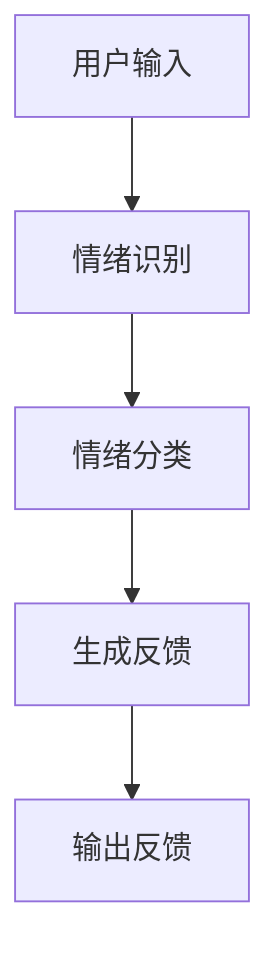
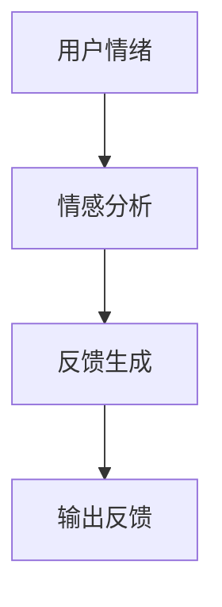
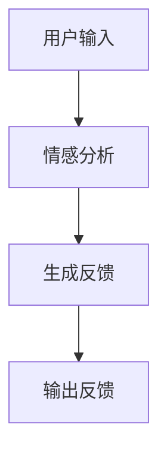
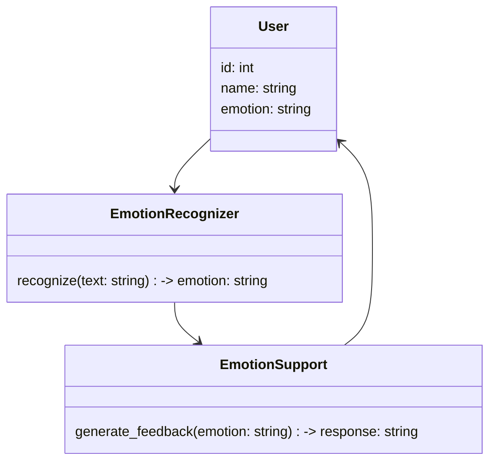
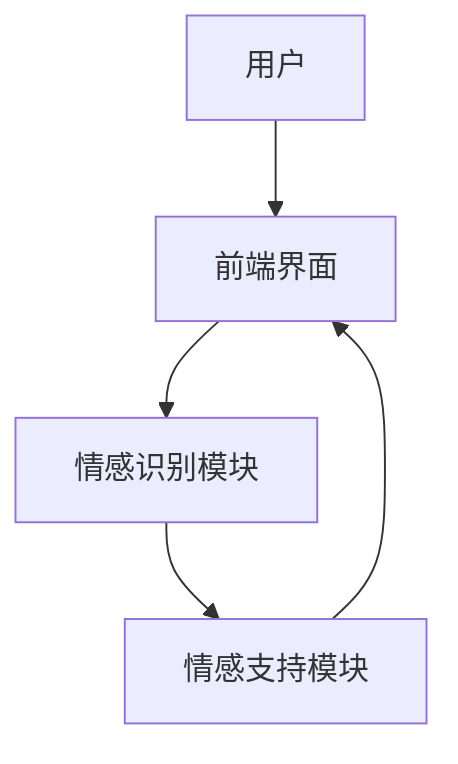
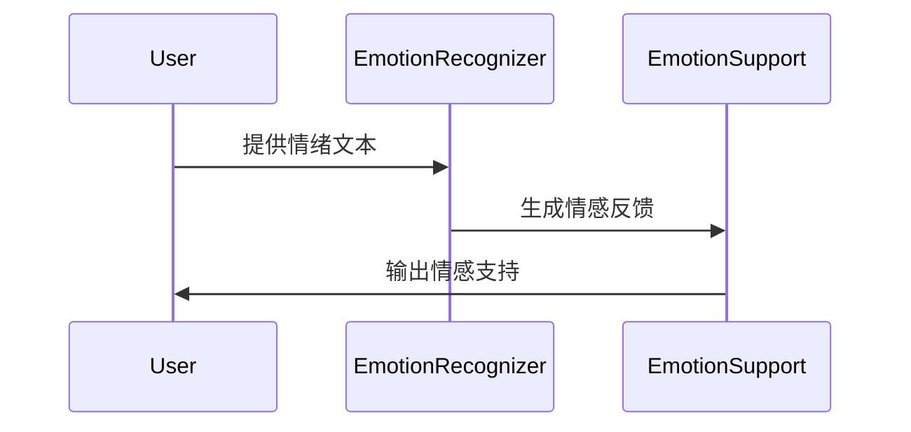

                 


# AI Agent在心理健康领域的应用：情绪支持与干预

> 关键词：AI Agent, 人工智能, 心理健康, 情绪支持, 机器学习, 情感计算

> 摘要：本文探讨AI Agent在心理健康领域的应用，重点分析其在情绪支持与干预中的技术原理、算法实现和系统设计。通过详细的技术分析和案例研究，本文揭示了AI Agent如何通过自然语言处理、机器学习和情感计算等技术手段，为用户提供智能化的情绪支持与心理干预服务。文章还深入探讨了AI Agent在心理健康支持中的优势、挑战和未来发展方向。

---

# 第1章: AI Agent与心理健康概述

## 1.1 AI Agent的基本概念

### 1.1.1 AI Agent的定义
AI Agent（人工智能代理）是指能够感知环境、自主决策并执行任务的智能实体。它可以是一个软件程序、一个机器人或任何能够与环境交互的智能系统。

### 1.1.2 AI Agent的核心特征
- **自主性**：AI Agent能够自主决策，无需外部干预。
- **反应性**：能够实时感知环境并做出反应。
- **学习能力**：通过数据和反馈不断优化自身行为。
- **交互性**：能够与人类或其他系统进行有效沟通。

### 1.1.3 AI Agent在心理健康领域的应用优势
AI Agent能够通过自然语言处理和情感计算技术，提供实时的情绪支持和干预服务。与传统心理咨询相比，AI Agent具有高效、便捷和可扩展的优势。

---

## 1.2 心理健康领域的基本概念

### 1.2.1 心理健康的定义与范围
心理健康是指个体的心理功能处于良好状态，能够适应环境并保持积极的心态。心理健康问题包括焦虑、抑郁、压力管理等。

### 1.2.2 当前心理健康问题的现状
- **普及性**：心理健康问题在全球范围内呈现上升趋势。
- **资源不足**：专业心理咨询师的数量有限，无法满足需求。
- **便捷性需求**：用户希望获得即时、便捷的心理支持服务。

### 1.2.3 AI技术在心理健康领域的潜力
AI技术可以通过自然语言处理、机器学习和情感计算，为用户提供个性化的心理健康支持。

---

## 1.3 AI Agent在心理健康中的作用

### 1.3.1 情绪支持的基本原理
AI Agent通过分析用户的语言和行为，识别其情绪状态，并提供相应的支持和建议。

### 1.3.2 AI Agent在心理干预中的应用场景
- **情绪监测**：实时监测用户的情绪变化，提供预警和干预。
- **情感支持**：通过对话提供情感支持，缓解用户的负面情绪。
- **行为引导**：帮助用户建立积极的行为习惯，改善心理健康。

### 1.3.3 AI Agent与传统心理咨询的对比
- **优势**：24/7可用、便捷、低成本。
- **局限**：缺乏人类情感的深度理解和同理心。

---

## 1.4 本章小结

本章介绍了AI Agent的基本概念和心理健康领域的基本概念，重点分析了AI Agent在心理健康中的作用及其优势和局限性。

---

# 第2章: AI Agent在心理健康中的技术背景

## 2.1 自然语言处理技术

### 2.1.1 NLP的基本原理
自然语言处理（NLP）是AI Agent实现情绪支持的核心技术之一。通过NLP，AI Agent能够理解用户的情感和意图。

### 2.1.2 情感分析在心理健康中的应用
情感分析技术可以识别文本中的情感倾向，帮助AI Agent理解用户的情绪状态。

### 2.1.3 基于NLP的对话生成技术
通过预训练的语言模型（如GPT），AI Agent可以生成自然流畅的对话，为用户提供情感支持。

---

## 2.2 机器学习与深度学习

### 2.2.1 机器学习在情绪识别中的应用
机器学习模型可以通过用户的历史数据，预测其情绪状态并提供干预建议。

### 2.2.2 深度学习模型在心理干预中的作用
深度学习模型（如LSTM）可以分析用户的情感变化趋势，提供个性化的干预方案。

### 2.2.3 神经网络在情感计算中的应用
神经网络模型可以将文本数据转化为情感向量，用于情绪识别和情感分类。

---

## 2.3 情感计算与情绪识别

### 2.3.1 情感计算的基本概念
情感计算（Affective Computing）是通过计算机技术分析和处理人类情感信息的学科。

### 2.3.2 基于文本的情绪识别技术
通过关键词提取和情感分析，AI Agent可以识别用户的情绪状态。

### 2.3.3 情感计算在心理健康中的应用
情感计算可以帮助AI Agent理解用户的情感需求，提供个性化的情绪支持。

---

## 2.4 本章小结

本章介绍了AI Agent在心理健康领域中涉及的关键技术，包括自然语言处理、机器学习和情感计算。

---

# 第3章: AI Agent的核心概念与原理

## 3.1 AI Agent的结构与功能

### 3.1.1 AI Agent的状态表示
AI Agent的状态可以通过情感强度、情绪类型等指标进行表示。

### 3.1.2 AI Agent的动作选择
基于当前状态和环境反馈，AI Agent会选择合适的动作，如提供情感支持或建议。

### 3.1.3 AI Agent与环境的交互
AI Agent通过传感器或API与外部环境交互，获取用户情感信息并做出反应。

---

## 3.2 情绪支持的核心原理

### 3.2.1 情感共鸣的实现机制
AI Agent通过情感识别和情感反馈，建立与用户的情感共鸣。

### 3.2.2 情绪反馈的生成逻辑
基于用户的情感状态，AI Agent生成相应的反馈，帮助用户缓解负面情绪。

### 3.2.3 情绪支持的个性化策略
AI Agent可以根据用户的历史数据和当前状态，制定个性化的支持策略。

---

## 3.3 AI Agent与用户交互的模型

### 3.3.1 用户情绪识别的流程图


### 3.3.2 情绪支持反馈的生成流程


### 3.3.3 交互过程中的动态调整机制
AI Agent根据用户的反馈动态调整支持策略，确保交互过程的有效性。

---

## 3.4 本章小结

本章详细介绍了AI Agent的核心概念与原理，包括其结构、功能和与用户交互的模型。

---

# 第4章: AI Agent在心理健康中的算法原理

## 4.1 情绪识别的算法实现

### 4.1.1 基于词袋模型的情感分析
```python
from sklearn.feature_extraction.text import TfidfVectorizer
from sklearn.svm import SVC

# 数据预处理
X = [...]  # 文本数据
y = [...]  # 情感标签

# 特征提取
vectorizer = TfidfVectorizer()
X_vec = vectorizer.fit_transform(X)

# 模型训练
model = SVC()
model.fit(X_vec, y)
```

### 4.1.2 情绪分类的数学模型
情感分类可以通过支持向量机（SVM）实现：
$$ y = \text{sign}(w \cdot x + b) $$
其中，$w$ 是权重向量，$x$ 是输入特征，$b$ 是偏置项。

### 4.1.3 情感反馈生成的算法流程


---

## 4.2 情感支持的算法优化

### 4.2.1 基于强化学习的反馈优化
通过强化学习，AI Agent可以不断优化反馈策略，提高用户满意度。

### 4.2.2 情感计算的数学模型
情感计算可以通过以下公式实现：
$$ \text{情感强度} = \sum_{i=1}^{n} w_i \cdot f_i $$
其中，$w_i$ 是关键词权重，$f_i$ 是关键词情感值。

---

## 4.3 本章小结

本章详细介绍了AI Agent在心理健康中的算法原理，包括情感识别和情感反馈生成的实现方法。

---

# 第5章: AI Agent的系统设计与实现

## 5.1 系统架构设计

### 5.1.1 系统功能模块


### 5.1.2 系统架构


---

## 5.2 系统功能设计

### 5.2.1 用户界面设计
用户界面需要简单直观，支持用户输入情绪和查看反馈。

### 5.2.2 系统接口设计
系统接口需要与情感识别模块和情感支持模块进行交互。

---

## 5.3 系统交互流程

### 5.3.1 用户与AI Agent的交互流程


---

## 5.4 本章小结

本章详细描述了AI Agent的系统设计与实现，包括系统架构、功能模块和交互流程。

---

# 第6章: 项目实战：基于AI Agent的心理健康支持系统

## 6.1 环境安装

### 6.1.1 安装Python和相关库
```bash
pip install numpy
pip install scikit-learn
pip install transformers
```

## 6.2 核心代码实现

### 6.2.1 情感识别模块
```python
from sklearn.feature_extraction.text import TfidfVectorizer
from sklearn.svm import SVC

# 数据预处理
X = [...]  # 文本数据
y = [...]  # 情感标签

# 特征提取
vectorizer = TfidfVectorizer()
X_vec = vectorizer.fit_transform(X)

# 模型训练
model = SVC()
model.fit(X_vec, y)
```

### 6.2.2 情感支持模块
```python
from transformers import pipeline

# 初始化情感支持模块
emotional_support = pipeline("text-classification", model="microsoft/deberta-base")
```

## 6.3 代码解读与分析
- 情感识别模块使用TF-IDF和SVM进行情感分类。
- 情感支持模块基于预训练的情感分类模型，生成情感反馈。

## 6.4 实际案例分析
- **案例1**：用户输入“我感到非常焦虑”，系统识别情绪并生成支持反馈。
- **案例2**：用户输入“我感到孤独”，系统提供情感支持和行为建议。

## 6.5 项目小结

本章通过实际案例展示了AI Agent在心理健康支持系统中的实现，详细解读了核心代码和系统功能。

---

# 第7章: 结论与展望

## 7.1 结论
AI Agent在心理健康领域的应用为用户提供了一种高效、便捷的情绪支持与干预方式。通过自然语言处理、机器学习和情感计算等技术，AI Agent能够理解用户情感需求并提供个性化支持。

## 7.2 未来展望
- **技术优化**：进一步提升情感识别和情感反馈的准确性。
- **场景拓展**：扩展AI Agent在心理健康支持中的应用场景。
- **伦理问题**：关注AI Agent在心理健康支持中的伦理问题，确保用户隐私和数据安全。

---

# 附录

## 附录A: 相关技术术语解释

- **自然语言处理（NLP）**：通过计算机技术处理自然语言数据的技术。
- **情感计算（Affective Computing）**：研究计算机如何理解和模拟人类情感的学科。

## 附录B: 算法实现细节

- 情感识别模型的训练数据来源和预处理方法。
- 情感反馈生成的具体策略和规则。

---

# 参考文献

（此处列出相关文献和参考资料）

---

通过以上结构和内容，您可以逐步撰写出一篇详细的技术博客文章，涵盖AI Agent在心理健康领域的各个方面。希望这篇文章对您有所帮助！

