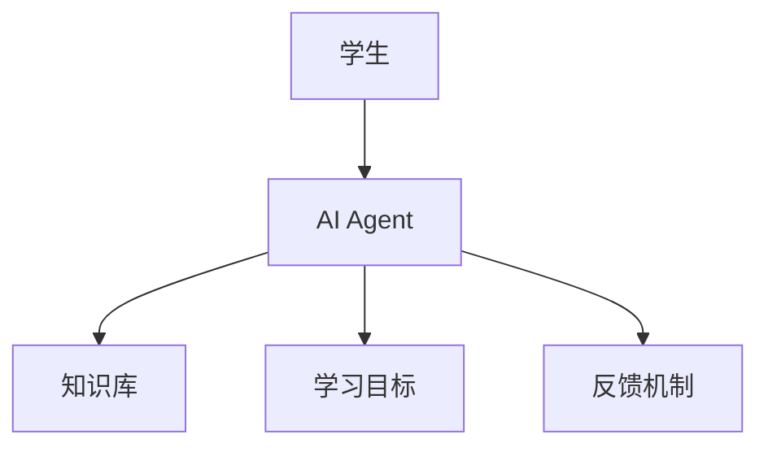
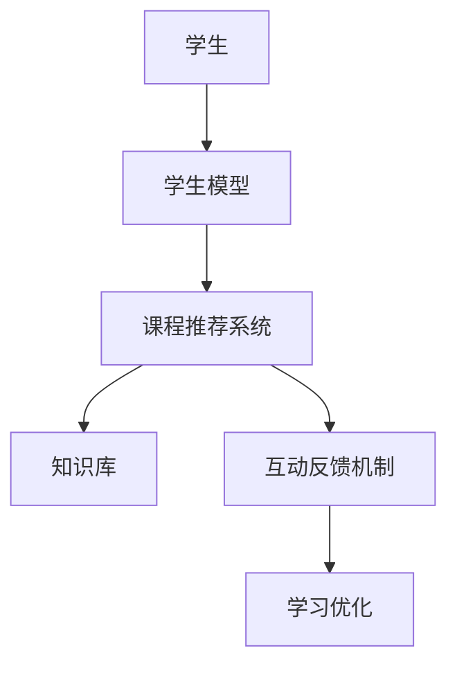
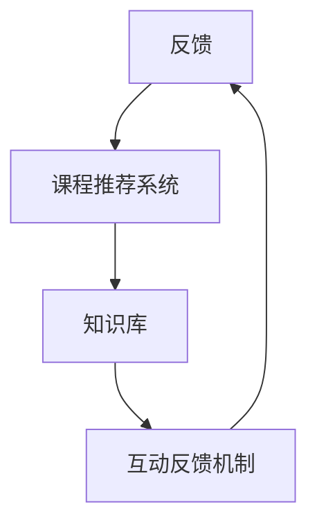

                 


# AI Agent在教育领域的创新应用

## 关键词：
- AI Agent
- 教育技术
- 人工智能
- 教学辅助
- 个性化学习

## 摘要：
AI Agent（人工智能代理）在教育领域的应用正逐步改变传统的教学模式。通过分析学习者的个性化需求，AI Agent能够提供智能化的教学辅助、自适应的学习路径设计以及教育资源的高效管理。本文将从AI Agent的核心概念、算法原理、系统架构设计以及实际项目案例等方面，全面探讨AI Agent在教育领域的创新应用，并结合实际代码实现，深入剖析其技术实现细节和应用价值。

---

# 第一部分: AI Agent在教育领域的背景与核心概念

## 第1章: AI Agent的基本概念与教育应用背景

### 1.1 AI Agent的基本概念

#### 1.1.1 AI Agent的定义
AI Agent是一种能够感知环境、自主决策并执行任务的智能实体。它通过与用户交互或环境数据的输入，利用机器学习算法和知识库进行推理，从而提供个性化的服务或解决方案。AI Agent的核心特征包括智能性、自主性、反应性和社会性。

#### 1.1.2 AI Agent的核心特征
- **智能性**：AI Agent能够理解输入数据并基于知识库进行推理。
- **自主性**：AI Agent能够在没有人工干预的情况下独立执行任务。
- **反应性**：AI Agent能够实时感知环境变化并做出响应。
- **社会性**：AI Agent能够与用户或其他系统进行交互。

#### 1.1.3 AI Agent与传统教育技术的区别
AI Agent与传统教育技术的主要区别在于其智能化和自主性。传统教育技术（如教学管理系统）通常依赖于预定义的规则，而AI Agent能够通过学习和优化不断提升其服务质量和个性化能力。

### 1.2 教育领域的AI Agent应用背景

#### 1.2.1 当前教育领域的技术挑战
- **学生个性化学习需求**：每个学生的知识水平、学习能力和兴趣爱好都不同，传统教学难以满足个性化需求。
- **教师教学效率提升**：教师需要花费大量时间进行备课和批改作业，影响教学效率。
- **教育资源分配不均**：优质教育资源难以覆盖所有地区和学生。

#### 1.2.2 AI Agent在教育中的潜在价值
- **个性化学习路径设计**：AI Agent能够根据学生的学习情况和兴趣推荐个性化学习内容。
- **自动化教学辅助工具**：AI Agent可以自动批改作业、提供反馈并推荐学习资源。
- **智能化教育资源管理**：AI Agent能够优化教育资源配置，确保每个学生都能获得适合的学习材料。

#### 1.2.3 全球AI教育应用的现状与趋势
目前，全球范围内AI教育应用正在快速发展，尤其是在自适应学习、智能辅导系统和教育管理领域。未来，AI Agent将更加智能化，能够实现跨平台的无缝集成，并与虚拟现实、增强现实等技术结合，进一步提升教育体验。

---

## 第2章: AI Agent在教育中的问题背景与需求分析

### 2.1 教育中的核心问题

#### 2.1.1 学生个性化学习需求
每个学生的学习能力、知识水平和兴趣爱好都不同，传统教育模式难以满足个性化学习需求。

#### 2.1.2 教师教学效率提升
教师需要花费大量时间进行备课、批改作业和管理学生，影响教学效率。

#### 2.1.3 教育资源分配不均
优质教育资源往往集中在发达地区，难以覆盖所有学生。

### 2.2 AI Agent在教育中的解决方案

#### 2.2.1 个性化学习路径设计
AI Agent可以根据学生的学习数据和兴趣推荐个性化学习内容，帮助学生高效学习。

#### 2.2.2 自动化教学辅助工具
AI Agent可以自动批改作业、提供反馈并推荐学习资源，减轻教师的工作负担。

#### 2.2.3 智能化教育资源管理
AI Agent能够优化教育资源配置，确保每个学生都能获得适合的学习材料。

### 2.3 AI Agent的边界与外延

#### 2.3.1 AI Agent在教育中的应用范围
AI Agent在教育中的应用范围包括个性化学习、教学辅助、教育资源管理等领域。

#### 2.3.2 AI Agent与其他教育技术的关系
AI Agent可以与虚拟现实、增强现实等技术结合，进一步提升教育体验。

#### 2.3.3 AI Agent的局限性与挑战
- 数据隐私问题：AI Agent需要收集大量学生数据，存在隐私泄露风险。
- 模型泛化能力：AI Agent的性能依赖于数据质量和算法模型，可能存在泛化能力不足的问题。

---

## 第3章: AI Agent的核心概念与原理

### 3.1 AI Agent的核心概念

#### 3.1.1 感知层
AI Agent通过感知层获取环境数据，例如学生的学习行为数据、考试成绩等。

#### 3.1.2 决策层
AI Agent基于感知层获取的数据，利用机器学习算法进行推理和决策，例如推荐个性化学习内容。

#### 3.1.3 执行层
AI Agent根据决策层的指令执行具体任务，例如发送学习建议或自动批改作业。

### 3.2 AI Agent的实体关系图



### 3.3 AI Agent的核心算法原理

#### 3.3.1 强化学习算法
强化学习是一种通过试错机制优化决策的算法，常用于AI Agent的决策层。

- **Q-Learning算法**
  $$ Q(s, a) = r + \gamma \max_{a'} Q(s', a') $$
  其中，\( Q(s, a) \) 表示在状态 \( s \) 下采取动作 \( a \) 的价值，\( r \) 是奖励，\( \gamma \) 是折扣因子。

#### 3.3.2 监督学习算法
监督学习是一种通过标注数据训练模型的算法，常用于AI Agent的感知层。

- **线性回归算法**
  $$ y = \theta_0 + \theta_1 x $$
  其中，\( y \) 是预测值，\( x \) 是输入特征，\( \theta \) 是模型参数。

---

# 第二部分: AI Agent的算法原理与系统架构设计

## 第4章: AI Agent的核心算法实现

### 4.1 强化学习算法的实现

#### 4.1.1 Q-Learning算法的实现步骤
1. 初始化Q值表。
2. 在环境中执行动作，获取奖励。
3. 更新Q值表。
4. 重复步骤2和3，直到达到终止条件。

#### 4.1.2 Q-Learning算法的Python代码实现
```python
import numpy as np

class QLearning:
    def __init__(self, state_space_size, action_space_size, gamma=0.99):
        self.Q = np.zeros((state_space_size, action_space_size))
        self.gamma = gamma

    def update(self, state, action, reward, next_state):
        self.Q[state, action] = reward + self.gamma * np.max(self.Q[next_state])
```

### 4.2 监督学习算法的实现

#### 4.2.1 线性回归算法的实现步骤
1. 初始化模型参数。
2. 计算预测值。
3. 计算损失函数。
4. 更新模型参数。
5. 重复步骤2-4，直到达到终止条件。

#### 4.2.2 线性回归算法的Python代码实现
```python
import numpy as np

class LinearRegression:
    def __init__(self, learning_rate=0.01, iterations=100):
        self.lr = learning_rate
        self.iterations = iterations

    def fit(self, X, y):
        self.theta = np.zeros(X.shape[1])
        for _ in range(self.iterations):
            y_pred = np.dot(X, self.theta)
            gradient = (2 / len(X)) * np.dot(X.T, (y_pred - y))
            self.theta -= self.lr * gradient

    def predict(self, X):
        return np.dot(X, self.theta)
```

---

## 第5章: AI Agent的系统分析与架构设计

### 5.1 系统功能设计

#### 5.1.1 学生模型
学生模型用于记录学生的学习行为、知识水平和兴趣爱好。

#### 5.1.2 课程推荐系统
课程推荐系统基于学生模型推荐个性化学习内容。

#### 5.1.3 互动反馈机制
互动反馈机制用于实时收集学生反馈并优化学习路径。

### 5.2 系统架构设计



### 5.3 系统接口设计

#### 5.3.1 学生信息接口
- 输入：学生ID
- 输出：学生基本信息、学习记录

#### 5.3.2 课程推荐接口
- 输入：学生ID
- 输出：推荐课程列表

### 5.4 系统交互设计



---

## 第6章: 项目实战——基于AI Agent的自适应学习系统

### 6.1 项目环境安装

#### 6.1.1 安装Python和依赖库
```bash
pip install numpy scikit-learn
```

#### 6.1.2 安装机器学习框架
```bash
pip install scikit-learn
```

### 6.2 系统核心代码实现

#### 6.2.1 学生模型实现
```python
class StudentModel:
    def __init__(self):
        self.students = {}

    def add_student(self, student_id, info):
        self.students[student_id] = info

    def get_student_info(self, student_id):
        return self.students.get(student_id, {})
```

#### 6.2.2 课程推荐系统实现
```python
from sklearn.linear_model import LinearRegression

class CourseRecommender:
    def __init__(self):
        self.model = LinearRegression()

    def train(self, X, y):
        self.model.fit(X, y)

    def predict(self, X):
        return self.model.predict(X)
```

### 6.3 代码应用解读与分析

#### 6.3.1 学生模型的应用
学生模型用于记录学生的基本信息和学习记录，帮助系统更好地理解学生的需求。

#### 6.3.2 课程推荐系统的核心逻辑
课程推荐系统基于学生模型中的学习数据，利用机器学习算法推荐个性化学习内容。

### 6.4 实际案例分析

#### 6.4.1 案例背景
某在线教育平台希望通过AI Agent实现个性化学习路径设计。

#### 6.4.2 实施步骤
1. 数据收集：收集学生的学习数据和考试成绩。
2. 模型训练：利用强化学习算法训练推荐模型。
3. 系统部署：将AI Agent集成到在线教育平台。

### 6.5 项目小结

---

## 第三部分: 总结与展望

### 7.1 最佳实践 tips
- 数据隐私保护是AI Agent在教育中的重要考虑因素。
- 在选择AI Agent模型时，需要根据具体需求选择合适的算法。

### 7.2 小结
AI Agent在教育领域的应用前景广阔，通过智能化的学习路径设计和教育资源管理，能够显著提升教学效率和学习效果。

### 7.3 注意事项
- AI Agent的性能依赖于数据质量和算法模型，需要注意模型的泛化能力。
- 数据隐私和安全问题需要高度重视。

### 7.4 拓展阅读
- 《机器学习实战》
- 《深度学习》

---

通过以上内容，我们可以看到AI Agent在教育领域的创新应用具有巨大的潜力，同时也需要我们在技术实现和实际应用中不断探索和优化。

