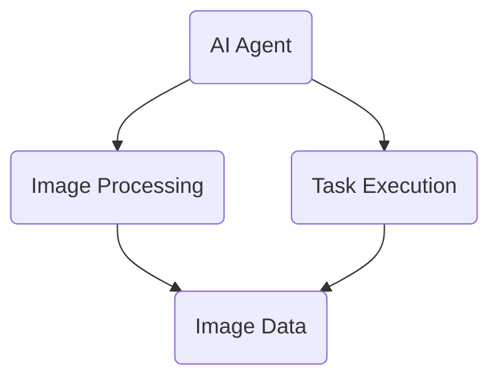
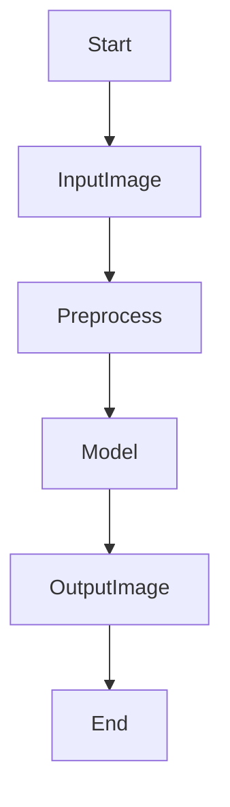
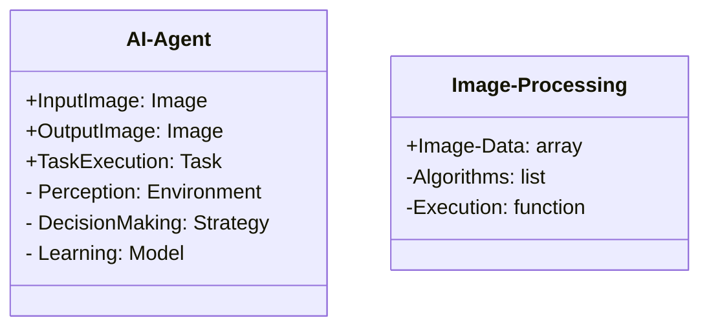
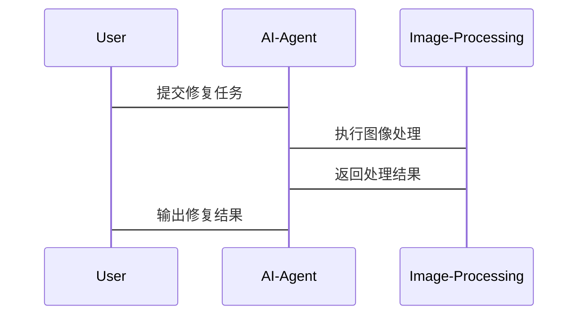

                 


# AI Agent在文物修复中的图像处理应用

> 关键词：AI Agent, 文物修复, 图像处理, 强化学习, 计算机视觉, 文物保护

> 摘要：本文探讨AI Agent在文物修复中的图像处理应用，分析其在文物保护中的作用，介绍AI Agent与图像处理技术的核心概念与算法原理，结合实际案例展示其在文物修复中的应用效果，总结其优势与挑战。

---

# 第1章 背景介绍

## 1.1 问题背景

### 1.1.1 文物修复的现状与挑战

文物修复是一项复杂且耗时的工程，传统方法依赖修复师的经验与技术，但修复师的数量有限，修复过程容易受到主观因素的影响。随着科技的进步，图像处理技术为文物修复提供了新的可能性。然而，如何高效、精准地利用图像处理技术仍是一个挑战。

### 1.1.2 图像处理技术在文物修复中的作用

图像处理技术可以通过去噪、增强、修复等方式改善文物的图像质量，帮助修复师更好地理解文物的状态。然而，传统图像处理技术需要人工干预，效率较低，难以应对大量文物修复需求。

### 1.1.3 AI Agent技术的引入与意义

AI Agent（人工智能代理）能够自主决策和执行任务，结合图像处理技术，可以实现自动化、智能化的文物修复流程。AI Agent在文物修复中的引入，能够提高修复效率，减少人为误差，为文物保护提供新的解决方案。

## 1.2 问题描述

### 1.2.1 文物修复中的图像处理需求

文物修复需要对图像进行去噪、修复缺失部分、增强图像对比度等处理。这些操作通常需要手动完成，效率较低，且容易受到修复师经验的影响。

### 1.2.2 AI Agent在图像处理中的应用目标

通过AI Agent实现图像处理的自动化，提高修复效率，同时保证修复质量。AI Agent需要能够识别图像中的问题区域，选择合适的修复算法，并执行修复操作。

### 1.2.3 问题的边界与外延

AI Agent在文物修复中的应用主要集中在图像处理领域，但修复过程还可能涉及其他技术，如3D建模、材质还原等。本文主要聚焦于图像处理部分。

## 1.3 问题解决

### 1.3.1 AI Agent的核心作用

AI Agent能够自主识别图像中的问题区域，选择合适的算法进行修复，同时能够学习和优化修复策略，提高修复效果。

### 1.3.2 图像处理技术的关键环节

图像处理技术包括图像去噪、图像修复、图像增强等关键环节。这些技术需要结合AI Agent的决策能力，实现智能化的修复过程。

### 1.3.3 AI Agent与图像处理的结合方式

AI Agent通过调用图像处理算法，实现对文物图像的自动修复。修复过程包括图像分割、特征提取、修复算法选择与执行等步骤。

## 1.4 概念结构与核心要素

### 1.4.1 AI Agent的定义与特征

AI Agent是一种能够感知环境、自主决策并执行任务的智能体。其核心特征包括自主性、反应性、目标导向性和学习能力。

### 1.4.2 图像处理技术的核心要素

图像处理技术的核心要素包括图像分割、特征提取、图像增强和修复算法。这些技术能够对图像进行分析和处理，为AI Agent提供支持。

### 1.4.3 两者的结合与系统架构

AI Agent与图像处理技术的结合，形成了一个完整的修复系统。系统包括图像输入、AI Agent决策、图像处理算法执行和修复结果输出等环节。

---

# 第2章 AI Agent与图像处理的核心概念

## 2.1 核心概念原理

### 2.1.1 AI Agent的基本原理

AI Agent通过感知环境、分析任务需求，选择合适的算法和工具，执行修复任务。其核心原理包括感知、决策和执行三个阶段。

### 2.1.2 图像处理技术的基本原理

图像处理技术通过对图像的像素进行操作，实现图像的去噪、增强、修复等功能。其核心原理包括图像分割、特征提取和算法选择。

## 2.2 核心概念属性特征对比

| 特性                | AI Agent                          | 图像处理技术                      |
|---------------------|-----------------------------------|-----------------------------------|
| 自主性              | 高                                | 低                                |
| 反应性              | 高                                | 低                                |
| 目标导向性          | 高                                | 中                                |
| 学习能力            | 高                                | 无                                |

### 2.2.3 ER实体关系图



---

# 第3章 AI Agent在图像处理中的算法原理

## 3.1 算法原理讲解

### 3.1.1 AI Agent的算法流程

AI Agent的算法流程包括图像输入、图像分割、特征提取、修复算法选择与执行、结果输出等步骤。

### 3.1.2 图像处理算法的流程

图像处理算法的流程包括图像预处理、图像分割、特征提取、修复算法选择与执行、结果输出等步骤。

## 3.2 算法流程图



## 3.3 算法实现代码

```python
def preprocess_image(image):
    # 图像预处理代码
    pass

def ai_agent_process(image):
    preprocessed = preprocess(image)
    segmented = segment_image(preprocessed)
    features = extract_features(segmented)
    selected_algorithm = choose_algorithm(features)
    restored_image = apply_algorithm(selected_algorithm, segmented)
    return restored_image
```

---

# 第4章 系统分析与架构设计

## 4.1 系统功能设计

### 4.1.1 领域模型



### 4.1.2 系统架构


### 4.1.3 系统接口设计

系统接口包括图像输入接口、图像处理接口、修复结果输出接口等。

### 4.1.4 系统交互



---

# 第5章 项目实战

## 5.1 环境安装

### 5.1.1 Python环境配置

安装Python和必要的库，如NumPy、OpenCV、TensorFlow等。

### 5.1.2 依赖项管理

使用虚拟环境管理项目依赖，确保所有库版本兼容。

## 5.2 核心实现

### 5.2.1 图像分割

使用深度学习模型（如U-Net）对图像进行分割，识别需要修复的区域。

### 5.2.2 特征提取

提取图像特征，用于选择合适的修复算法。

### 5.2.3 修复算法选择与执行

根据图像特征选择合适的修复算法，执行修复操作。

## 5.3 代码实现

```python
import numpy as np
import cv2
from tensorflow.keras.models import load_model

def segment_image(image):
    model = load_model('segmentation_model.h5')
    return model.predict(image)

def restore_image(image):
    segmented = segment_image(image)
    restored = cv2.inpaint(image, segmented, None, cv2.INPAINT_NS)
    return restored
```

## 5.4 案例分析

### 5.4.1 案例背景

选取一幅受损的文物图像，目标是通过AI Agent实现自动修复。

### 5.4.2 案例分析

修复过程包括图像分割、特征提取、算法选择与执行，最终输出修复后的图像。

## 5.5 项目总结

通过AI Agent实现文物修复的图像处理，能够提高修复效率，减少人为误差，为文物保护提供新的解决方案。

---

# 第6章 最佳实践

## 6.1 小结

AI Agent在文物修复中的图像处理应用，通过自动化、智能化的方式，显著提高了修复效率和质量。

## 6.2 注意事项

修复过程中需要注意图像特征的提取准确性，算法选择的合理性，以及修复结果的可追溯性。

## 6.3 拓展阅读

推荐阅读相关领域的最新论文和文献，深入了解AI Agent和图像处理技术的最新进展。

---

# 附录

## 附录A 术语解释

解释文中涉及的关键术语，如AI Agent、图像处理、修复算法等。

## 附录B 参考文献

列出参考文献和相关资源，供读者进一步查阅。

---

# 结束语

通过本文的介绍，读者可以全面了解AI Agent在文物修复中的图像处理应用，从理论到实践，掌握其核心概念、算法原理和系统架构。希望本文能够为文物保护领域的技术进步提供有价值的参考。

