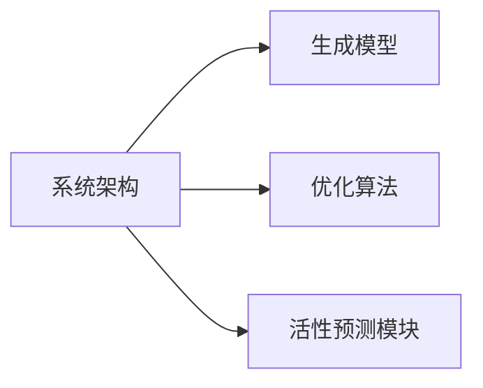

                 


# AI Agent在新药研发中的分子设计应用

## 关键词：AI Agent，新药研发，分子设计，生成模型，强化学习

## 摘要：  
随着人工智能技术的快速发展，AI Agent在新药研发中的应用逐渐成为热点。本文详细探讨了AI Agent在分子设计中的应用，从基本概念、核心算法到系统设计，再到项目实战，全面解析了AI Agent在新药研发中的潜力和实际应用。通过具体案例分析和代码实现，展示了AI Agent在分子生成、优化和活性预测中的强大能力。

---

## 第一部分: AI Agent与新药研发的背景与基础

### 第1章: AI Agent与新药研发概述

#### 1.1 AI Agent的基本概念  
AI Agent（人工智能代理）是一种能够感知环境、执行任务并做出决策的智能体。在新药研发中，AI Agent可以用于分子设计、药物筛选和优化等任务。  

- **AI Agent的核心特点**：  
  - **自主性**：能够独立执行任务。  
  - **反应性**：能够实时感知环境并做出反应。  
  - **目标导向性**：以特定目标为导向，优化分子结构。  

#### 1.2 新药研发的基本流程  
新药研发通常包括药物发现、临床前研究和临床试验三个阶段。分子设计是药物发现的核心环节，AI Agent在这一阶段发挥重要作用。  

- **分子设计在新药研发中的重要性**：  
  - 分子设计决定了药物的药效和安全性。  
  - AI Agent通过生成和优化分子结构，显著提高了药物研发的效率。  

---

### 第2章: AI Agent在分子设计中的核心概念  

#### 2.1 分子设计的基本原理  
分子设计的目标是通过优化分子结构，提高药物的药效和选择性。AI Agent通过生成模型和强化学习等技术实现分子设计。  

- **分子设计的核心目标**：  
  - 提高药物的生物活性。  
  - 减少药物的副作用。  

#### 2.2 AI Agent的核心算法与技术  
AI Agent在分子设计中的应用主要依赖以下技术：  

1. **生成模型**：用于生成新的分子结构。  
2. **强化学习**：用于优化分子结构。  
3. **分子表示方法**：用于将分子转换为计算机可处理的形式。  

---

## 第二部分: AI Agent在分子设计中的算法原理  

### 第3章: 分子生成模型的原理与实现  

#### 3.1 生成模型的基本原理  
生成模型是一种能够生成新数据的模型。在分子设计中，生成模型用于生成新的分子结构。  

- **生成模型的分类与特点**：  
  - **生成对抗网络（GAN）**：通过对抗训练生成分子结构。  
  - **变分自编码器（VAE）**：通过压缩和解压生成分子结构。  

#### 3.2 基于生成对抗网络的分子生成  
生成对抗网络（GAN）由生成器和判别器组成。生成器生成分子结构，判别器判断分子结构是否真实。  

- **GAN的训练流程**：  
  1. 生成器生成分子结构。  
  2. 判别器判断分子结构是否真实。  
  3. 调整生成器和判别器的参数，优化生成效果。  

```mermaid
graph LR
    GAN[生成对抗网络] --> Generator[生成器]
    GAN --> Discriminator[判别器]
    Generator --> X[生成分子结构]
    Discriminator --> D(X)[判断分子结构是否真实]
```

---

### 第4章: 强化学习在分子优化中的应用  

#### 4.1 强化学习的基本原理  
强化学习是一种通过试错学习的方法。在分子设计中，强化学习用于优化分子结构。  

- **强化学习的核心概念**：  
  - **状态**：分子结构的状态。  
  - **动作**：优化分子结构的操作。  
  - **奖励**：优化结果的评价指标。  

#### 4.2 基于强化学习的分子优化  
强化学习通过不断调整分子结构，优化药物的生物活性。  

- **强化学习的优化流程**：  
  1. 初始分子结构。  
  2. 强化学习算法生成新的分子结构。  
  3. 评价新的分子结构，计算奖励。  
  4. 根据奖励调整分子结构。  

```mermaid
graph LR
    RL[强化学习] --> State[分子结构状态]
    RL --> Action[优化操作]
    RL --> Reward[奖励]
    RL --> New State[新分子结构状态]
```

---

## 第三部分: AI Agent在分子设计中的系统架构设计  

### 第5章: 系统分析与架构设计  

#### 5.1 问题场景介绍  
分子设计的目标是生成具有特定药效的分子结构。AI Agent通过生成模型和强化学习实现分子设计。  

- **系统功能设计**：  
  - 分子生成模块：生成新的分子结构。  
  - 分子优化模块：优化分子结构。  
  - 分子活性预测模块：预测分子的生物活性。  

#### 5.2 系统架构设计  
系统架构包括生成模型、优化算法和活性预测模块。  



---

## 第四部分: 项目实战  

### 第6章: 项目实战与分析  

#### 6.1 环境安装  
安装Python和相关库（如TensorFlow、Keras）。  

#### 6.2 系统核心实现源代码  
以下是基于生成对抗网络的分子生成代码示例：  

```python
import tensorflow as tf
from tensorflow.keras.layers import Dense, Input

# 生成器
generator = tf.keras.Sequential([
    Input(shape=(100,)),
    Dense(256, activation='relu'),
    Dense(128, activation='relu'),
    Dense(10, activation='sigmoid')
])

# 判别器
discriminator = tf.keras.Sequential([
    Input(shape=(10,)),
    Dense(128, activation='relu'),
    Dense(1, activation='sigmoid')
])

# 损失函数
cross_entropy = tf.keras.losses.BinaryCrossentropy()

# 生成器损失
def generator_loss(generated_output):
    return cross_entropy(tf.ones_like(generated_output), generated_output)

# 判别器损失
def discriminator_loss(real_output, generated_output):
    real_loss = cross_entropy(tf.ones_like(real_output), real_output)
    generated_loss = cross_entropy(tf.zeros_like(generated_output), generated_output)
    return real_loss + generated_loss

# 优化器
generator_optimizer = tf.keras.optimizers.Adam(0.0002)
discriminator_optimizer = tf.keras.optimizers.Adam(0.0002)

# 训练过程
def train_step(real_molecules, generator, discriminator):
    noise = tf.random.normal([batch_size, 100])
    generated_molecules = generator(noise, training=True)
    real_labels = tf.ones_like(real_molecules)
    generated_labels = tf.zeros_like(generated_molecules)

    generator_loss = generator_loss(generated_molecules)
    discriminator_loss = discriminator_loss(real_molecules, generated_molecules)

    gradients_of_generator = generator_optimizer.compute_gradients(generator_loss, generator.trainable_variables)
    gradients_of_discriminator = discriminator_optimizer.compute_gradients(discriminator_loss, discriminator.trainable_variables)

    generator_optimizer.apply_gradients(gradients_of_generator)
    discriminator_optimizer.apply_gradients(gradients_of_discriminator)
```

#### 6.3 案例分析与解读  
通过实际案例分析，展示了AI Agent在分子设计中的应用。例如，生成具有特定药效的分子结构。  

---

## 第五部分: 最佳实践  

### 第7章: 最佳实践与总结  

#### 7.1 经验总结  
- AI Agent在分子设计中的应用潜力巨大。  
- 生成模型和强化学习是核心算法。  

#### 7.2 小结  
本文详细探讨了AI Agent在新药研发中的分子设计应用，从基本概念到系统设计，再到项目实战，全面解析了AI Agent在分子设计中的潜力和实际应用。  

---

## 第六部分: 拓展阅读  

### 第8章: 拓展阅读与资源  

#### 8.1 深度学习在药物发现中的应用  
- 推荐书籍：《Deep Learning in Drug Discovery》  
- 推荐论文：《Deep Learning for Drug Discovery》  

#### 8.2 AI Agent在药物研发中的未来展望  
AI Agent在药物研发中的应用前景广阔，未来将更加智能化和高效化。  

---

通过以上内容，您可以全面了解AI Agent在新药研发中的分子设计应用，从理论到实践，逐步深入。希望本文对您有所帮助！

