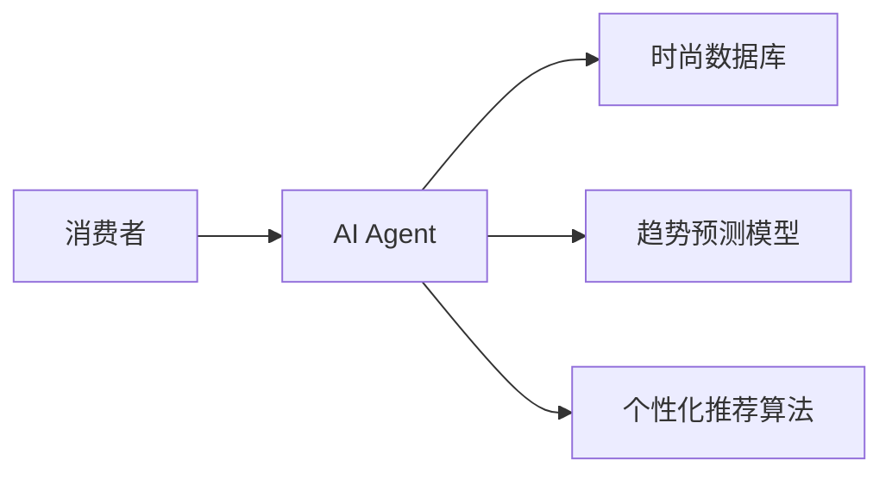
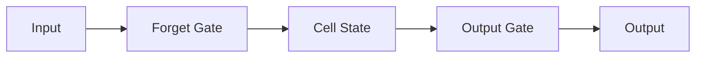
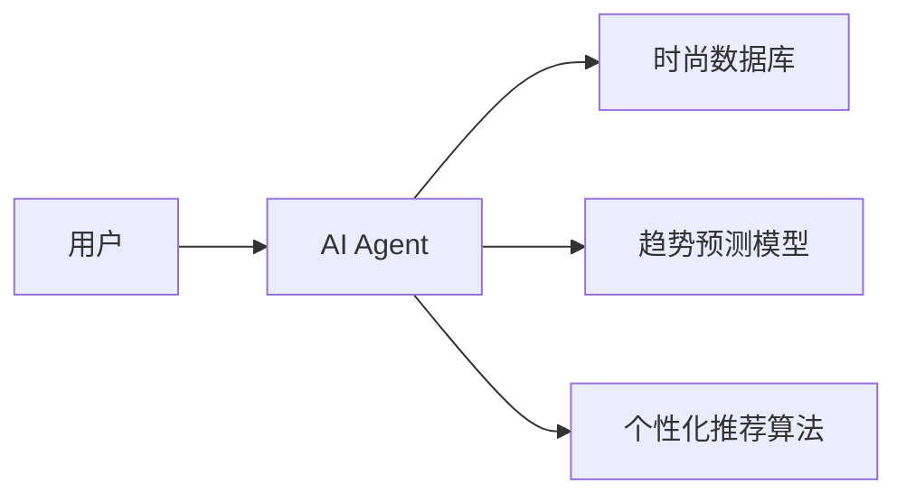
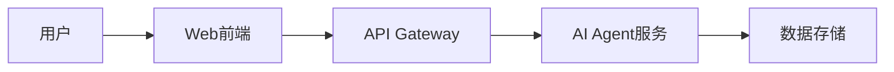
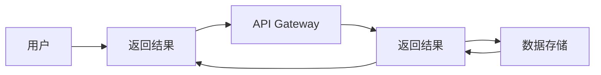

                 


# AI Agent在时尚产业中的应用：趋势预测与个性化搭配

## 关键词：AI Agent、时尚产业、趋势预测、个性化搭配、机器学习

## 摘要：AI Agent在时尚产业中的应用，特别是在趋势预测和个性化搭配方面，通过分析消费者行为、市场趋势和时尚数据，利用机器学习、自然语言处理和计算机视觉等技术，为消费者提供智能化的时尚推荐和搭配建议。本文将详细介绍AI Agent在时尚产业中的核心概念、算法原理、系统架构和实际应用。

---

# 第一部分: AI Agent在时尚产业中的应用概述

## 第1章: AI Agent与时尚产业的结合

### 1.1 AI Agent的基本概念

#### 1.1.1 什么是AI Agent
AI Agent（人工智能代理）是指能够感知环境、执行任务并做出决策的智能系统。它通过学习和推理，能够根据输入的数据生成输出，并与用户或系统进行交互。

#### 1.1.2 AI Agent的核心特点
- **自主性**：能够在没有人工干预的情况下自主执行任务。
- **反应性**：能够实时感知环境并做出反应。
- **学习能力**：能够通过数据和经验不断优化自身的行为。
- **适应性**：能够根据环境的变化调整自身的策略。

#### 1.1.3 AI Agent在时尚产业中的潜力
AI Agent在时尚产业中可以用于趋势预测、个性化推荐、库存管理等多个方面。通过分析消费者的行为和市场趋势，AI Agent能够帮助品牌更好地理解市场需求，优化产品设计和营销策略。

### 1.2 时尚产业的现状与挑战

#### 1.2.1 时尚产业的市场规模与发展趋势
时尚产业是一个庞大的市场，涵盖了服装、鞋类、配饰等多个领域。随着消费者需求的多样化和市场竞争的加剧，时尚产业正在经历从传统模式向数字化、智能化转型的过程。

#### 1.2.2 传统时尚产业的痛点与局限性
- **市场竞争激烈**：品牌众多，消费者选择多样，市场竞争日益激烈。
- **需求变化快**：时尚趋势变化迅速，传统模式难以及时响应。
- **数据利用不足**：许多品牌未能充分利用数据来优化产品设计和营销策略。

#### 1.2.3 技术驱动时尚产业的变革
随着人工智能、大数据和物联网等技术的快速发展，时尚产业正在经历一场技术驱动的变革。通过AI Agent等技术的应用，品牌能够更高效地满足消费者需求，提升用户体验。

### 1.3 AI Agent在时尚产业中的应用前景

#### 1.3.1 趋势预测的核心价值
趋势预测是时尚产业的核心环节之一。通过AI Agent的趋势预测功能，品牌可以更准确地预测下一个季度的流行趋势，从而优化产品设计和生产计划。

#### 1.3.2 个性化搭配的市场需求
消费者越来越注重个性化和定制化服务。通过AI Agent的个性化搭配功能，品牌可以为消费者提供个性化的时尚建议，提升消费者的购买体验。

#### 1.3.3 AI Agent在提升用户体验中的作用
AI Agent通过分析消费者的行为和偏好，能够为消费者提供个性化的推荐和搭配建议，从而提升用户体验和品牌忠诚度。

### 1.4 本章小结
本章介绍了AI Agent的基本概念、时尚产业的现状与挑战以及AI Agent在时尚产业中的应用前景。通过AI Agent的应用，时尚产业可以更高效地满足消费者需求，提升用户体验和品牌竞争力。

---

## 第2章: AI Agent的核心概念与技术原理

### 2.1 AI Agent的核心概念

#### 2.1.1 AI Agent的定义与分类
AI Agent可以根据不同的应用场景和功能进行分类，常见的分类包括：
- **基于规则的AI Agent**：通过预定义的规则进行决策。
- **基于学习的AI Agent**：通过机器学习算法进行自适应决策。
- **基于推理的AI Agent**：通过逻辑推理进行决策。

#### 2.1.2 AI Agent的核心属性与特征
- **感知能力**：能够感知环境并获取数据。
- **推理能力**：能够根据数据进行推理和决策。
- **学习能力**：能够通过数据和经验不断优化自身的行为。
- **交互能力**：能够与用户或系统进行交互。

#### 2.1.3 AI Agent与相关概念的对比
以下是一个对比表格，展示了AI Agent与其他相关概念的区别：

| 概念         | 描述                                                         |
|--------------|--------------------------------------------------------------|
| AI Agent     | 能够感知环境、执行任务并做出决策的智能系统                 |
| 机器学习     | 通过数据训练模型，使其能够进行预测和分类                   |
| 自然语言处理 | 处理和理解人类语言的技术                                     |
| 计算机视觉   | 通过计算机处理和理解视觉信息的技术                           |

### 2.2 AI Agent的实体关系图



### 2.3 AI Agent的核心技术

#### 2.3.1 机器学习
机器学习是AI Agent的核心技术之一。通过机器学习算法，AI Agent可以分析大量的时尚数据，提取特征并进行预测。

#### 2.3.2 自然语言处理
自然语言处理技术可以帮助AI Agent理解消费者的评论和反馈，从而优化推荐算法。

#### 2.3.3 计算机视觉
计算机视觉技术可以用于分析时尚产品的图像，提取颜色、纹理等特征，从而辅助趋势预测。

#### 2.3.4 数据挖掘与分析
数据挖掘与分析技术可以帮助AI Agent从大量的数据中提取有用的信息，支持趋势预测和个性化推荐。

### 2.4 本章小结
本章详细介绍了AI Agent的核心概念、实体关系图以及核心技术。通过这些技术的支持，AI Agent能够实现趋势预测和个性化推荐等功能。

---

## 第3章: AI Agent的算法原理与数学模型

### 3.1 趋势预测算法原理

#### 3.1.1 时间序列分析
时间序列分析是一种常用的趋势预测方法。通过对历史数据的分析，可以预测未来的趋势。

##### 3.1.2 ARIMA模型的原理
ARIMA（自回归积分滑动平均）模型是一种常用的时间序列预测模型。其数学公式如下：

$$ ARIMA(p, d, q) $$

其中，p表示自回归阶数，d表示差分阶数，q表示滑动平均阶数。

##### 3.1.3 LSTM网络的应用
LSTM（长短期记忆网络）是一种深度学习模型，适用于时间序列预测。其结构如下：



### 3.2 个性化推荐算法原理

#### 3.2.1 基于协同过滤的推荐算法
协同过滤是一种常用的推荐算法。通过分析用户的行为和偏好，可以推荐相似用户的商品。

#### 3.2.2 基于内容的推荐算法
内容推荐算法是基于商品本身的特征进行推荐。通过分析商品的描述和属性，可以推荐相似的商品。

#### 3.2.3 深度学习推荐模型
深度学习模型，如神经网络，可以用于推荐系统的优化。通过训练大量的数据，可以提高推荐的准确性。

### 3.3 算法实现与代码示例

#### 3.3.1 时间序列分析的Python代码示例

```python
import numpy as np
from statsmodels.tsa.arima.model import ARIMA
import pandas as pd

# 示例数据
data = pd.Series([1, 2, 3, 4, 5], index=pd.date_range('2023-01-01', periods=5))

# 训练ARIMA模型
model = ARIMA(data, order=(1, 1, 1))
model_fit = model.fit()

# 预测未来值
forecast = model_fit.forecast(steps=5)
print(forecast)
```

#### 3.3.2 LSTM网络的代码示例

```python
import keras
from keras.models import Sequential
from keras.layers import LSTM, Dense

# 示例数据
X = np.random.rand(10, 1, 10)
y = np.random.rand(10, 1)

# 构建LSTM模型
model = Sequential()
model.add(LSTM(5, input_shape=(1, 10)))
model.add(Dense(1))
model.compile(loss='mean_squared_error', optimizer='adam')

# 训练模型
model.fit(X, y, epochs=10, batch_size=1)
```

### 3.4 本章小结
本章详细介绍了AI Agent在趋势预测和个性化推荐中的算法原理和数学模型，并通过代码示例展示了这些算法的实现。

---

## 第4章: AI Agent在时尚产业中的系统架构设计

### 4.1 系统功能设计

#### 4.1.1 领域模型设计
以下是AI Agent系统的领域模型：



#### 4.1.2 系统功能模块
AI Agent系统主要包括以下几个功能模块：
- **数据采集模块**：采集消费者的行为数据和市场趋势数据。
- **数据处理模块**：对数据进行清洗和预处理。
- **模型训练模块**：训练趋势预测和推荐模型。
- **用户交互模块**：与用户进行交互，提供个性化推荐和搭配建议。

### 4.2 系统架构设计

#### 4.2.1 系统架构图
以下是AI Agent系统的架构图：



#### 4.2.2 接口设计
- **API接口**：AI Agent服务提供RESTful API接口，供前端调用。
- **数据库接口**：AI Agent服务与数据库进行交互，存储和检索数据。

#### 4.2.3 交互流程图
以下是AI Agent系统的交互流程图：



### 4.3 本章小结
本章详细介绍了AI Agent系统的功能设计、架构设计和交互流程。

---

## 第5章: 项目实战——AI Agent在时尚产业中的应用

### 5.1 项目背景

#### 5.1.1 项目介绍
本项目旨在利用AI Agent技术，为消费者提供个性化的时尚推荐和搭配建议。

#### 5.1.2 项目目标
- 实现趋势预测功能。
- 实现个性化推荐功能。
- 提供用户友好的交互界面。

### 5.2 项目环境安装

#### 5.2.1 安装Python和相关库
```bash
pip install numpy
pip install pandas
pip install statsmodels
pip install keras
pip install tensorflow
```

### 5.3 项目核心代码实现

#### 5.3.1 趋势预测代码

```python
import numpy as np
from statsmodels.tsa.arima.model import ARIMA
import pandas as pd

# 示例数据
data = pd.Series([1, 2, 3, 4, 5], index=pd.date_range('2023-01-01', periods=5))

# 训练ARIMA模型
model = ARIMA(data, order=(1, 1, 1))
model_fit = model.fit()

# 预测未来值
forecast = model_fit.forecast(steps=5)
print(forecast)
```

#### 5.3.2 个性化推荐代码

```python
import keras
from keras.models import Sequential
from keras.layers import LSTM, Dense

# 示例数据
X = np.random.rand(10, 1, 10)
y = np.random.rand(10, 1)

# 构建LSTM模型
model = Sequential()
model.add(LSTM(5, input_shape=(1, 10)))
model.add(Dense(1))
model.compile(loss='mean_squared_error', optimizer='adam')

# 训练模型
model.fit(X, y, epochs=10, batch_size=1)
```

### 5.4 代码应用解读与分析

#### 5.4.1 趋势预测代码解读
- 数据准备：使用Pandas库读取数据，并生成时间序列数据。
- 模型训练：使用ARIMA模型训练数据。
- 预测结果：输出预测结果。

#### 5.4.2 个性化推荐代码解读
- 数据准备：生成随机数据作为输入和输出。
- 模型构建：使用LSTM网络构建推荐模型。
- 模型训练：训练模型并输出训练结果。

### 5.5 实际案例分析

#### 5.5.1 案例背景
某品牌希望通过AI Agent技术，预测下一个季度的流行颜色，并为消费者提供个性化的搭配建议。

#### 5.5.2 数据分析
通过对历史销售数据和消费者评论的分析，AI Agent预测出蓝色是下一个季度的流行颜色。

#### 5.5.3 推荐结果
AI Agent为消费者推荐了一系列蓝色为主的搭配方案，包括上衣、裤子、鞋子和配饰。

### 5.6 项目小结
本章通过一个实际案例，详细介绍了AI Agent在时尚产业中的应用。通过趋势预测和个性化推荐，品牌可以更精准地满足消费者需求，提升用户体验和品牌竞争力。

---

## 第6章: 最佳实践、小结、注意事项与拓展阅读

### 6.1 最佳实践
- **数据质量**：确保数据的准确性和完整性。
- **模型优化**：通过不断优化模型参数和结构，提高预测准确率。
- **用户体验**：提供用户友好的交互界面和个性化的推荐服务。

### 6.2 小结
通过本章的学习，我们了解了AI Agent在时尚产业中的应用，包括趋势预测和个性化推荐的核心概念、算法原理和系统架构设计。

### 6.3 注意事项
- **数据隐私**：注意保护消费者的隐私数据。
- **模型解释性**：确保模型的可解释性，便于调试和优化。
- **技术局限性**：了解AI Agent技术的局限性，避免过度依赖技术。

### 6.4 拓展阅读
- **相关书籍**：《机器学习实战》、《深度学习入门》。
- **相关论文**：搜索AI Agent在时尚产业中的应用相关论文，了解更多前沿技术。

---

## 结语
通过本文的学习，我们了解了AI Agent在时尚产业中的应用，包括趋势预测和个性化推荐的核心概念、算法原理和系统架构设计。希望本文能够为读者提供有价值的参考和启发，进一步推动AI Agent在时尚产业中的应用和发展。

--- 

**感谢您的耐心阅读！如果本文对您有所帮助，请点赞、收藏并分享给更多需要的朋友！**

