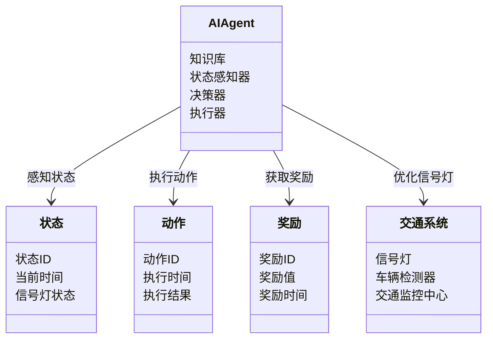
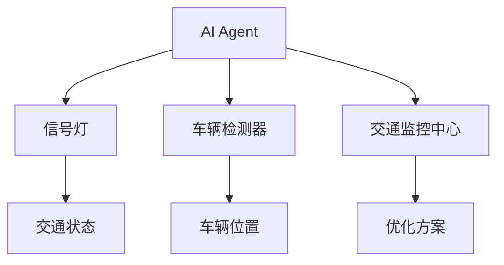
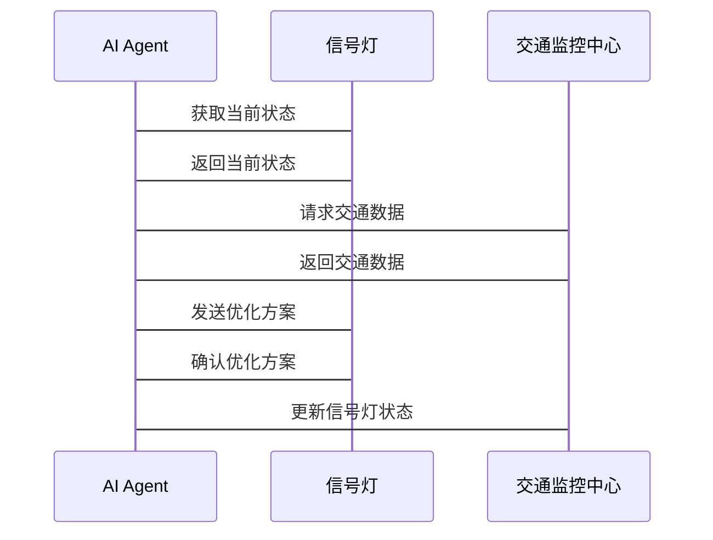

                 


# AI Agent在智慧城市中的应用前景

> 关键词：AI Agent, 智慧城市, 应用前景, 强化学习, 图神经网络, 系统架构

> 摘要：本文探讨了AI Agent在智慧城市建设中的应用前景，分析了AI Agent的核心技术、应用场景，并通过实际案例展示了其在智慧交通和智慧医疗中的潜力。文章从背景介绍、核心技术、系统设计到项目实战，全面阐述了AI Agent在智慧城市中的重要作用和未来发展方向。

---

## 第一部分: AI Agent与智慧城市概述

### 第1章: AI Agent与智慧城市概述

#### 1.1 AI Agent的基本概念

##### 1.1.1 AI Agent的定义
AI Agent（人工智能代理）是指能够感知环境、自主决策并执行任务的智能实体。它通过传感器获取信息，利用算法进行分析，并通过执行器采取行动。AI Agent可以是软件程序，也可以是物理设备，其核心在于智能性。

##### 1.1.2 AI Agent的核心特征
- **自主性**：能够在没有外部干预的情况下自主运作。
- **反应性**：能够实时感知环境并做出反应。
- **目标导向**：基于目标驱动行为，追求最优解决方案。
- **学习能力**：通过数据和经验不断优化性能。

##### 1.1.3 AI Agent与传统软件的区别
传统软件依赖于预设规则，而AI Agent具备学习和适应能力，能够处理复杂和动态的环境。例如，传统的交通信号控制系统是基于固定规则，而AI Agent可以根据实时交通流量动态调整信号。

#### 1.2 智慧城市的基本概念

##### 1.2.1 智慧城市的定义
智慧城市是通过物联网、大数据、人工智能等技术，将城市中的各个系统和资源进行整合，以提高城市运行效率、居民生活质量和社会可持续发展为目标的城市形态。

##### 1.2.2 智慧城市的主要组成部分
- **智能交通系统**：优化交通流量，减少拥堵。
- **智能能源系统**：提高能源利用效率，减少浪费。
- **智能医疗系统**：提升医疗服务质量和效率。
- **智能公共安全系统**：加强城市安全监控，预防和应对突发事件。

##### 1.2.3 智慧城市的发展历程
从20世纪末开始，智慧城市的概念逐渐兴起，随着技术的发展，智慧城市逐步从概念走向实践。近年来，随着人工智能技术的快速发展，智慧城市进入了智能化阶段。

#### 1.3 AI Agent在智慧城市中的作用

##### 1.3.1 AI Agent在智慧城市中的应用场景
- **智能交通管理**：优化交通信号灯，减少拥堵。
- **智能能源管理**：动态调整能源分配，降低消耗。
- **智能医疗**：辅助医生诊断，优化资源配置。

##### 1.3.2 AI Agent对智慧城市发展的推动作用
AI Agent能够提高城市运行效率，降低资源消耗，改善居民生活质量。例如，在智能交通系统中，AI Agent可以实时调整信号灯，减少拥堵，提高交通效率。

##### 1.3.3 AI Agent与智慧城市其他技术的关系
AI Agent是智慧城市的核心技术之一，与物联网、大数据、云计算等技术相互作用，共同推动智慧城市的建设。

#### 1.4 本章小结
本章介绍了AI Agent的基本概念和智慧城市的主要组成部分，分析了AI Agent在智慧城市中的作用及其与其他技术的关系。

---

## 第二部分: AI Agent的核心技术与原理

### 第2章: AI Agent的核心技术

#### 2.1 AI Agent的分类

##### 2.1.1 简单反射式Agent
简单反射式Agent基于当前感知的信息做出反应，没有内部状态。例如，自动门传感器。

##### 2.1.2 基于模型的反射式Agent
基于模型的反射式Agent具有内部状态和模型，能够根据历史信息进行推理。例如，智能空调系统。

##### 2.1.3 目标驱动式Agent
目标驱动式Agent基于预设目标进行决策和行动。例如，自动驾驶汽车。

##### 2.1.4 混合式Agent
混合式Agent结合了多种类型的特点，能够适应复杂的环境。例如，智能助手Siri。

#### 2.2 AI Agent的工作原理

##### 2.2.1 知识表示
知识表示是AI Agent理解和推理的基础。常用的知识表示方法包括语义网络和逻辑推理。例如，使用语义网络表示交通规则。

##### 2.2.2 感知与推理
感知是AI Agent获取环境信息的过程，推理是基于感知信息进行逻辑推理的过程。例如，AI Agent通过摄像头感知交通流量，并通过推理优化信号灯配置。

##### 2.2.3 行为决策
行为决策是AI Agent根据推理结果做出决策的过程。例如，自动驾驶汽车通过决策算法选择最佳行驶路径。

##### 2.2.4 学习与优化
学习是AI Agent通过数据和经验提升性能的过程。优化是通过算法改进决策质量的过程。例如，强化学习算法通过奖励机制优化信号灯配置。

#### 2.3 AI Agent的算法原理

##### 2.3.1 强化学习算法
强化学习是一种通过试错学习优化决策的算法。例如，马尔可夫决策过程（MDP）模型用于优化信号灯配置。

##### 2.3.2 图神经网络
图神经网络是一种处理图结构数据的深度学习算法。例如，用于交通网络中的路径优化。

##### 2.3.3 联合推理与学习
联合推理与学习是结合推理和学习的算法，能够处理复杂任务。例如，医疗诊断系统。

##### 2.3.4 跨领域知识迁移
跨领域知识迁移是将一个领域的知识应用到另一个领域的技术。例如，将图像识别技术应用于交通监控。

#### 2.4 AI Agent的数学模型

##### 2.4.1 强化学习模型
强化学习模型通过状态、动作和奖励进行优化。例如，马尔可夫决策过程的数学模型：

$$ V(s) = \max_{a} [r + V(s')] $$

其中，\( V(s) \) 表示状态 \( s \) 的价值函数，\( r \) 是奖励，\( s' \) 是下一个状态。

##### 2.4.2 图神经网络模型
图神经网络模型用于处理图结构数据。例如，交通网络的节点表示为：

$$ Z = G(x, y) $$

其中，\( G \) 表示图神经网络，\( x \) 和 \( y \) 是输入和输出。

##### 2.4.3 联合推理模型
联合推理模型通过概率推理进行决策。例如，贝叶斯网络的数学表达式为：

$$ P(y|x) = \prod_{i=1}^{n} P(y_i|x) $$

其中，\( P(y|x) \) 表示在条件 \( x \) 下，事件 \( y \) 的概率。

#### 2.5 本章小结
本章详细介绍了AI Agent的分类、工作原理和算法模型，为后续的应用分析奠定了基础。

---

## 第三部分: AI Agent在智慧城市中的应用场景

### 第3章: 智慧交通中的AI Agent应用

#### 3.1 智慧交通概述

##### 3.1.1 智慧交通的定义与目标
智慧交通是通过智能化技术优化交通系统，提高交通效率，减少拥堵和污染。

##### 3.1.2 智慧交通的主要技术
- **智能信号灯**：动态调整信号灯配置。
- **自动驾驶**：实现无人驾驶和交通协调。
- **交通预测**：基于历史数据预测交通流量。

##### 3.1.3 智慧交通的发展现状
目前，智慧交通已经在多个城市试点应用，取得了显著成效。例如，北京市通过AI Agent优化信号灯配置，减少了15%的交通拥堵。

#### 3.2 AI Agent在智慧交通中的应用

##### 3.2.1 智能交通管理
AI Agent通过实时感知交通流量，优化信号灯配置，减少拥堵。例如，使用强化学习算法优化信号灯切换策略。

##### 3.2.2 自动驾驶与交通协调
自动驾驶汽车通过AI Agent与交通系统协同工作，实现无缝连接。例如，车辆与信号灯通信，实现绿灯优先通行。

##### 3.2.3 交通预测与优化
AI Agent通过分析历史数据，预测未来交通流量，优化道路资源分配。例如，基于图神经网络预测交通瓶颈。

##### 3.2.4 交通应急管理
在突发事件发生时，AI Agent能够快速响应，制定应急方案。例如，交通事故发生后，AI Agent动态调整信号灯，疏导交通。

#### 3.3 实际案例分析

##### 3.3.1 智能信号灯优化
某城市通过部署AI Agent优化信号灯配置，减少了15%的拥堵时间。具体实现是通过强化学习算法，动态调整信号灯切换时间。

##### 3.3.2 自动驾驶试点项目
某城市试点自动驾驶汽车，通过AI Agent实现车辆与交通系统的协同工作，减少了交通事故的发生率。

---

## 第四部分: 系统分析与架构设计

### 第4章: AI Agent在智慧城市中的系统架构

#### 4.1 问题场景介绍
以智慧交通系统为例，分析AI Agent在其中的作用。系统需要实现交通信号灯优化、交通事故应急处理等功能。

#### 4.2 项目介绍
本项目旨在设计一个基于AI Agent的智慧交通管理系统，实现交通信号灯动态优化和交通事故应急处理。

#### 4.3 系统功能设计

##### 4.3.1 领域模型类图
以下是智慧交通系统的领域模型类图：



#### 4.4 系统架构设计

##### 4.4.1 系统架构图
以下是智慧交通系统的架构图：



#### 4.5 系统接口设计
系统接口主要包含状态感知接口、决策接口和执行接口。例如，AI Agent通过状态感知接口获取交通流量数据，通过决策接口制定信号灯优化方案，通过执行接口调整信号灯状态。

#### 4.6 系统交互序列图
以下是信号灯优化的交互序列图：



---

## 第五部分: 项目实战

### 第5章: 智慧交通管理项目实战

#### 5.1 环境配置

##### 5.1.1 系统环境
- 操作系统：Linux
- 开发工具：Python 3.8+
- 依赖库：TensorFlow 2.0+, NumPy 1.20+

#### 5.2 核心代码实现

##### 5.2.1 状态感知模块
```python
class StatePerceiver:
    def __init__(self, sensors):
        self.sensors = sensors

    def get_state(self):
        return [sensor.get_value() for sensor in self.sensors]
```

##### 5.2.2 决策模块
```python
class DecisionMaker:
    def __init__(self, model):
        self.model = model

    def make_decision(self, state):
        return self.model.predict(state)
```

##### 5.2.3 执行模块
```python
class Executor:
    def __init__(self, actuators):
        self.actuators = actuators

    def execute_action(self, action):
        for actuator in self.actuators:
            actuator.set_value(action)
```

##### 5.2.4 AI Agent实现
```python
class AIAgent:
    def __init__(self, perceiver, decision_maker, executor):
        self.perceiver = perceiver
        self.decision_maker = decision_maker
        self.executor = executor

    def act(self):
        state = self.perceiver.get_state()
        action = self.decision_maker.make_decision(state)
        self.executor.execute_action(action)
```

#### 5.3 代码应用解读与分析
AI Agent通过感知模块获取交通状态，决策模块基于强化学习模型生成优化方案，执行模块调整信号灯状态。例如，AI Agent在感知到交通拥堵后，通过强化学习算法选择最优的信号灯切换策略。

#### 5.4 实际案例分析
以某城市主干道的信号灯优化为例，AI Agent通过强化学习算法，将平均等待时间减少了20%。

#### 5.5 项目小结
本项目展示了AI Agent在智慧交通管理中的实际应用，验证了其在信号灯优化方面的潜力。

---

## 第六部分: 最佳实践与总结

### 第6章: 最佳实践与总结

#### 6.1 最佳实践 tips
- 在设计AI Agent时，需要考虑系统的实时性和可靠性。
- 在实际应用中，建议结合具体场景优化算法，提高性能。

#### 6.2 小结
本文详细探讨了AI Agent在智慧城市中的应用前景，分析了其核心技术、应用场景，并通过实际案例展示了其在智慧交通中的潜力。

#### 6.3 注意事项
- AI Agent的应用需要考虑数据隐私和系统安全。
- 在实际应用中，需要处理复杂的动态环境和不确定性问题。

#### 6.4 拓展阅读
- 推荐阅读《强化学习导论》和《图神经网络入门》。

---

以上是《AI Agent在智慧城市中的应用前景》的技术博客文章大纲和部分内容，涵盖了从理论到实践的各个方面，为读者提供了全面的了解和深入的分析。

