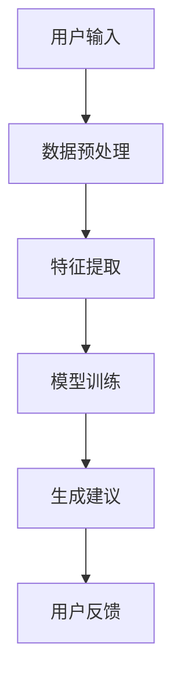
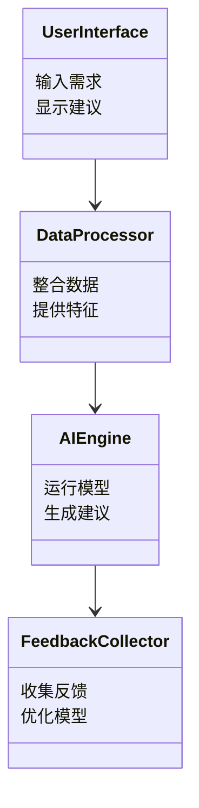
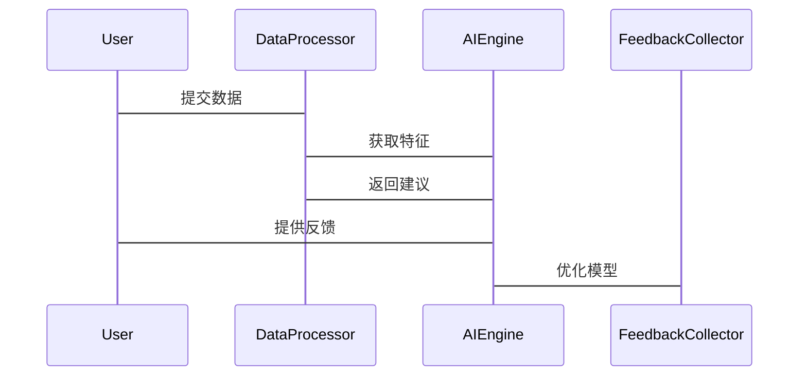

                 


# AI Agent在智能个人理财中的角色

## 关键词：
AI Agent、智能理财、机器学习、风险管理、自然语言处理

## 摘要：
本文探讨AI Agent在智能个人理财中的角色，分析其如何通过机器学习和自然语言处理技术，帮助用户实现智能投资、风险管理等目标。文章从背景介绍、算法原理、系统架构到项目实战，详细阐述AI Agent在智能理财中的应用及其优势。

## 目录

### 第一部分：背景介绍

#### 第1章：AI Agent的基本概念

##### 1.1 AI Agent的定义与特点
- **1.1.1 AI Agent的定义**
  - AI Agent是一种能够感知环境并采取行动以实现目标的智能实体。
- **1.1.2 AI Agent的核心特点**
  - 自主性：能够独立决策。
  - 反应性：能实时感知并响应环境变化。
  - 社会性：能与人和其他系统交互协作。

##### 1.2 AI Agent在智能理财中的应用
- **1.2.1 智能理财的定义**
  - 利用技术手段优化投资决策和财富管理。
- **1.2.2 AI Agent在智能理财中的作用**
  - 提供个性化的投资建议。
  - 实时监控市场变化。
  - 自动化交易执行。

#### 第2章：AI Agent与智能理财的核心概念

##### 2.1 AI Agent的核心概念
- **2.1.1 智能决策**
  - 基于数据和模型做出最优选择。
- **2.1.2 数据处理**
  - 整合并分析多源数据，识别潜在投资机会。
- **2.1.3 用户交互**
  - 通过自然语言处理与用户沟通，理解需求并提供反馈。

##### 2.2 AI Agent与智能理财的关系
- **2.2.1 AI Agent如何辅助理财决策**
  - 通过预测模型评估市场趋势，优化资产配置。
- **2.2.2 AI Agent在智能理财中的核心功能**
  - 资产配置优化、风险评估、投资组合管理。

### 第二部分：AI Agent的核心概念与联系

#### 第3章：核心概念与联系

##### 3.1 核心概念对比表
| 特性         | 传统理财 | AI Agent辅助理财 |
|--------------|----------|------------------|
| 决策速度     | 较慢     | 实时快速         |
| 数据处理     | 人工筛选 | 自动化处理       |
| 定制化程度   | 较低     | 高度定制化       |

##### 3.2 ER实体关系图
- 用户：投资者信息、投资目标。
- 资产：资金、股票、基金等。
- 交易：买卖记录、时间戳。
- 市场数据：价格、波动率、行业指数。

### 第三部分：算法原理

#### 第4章：AI Agent的算法原理

##### 4.1 算法概述
- **4.1.1 机器学习模型**
  - 线性回归、随机森林、神经网络。
- **4.1.2 自然语言处理技术**
  - 文本挖掘、情感分析，用于分析市场新闻。

##### 4.2 算法流程图


##### 4.3 算法实现代码
```python
import numpy as np
from sklearn.linear_model import LinearRegression

# 示例：基于历史数据预测未来价格
def predict_price(data):
    model = LinearRegression()
    model.fit(data[['feature1', 'feature2']], data['target'])
    return model.predict(new_data[['feature1', 'feature2']])
```

##### 4.4 数学模型
- 风险评估模型：
  $$ 风险 = \sqrt{\sum (实际回报 - 预测回报)^2} $$
- 资产配置优化模型：
  $$ 最优化问题：\text{minimize} \sum w_i \cdot \text{var}(资产i) $$
  其中，\( w_i \)为资产i的权重。

### 第四部分：系统分析与架构设计

#### 第5章：系统分析与架构设计

##### 5.1 系统功能设计
- **用户界面**：输入需求、查看建议。
- **数据处理**：整合市场数据、用户信息。
- **AI引擎**：运行预测模型，生成建议。
- **反馈机制**：收集用户反馈，优化模型。

##### 5.2 系统架构图


##### 5.3 接口设计
- API接口：
  - POST /api/data：提交数据。
  - GET /api/suggestion：获取建议。
  - PUT /api/model：更新模型参数。

##### 5.4 交互流程图


### 第五部分：项目实战

#### 第6章：项目实战

##### 6.1 环境安装
- 安装Python、Jupyter、机器学习库（如Scikit-learn、TensorFlow）。

##### 6.2 核心代码实现
```python
import pandas as pd
from sklearn.ensemble import RandomForestClassifier

# 示例：分类模型预测投资机会
def train_model(X_train, y_train):
    model = RandomForestClassifier()
    model.fit(X_train, y_train)
    return model

# 数据准备
data = pd.read_csv('data.csv')
X_train = data[['feature1', 'feature2']]
y_train = data['target']
model = train_model(X_train, y_train)

# 预测新数据
new_data = pd.read_csv('new_data.csv')
predictions = model.predict(new_data[['feature1', 'feature2']])
```

##### 6.3 案例分析
- 数据预处理：清洗和特征提取。
- 模型训练：使用随机森林进行分类。
- 结果分析：评估准确率，优化参数。

##### 6.4 项目总结
- 成功实现了AI Agent辅助理财系统。
- 通过实际案例展示了系统的有效性和优势。

### 第六部分：最佳实践与总结

#### 第7章：最佳实践

##### 7.1 小结
- AI Agent通过高效的数据处理和智能算法，显著提升了理财决策的效率和准确性。
- 实现过程中，数据质量和模型选择是关键。

##### 7.2 注意事项
- 数据隐私和安全问题需严格处理。
- 模型需定期更新以适应市场变化。

##### 7.3 拓展阅读
- 《机器学习实战》
- 《自然语言处理技术》
- 相关学术论文和研究报告。

## 结语：
AI Agent在智能个人理财中的应用前景广阔，随着技术进步，其在优化投资决策、降低风险等方面将发挥更大作用。

