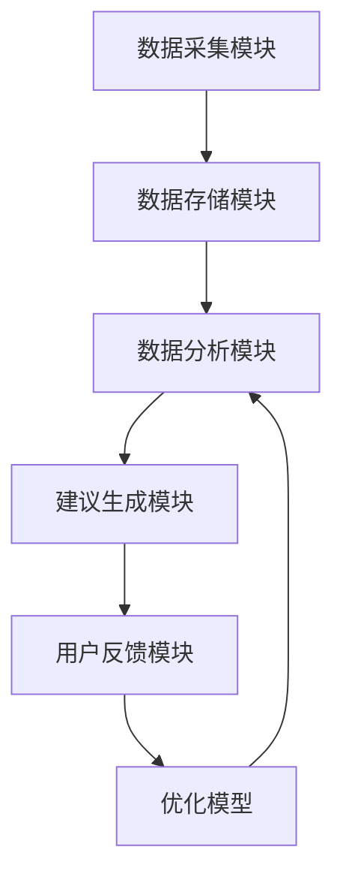
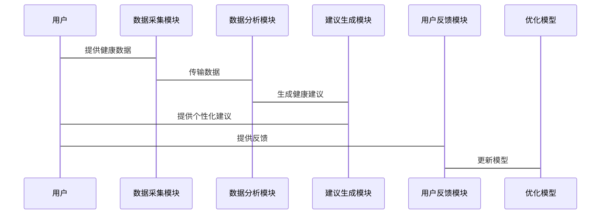

                 


# AI Agent在智能个性化健康建议中的应用

## 关键词：
AI Agent, 个性化健康建议, 人工智能, 机器学习, 强化学习, 数据分析

## 摘要：
本文探讨了AI Agent在智能个性化健康建议中的应用，从背景、核心概念到算法原理、系统架构，再到项目实战，全面分析AI Agent如何通过数据处理、机器学习和动态优化为个人提供精准健康建议。文章结合理论与实践，详细阐述了实现过程和实际案例，为读者提供了深入的技术见解。

---

# 第1章：AI Agent的基本概念与应用背景

## 1.1 AI Agent的核心概念

AI Agent，即人工智能代理，是指能够感知环境、自主决策并执行任务的智能实体。它具备以下核心特征：
- **自主性**：无需外部干预，自主完成任务。
- **反应性**：能实时感知环境变化并做出反应。
- **目标导向**：所有行动均以达成特定目标为导向。

与传统软件相比，AI Agent具有更强的适应性和学习能力，能够处理复杂动态环境中的问题。

## 1.2 智能个性化健康建议的背景

### 1.2.1 当代健康问题与个性化需求
现代人面临健康问题日益复杂化和个性化的需求增加。传统健康建议基于通用标准，难以满足个体差异化的健康需求。

### 1.2.2 传统健康建议的局限性
传统健康建议往往基于通用数据，忽视个体差异，导致建议的准确性和针对性不足。

### 1.2.3 AI技术在健康领域的应用潜力
AI技术能够处理大量复杂数据，为个性化健康建议提供了新的可能性。

---

# 第2章：AI Agent的核心原理与工作流程

## 2.1 AI Agent的基本工作原理

### 2.1.1 感知阶段：数据的收集与处理
AI Agent通过传感器、数据库等渠道收集健康数据，包括心率、血压、运动量等。

### 2.1.2 决策阶段：基于数据的分析与推理
通过机器学习算法对数据进行分析，生成个性化健康建议。例如，使用强化学习算法优化建议策略。

### 2.1.3 执行阶段：生成个性化建议
根据决策结果，生成具体的健康建议，如运动计划、饮食建议等。

---

# 第3章：AI Agent的算法原理与数学模型

## 3.1 机器学习算法在AI Agent中的应用

### 3.1.1 监督学习：基于标签数据的健康评估
通过监督学习算法，AI Agent能够根据标签数据（如健康状况）对用户健康状况进行评估。

### 3.1.2 无监督学习：健康数据的聚类分析
无监督学习算法能够将相似的健康数据自动聚类，帮助识别用户的健康模式。

### 3.1.3 强化学习：动态优化健康建议的生成
强化学习算法通过试错机制，不断优化健康建议的生成策略，提高建议的准确性和效果。

---

## 3.2 数学模型与公式

### 3.2.1 损失函数
在机器学习模型中，损失函数用于衡量预测值与实际值之间的差距。常用损失函数包括均方误差（MSE）：

$$L = \frac{1}{2n}\sum_{i=1}^{n}(y_i - \hat{y_i})^2$$

### 3.2.2 优化算法
梯度下降法是一种常用优化算法，用于最小化损失函数。其更新规则为：

$$\theta := \theta - \eta \frac{\partial L}{\partial \theta}$$

其中，$\eta$ 是学习率，$\frac{\partial L}{\partial \theta}$ 是损失函数关于参数 $\theta$ 的偏导数。

---

# 第4章：AI Agent在智能个性化健康建议中的系统架构

## 4.1 系统功能设计

### 4.1.1 数据采集模块
负责采集用户的健康数据，包括传感器数据和用户输入数据。

### 4.1.2 数据分析模块
对采集到的数据进行预处理和分析，使用机器学习算法生成健康评估报告。

### 4.1.3 建议生成模块
根据健康评估结果，生成个性化的健康建议。

### 4.1.4 用户反馈模块
收集用户的反馈，用于模型优化和效果评估。

## 4.2 系统架构设计

### 4.2.1 系统架构图
以下是系统架构的Mermaid图：



---

## 4.3 系统接口设计

### 4.3.1 数据采集接口
定义了与传感器和数据库的接口，用于数据的采集和传输。

### 4.3.2 用户反馈接口
定义了用户与系统交互的接口，用于收集用户的反馈信息。

---

## 4.4 系统交互流程

### 4.4.1 交互序列图
以下是系统交互的Mermaid序列图：



---

# 第5章：项目实战

## 5.1 环境安装

### 5.1.1 安装Python环境
使用Anaconda安装Python 3.8及以上版本。

### 5.1.2 安装依赖库
安装必要的Python库，如TensorFlow、Keras、Scikit-learn等。

## 5.2 系统核心实现

### 5.2.1 数据预处理代码

```python
import numpy as np
import pandas as pd

# 加载数据
data = pd.read_csv('health_data.csv')

# 数据清洗
data = data.dropna()
data = pd.get_dummies(data)
```

### 5.2.2 机器学习模型训练代码

```python
from sklearn.model import SGDRegressor

# 初始化模型
model = SGDRegressor()

# 训练模型
model.fit(X_train, y_train)
```

## 5.3 案例分析与解读

### 5.3.1 案例分析
以一位用户的健康数据为例，展示系统如何生成个性化健康建议。

### 5.3.2 实际效果分析
分析系统的实际表现，如建议的准确性和用户反馈。

---

# 第6章：总结与展望

## 6.1 最佳实践

### 6.1.1 数据隐私保护
在处理用户健康数据时，必须严格遵守数据隐私保护法规。

### 6.1.2 模型的可解释性
确保模型的决策过程清晰透明，便于用户理解和信任。

## 6.2 小结

本文详细探讨了AI Agent在智能个性化健康建议中的应用，从理论到实践，全面分析了其实现过程和实际效果。AI Agent通过数据处理、机器学习和动态优化，为个性化健康建议提供了新的解决方案。

## 6.3 注意事项

在实际应用中，需要注意数据质量、模型泛化能力以及用户隐私保护等问题。

## 6.4 拓展阅读

建议读者进一步学习强化学习、联邦学习等技术，以深入了解AI Agent在健康领域的更多应用。

---

# 结语

AI Agent在智能个性化健康建议中的应用前景广阔，随着技术的不断发展，AI Agent将为人类的健康管理提供更加智能和精准的服务。

