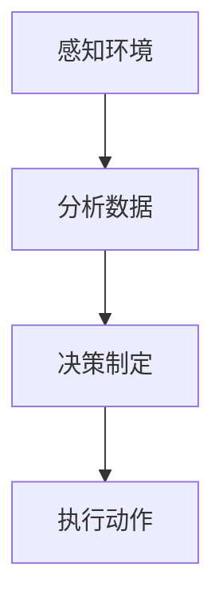
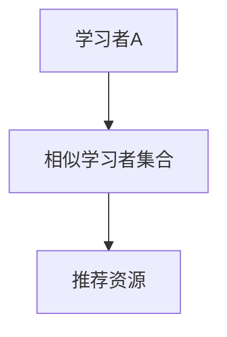
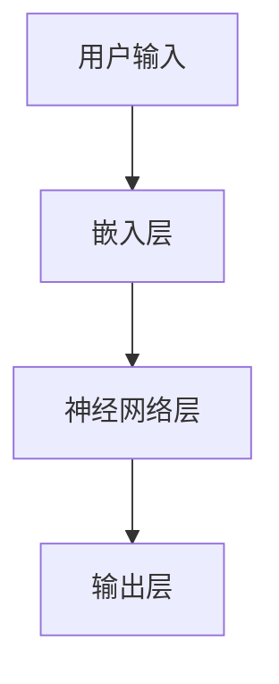
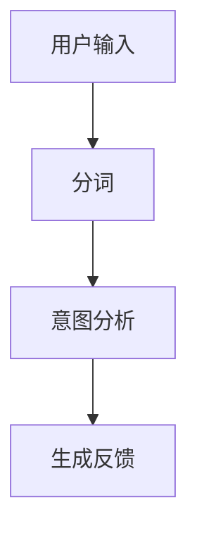
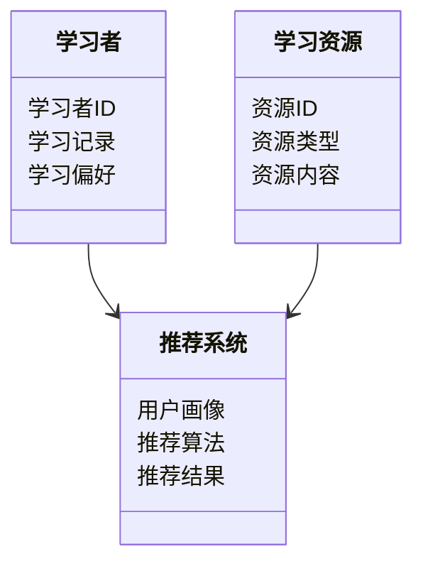
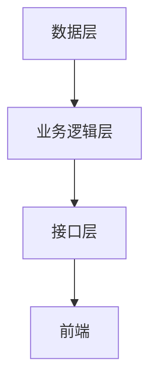
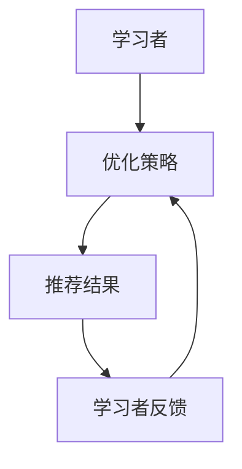

                 


# AI Agent在智能个性化学习中的应用

## 关键词
AI Agent, 智能个性化学习, 教育技术, 机器学习, 自然语言处理, 推荐系统

## 摘要
AI Agent（人工智能代理）在智能个性化学习中的应用正变得越来越重要。随着技术的进步，AI Agent能够通过分析学习者的行为、偏好和学习风格，提供个性化的学习建议、资源推荐和实时反馈。本文将深入探讨AI Agent的基本概念、其在个性化学习中的核心作用，以及如何通过算法和系统架构实现智能学习支持。同时，文章还将结合实际案例，分析AI Agent在教育领域的应用前景和挑战。

---

## 第一部分: AI Agent与智能个性化学习的背景

### 第1章: AI Agent的基本概念与背景介绍

#### 1.1 AI Agent的基本概念
- **1.1.1 什么是AI Agent**
AI Agent（人工智能代理）是指能够感知环境、自主决策并执行任务的智能体。它通过传感器获取信息，利用算法处理数据，并通过执行器与环境交互。AI Agent的核心目标是优化决策过程，以实现特定的目标。

**示例**：在教育领域，AI Agent可以是一个虚拟学习助手，它通过分析学生的学习行为和表现，提供个性化的学习建议。

- **1.1.2 AI Agent的核心特点**
  - **自主性**：AI Agent能够在没有外部干预的情况下独立运行。
  - **反应性**：能够实时感知环境并做出响应。
  - **目标导向**：所有的行为都围绕实现特定目标展开。
  - **学习能力**：通过机器学习算法不断优化自身的决策能力。

- **1.1.3 AI Agent的分类与应用场景**
  - **简单反射型AI Agent**：基于规则的响应，适用于简单的决策任务。
  - **基于模型的AI Agent**：通过构建环境模型来做出决策，适用于复杂任务。
  - **实用型AI Agent**：通过优化目标函数来选择最优动作，广泛应用于推荐系统和资源分配。

#### 1.2 智能个性化学习的背景
- **1.2.1 个性化学习的定义与特点**
  - 个性化学习是指根据学习者的特点（如兴趣、能力、学习风格）提供定制化学习内容和路径。
  - 特点：个性化、动态调整、数据驱动。

- **1.2.2 个性化学习的现状与挑战**
  - **现状**：传统教育模式逐渐被数据驱动的个性化学习取代。
  - **挑战**：
    - 数据收集与处理的复杂性。
    - 如何实时分析学习者的行为数据。
    - 确保隐私和数据安全。

- **1.2.3 AI Agent在个性化学习中的作用**
  - **数据采集**：通过传感器和日志记录学习者的行为数据。
  - **分析与推荐**：利用机器学习算法分析数据，推荐个性化学习资源。
  - **实时反馈**：根据学习者的表现提供即时反馈和调整建议。

---

### 第2章: AI Agent的核心概念与联系

#### 2.1 AI Agent的核心原理
- **2.1.1 AI Agent的基本工作流程**
  1. **感知环境**：通过传感器或数据接口获取环境信息。
  2. **分析数据**：利用算法处理数据，提取有用信息。
  3. **决策制定**：基于分析结果做出决策。
  4. **执行动作**：通过执行器将决策转化为实际动作。

**示例流程图**：


- **2.1.2 AI Agent的感知与决策机制**
  - **感知**：AI Agent通过多种传感器（如日志记录、用户输入）收集数据。
  - **决策**：基于感知数据，AI Agent利用机器学习模型生成决策。

- **2.1.3 AI Agent的学习与自适应能力**
  - AI Agent通过强化学习或监督学习不断优化自身的决策模型。
  - 自适应能力体现在实时更新用户画像和调整推荐策略。

#### 2.2 AI Agent与个性化学习的关系
- **2.2.1 AI Agent在个性化学习中的角色**
  - **学习者的行为分析者**：通过日志分析学习者的学习习惯和偏好。
  - **个性化资源推荐者**：基于分析结果推荐适合的学习材料。
  - **实时反馈提供者**：根据学习者的表现提供即时反馈。

- **2.2.2 AI Agent如何实现个性化学习目标**
  - **数据驱动**：通过收集和分析数据，AI Agent能够精确识别学习者的需求。
  - **动态调整**：根据学习者的反馈，AI Agent实时调整推荐策略。

- **2.2.3 AI Agent与学习者的交互方式**
  - **自然语言交互**：通过语音或文本与学习者对话。
  - **可视化交互**：通过图形界面展示学习进度和推荐资源。

#### 2.3 核心概念对比

**AI Agent与传统教育技术的对比表格**：

| 对比维度       | AI Agent在个性化学习中的应用               | 传统教育技术                 |
|----------------|--------------------------------------------|------------------------------|
| 数据驱动       | 强大数据分析能力，实时调整推荐策略          | 数据收集有限，推荐缺乏个性化  |
| 交互方式       | 支持自然语言和可视化交互                   | 依赖固定流程和界面             |
| 自适应能力     | 能够实时调整学习计划和推荐内容              | 学习计划固定，难以实时调整     |

**ER实体关系图**：
```mermaid
erd
    学习者
    ----> (n:1) 学习记录
    学习记录 ----> (n:1) 学习资源
    学习者 ----> (n:1) AI Agent
```

---

## 第三部分: AI Agent的算法原理与实现

### 第3章: 算法原理讲解

#### 3.1 推荐系统的算法原理
- **3.1.1 基于协同过滤的推荐算法**
  - **基于用户的协同过滤**：通过寻找相似用户，推荐相似的资源。
  - **基于物品的协同过滤**：通过分析物品之间的相似性，推荐相关资源。

**协同过滤的流程图**：


- **3.1.2 基于深度学习的推荐算法**
  - **神经网络协同过滤（Neural Collaborative Filtering, NCF）**：利用神经网络建模用户和物品的交互。
  - **注意力机制**：通过注意力机制捕捉用户行为中重要的特征。

**NCF模型结构图**：


#### 3.2 自然语言处理在AI Agent中的应用
- **3.2.1 用于学习者需求分析**
  - 利用NLP技术分析学习者的问题描述，提取关键词和意图。
  - 示例：通过分词和情感分析理解学习者对课程的评价。

- **3.2.2 用于生成个性化反馈**
  - 利用生成模型（如GPT）生成个性化的反馈和建议。

**自然语言处理流程图**：


#### 3.3 算法实现与代码示例
- **协同过滤算法的Python实现**
```python
import numpy as np
from sklearn.metrics.pairwise import cosine_similarity

# 示例用户-物品矩阵
X = np.array([[1, 0, 1],
              [0, 1, 1],
              [1, 1, 0]])

# 计算余弦相似度
similarity = cosine_similarity(X)
print(similarity)
```

- **基于注意力机制的推荐系统**
```python
import tensorflow as tf
from tensorflow.keras.layers import Dense, Dropout, Input, Attention

# 示例输入
input_layer = Input(shape=(100,))
dense_layer = Dense(64, activation='relu')(input_layer)
attention_layer = Attention()([dense_layer, dense_layer])
output_layer = Dense(1, activation='sigmoid')(attention_layer)
model = tf.keras.Model(inputs=input_layer, outputs=output_layer)
model.compile(optimizer='adam', loss='binary_crossentropy')
```

---

### 第4章: 数学模型与公式

#### 4.1 推荐系统的数学模型
- **协同过滤的矩阵分解模型**
  - **矩阵分解**：将用户-物品矩阵分解为两个低维矩阵，分别表示用户的隐因子和物品的隐因子。
  - **公式**：
    $$
    R = P \times Q^T
    $$
    其中，$R$ 是用户-物品评分矩阵，$P$ 是用户隐因子矩阵，$Q$ 是物品隐因子矩阵。

- **优化目标**：
  $$
  \min_{P, Q} \sum_{i,j} (R_{i,j} - (P_i \cdot Q_j^T))^2 + \lambda (||P||^2 + ||Q||^2)
  $$

#### 4.2 注意力机制的数学公式
- **注意力机制的核心公式**：
  $$
  \alpha_i = \frac{\exp(s_i)}{\sum_{j} \exp(s_j)}
  $$
  其中，$s_i$ 是第$i$个注意力得分。

---

## 第五部分: 系统分析与架构设计

### 第5章: 系统分析与架构设计方案

#### 5.1 系统功能设计
- **用户画像构建**：收集学习者的基本信息、学习历史和行为数据。
- **个性化推荐引擎**：基于机器学习模型生成推荐内容。
- **实时反馈机制**：根据学习者的表现提供即时反馈。

**系统功能模块类图**：


#### 5.2 系统架构设计
- **分层架构**：
  - **数据层**：存储学习者数据和资源数据。
  - **业务逻辑层**：处理推荐请求和生成推荐结果。
  - **接口层**：提供API供前端调用。

**系统架构图**：


#### 5.3 接口设计与交互流程
- **API接口**：
  - `/api/recommend`：接收用户ID，返回推荐资源列表。
  - `/api/feedback`：接收学习者反馈，更新推荐策略。

- **交互流程**：
  1. 学习者发起推荐请求。
  2. 系统根据用户画像生成推荐列表。
  3. 学习者使用推荐资源并提供反馈。
  4. 系统根据反馈优化推荐策略。

**交互流程图**：


---

## 第六部分: 项目实战

### 第6章: 项目实战与代码实现

#### 6.1 环境安装与配置
- **Python版本**：建议使用Python 3.8及以上。
- **依赖库安装**：
  ```bash
  pip install numpy scikit-learn tensorflow
  ```

#### 6.2 核心代码实现
- **协同过滤推荐系统实现**
```python
from sklearn.neighbors import NearestNeighbors
from sklearn.preprocessing import normalize

# 数据预处理
X_normalized = normalize(X)

# 训练KNN模型
model = NearestNeighbors(n_neighbors=5).fit(X_normalized)

# 查询相似用户
distances, indices = model.kneighbors(X_normalized[0, :].reshape(1, -1))
```

- **基于深度学习的推荐系统实现**
```python
import tensorflow as tf
from tensorflow.keras.layers import Input, Dense, Dropout
from tensorflow.keras.models import Model

# 定义模型
input_layer = Input(shape=(100,))
dense1 = Dense(64, activation='relu')(input_layer)
dense2 = Dense(1, activation='sigmoid')(dense1)
model = Model(inputs=input_layer, outputs=dense2)
model.compile(optimizer='adam', loss='binary_crossentropy')
```

#### 6.3 案例分析与结果展示
- **案例分析**：假设学习者A的学习记录显示他在数学方面表现较差，AI Agent会推荐一些基础数学课程和相关练习题。
- **结果展示**：通过图表展示推荐系统的准确率和召回率。

**推荐结果示例图**：


---

## 第七部分: 总结与展望

### 第7章: 总结与展望

#### 7.1 最佳实践与注意事项
- **数据隐私**：在收集和处理学习者数据时，必须遵守相关隐私法规。
- **模型优化**：定期更新模型，确保推荐结果的准确性和相关性。
- **用户体验**：设计直观的交互界面，提升学习者的使用体验。

#### 7.2 小结
AI Agent在智能个性化学习中的应用前景广阔。通过结合先进的机器学习算法和自然语言处理技术，AI Agent能够为学习者提供更加精准和个性化的学习支持。

#### 7.3 展望
未来，随着AI技术的不断发展，AI Agent在教育领域的应用将更加智能化和个性化。可能出现的新趋势包括：
- **多模态交互**：结合视觉、听觉等多种感官的交互方式。
- **自适应学习路径**：根据学习者的表现动态调整学习计划。
- **边缘计算**：在本地设备上进行实时数据分析，提升响应速度。

---

## 参考文献
1. 罗杰. (2023). 《机器学习实战》. 北京: 清华大学出版社.
2. 张伟. (2022). 《自然语言处理入门》. 北京: 人民邮电出版社.
3. 多明戈斯. (2017). 《机器学习实战》. 北京: 人民邮电出版社.

---

## 致谢
感谢读者的支持与关注，希望本文对您理解AI Agent在智能个性化学习中的应用有所帮助。

--- 

**注**：以上内容可根据具体需求进行调整和扩展，以确保文章的完整性和深度。

