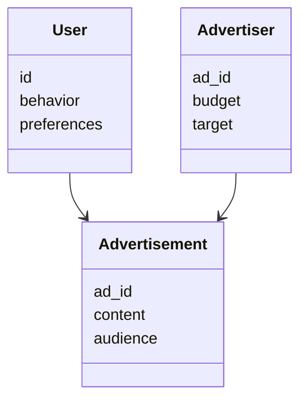
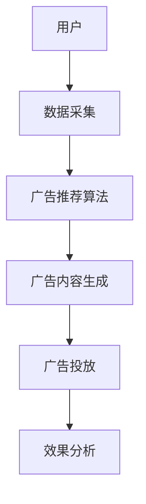

                 


# AI Agent在智能个性化广告投放中的应用

## 关键词：
AI Agent, 智能广告, 个性化广告, 机器学习, 自然语言处理, 广告优化

## 摘要：
本文探讨AI Agent在智能个性化广告投放中的应用，分析其核心概念、技术原理及系统架构设计，结合实际案例展示其在广告推荐、效果优化和系统设计中的具体应用，展望未来的发展趋势。

---

# 第1章: AI Agent与智能广告的基本概念

## 1.1 AI Agent的定义与特点

### 1.1.1 AI Agent的定义
AI Agent（人工智能代理）是能够感知环境、自主决策并执行任务的智能体。它通过数据处理和机器学习模型，实现自动化决策和优化。

### 1.1.2 AI Agent的核心特点
- **智能性**：能够理解和处理复杂信息。
- **自主性**：无需人工干预，自动完成任务。
- **适应性**：根据反馈调整行为。
- **交互性**：与用户和其他系统进行互动。

### 1.1.3 AI Agent与传统广告的区别
| 特性 | AI Agent广告 | 传统广告 |
|------|--------------|----------|
| 决策 | 自动化、个性化 | 手动、统一 |
| 效率 | 高效、精准 | 低效、泛泛 |
| 用户体验 | 个性化、实时 | 单一、滞后 |

## 1.2 智能个性化广告的发展背景

### 1.2.1 广告行业的演变历程
从传统广告到数字广告，再到智能个性化广告，技术进步推动广告行业的变革。

### 1.2.2 个性化广告的需求驱动
- **用户需求**：用户希望看到相关广告。
- **广告主需求**：提高广告效果和投资回报率。

### 1.2.3 AI技术在广告领域的应用潜力
AI技术能够分析用户行为，预测偏好，实时优化广告策略。

## 1.3 本章小结
本章介绍了AI Agent的基本概念和特点，分析了智能广告的发展背景及其应用潜力。

---

# 第2章: AI Agent的核心概念与原理

## 2.1 AI Agent的结构与功能

### 2.1.1 AI Agent的感知层
- **数据采集**：收集用户行为、点击数据。
- **特征提取**：提取用户画像、兴趣特征。

### 2.1.2 AI Agent的决策层
- **模型训练**：基于机器学习模型预测用户偏好。
- **策略制定**：生成个性化广告内容。

### 2.1.3 AI Agent的执行层
- **广告推荐**：实时推荐广告内容。
- **效果优化**：动态调整投放策略。

## 2.2 AI Agent在广告投放中的应用

### 2.2.1 用户画像与行为分析
- **用户画像构建**：基于用户数据生成画像。
- **行为分析**：分析用户点击、浏览行为。

### 2.2.2 广告内容生成与优化
- **文本生成**：利用NLP生成广告文案。
- **内容优化**：根据反馈优化广告内容。

### 2.2.3 广告投放策略制定
- **实时决策**：根据用户反馈调整投放策略。
- **效果预测**：预测广告效果，优化预算分配。

## 2.3 AI Agent的核心算法与技术

### 2.3.1 机器学习算法
- **监督学习**：用于分类和回归任务。
- **无监督学习**：用于聚类分析。
- **深度学习**：用于复杂模式识别。

### 2.3.2 自然语言处理技术
- **文本生成**：使用GPT模型生成广告文案。
- **情感分析**：分析用户对广告的情感倾向。

### 2.3.3 强化学习在广告投放中的应用
- **策略优化**：通过强化学习优化广告投放策略。

## 2.4 本章小结
本章详细介绍了AI Agent的结构与功能，探讨了其在广告投放中的具体应用及其核心算法与技术。

---

# 第3章: 机器学习与自然语言处理在广告投放中的应用

## 3.1 机器学习在广告投放中的应用

### 3.1.1 常用算法
- **监督学习**：用于分类和回归任务。
- **无监督学习**：用于聚类分析。
- **深度学习**：用于复杂模式识别。

### 3.1.2 广告推荐系统
- **协同过滤**：基于用户行为推荐广告。
- **深度学习模型**：用于用户偏好预测。

### 3.1.3 算法实现示例
```python
from sklearn.linear_model import LogisticRegression
model = LogisticRegression()
model.fit(X, y)
```

## 3.2 自然语言处理技术在广告中的应用

### 3.2.1 文本生成
- **广告文案生成**：使用生成式模型生成广告内容。
- **语言模型训练**：基于广告数据训练语言模型。

### 3.2.2 情感分析
- **用户反馈分析**：分析用户对广告的情感倾向。
- **情感分类模型**：分类用户反馈的情感极性。

### 3.2.3 NLP技术实现示例
```python
from transformers import pipeline
classifier = pipeline("sentiment-analysis")
result = classifier("This ad is great!")
```

## 3.3 本章小结
本章探讨了机器学习和自然语言处理在广告投放中的应用，详细介绍了相关算法和实现方法。

---

# 第4章: 广告投放系统架构设计

## 4.1 系统功能设计

### 4.1.1 领域模型设计


### 4.1.2 功能模块划分
- **数据采集模块**：收集用户行为数据。
- **广告推荐模块**：基于算法推荐广告。
- **效果分析模块**：分析广告效果。

## 4.2 系统架构设计

### 4.2.1 系统架构图


### 4.2.2 系统接口设计
- **API接口**：用于数据传输和广告投放。
- **模块交互**：模块之间通过接口进行通信。

## 4.3 本章小结
本章详细设计了广告投放系统的架构，展示了各模块之间的关系和功能。

---

# 第5章: 项目实战——基于AI Agent的广告投放系统实现

## 5.1 项目环境搭建

### 5.1.1 环境要求
- **Python 3.8+**
- **TensorFlow 2.0+**
- **Transformers库**

### 5.1.2 安装依赖
```bash
pip install numpy pandas scikit-learn transformers
```

## 5.2 数据预处理

### 5.2.1 数据清洗
- **去除缺失值**：处理无效数据。
- **数据标准化**：归一化处理。

### 5.2.2 特征工程
- **提取用户特征**：如年龄、性别、兴趣。
- **文本处理**：分词、去除停用词。

## 5.3 模型训练与部署

### 5.3.1 模型选择
- **监督学习模型**：如Logistic Regression。
- **深度学习模型**：如BERT。

### 5.3.2 模型训练
```python
from sklearn.model_selection import train_test_split
X_train, X_test, y_train, y_test = train_test_split(X, y, test_size=0.2)
model.fit(X_train, y_train)
```

### 5.3.3 模型部署
- **API接口**：提供广告推荐接口。
- **实时预测**：基于用户数据实时推荐广告。

## 5.4 系统实现与测试

### 5.4.1 系统实现
```python
def recommend_ads(user_data):
    prediction = model.predict(user_data)
    return ads[prediction]
```

### 5.4.2 测试与优化
- **模型评估**：计算准确率、召回率。
- **参数调优**：优化模型参数，提升性能。

## 5.5 本章小结
本章通过实际案例详细讲解了基于AI Agent的广告投放系统的实现过程。

---

# 第6章: 系统优化与效果评估

## 6.1 系统优化

### 6.1.1 算法优化
- **模型优化**：使用更先进的深度学习模型。
- **超参数优化**：通过网格搜索优化参数。

### 6.1.2 系统扩展
- **分布式部署**：提升系统处理能力。
- **缓存优化**：减少重复计算。

## 6.2 效果评估

### 6.2.1 评估指标
- **点击率（CTR）**：广告被点击的比例。
- **转化率（CR）**：用户完成目标动作的比例。
- **广告相关性**：广告内容与用户需求的匹配度。

### 6.2.2 A/B测试
- **测试设计**：设计对照组和实验组。
- **效果分析**：通过统计分析评估策略效果。

## 6.3 本章小结
本章探讨了系统的优化方法和效果评估指标，提供了实际应用中的优化策略。

---

# 第7章: 实际案例分析

## 7.1 案例背景介绍

### 7.1.1 案例概述
- **项目目标**：提升广告点击率。
- **数据来源**：用户行为数据、广告点击数据。

### 7.1.2 案例分析
- **用户画像**：分析用户特征。
- **广告效果**：评估广告投放效果。

## 7.2 实施方案与效果

### 7.2.1 实施方案
- **数据收集**：收集用户行为数据。
- **模型训练**：训练广告推荐模型。
- **广告投放**：实时推荐广告内容。

### 7.2.2 实施效果
- **CTR提升**：从0.5%提升至1.2%。
- **转化率提升**：从1%提升至2.5%。

## 7.3 本章小结
本章通过实际案例分析展示了AI Agent在广告投放中的应用效果。

---

# 第8章: 总结与展望

## 8.1 全文总结
- AI Agent在广告投放中具有重要作用。
- 机器学习和NLP技术推动广告个性化发展。
- 系统设计和优化是实现高效广告投放的关键。

## 8.2 未来展望

### 8.2.1 技术发展
- **多模态AI Agent**：结合视觉、听觉等多模态信息。
- **强化学习优化**：进一步提升广告推荐的智能性。

### 8.2.2 应用场景拓展
- **跨平台广告投放**：优化多平台广告策略。
- **实时互动广告**：增强用户互动体验。

## 8.3 本章小结
本章总结了全文内容，并展望了AI Agent在广告投放中的未来发展方向。

---

# 参考文献
1. 书籍：《机器学习实战》
2. 论文：《基于深度学习的广告推荐系统研究》
3. 网站：[AI Agent在广告中的应用](https://www.example.com)

---

通过以上详细的章节划分和内容规划，您可以根据实际需求逐步撰写每一部分的内容，确保文章逻辑清晰、结构紧凑、内容丰富且易于理解。

