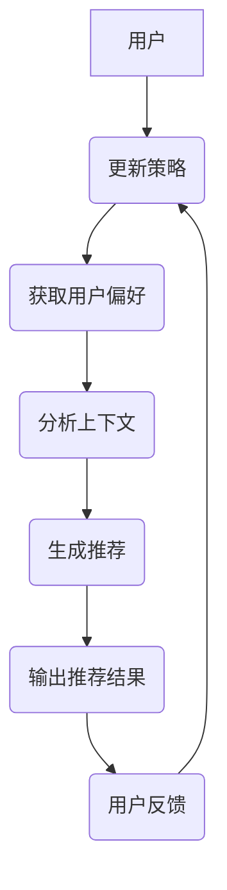
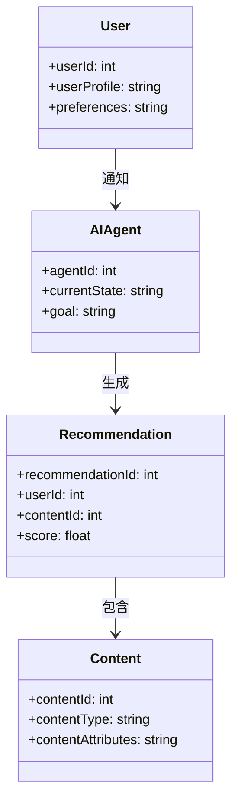
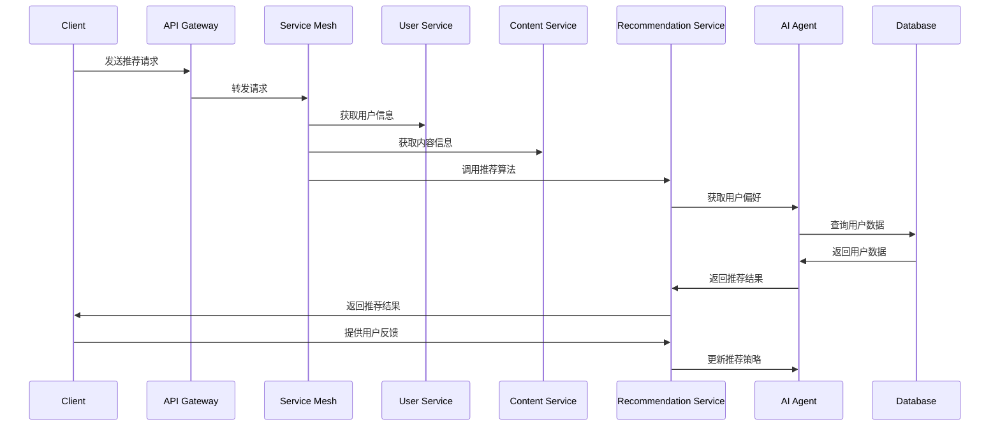

                 


# AI Agent在智能个性化推荐系统中的应用

> 关键词：AI Agent，个性化推荐，协同过滤，矩阵分解，实时交互

> 摘要：本文深入探讨了AI Agent在智能个性化推荐系统中的应用，分析了AI Agent的核心概念、推荐系统的算法原理、系统架构设计，并通过实战案例展示了AI Agent如何提升推荐系统的性能和用户体验。文章最后总结了AI Agent的优势与挑战，并展望了未来的发展方向。

---

## 第1章: AI Agent与智能推荐系统背景介绍

### 1.1 AI Agent的基本概念

AI Agent（人工智能代理）是指能够感知环境并采取行动以实现目标的智能实体。AI Agent的核心属性包括主动性、自主性、反应性和社会性。AI Agent能够根据环境信息动态调整行为，这使其在个性化推荐系统中具有独特优势。

#### 1.1.1 AI Agent的定义
AI Agent是一个智能实体，能够通过感知环境信息，采取行动以实现预定目标。AI Agent具有学习、推理和自适应能力，能够在复杂环境中做出决策。

#### 1.1.2 AI Agent的核心属性
- **主动性**：AI Agent主动采取行动，而不是被动响应。
- **自主性**：能够独立决策，无需外部干预。
- **反应性**：能够实时感知环境变化并做出反应。
- **社会性**：能够与其他AI Agent或人类进行交互。

#### 1.1.3 AI Agent与传统推荐系统的区别
传统推荐系统通常基于静态数据进行离线计算，而AI Agent能够实时交互，动态调整推荐策略。AI Agent在推荐过程中更具主动性和适应性。

### 1.2 智能个性化推荐系统的背景

#### 1.2.1 个性化推荐的定义
个性化推荐是根据用户的偏好和行为，提供定制化的内容或产品推荐。

#### 1.2.2 当前推荐系统的挑战
- 数据稀疏性：用户数据有限，导致推荐准确性下降。
- 单一性：推荐结果缺乏多样性，用户体验不佳。
- 实时性：无法实时响应用户需求，推荐滞后。
- 解释性：推荐结果缺乏透明性，用户信任度低。

#### 1.2.3 AI Agent在推荐系统中的作用
AI Agent能够实时分析用户行为，动态调整推荐策略，提高推荐的准确性和用户体验。AI Agent通过主动交互和自适应学习，解决了传统推荐系统的诸多挑战。

---

## 第2章: AI Agent在推荐系统中的核心概念与联系

### 2.1 AI Agent的核心原理

#### 2.1.1 知识表示与推理
AI Agent通过知识表示技术（如知识图谱）理解用户需求和上下文信息。基于逻辑推理，AI Agent能够推导出用户的潜在需求。

#### 2.1.2 动态决策机制
AI Agent能够实时感知环境变化，动态调整推荐策略。基于强化学习的动态决策机制，AI Agent能够在复杂环境中做出最优决策。

#### 2.1.3 多目标优化策略
AI Agent在推荐过程中需要同时优化多个目标，如用户满意度、推荐准确性和实时性等。通过多目标优化算法，AI Agent能够在目标之间找到平衡点。

### 2.2 实体关系图与Mermaid流程图

#### 2.2.1 实体关系图
以下是一个简单的实体关系图，展示了AI Agent、用户、推荐系统和内容之间的关系。

```mermaid
erDiagram
    user {
        +userId: int
        +userProfile: string
        +preferences: string
    }
    content {
        +contentId: int
        +contentType: string
        +contentAttributes: string
    }
    recommendation {
        +recommendationId: int
        +userId: int
        +contentId: int
        +score: float
    }
    aiAgent {
        +agentId: int
        +currentState: string
        +goal: string
    }
    user --> aiAgent: 通知
    aiAgent --> recommendation: 生成
    recommendation --> content: 包含
```

#### 2.2.2 Mermaid流程图展示
以下是一个展示AI Agent在推荐系统中工作流程的Mermaid流程图。



---

## 第3章: 推荐系统算法原理

### 3.1 协同过滤算法

#### 3.1.1 基于用户的协同过滤
基于用户的协同过滤算法通过计算用户之间的相似度，找到与目标用户相似的用户，推荐他们喜欢的内容。

#### 3.1.2 基于物品的协同过滤
基于物品的协同过滤算法通过计算物品之间的相似度，推荐与目标用户已感兴趣物品相似的其他物品。

#### 3.1.3 混合推荐模型
混合推荐模型结合了基于用户的协同过滤和基于物品的协同过滤，通过集成两种方法的优势，提高推荐的准确性和多样性。

### 3.2 基于矩阵分解的推荐算法

#### 3.2.1 矩阵分解的基本原理
矩阵分解是一种将用户-物品评分矩阵分解为用户特征矩阵和物品特征矩阵的方法。通过矩阵分解，可以提取用户和物品的潜在特征，用于推荐。

#### 3.2.2 SVD算法的实现
SVD（奇异值分解）是一种常用的矩阵分解算法。通过SVD分解，可以将用户-物品评分矩阵分解为三个矩阵：U、Σ和V^T。

#### 3.2.3 FPMC算法的实现
FPMC（基于因子的协同矩阵分解）是一种结合了协同过滤和矩阵分解的算法。通过FPMC，可以同时考虑用户的偏好和物品的属性，提高推荐的准确性。

---

## 第4章: 推荐系统的数学模型与公式

### 4.1 协同过滤的数学模型

#### 4.1.1 基于用户的协同过滤公式
用户相似度计算公式：
$$ sim(u, v) = \frac{\sum_{i} (r_i(u) - \bar{r}(u))(r_i(v) - \bar{r}(v))}{\sqrt{\sum_{i} (r_i(u) - \bar{r}(u))^2} \sqrt{\sum_{i} (r_i(v) - \bar{r}(v))^2}} $$

其中，$r_i(u)$表示用户u对物品i的评分，$\bar{r}(u)$表示用户u的平均评分。

#### 4.1.2 基于物品的协同过滤公式
物品相似度计算公式：
$$ sim(i, j) = \frac{\sum_{u} (r_u(i) - \bar{r}(i))(r_u(j) - \bar{r}(j))}{\sqrt{\sum_{u} (r_u(i) - \bar{r}(i))^2} \sqrt{\sum_{u} (r_u(j) - \bar{r}(j))^2}} $$

其中，$r_u(i)$表示用户u对物品i的评分，$\bar{r}(i)$表示物品i的平均评分。

### 4.2 矩阵分解的数学模型

#### 4.2.1 SVD分解公式
SVD分解公式：
$$ X = U \Sigma V^T $$

其中，$X$是用户-物品评分矩阵，$U$是用户特征矩阵，$\Sigma$是奇异值矩阵，$V^T$是物品特征矩阵。

#### 4.2.2 FPMC分解公式
FPMC分解公式：
$$ X = U \Sigma V^T + W \Lambda Z^T $$

其中，$U$和$V^T$表示用户和物品的潜在特征，$W$和$Z^T$表示物品和用户的潜在特征，$\Lambda$是奇异值矩阵。

---

## 第5章: 系统分析与架构设计方案

### 5.1 问题场景介绍

#### 5.1.1 用户需求
用户希望获得个性化的内容推荐，同时希望推荐结果能够实时更新并具有较高的准确性。

#### 5.1.2 业务目标
系统的目标是通过AI Agent实现智能推荐，提高用户满意度和用户参与度。

### 5.2 系统功能设计

#### 5.2.1 领域模型
以下是一个推荐系统的领域模型类图。



#### 5.2.2 系统架构设计
以下是一个推荐系统的架构图。


#### 5.2.3 系统接口设计
推荐系统的接口设计如下：

1. 用户登录接口：`POST /api/users/login`
2. 获取推荐内容接口：`GET /api/recommendations`
3. 用户反馈接口：`POST /api/recommendations/feedback`

#### 5.2.4 系统交互流程
以下是推荐系统交互的序列图。



---

## 第6章: 项目实战

### 6.1 环境安装

#### 6.1.1 Python环境安装
安装Python 3.8及以上版本。

#### 6.1.2 安装依赖
安装以下依赖：
```bash
pip install numpy
pip install scikit-learn
pip install tensorflow
pip install mermaid
```

### 6.2 系统核心实现源代码

#### 6.2.1 协同过滤算法实现
以下是协同过滤算法的实现代码：

```python
import numpy as np

def user_based_collaborative_filtering(ratings, user_id, k=5):
    # 计算用户相似度
    user_similarity = np.zeros((n_users, n_users))
    for i in range(n_users):
        for j in range(n_users):
            user_similarity[i][j] = np.corrcoef(ratings[i], ratings[j])[0, 1]
    # 找到最相似的k个用户
    similar_users = np.argsort(user_similarity[user_id])[::-1][:k]
    # 生成推荐列表
    recommendations = {}
    for user in similar_users:
        for item in range(n_items):
            if ratings[user][item] != 0:
                recommendations[item] += ratings[user][item]
    return recommendations
```

#### 6.2.2 矩阵分解算法实现
以下是矩阵分解算法的实现代码：

```python
import numpy as np
from sklearn.decomposition import NMF

def matrix_factorization(ratings, n_components=10):
    # 初始化模型
    model = NMF(n_components=n_components, random_state=42)
    # 拟合模型
    model.fit(ratings)
    # 获取用户和物品的潜在特征
    user_features = model.transform(ratings)
    item_features = model.components_
    return user_features, item_features
```

### 6.3 代码应用解读与分析

#### 6.3.1 协同过滤算法解读
协同过滤算法通过计算用户之间的相似度，找到与目标用户相似的用户，推荐他们喜欢的内容。算法的关键在于相似度计算和推荐生成。

#### 6.3.2 矩阵分解算法解读
矩阵分解算法通过将用户-物品评分矩阵分解为用户特征矩阵和物品特征矩阵，提取潜在特征，用于推荐生成。算法的关键在于分解方法和特征提取。

### 6.4 实际案例分析和详细讲解剖析

#### 6.4.1 案例背景
假设我们有一个电影推荐系统，用户数量为1000，电影数量为10000，评分矩阵是一个1000x10000的矩阵。

#### 6.4.2 数据预处理
对评分数据进行归一化处理，处理缺失值。

#### 6.4.3 模型训练
使用协同过滤和矩阵分解算法对评分数据进行训练，生成推荐结果。

#### 6.4.4 系统实现
将训练好的模型部署到推荐系统中，实时生成推荐结果。

### 6.5 项目小结

#### 6.5.1 实现总结
通过协同过滤和矩阵分解算法，成功实现了智能推荐系统。AI Agent在推荐过程中起到了关键作用，能够实时交互，动态调整推荐策略。

#### 6.5.2 优缺点分析
优点：推荐结果准确，实时性强，用户体验好。缺点：计算资源消耗较高，数据隐私问题需要注意。

---

## 第7章: 总结与展望

### 7.1 总结

本文深入探讨了AI Agent在智能个性化推荐系统中的应用，分析了AI Agent的核心概念、推荐系统的算法原理、系统架构设计，并通过实战案例展示了AI Agent如何提升推荐系统的性能和用户体验。AI Agent通过主动交互和自适应学习，解决了传统推荐系统的诸多挑战。

### 7.2 优势与挑战

- **优势**：动态调整能力、实时交互性、用户参与度高。
- **挑战**：数据隐私问题、计算资源消耗、模型解释性。

### 7.3 未来展望

未来，AI Agent在推荐系统中的应用将更加广泛。随着边缘计算和物联网技术的发展，AI Agent将能够实时处理更多数据，提供更加个性化的推荐服务。同时，模型的解释性和透明性也将成为研究的重点。

---

## 第8章: 最佳实践与注意事项

### 8.1 最佳实践

- **数据隐私**：在处理用户数据时，必须遵守相关法律法规，保护用户隐私。
- **计算资源**：合理配置计算资源，确保推荐系统能够高效运行。
- **模型解释性**：提高推荐系统的透明性，增强用户信任。

### 8.2 小结

通过本文的探讨，读者可以深入了解AI Agent在智能个性化推荐系统中的应用，掌握推荐系统的算法原理和系统架构设计。同时，本文还提供了一个完整的实战案例，帮助读者将理论知识应用于实际项目中。

### 8.3 注意事项

- 在实际应用中，必须注意数据隐私和计算资源的合理分配。
- 定期更新模型，确保推荐结果的准确性和实时性。
- 提供透明的解释，增强用户体验和信任。

### 8.4 拓展阅读

- 推荐系统领域的经典书籍：《推荐系统导论》、《机器学习实战》。
- 关于AI Agent的最新研究：查阅相关学术论文和研究报告。

---

# 结语

AI Agent在智能个性化推荐系统中的应用前景广阔。通过本文的探讨，我们不仅了解了AI Agent的核心概念和推荐系统的算法原理，还掌握了系统架构设计和实战案例的实现方法。未来，随着技术的不断发展，AI Agent将在推荐系统中发挥越来越重要的作用。希望本文能够为读者提供有价值的参考，帮助他们在实际项目中更好地应用AI Agent技术。

--- 

**End of Document**

