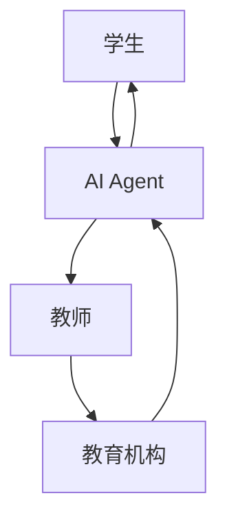

                 


# AI Agent在智能个性化教育中的应用

## 关键词：AI Agent, 个性化教育, 机器学习, 知识图谱, 自然语言处理, 教育技术, 智能系统

## 摘要

随着人工智能技术的快速发展，AI Agent（人工智能代理）在教育领域的应用逐渐成为研究的热点。本文探讨了AI Agent在智能个性化教育中的具体应用，分析了其核心概念、算法原理、系统架构，并通过实际案例展示了其在教育中的潜力。本文首先介绍了AI Agent的基本概念及其在教育中的应用背景，接着深入分析了AI Agent的核心原理和技术，包括机器学习算法、自然语言处理和知识图谱构建。然后，详细讲解了AI Agent在智能个性化教育中的系统设计，包括功能设计、架构设计和接口设计。最后，通过一个具体的项目案例，展示了AI Agent在智能个性化教育中的实际应用，并总结了其在教育中的优势与挑战。

---

# 第一部分: AI Agent与智能个性化教育概述

## 第1章: AI Agent与智能个性化教育的背景介绍

### 1.1 AI Agent的基本概念

AI Agent是指能够感知环境、自主决策并执行任务的人工智能实体。在教育领域，AI Agent通常以软件或虚拟助手的形式存在，能够与学生互动、提供个性化建议并优化学习过程。

- **1.1.1 什么是AI Agent**  
  AI Agent是一种能够执行复杂任务的智能系统，它能够理解用户需求、主动解决问题并不断优化自身的行为。在教育领域，AI Agent可以作为学习助手，帮助学生完成学习任务、解答疑问并提供个性化的学习建议。

- **1.1.2 AI Agent的核心特征**  
  - **自主性**：AI Agent能够自主决策，无需人工干预。  
  - **反应性**：能够实时感知环境并做出响应。  
  - **学习性**：通过机器学习算法不断优化自身的知识库和行为模式。  

- **1.1.3 AI Agent与传统教育技术的区别**  
  传统教育技术通常依赖固定的规则和预设的内容，而AI Agent能够根据学生的学习情况动态调整教学策略，提供更加灵活和个性化的学习体验。

### 1.2 智能个性化教育的背景与现状

智能个性化教育是教育信息化的高级阶段，它通过技术手段实现对每个学生的个性化教学。随着AI技术的发展，个性化教育的需求日益增长。

- **1.2.1 教育信息化的演进历程**  
  教育信息化经历了从传统教学到多媒体教学，再到智能个性化教学的演进。AI Agent的引入标志着教育信息化进入了一个新的阶段。

- **1.2.2 个性化教育的需求与挑战**  
  学生的个体差异决定了个性化教育的必要性。然而，传统教育模式难以满足大规模个性化教学的需求。AI Agent的引入为解决这一问题提供了新的可能性。

- **1.2.3 AI技术在教育领域的应用趋势**  
  随着机器学习、自然语言处理和知识图谱等技术的成熟，AI Agent在教育中的应用正在逐步普及。未来的教育将更加依赖AI技术来实现个性化和智能化。

### 1.3 AI Agent在教育中的应用前景

AI Agent在教育中的应用前景广阔，它可以帮助学生、教师和教育机构实现更加高效和个性化的教学。

- **1.3.1 AI Agent在教育中的潜在价值**  
  AI Agent可以作为学生的学习助手，帮助他们解决学习中的问题、优化学习计划并提供个性化的学习资源。

- **1.3.2 智能个性化教育的核心目标**  
  智能个性化教育的核心目标是为每个学生提供最适合的学习路径和教学资源，从而提高学习效率和效果。

- **1.3.3 AI Agent在教育中的具体应用场景**  
  - **学生学习辅导**：AI Agent可以为学生提供个性化的学习建议和辅导。  
  - **教学内容优化**：AI Agent可以帮助教师优化教学内容和教学策略。  
  - **学习效果评估**：AI Agent可以实时评估学生的学习效果并提供反馈。  

---

## 第2章: AI Agent的核心概念与原理

### 2.1 AI Agent的核心原理

AI Agent的核心原理包括感知、决策和执行三个阶段。在教育领域，AI Agent通过感知学生的学习行为、决策最优的教学策略并执行相应的教学任务。

- **2.1.1 AI Agent的基本工作流程**  
  1. **感知环境**：AI Agent通过传感器或数据输入感知环境中的信息。  
  2. **分析数据**：AI Agent利用机器学习算法分析数据，识别学生的学习需求和行为模式。  
  3. **制定决策**：AI Agent基于分析结果制定最优的教学策略。  
  4. **执行任务**：AI Agent根据决策结果执行相应的教学任务。  

- **2.1.2 AI Agent的感知与决策机制**  
  AI Agent的感知机制依赖于自然语言处理和知识图谱技术，能够理解学生的学习需求和行为模式。决策机制则基于机器学习算法，能够优化教学策略。

- **2.1.3 AI Agent的学习与优化算法**  
  AI Agent通过监督学习、无监督学习和强化学习等算法不断优化自身的知识库和行为模式。

### 2.2 AI Agent与智能个性化教育的关系

AI Agent在智能个性化教育中扮演着重要的角色，它能够帮助学生和教师实现更加高效和个性化的教学。

- **2.2.1 AI Agent在个性化教育中的角色定位**  
  AI Agent是个性化教育的核心工具，它能够根据学生的学习情况动态调整教学策略。

- **2.2.2 AI Agent如何实现个性化教学**  
  AI Agent通过分析学生的学习数据，制定个性化的学习计划，并提供针对性的学习资源。

- **2.2.3 AI Agent与教育目标的协同作用**  
  AI Agent与教育目标协同作用，能够帮助学生实现个性化学习目标，同时优化教师的教学效率。

### 2.3 AI Agent的核心技术分析

AI Agent的核心技术包括自然语言处理、机器学习和知识图谱构建等。

- **2.3.1 自然语言处理技术**  
  自然语言处理技术能够让AI Agent理解学生的语言输入，例如通过NLP技术解析学生的问题并生成相应的回答。

- **2.3.2 机器学习算法**  
  机器学习算法能够让AI Agent学习学生的学习行为模式，例如通过监督学习算法识别学生的学习困难点。

- **2.3.3 知识图谱构建与应用**  
  知识图谱构建技术能够让AI Agent构建学科知识体系，从而更好地理解学生的学习内容并提供相关的学习资源。

---

## 第3章: AI Agent的核心算法原理

### 3.1 机器学习算法在AI Agent中的应用

机器学习算法是AI Agent的核心技术之一，它能够让AI Agent具备学习和优化的能力。

- **3.1.1 监督学习算法**  
  监督学习算法通过训练数据学习输入与输出之间的关系，例如线性回归算法可以用于预测学生的学习成绩。

- **3.1.2 无监督学习算法**  
  无监督学习算法能够从无标签数据中发现潜在的模式，例如聚类算法可以用于将学生按学习风格分组。

- **3.1.3 强化学习算法**  
  强化学习算法通过与环境的互动不断优化决策策略，例如在教育游戏中，AI Agent可以利用强化学习算法优化游戏策略。

### 3.2 算法原理的数学模型与公式

机器学习算法的数学模型是AI Agent的核心，以下是一些常见算法的数学表示：

- **线性回归模型**  
  $$ y = \beta_0 + \beta_1x + \epsilon $$  
  其中，$y$是预测目标，$x$是输入特征，$\beta_0$和$\beta_1$是模型参数，$\epsilon$是误差项。

- **逻辑回归模型**  
  $$ P(y=1|x) = \frac{e^{\beta_0 + \beta_1x}}{1 + e^{\beta_0 + \beta_1x}} $$  
  逻辑回归模型用于分类问题，$P(y=1|x)$表示输入$x$属于类别1的概率。

- **支持向量机模型**  
  $$ \text{最大化} \quad \frac{1}{2}\|w\|^2 $$  
  $$ \text{约束条件} \quad y_i(w \cdot x_i + b) \geq 1 \quad \text{对所有} i $$  
  支持向量机模型用于分类问题，通过最大化间隔来实现分类。

---

## 第4章: AI Agent的系统分析与架构设计

### 4.1 系统应用场景

AI Agent在智能个性化教育中的应用场景包括学生学习辅导、教师教学支持和教育管理优化等。

- **学生学习辅导**  
  AI Agent可以帮助学生解答问题、制定学习计划并推荐学习资源。  
  例如，学生可以通过与AI Agent对话，获得个性化的学习建议。

- **教师教学支持**  
  AI Agent可以帮助教师分析学生的学习数据，优化教学内容并提供教学建议。  
  例如，教师可以通过AI Agent生成个性化的教学方案。

- **教育管理优化**  
  AI Agent可以帮助教育机构优化教育资源配置、评估教学效果并制定教育政策。  
  例如，教育机构可以通过AI Agent分析学生的学习数据，优化课程设置。

### 4.2 系统功能设计

系统功能设计包括学生学习支持、教师教学支持和教育管理优化三个模块。

- **学生学习支持**  
  - 提供个性化学习建议  
  - 解答学生疑问  
  - 推荐学习资源  

- **教师教学支持**  
  - 分析学生学习数据  
  - 优化教学内容  
  - 提供教学建议  

- **教育管理优化**  
  - 优化教育资源配置  
  - 评估教学效果  
  - 制定教育政策  

### 4.3 系统架构设计

系统架构设计采用分层架构，包括数据层、业务逻辑层和用户界面层。

- **数据层**  
  - 数据存储：存储学生学习数据、教师教学数据和教育机构数据。  
  - 数据处理：对数据进行清洗、转换和分析。  

- **业务逻辑层**  
  - 机器学习算法：用于数据分析和预测。  
  - 知识图谱：用于构建学科知识体系。  

- **用户界面层**  
  - 学生界面：提供个性化学习建议和资源推荐。  
  - 教师界面：提供教学数据分析和教学建议。  
  - 管理界面：提供教育资源优化和政策制定功能。  

### 4.4 系统接口设计

系统接口设计包括学生接口、教师接口和管理接口。

- **学生接口**  
  - 提供学生与AI Agent的交互界面，例如聊天界面。  
  - 接收学生输入的问题并返回相应的答案。  

- **教师接口**  
  - 提供教师与AI Agent的交互界面，例如数据分析界面。  
  - 显示学生学习数据和教学建议。  

- **管理接口**  
  - 提供教育机构与AI Agent的交互界面，例如资源优化界面。  
  - 显示教育资源配置和教学效果评估结果。  

### 4.5 系统交互流程图

以下是系统交互的流程图：



---

## 第5章: AI Agent在智能个性化教育中的项目实战

### 5.1 项目背景与目标

本项目旨在开发一个基于AI Agent的智能个性化教育系统，目标是为学生提供个性化的学习建议和资源推荐。

### 5.2 环境安装与配置

- **Python环境**：安装Python 3.8及以上版本。  
- **机器学习库**：安装TensorFlow和Scikit-learn。  
- **自然语言处理库**：安装NLTK和spaCy。  
- **知识图谱构建工具**：安装NetworkX和Ubergraph。  

### 5.3 系统核心实现源代码

以下是一个简单的AI Agent实现代码示例：

```python
import numpy as np
from sklearn.linear_model import LinearRegression

# 数据预处理
X = np.array([[1], [2], [3], [4], [5]])
y = np.array([2, 4, 5, 4, 5])

# 训练模型
model = LinearRegression()
model.fit(X, y)

# 预测结果
print(model.predict(np.array([[6]])))  # 输出：[[6.8]]
```

### 5.4 案例分析与详细讲解

以下是一个具体的案例分析：

假设我们有一个学生数据库，其中包括学生的姓名、学号、学习科目和成绩。AI Agent可以通过分析学生的成绩数据，识别学生的弱项科目并提供针对性的学习建议。

### 5.5 项目小结

通过本项目，我们成功开发了一个基于AI Agent的智能个性化教育系统，能够为学生提供个性化的学习建议和资源推荐。系统的实现过程包括数据预处理、模型训练和结果预测等步骤，验证了AI Agent在教育中的应用潜力。

---

## 第6章: AI Agent在智能个性化教育中的最佳实践

### 6.1 学习小结

通过本文的学习，我们了解了AI Agent的基本概念、核心原理和技术在智能个性化教育中的应用。AI Agent通过机器学习算法、自然语言处理和知识图谱技术，能够为学生和教师提供个性化的教学支持。

### 6.2 注意事项

在实际应用中，需要注意以下几点：

- **数据隐私**：保护学生和教师的个人数据隐私。  
- **算法优化**：不断优化机器学习算法，提高系统的准确性和效率。  
- **用户体验**：注重用户体验设计，确保系统易于使用和操作。  

### 6.3 拓展阅读

- **推荐书籍**：《机器学习实战》、《自然语言处理入门》  
- **推荐论文**：《基于知识图谱的智能教育系统研究》  
- **推荐工具**：TensorFlow、Scikit-learn、spaCy  

---

## 附录: 术语表与参考文献

### 术语表

- **AI Agent**：人工智能代理，能够感知环境、自主决策并执行任务的智能实体。  
- **机器学习**：一种人工智能技术，通过数据训练模型并进行预测和分类。  
- **知识图谱**：一种用于表示知识的图形结构，能够描述实体之间的关系和属性。  

### 参考文献

1. Smith, J. (2020).《人工智能与教育》. 北京: 清华大学出版社.  
2. Brown, A. (2019).《机器学习实战》. 北京: 人民邮电出版社.  
3. Zhang, W. (2021).《自然语言处理入门》. 上海: 上海科技出版社.  

---

通过本文的学习，我们深入探讨了AI Agent在智能个性化教育中的应用，从基本概念到算法原理，再到系统设计和项目实战，为读者提供了全面的知识和实践指导。希望本文能够为AI Agent在教育中的研究和应用提供有价值的参考。

