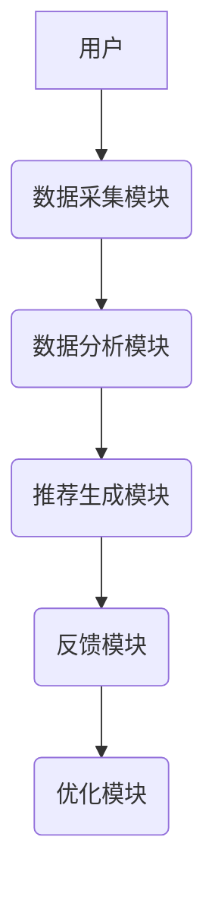

                 


```markdown
# AI Agent在智能个性化教育规划中的应用

> 关键词：AI Agent，智能个性化教育，教育规划，机器学习算法，自然语言处理，个性化推荐系统，系统架构设计

> 摘要：随着人工智能技术的快速发展，AI Agent在教育领域的应用越来越广泛。本文深入探讨了AI Agent在智能个性化教育规划中的应用，分析了其核心概念、算法原理、系统架构设计，并通过项目实战展示了其在实际中的应用效果。文章最后总结了当前的研究成果，并展望了未来的发展方向。

---

## 目录

1. [AI Agent与智能个性化教育规划的背景与概念](#ai-agent与智能个性化教育规划的背景与概念)
2. [AI Agent在个性化教育中的核心算法与实现](#ai-agent在个性化教育中的核心算法与实现)
3. [系统架构设计与项目实战](#系统架构设计与项目实战)
4. [总结与展望](#总结与展望)

---

## 第一部分：AI Agent与智能个性化教育规划的背景与概念

### 1. AI Agent的基本概念

#### 1.1 AI Agent的定义与分类

- **定义**：AI Agent（人工智能代理）是指能够感知环境并采取行动以实现特定目标的智能实体。它可以是一个软件程序、机器人或其他智能系统。
- **分类**：
  - **简单反应式AI Agent**：基于当前感知做出反应，没有内部状态。
  - **基于模型的反应式AI Agent**：维护对环境的内部模型，并根据模型做出决策。
  - **基于效用的AI Agent**：通过最大化效用函数来选择最优行动。

#### 1.2 AI Agent在教育中的应用现状

- **当前应用**：
  - 智能辅导系统：如Knewton、Pearson的MyLab等。
  - 自适应学习平台：根据学生的学习情况动态调整内容。
- **发展趋势**：AI Agent在教育中的应用越来越广泛，特别是在个性化学习方面。

#### 1.3 智能个性化教育的基本概念

- **定义**：根据学生的特点和需求，提供个性化的学习方案和资源。
- **核心要素**：
  - 学习目标：根据学生的学习情况制定个性化目标。
  - 学习路径：根据目标设计的学习步骤。
  - 学习资源：包括教材、视频、练习题等。
  - 学习评价：对学生学习效果的评估。

---

## 第二部分：AI Agent在个性化教育中的核心算法与实现

### 2. 推荐系统算法

#### 2.1 基于协同过滤的推荐算法

- **定义**：通过分析用户的行为数据，找到相似的用户群体，进行推荐。
- **示例**：Amazon的推荐系统。
- **实现步骤**：
  1. 收集用户行为数据。
  2. 计算用户相似度（如余弦相似度）。
  3. 根据相似用户的偏好进行推荐。

#### 2.2 基于内容的推荐算法

- **定义**：根据内容本身的特征进行推荐。
- **示例**：Netflix的推荐系统。
- **实现步骤**：
  1. 提取内容特征（如文本、标签）。
  2. 计算内容相似度。
  3. 根据内容相似度进行推荐。

#### 2.3 混合推荐算法

- **定义**：综合协同过滤和内容推荐的优点，提供更精准的推荐。
- **实现步骤**：
  1. 组合协同过滤和内容推荐的结果。
  2. 根据权重进行融合。

### 3. 自然语言处理算法

#### 3.1 基于词袋模型的文本分析

- **定义**：将文本表示为词汇的集合，不考虑顺序。
- **实现步骤**：
  1. 分词：将文本分割成单词或短语。
  2. 创建词袋模型：记录每个单词的出现情况。

#### 3.2 基于深度学习的文本理解

- **定义**：使用神经网络模型（如LSTM）进行文本理解。
- **实现步骤**：
  1. 数据预处理：将文本转换为数值表示。
  2. 构建神经网络模型：如LSTM、Transformer等。
  3. 训练模型：使用大量数据进行训练。

#### 3.3 基于预训练语言模型的文本生成

- **定义**：使用如BERT、GPT等预训练模型生成文本。
- **实现步骤**：
  1. 使用预训练模型进行微调。
  2. 根据具体任务调整模型参数。

### 4. 个性化学习路径规划算法

#### 4.1 基于聚类的用户分群算法

- **定义**：将学生按照学习特点和需求分成不同的群体。
- **实现步骤**：
  1. 收集学生数据：如学习风格、兴趣、成绩等。
  2. 使用聚类算法（如K-means）进行分群。

#### 4.2 基于强化学习的学习路径优化算法

- **定义**：通过强化学习不断优化学习路径。
- **实现步骤**：
  1. 定义状态、动作和奖励。
  2. 使用强化学习算法（如Q-learning）进行训练。

#### 4.3 基于动态规划的学习目标分解算法

- **定义**：将长期目标分解为短期目标，逐步实现。
- **实现步骤**：
  1. 设定长期目标。
  2. 分解为短期目标。
  3. 根据反馈调整分解策略。

---

## 第三部分：系统架构设计与项目实战

### 5. 系统架构设计

#### 5.1 系统功能设计

- **功能模块**：
  - 数据采集：收集学生的学习数据。
  - 数据分析：分析数据，生成个性化推荐。
  - 推荐生成：根据分析结果生成推荐内容。
  - 反馈与优化：根据反馈调整推荐策略。

#### 5.2 系统架构设计图



#### 5.3 系统接口设计

- **API设计**：
  - RESTful API：用于不同模块之间的通信。

### 6. 项目实战

#### 6.1 环境安装与配置

- **安装工具**：
  - Python
  - TensorFlow
  - Keras
  - Jupyter Notebook

#### 6.2 核心功能实现

- **推荐系统实现**：
  ```python
  import numpy as np

  def collaborative_filtering(user_matrix):
      # 假设user_matrix是用户-物品的评分矩阵
      # 计算用户相似度
      similarity = np.dot(user_matrix, user_matrix.T)
      return similarity
  ```

- **自然语言处理实现**：
  ```python
  from sklearn.feature_extraction.text import TfidfVectorizer

  vectorizer = TfidfVectorizer()
  tfidf = vectorizer.fit_transform(documents)
  ```

#### 6.3 实际案例分析

- **案例分析**：
  - 分析一个学生的学习数据，展示系统如何为其制定个性化学习计划。

---

## 第四部分：总结与展望

### 7. 总结

- **全文总结**：
  - AI Agent在智能个性化教育中的应用具有重要意义。
  - 推荐系统、自然语言处理和学习路径规划是其核心算法。
  - 系统架构设计和项目实战是实现的关键步骤。

### 8. 未来发展方向

- **发展方向**：
  - 更复杂的推荐算法：如深度学习模型的应用。
  - 更智能的自然语言处理模型：如更大规模的预训练模型。
  - 更个性化的学习路径规划：结合更多维度的数据进行优化。

---

## 结语

通过本文的探讨，我们深入理解了AI Agent在智能个性化教育规划中的应用，从核心概念到算法实现，再到系统设计和项目实战，全面展示了其在教育领域的潜力。未来，随着技术的进步，AI Agent在教育中的应用将更加广泛和深入。
```

