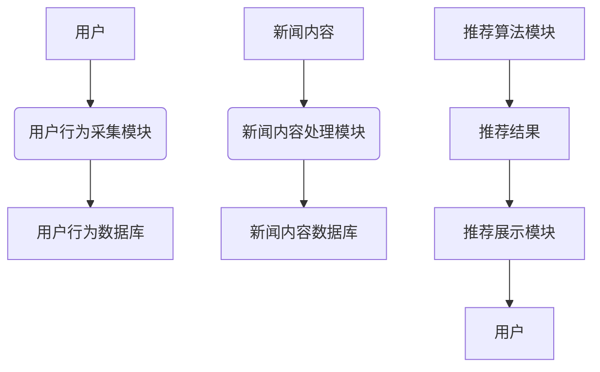

                 


# AI Agent在智能个性化新闻推荐中的应用

> 关键词：AI Agent, 个性化推荐, 新闻推荐, 机器学习, 自然语言处理

> 摘要：本文探讨了AI Agent在智能个性化新闻推荐中的应用，分析了AI Agent的核心概念、推荐算法原理、系统架构设计以及实际应用案例。文章详细介绍了从用户行为分析到新闻内容处理，再到推荐系统实现的全过程，为读者提供了从理论到实践的全面指导。

---

## 第一章: AI Agent与智能个性化新闻推荐概述

### 1.1 AI Agent的基本概念

#### 1.1.1 AI Agent的定义与特点
AI Agent（人工智能代理）是指能够感知环境、自主决策并执行任务的智能实体。其特点包括：
- **自主性**：无需外部干预，自主完成任务。
- **反应性**：能够实时感知环境变化并做出响应。
- **目标导向**：基于目标驱动行为。
- **学习能力**：通过数据和经验不断优化性能。

#### 1.1.2 AI Agent的核心功能与应用场景
AI Agent的核心功能包括：
- **感知环境**：通过传感器或数据接口获取信息。
- **决策与规划**：基于感知信息，制定行动计划。
- **执行任务**：通过执行器或API实现目标。

应用场景广泛，如智能助手、自动驾驶、智能推荐系统等。

#### 1.1.3 个性化推荐的基本原理
个性化推荐通过分析用户行为、偏好和需求，提供定制化的内容推荐。其基本原理包括：
- **用户建模**：构建用户画像，分析用户兴趣和行为特征。
- **内容建模**：对新闻内容进行特征提取，分析其主题、情感倾向等。
- **推荐生成**：基于用户和内容的特征，匹配用户需求，生成推荐结果。

---

### 1.2 智能个性化新闻推荐的背景与意义

#### 1.2.1 传统新闻推荐的局限性
传统新闻推荐系统主要依赖简单的关键词匹配或基于热度的推荐，存在以下问题：
- **推荐结果同质化**：无法满足用户的多样化需求。
- **缺乏个性化**：推荐结果千篇一律，用户体验差。
- **实时性不足**：无法及时响应用户需求变化。

#### 1.2.2 AI Agent在新闻推荐中的优势
AI Agent通过结合机器学习、自然语言处理等技术，显著提升了新闻推荐的效果：
- **精准匹配**：基于用户画像和内容分析，实现精准推荐。
- **实时响应**：能够实时感知用户需求变化，快速调整推荐策略。
- **动态优化**：通过反馈机制不断优化推荐结果，提升用户满意度。

#### 1.2.3 个性化推荐对用户和媒体的价值
- **对用户**：提升阅读体验，满足个性化需求。
- **对媒体**：提高用户留存率和活跃度，增强用户粘性。

---

### 1.3 本章小结
本章介绍了AI Agent的基本概念、个性化推荐的基本原理以及智能个性化新闻推荐的背景与意义。通过分析传统推荐的局限性，突出了AI Agent在新闻推荐中的优势和价值。

---

## 第二章: AI Agent的核心概念与原理

### 2.1 AI Agent的基本原理

#### 2.1.1 AI Agent的感知与决策机制
AI Agent的感知与决策机制包括：
1. **感知环境**：通过数据采集模块获取用户行为、新闻内容等信息。
2. **信息处理**：利用自然语言处理技术对文本进行特征提取和语义分析。
3. **决策制定**：基于处理后的信息，结合用户画像和内容分析结果，制定推荐策略。

#### 2.1.2 基于机器学习的推荐算法
推荐算法是AI Agent实现个性化推荐的核心技术。常用的机器学习算法包括：
- **协同过滤**：基于用户行为数据，发现用户相似性，推荐相似内容。
- **内容推荐**：基于新闻内容的特征向量，计算内容相似度，推荐相关文章。
- **深度学习**：利用神经网络模型，学习更复杂的用户偏好和内容特征。

#### 2.1.3 多目标优化与动态调整
AI Agent需要同时优化多个目标，如用户满意度、推荐系统的实时性、推荐结果的相关性等。动态调整机制能够根据用户反馈和环境变化，实时优化推荐策略。

---

### 2.2 个性化推荐的核心要素

#### 2.2.1 用户画像与行为分析
用户画像是个性化推荐的基础，包括：
- **用户基本信息**：年龄、性别、职业等。
- **用户行为特征**：阅读习惯、点击率、停留时间等。
- **用户偏好**：兴趣爱好、阅读深度等。

#### 2.2.2 新闻内容特征提取
新闻内容的特征提取包括：
- **文本特征**：关键词提取、主题分类、情感分析。
- **结构特征**：文章长度、标题、段落分布等。
- **语义特征**：基于主题模型（如LDA）提取文章主题。

#### 2.2.3 推荐系统的评价指标
常用的推荐系统评价指标包括：
- **准确率**：推荐结果与用户实际兴趣的匹配程度。
- **召回率**：推荐结果覆盖用户兴趣的比例。
- **F1分数**：准确率和召回率的调和平均值。
- **用户满意度**：用户对推荐结果的主观评价。

---

### 2.3 AI Agent与个性化推荐的关系

#### 2.3.1 AI Agent在推荐系统中的角色
AI Agent在推荐系统中扮演着感知环境、处理信息和制定决策的核心角色。它能够实时分析用户行为和内容特征，动态调整推荐策略，从而实现精准推荐。

#### 2.3.2 从传统推荐到智能推荐的转变
传统推荐系统主要依赖规则和统计方法，而智能推荐系统通过引入机器学习和深度学习技术，实现了从“基于规则”到“基于数据驱动”的转变，推荐结果更加精准和个性化。

#### 2.3.3 个性化推荐的边界与外延
个性化推荐的边界在于如何在用户隐私和数据安全的前提下，最大限度地满足用户需求。外延则涉及多模态推荐（如视频、音频推荐）、跨平台推荐等。

---

### 2.4 本章小结
本章详细探讨了AI Agent的核心概念与原理，分析了个性化推荐的核心要素和评价指标，明确了AI Agent在推荐系统中的角色和作用。

---

## 第三章: 智能个性化新闻推荐系统的架构设计

### 3.1 系统功能模块划分

#### 3.1.1 用户行为采集模块
用户行为采集模块负责收集用户的阅读行为数据，包括：
- **用户ID**：唯一标识用户。
- **行为类型**：点击、停留、收藏等。
- **时间戳**：记录行为发生的时间。

#### 3.1.2 新闻内容处理模块
新闻内容处理模块负责对新闻文本进行预处理和特征提取，包括：
- **分词**：对中文文本进行分词处理。
- **词嵌入**：使用Word2Vec等模型生成词向量。
- **主题建模**：利用LDA模型提取文章主题。

#### 3.1.3 推荐算法实现模块
推荐算法实现模块是系统的核心部分，负责根据用户行为和新闻内容特征，生成推荐结果。常用的算法包括：
- **协同过滤**：基于用户行为数据，计算用户相似度和文章相似度。
- **深度学习模型**：使用神经网络模型（如DNN、CNN）进行推荐。

#### 3.1.4 推荐结果展示模块
推荐结果展示模块负责将推荐结果呈现给用户，包括：
- **推荐列表**：展示推荐的新闻标题和摘要。
- **推荐理由**：解释推荐的原因，增强用户体验。

---

### 3.2 系统架构设计

#### 3.2.1 分层架构设计
系统采用分层架构，包括数据层、业务逻辑层和表现层：
- **数据层**：存储用户行为数据和新闻内容数据。
- **业务逻辑层**：实现推荐算法和决策逻辑。
- **表现层**：展示推荐结果和用户交互界面。

#### 3.2.2 微服务架构设计
微服务架构设计能够提高系统的扩展性和维护性。系统主要分为以下几个微服务：
- **用户服务**：负责用户认证和用户画像管理。
- **内容服务**：负责新闻内容的存储和特征提取。
- **推荐服务**：负责推荐算法的实现和推荐结果生成。
- **展示服务**：负责推荐结果的展示和用户交互。

#### 3.2.3 数据流与交互流程
系统数据流与交互流程如下：



---

### 3.3 系统实现的关键技术

#### 3.3.1 自然语言处理技术
自然语言处理技术是新闻内容处理的核心，常用的工具有：
- **分词工具**：如jieba。
- **词嵌入模型**：如Word2Vec、Gensim。
- **主题模型**：如LDA。

#### 3.3.2 机器学习算法
常用的机器学习算法包括：
- **协同过滤算法**：如基于用户的协同过滤（UBCF）和基于物品的协同过滤（IBCF）。
- **深度学习模型**：如神经网络模型（DNN、CNN、RNN）。

#### 3.3.3 实时推荐机制
实时推荐机制能够根据用户的实时行为，动态调整推荐结果。常用的实时推荐技术包括：
- **在线学习**：基于实时数据更新模型参数。
- **流数据处理**：利用流处理技术（如Kafka、Flink）实时处理用户行为数据。

---

### 3.4 本章小结
本章详细探讨了智能个性化新闻推荐系统的架构设计，包括功能模块划分、系统架构设计和关键技术创新。通过合理的架构设计和技术创新，能够显著提升推荐系统的性能和用户体验。

---

## 第四章: 基于AI Agent的推荐算法原理

### 4.1 基于协同过滤的推荐算法

#### 4.1.1 基于用户的协同过滤
基于用户的协同过滤算法（UBCF）通过计算用户之间的相似度，将相似用户的偏好作为推荐依据。相似度计算公式如下：

$$
similarity(u_i, u_j) = \frac{\sum_{k} (r_{u_i,k} - \bar{r_{u_i}})(r_{u_j,k} - \bar{r_{u_j}})}{\sqrt{\sum_{k} (r_{u_i,k} - \bar{r_{u_i}})^2} \cdot \sqrt{\sum_{k} (r_{u_j,k} - \bar{r_{u_j}})^2}}
$$

其中，$r_{u_i,k}$表示用户$i$对物品$k$的评分，$\bar{r_{u_i}}$表示用户$i$的平均评分。

#### 4.1.2 基于物品的协同过滤
基于物品的协同过滤算法（IBCF）通过计算物品之间的相似度，将相似物品推荐给用户。相似度计算公式如下：

$$
similarity(i_j, i_k) = \frac{\sum_{u} (r_{u,i_j} - \bar{r_{i_j}})(r_{u,i_k} - \bar{r_{i_k}})}{\sqrt{\sum_{u} (r_{u,i_j} - \bar{r_{i_j}})^2} \cdot \sqrt{\sum_{u} (r_{u,i_k} - \bar{r_{i_k}})^2}}
$$

其中，$r_{u,i_j}$表示用户$u$对物品$j$的评分，$\bar{r_{i_j}}$表示物品$j$的平均评分。

#### 4.1.3 混合协同过滤算法
混合协同过滤算法结合了基于用户和基于物品的协同过滤算法的优势，能够提升推荐系统的准确率和召回率。

---

### 4.2 基于内容的推荐算法

#### 4.2.1 文本相似度计算
基于文本相似度的推荐算法通过计算新闻内容的相似度，推荐相关文章。常用的文本相似度计算方法包括：
- **余弦相似度**：计算两个向量的余弦值。
- **Jaccard相似度**：计算两个集合的相似度。

#### 4.2.2 主题模型与文本挖掘
主题模型（如LDA）能够发现新闻内容的主题结构，帮助推荐系统更好地理解文章内容。文本挖掘技术能够提取新闻内容的关键词和语义信息，为推荐系统提供丰富的特征。

#### 4.2.3 基于向量空间模型的推荐
基于向量空间模型的推荐算法将新闻内容表示为向量空间中的点，通过计算向量的相似度进行推荐。

---

### 4.3 基于深度学习的推荐算法

#### 4.3.1 基于神经网络的推荐模型
深度学习模型（如DNN、CNN、RNN）能够从海量数据中学习复杂的用户偏好和内容特征。例如，使用卷积神经网络（CNN）对新闻文本进行特征提取，能够捕捉到文本中的语义信息和上下文信息。

#### 4.3.2 基于注意力机制的推荐
注意力机制能够帮助模型关注重要的特征，提升推荐的准确率。例如，使用自注意力机制（Self-Attention）对用户行为序列进行建模，能够捕捉到用户行为的长短期依赖关系。

#### 4.3.3 基于强化学习的推荐
强化学习是一种通过试错机制优化推荐策略的方法。例如，使用Q-learning算法对推荐策略进行优化，能够在动态环境下实现更优的推荐效果。

---

### 4.4 本章小结
本章详细探讨了基于AI Agent的推荐算法原理，包括协同过滤算法、内容推荐算法和深度学习推荐算法。通过对比不同算法的优缺点，能够更好地理解AI Agent在推荐系统中的应用。

---

## 第五章: 智能个性化新闻推荐系统的实现

### 5.1 系统实现的关键技术

#### 5.1.1 数据预处理
数据预处理是推荐系统实现的基础，包括：
- **数据清洗**：去除噪声数据，如重复数据、无效数据。
- **数据转换**：将数据转换为适合算法处理的形式，如数值化处理。

#### 5.1.2 推荐算法实现
推荐算法的实现需要结合具体的数据特征和业务需求，选择合适的算法进行实现。例如，使用协同过滤算法实现基于用户的推荐，使用深度学习模型实现基于内容的推荐。

#### 5.1.3 推荐结果优化
推荐结果的优化包括：
- **多样性优化**：避免推荐结果的同质化。
- **实时性优化**：提升推荐结果的实时响应速度。
- **个性化优化**：进一步提升推荐结果的个性化程度。

---

### 5.2 项目实战

#### 5.2.1 环境安装
推荐系统的实现需要安装以下工具和库：
- **编程语言**：Python。
- **深度学习框架**：TensorFlow或PyTorch。
- **自然语言处理库**：jieba、spaCy。
- **数据存储**：MySQL或MongoDB。

#### 5.2.2 核心实现代码
以下是基于协同过滤算法的推荐系统实现代码示例：

```python
import numpy as np
from sklearn.metrics.pairwise import cosine_similarity

# 用户行为数据
user_item_matrix = np.array([[4, 3, 0],
                              [3, 2, 5],
                              [0, 5, 3]])

# 计算用户相似度
user_similarity = cosine_similarity(user_item_matrix)

# 推荐结果
def recommend_users(user_id, user_similarity, user_item_matrix):
    similar_users = np.argsort(user_similarity[user_id])[::-1]
    recommend_items = []
    for u in similar_users:
        if u != user_id:
            for item in range(len(user_item_matrix[u])):
                if user_item_matrix[user_id][item] == 0 and user_item_matrix[u][item] > 0:
                    recommend_items.append(item)
    return recommend_items

# 示例推荐
user_id = 0
print(recommend_users(user_id, user_similarity, user_item_matrix))
```

#### 5.2.3 案例分析
通过实际案例分析，验证推荐系统的实现效果。例如，分析推荐系统的准确率、召回率和用户满意度等指标，评估推荐系统的性能。

---

### 5.3 本章小结
本章通过项目实战，详细介绍了智能个性化新闻推荐系统的实现过程，包括环境安装、核心算法实现和案例分析。通过实际案例分析，能够更好地理解AI Agent在推荐系统中的应用。

---

## 第六章: 推荐系统的优化与扩展

### 6.1 系统优化策略

#### 6.1.1 算法优化
算法优化包括：
- **模型优化**：调整模型参数，提升推荐效果。
- **算法融合**：结合多种算法的优势，提升推荐系统的性能。

#### 6.1.2 数据优化
数据优化包括：
- **数据增强**：增加数据多样性，提升模型的泛化能力。
- **数据清洗**：去除噪声数据，提升模型的准确性。

#### 6.1.3 系统性能优化
系统性能优化包括：
- **计算优化**：优化算法的时间复杂度，提升系统的运行效率。
- **资源优化**：合理分配系统资源，提升系统的扩展性。

---

### 6.2 推荐系统的扩展与未来趋势

#### 6.2.1 多模态推荐
多模态推荐是指结合文本、图像、视频等多种数据形式的推荐。例如，结合新闻文本和图片进行推荐，能够提升推荐结果的丰富性和多样性。

#### 6.2.2 跨平台推荐
跨平台推荐是指在不同平台（如PC端、移动端、网页端）之间实现推荐结果的共享和一致性。例如，用户在PC端阅读的文章，能够在移动端继续阅读。

#### 6.2.3 个性化推荐的未来趋势
个性化推荐的未来发展趋势包括：
- **实时化**：推荐结果能够实时响应用户需求。
- **智能化**：推荐系统更加智能化，能够主动发现用户的潜在需求。
- **个性化定制**：推荐系统能够提供更加个性化的定制服务。

---

### 6.3 本章小结
本章探讨了推荐系统的优化策略和扩展方向，包括算法优化、数据优化和系统性能优化。同时，分析了个性化推荐的未来发展趋势，为读者提供了更广阔的视野。

---

## 第七章: 总结与展望

### 7.1 本章总结
本文详细探讨了AI Agent在智能个性化新闻推荐中的应用，从AI Agent的基本概念到推荐算法的实现，再到系统的优化与扩展，为读者提供了全面的指导。

### 7.2 未来展望
随着人工智能技术的不断发展，智能个性化新闻推荐系统将更加智能化和个性化。未来的研究方向包括：
- **多模态推荐**：结合更多数据形式，提升推荐结果的丰富性和多样性。
- **实时推荐**：提升推荐结果的实时响应能力。
- **智能化推荐**：通过更高级的AI技术，实现更加智能化的推荐。

---

## 关键词
AI Agent, 个性化推荐, 新闻推荐, 机器学习, 自然语言处理

---

## 摘要
本文探讨了AI Agent在智能个性化新闻推荐中的应用，分析了AI Agent的核心概念、推荐算法原理、系统架构设计以及实际应用案例。文章详细介绍了从用户行为分析到新闻内容处理，再到推荐系统实现的全过程，为读者提供了从理论到实践的全面指导。

