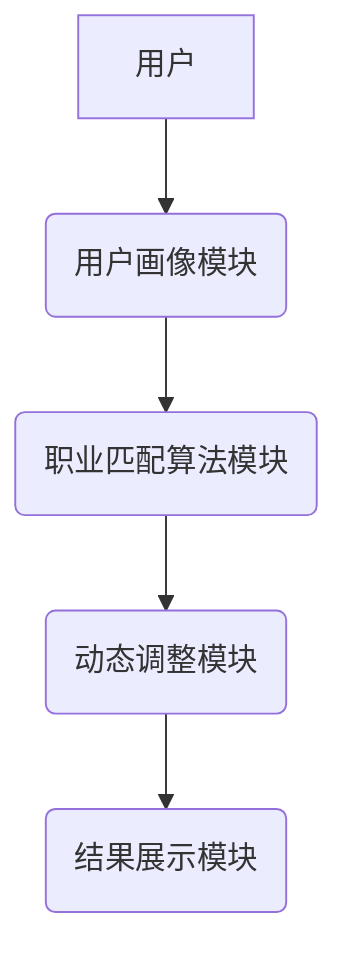
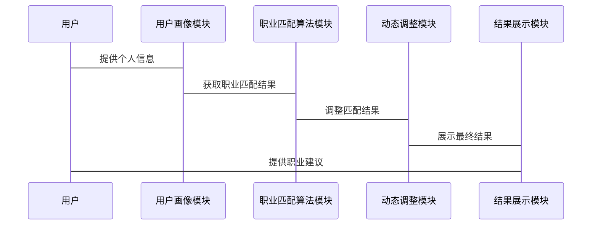

                 


# AI Agent在智能个性化职业规划中的应用

> 关键词：AI Agent, 智能职业规划, 个性化职业匹配, 知识表示, 行为规划, 人机交互

> 摘要：AI Agent作为一种智能化的决策辅助工具，在职业规划领域展现出了巨大的潜力。本文从AI Agent的核心原理出发，探讨其在个性化职业规划中的应用，包括系统设计、算法实现、实际案例分析等方面，深入剖析AI Agent如何帮助用户实现智能化、个性化的职业规划。

---

# 第一部分: AI Agent与智能个性化职业规划的背景介绍

## 第1章: AI Agent的基本概念与核心原理

### 1.1 AI Agent的定义与特点
#### 1.1.1 AI Agent的定义
AI Agent（人工智能代理）是一种能够感知环境、自主决策并执行任务的智能实体。它通过接收输入信息、分析问题、制定解决方案并执行操作，帮助用户完成特定目标。

#### 1.1.2 AI Agent的核心特点
- **自主性**：AI Agent能够在没有外部干预的情况下自主运行。
- **反应性**：能够实时感知环境变化并做出相应调整。
- **目标导向**：基于预设的目标或用户需求，进行任务规划和执行。
- **学习能力**：通过数据反馈不断优化自身的决策能力。

#### 1.1.3 AI Agent与传统算法的区别
| 特性 | AI Agent | 传统算法 |
|------|----------|----------|
| 决策方式 | 基于环境反馈动态调整 | 预设规则，固定执行 |
| 学习能力 | 具备自适应学习能力 | 无法自适应，依赖人工优化 |
| 应用场景 | 适用于复杂、动态的环境 | 适用于简单、静态的环境 |

### 1.2 智能个性化职业规划的背景
#### 1.2.1 当前职业规划的痛点
- 职业选择多样性大，用户难以找到最适合自己的方向。
- 传统职业规划工具缺乏个性化，难以满足用户的动态需求。
- 信息更新速度慢，无法适应快速变化的就业市场。

#### 1.2.2 个性化职业规划的重要性
个性化职业规划能够帮助用户明确职业目标、提升职业匹配度，并在职业发展中提供实时指导。

#### 1.2.3 AI Agent在职业规划中的应用潜力
AI Agent可以通过分析用户的兴趣、技能、职业目标等信息，提供个性化的职业建议和动态调整方案，显著提升职业规划的效率和准确性。

### 1.3 AI Agent在职业规划中的作用
#### 1.3.1 AI Agent如何实现个性化匹配
通过收集和分析用户数据，AI Agent能够为用户推荐最适合的职业方向，并提供职业发展路径的规划。

#### 1.3.2 AI Agent在职业咨询中的优势
- **高效性**：AI Agent能够快速处理大量数据，提供实时反馈。
- **个性化**：基于用户的动态需求，提供定制化的职业建议。
- **可扩展性**：能够同时为大量用户提供服务，资源消耗较低。

#### 1.3.3 AI Agent的可扩展性和适应性
AI Agent能够根据市场变化和用户需求的变化，动态调整职业建议，确保职业规划的持续优化。

---

# 第2章: AI Agent的核心概念与联系

## 第2章 AI Agent的核心概念与联系

### 2.1 AI Agent的核心概念原理
#### 2.1.1 知识表示与推理
AI Agent通过构建知识图谱，将职业信息、用户需求等转化为可计算的数据结构，以便进行推理和决策。

#### 2.1.2 行为规划与决策
AI Agent基于目标和环境信息，制定行动方案，并选择最优的行为路径。

#### 2.1.3 人机交互与反馈机制
通过自然语言处理和用户反馈，AI Agent能够与用户进行有效沟通，并根据反馈优化决策过程。

### 2.2 个性化职业规划模型的构建
#### 2.2.1 用户画像与职业目标
通过收集用户的兴趣、技能、价值观等信息，构建用户画像，并明确其职业目标。

#### 2.2.2 职业匹配算法
基于用户的画像，AI Agent通过协同过滤、深度学习等算法，推荐最适合的职业方向。

#### 2.2.3 动态调整与优化机制
根据市场变化和用户反馈，动态调整职业建议，确保规划的持续优化。

### 2.3 AI Agent与个性化职业规划的关系
#### 2.3.1 AI Agent作为职业规划工具的可行性
AI Agent能够通过数据驱动的方式，提供精准的职业匹配和规划建议。

#### 2.3.2 AI Agent与职业咨询师的协同作用
AI Agent可以作为职业咨询师的辅助工具，帮助用户快速找到适合的职业方向，同时职业咨询师可以提供个性化指导。

#### 2.3.3 AI Agent在职业规划中的边界与外延
AI Agent主要用于数据处理和初步匹配，其应用边界在于无法完全替代人类的创造力和情感因素。

---

# 第3章: AI Agent在个性化职业规划中的系统分析

## 第3章 AI Agent在个性化职业规划中的系统分析

### 3.1 问题场景介绍
#### 3.1.1 用户需求分析
用户希望通过AI Agent获得个性化的职业建议，包括职业匹配、职业发展路径规划等。

#### 3.1.2 系统目标设定
系统目标是通过AI Agent帮助用户实现个性化的职业规划，提供高效、精准的职业建议。

#### 3.1.3 系统功能概述
- 用户信息收集与分析
- 职业匹配算法实现
- 动态调整与优化
- 结果展示与反馈

### 3.2 系统架构设计
#### 3.2.1 系统功能模块划分
- 用户画像模块
- 职业匹配算法模块
- 动态调整模块
- 结果展示模块

#### 3.2.2 系统架构的Mermaid图


#### 3.2.3 系统交互的Mermaid图


### 3.3 系统接口与交互设计
#### 3.3.1 系统接口设计
- 用户通过网页或移动应用输入个人信息。
- 系统通过API接口调用职业匹配算法模块。
- 结果通过图形界面展示给用户。

#### 3.3.2 系统交互流程的Mermaid图


---

# 第4章: AI Agent在个性化职业规划中的算法实现

## 第4章 AI Agent在个性化职业规划中的算法实现

### 4.1 算法原理
#### 4.1.1 协同过滤算法
协同过滤是一种基于用户相似性推荐算法，通过分析用户的兴趣和行为，找到与用户相似的群体，推荐他们的职业方向。

#### 4.1.2 基于深度学习的职业匹配模型
通过神经网络学习用户特征和职业特征，构建嵌入向量，计算职业匹配度。

### 4.2 算法实现
#### 4.2.1 协同过滤算法实现
```python
def collaborative_filtering(user_id, user_data):
    # 计算用户相似性
    similarities = {}
    for user in user_data:
        if user != user_id:
            similarity = calculate_similarity(user_id, user, user_data)
            similarities[user] = similarity
    # 找到最相似的用户
    similar_user = max(similarities, key=lambda k: similarities[k])
    return user_data[similar_user]['recommended_jobs']
```

#### 4.2.2 基于深度学习的模型实现
```python
import tensorflow as tf
from tensorflow.keras import layers

model = tf.keras.Sequential()
model.add(layers.Dense(64, activation='relu', input_dim=10))
model.add(layers.Dense(1, activation='sigmoid'))
model.compile(optimizer='adam', loss='binary_crossentropy', metrics=['accuracy'])
model.fit(x_train, y_train, epochs=10, batch_size=32)
```

### 4.3 数学模型与公式
#### 4.3.1 协同过滤模型
$$ \text{相似度} = \frac{\sum_{i=1}^{n}(r_{u,i} - \bar{r}_u)(r_{v,i} - \bar{r}_v)}{\sqrt{\sum_{i=1}^{n}(r_{u,i} - \bar{r}_u)^2} \cdot \sqrt{\sum_{i=1}^{n}(r_{v,i} - \bar{r}_v)^2}} } $$

#### 4.3.2 基于矩阵分解的模型
$$ X = U \cdot V^T $$

---

# 第5章: 项目实战与案例分析

## 第5章 项目实战与案例分析

### 5.1 项目环境配置
#### 5.1.1 环境要求
- Python 3.8+
- TensorFlow 2.0+
- Pandas 1.0+

#### 5.1.2 数据准备
- 用户信息数据集
- 职业信息数据集

### 5.2 系统核心实现
#### 5.2.1 用户画像模块实现
```python
def create_user_profile(user_data):
    # 提取用户的基本信息
    profile = {
        'age': user_data['age'],
        'education': user_data['education'],
        'skills': user_data['skills']
    }
    return profile
```

#### 5.2.2 职业匹配算法实现
```python
def match_jobs(user_profile, job_data):
    # 基于用户的兴趣和技能推荐职业
    matches = []
    for job in job_data:
        match_score = calculate_match_score(user_profile, job)
        if match_score > 0.7:
            matches.append(job)
    return matches
```

### 5.3 案例分析
#### 5.3.1 案例背景
用户小张是一位计算机科学专业的学生，希望找到与他的兴趣和技能匹配的职业方向。

#### 5.3.2 算法实现
```python
user_profile = create_user_profile(user_data)
recommended_jobs = match_jobs(user_profile, job_data)
print(recommended_jobs)
```

#### 5.3.3 结果展示
根据算法推荐，小张的职业匹配结果包括软件开发工程师、数据分析师等职位，最终小张选择了软件开发工程师，并在AI Agent的帮助下完成了职业规划。

---

# 第6章: 总结与展望

## 第6章 总结与展望

### 6.1 总结
AI Agent在智能个性化职业规划中的应用展现了巨大的潜力，通过数据驱动的方式，能够为用户提供精准的职业匹配和动态规划建议。

### 6.2 展望
随着AI技术的不断发展，AI Agent在职业规划中的应用将更加广泛和深入，未来的挑战在于如何平衡算法的精准性和用户的情感需求。

### 6.3 最佳实践 Tips
- 在使用AI Agent进行职业规划时，建议结合职业咨询师的指导。
- 定期更新用户画像和职业数据，确保规划的准确性。

---

# 第7章: 结语

AI Agent作为一项前沿技术，正在逐步改变我们的生活方式和工作方式。在职业规划领域，AI Agent的应用不仅提升了效率，还为用户提供了更加个性化和精准的服务。未来，随着技术的不断进步，AI Agent将在更多领域发挥重要作用，为人类创造更大的价值。

