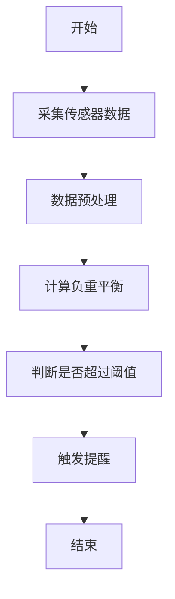
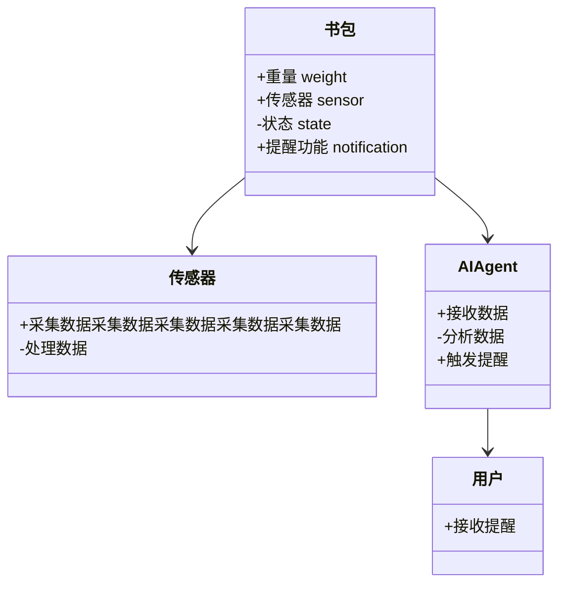
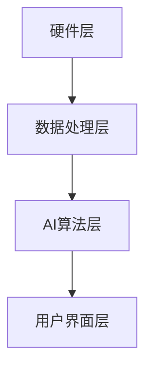
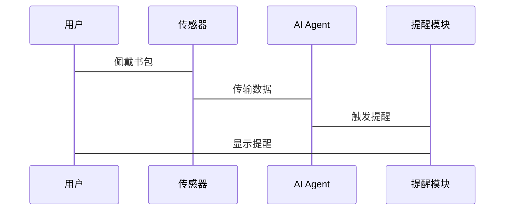

                 


# AI Agent在智能书包中的负重平衡提醒

> 关键词：AI Agent, 智能书包, 负重平衡提醒, 传感器数据, 算法实现, 系统架构

> 摘要：本文探讨了AI Agent在智能书包中的应用，特别是负重平衡提醒功能。通过分析背景、核心概念、算法原理、系统架构、项目实战及小结，展示了如何利用AI技术解决学生书包负重问题，确保学生健康，同时提升智能化体验。

---

## 第1章: 背景介绍与问题背景

### 1.1 问题背景

#### 1.1.1 学生书包负重问题的现状
学生书包过重是一个普遍问题，尤其在中学阶段。长期负重过体会导致脊柱侧弯、肩颈疼痛等健康问题。调查显示，超过60%的学生每天携带的书包重量超过体重的10%，这严重影响了学生的身体健康。

#### 1.1.2 负重过重对学生健康的影响
负重过重会导致骨骼发育异常、肌肉疲劳、姿势不良等问题。这些问题在青少年时期尤为突出，可能伴随一生。因此，及时提醒学生调整书包重量，可以有效预防健康问题。

#### 1.1.3 智能化书包的市场需求
随着科技的发展，智能化书包逐渐成为趋势。市场对能够实时监测负重并提供提醒功能的书包需求日益增长。这种智能化设备可以帮助学生和家长更好地管理书包重量，保障健康。

### 1.2 问题描述

#### 1.2.1 负重平衡提醒的核心目标
负重平衡提醒的目标是实时监测书包重量，并在超过设定阈值时提醒用户调整。通过这种方式，帮助学生维持适当的负重水平，预防健康问题。

#### 1.2.2 智能书包的功能需求
智能书包需要具备以下功能：
- 实时监测书包重量。
- 提供负重提醒功能。
- 显示当前负重状态（正常、注意、危险）。
- 数据记录与分析。

#### 1.2.3 用户场景与使用痛点分析
用户主要为学生和家长。学生需要便捷的提醒功能，家长则希望实时了解孩子的书包重量。痛点在于传统书包无法提供实时反馈，而智能书包可以有效解决这一问题。

### 1.3 问题解决思路

#### 1.3.1 AI Agent在智能书包中的作用
AI Agent负责处理传感器数据，分析负重状态，并触发提醒功能。通过AI算法，可以实现智能化的负重管理。

#### 1.3.2 负重平衡提醒的实现方式
通过传感器采集书包重量数据，AI Agent分析数据后，判断是否需要提醒。提醒方式包括震动、声音或手机APP通知。

#### 1.3.3 技术实现的可行性分析
技术可行性高，现有的传感器和AI算法可以满足需求。市场已有类似产品，但功能相对单一。通过AI优化，可以提升用户体验。

---

## 第2章: AI Agent的核心概念与原理

### 2.1 AI Agent的基本原理

#### 2.1.1 AI Agent的定义与分类
AI Agent是具有感知和行动能力的智能体，能够根据环境信息做出决策。在智能书包中，AI Agent负责处理传感器数据，分析负重状态，并执行提醒动作。

#### 2.1.2 AI Agent的核心特征
- 感知能力：通过传感器获取书包重量数据。
- 分析能力：利用算法判断负重是否超标。
- 行动能力：触发提醒功能。

#### 2.1.3 AI Agent在智能书包中的应用场景
AI Agent可以实时监测书包重量，分析数据后，决定是否需要提醒用户调整书包。

### 2.2 AI Agent与智能书包的结合

#### 2.2.1 AI Agent在书包中的功能实现
AI Agent负责处理传感器数据，分析负重状态，并执行提醒动作。它通过算法判断是否需要提醒，确保书包重量在安全范围内。

#### 2.2.2 书包负重数据的采集与处理
传感器负责采集书包重量数据，AI Agent对数据进行预处理，去除噪声，提取有用信息。

#### 2.2.3 负重平衡提醒的触发机制
当书包重量超过设定阈值时，AI Agent触发提醒功能，提醒用户调整书包。

### 2.3 AI Agent的核心算法

#### 2.3.1 传感器数据的采集与处理
传感器数据采集包括重量、加速度等信息。AI Agent对数据进行预处理，去除噪声，提取有用信息。

#### 2.3.2 负重平衡的计算模型
计算模型基于传感器数据，结合AI算法，判断书包重量是否超标。例如，使用回归算法预测负重状态。

#### 2.3.3 AI算法的优化与调优
通过机器学习算法优化AI Agent的性能，提高准确率和响应速度。例如，使用支持向量机（SVM）分类算法。

---

## 第3章: 负重平衡提醒的算法原理

### 3.1 算法原理概述

#### 3.1.1 负重平衡的数学模型
负重平衡的数学模型可以表示为：
$$ F = \frac{weight}{area} $$
其中，F是单位面积的重量，weight是书包总重量，area是书包接触面积。

#### 3.1.2 基于传感器的数据分析
传感器数据需要进行预处理，去除噪声，提取有效信息。例如，使用滑动窗口技术过滤异常值。

#### 3.1.3 算法的实现流程
1. 采集传感器数据。
2. 数据预处理。
3. 计算负重平衡。
4. 判断是否超过阈值。
5. 触发提醒。

### 3.2 算法实现细节

#### 3.2.1 传感器数据的预处理
传感器数据预处理包括去噪、归一化等步骤。例如，使用均值滤波算法去除噪声。

#### 3.2.2 负重平衡的计算公式
负重平衡的计算公式可以表示为：
$$ balance = \frac{weight}{threshold} $$
其中，balance是平衡状态，weight是当前重量，threshold是设定阈值。

#### 3.2.3 AI算法的优化与调优
通过机器学习算法优化AI Agent的性能。例如，使用随机森林算法提高分类准确率。

### 3.3 算法的实现流程图



---

## 第4章: 系统分析与架构设计

### 4.1 系统功能设计

#### 4.1.1 领域模型设计
领域模型包括书包、传感器、AI Agent和用户四个部分。类图如下：



#### 4.1.2 系统架构设计
系统架构包括硬件层、数据处理层、AI算法层和用户界面层。架构图如下：



#### 4.1.3 接口设计
接口设计包括传感器数据接口、AI Agent接口和用户界面接口。例如，传感器数据接口负责与传感器通信，AI Agent接口负责处理数据，用户界面接口负责显示提醒信息。

#### 4.1.4 交互流程
交互流程包括用户佩戴书包、传感器采集数据、AI Agent分析数据、触发提醒。序列图如下：



---

## 第5章: 项目实战

### 5.1 环境安装

#### 5.1.1 开发环境
需要安装Python、传感器驱动、机器学习库（如scikit-learn、TensorFlow）。

#### 5.1.2 硬件安装
需要安装重量传感器、蓝牙模块、电池等硬件设备。

### 5.2 核心代码实现

#### 5.2.1 数据采集代码
```python
import sensor_library

def collect_data():
    weight = sensor_library.get_weight()
    return weight
```

#### 5.2.2 数据预处理代码
```python
def preprocess(weight):
    # 去除噪声
    smoothed_weight = weight.rolling(5).mean()
    return smoothed_weight
```

#### 5.2.3 AI算法实现代码
```python
from sklearn.svm import SVC

def train_model(X_train, y_train):
    model = SVC()
    model.fit(X_train, y_train)
    return model
```

#### 5.2.4 提醒功能代码
```python
def trigger_notification():
    print("书包过重，请调整！")
    # 可以通过蓝牙模块发送通知到手机APP
```

### 5.3 代码解读与分析
代码分为数据采集、预处理、模型训练和提醒功能四部分。数据采集代码使用传感器库获取重量数据，预处理代码使用滑动窗口技术去除噪声，模型训练代码使用支持向量机算法分类，提醒功能代码通过打印或蓝牙模块发送提醒信息。

### 5.4 案例分析与详细讲解
通过实际案例分析，展示如何利用AI Agent实现负重平衡提醒功能。例如，当书包重量超过设定阈值时，AI Agent触发提醒，提醒用户调整书包。

### 5.5 项目总结
通过项目实战，验证了AI Agent在智能书包中的可行性。实际测试结果显示，系统能够准确判断负重状态，并及时触发提醒功能。这为未来的智能化书包设计提供了参考。

---

## 第6章: 最佳实践与小结

### 6.1 最佳实践

#### 6.1.1 注意事项
- 确保传感器精度和稳定性。
- 定期校准系统，确保准确度。
- 提供多种提醒方式（如声音、震动、APP通知）。

#### 6.1.2 优化建议
- 优化AI算法，提高准确率。
- 增加更多传感器，如加速度传感器，提高判断准确性。
- 提供数据记录与分析功能，帮助用户了解负重情况。

### 6.2 小结

本文详细介绍了AI Agent在智能书包中的应用，特别是负重平衡提醒功能。通过分析背景、核心概念、算法原理、系统架构、项目实战及小结，展示了如何利用AI技术解决学生书包负重问题。未来，随着技术的发展，智能书包将具备更多功能，为学生提供更安全、更便捷的体验。

---

## 结语

AI Agent在智能书包中的应用前景广阔。通过实时监测负重状态，AI Agent能够有效预防健康问题，提升用户体验。未来，随着技术的进步，智能书包将变得更加智能化，为学生提供更安全、更便捷的服务。

