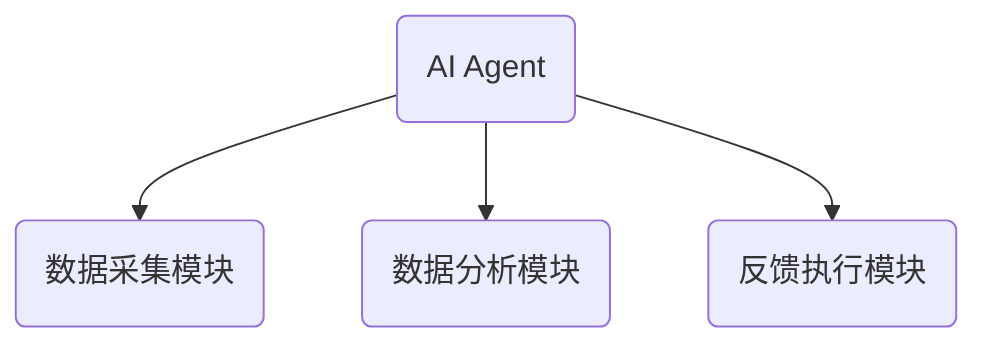
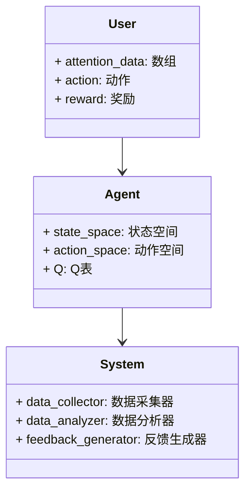
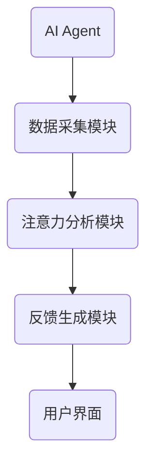

                 


# AI Agent在智能书桌中的专注力训练系统

> 关键词：AI Agent, 专注力训练, 智能书桌, 强化学习, 注意力机制

> 摘要：本文详细探讨了AI Agent在智能书桌中的专注力训练系统的应用，从背景、核心概念、算法原理、系统架构到项目实战，全面分析了如何利用AI技术提升用户的专注力。通过数学公式、mermaid图表和代码实现，本文为读者提供了深入的技术细节和实践指导。

---

# 第一部分: AI Agent与专注力训练系统背景介绍

## 第1章: 专注力训练的背景与需求

### 1.1 专注力的重要性

#### 1.1.1 专注力的定义与作用
专注力是指在特定任务或目标上集中注意力的能力。在当今信息爆炸的时代，专注力是提高学习和工作效率的关键能力。研究表明，持续的分心和多任务处理会导致注意力分散，降低工作效率和质量。

#### 1.1.2 当代社会中专注力的挑战
现代人面临着前所未有的信息干扰，社交媒体、即时通讯工具等不断分散人们的注意力。据统计，普通人在工作时平均每分钟会被干扰打断2次，这使得专注力训练变得尤为重要。

#### 1.1.3 提高专注力的必要性
专注力的提升不仅有助于工作效率的提高，还能改善生活质量。通过科学的专注力训练，人们可以更好地管理自己的注意力，提升学习效率、工作效率和创造力。

---

### 1.2 AI Agent的基本概念

#### 1.2.1 AI Agent的定义与特点
AI Agent（人工智能代理）是指具有感知环境、做出决策并执行操作的智能实体。与传统软件不同，AI Agent能够根据环境反馈动态调整行为，具有自主性和适应性。

#### 1.2.2 AI Agent的核心功能与应用场景
AI Agent的核心功能包括感知、决策、执行和学习。它广泛应用于推荐系统、自动驾驶、智能助手等领域。

#### 1.2.3 AI Agent与传统软件的区别
AI Agent能够自主学习和优化，能够根据环境变化调整行为，而传统软件通常只能按照预设的规则运行。

---

### 1.3 AI Agent在专注力训练中的应用

#### 1.3.1 专注力训练的数字化需求
传统的专注力训练通常依赖于冥想、番茄工作法等方法，但缺乏个性化的反馈和指导。AI Agent可以通过实时监测用户的注意力状态，提供个性化的训练建议。

#### 1.3.2 AI Agent在专注力训练中的角色
AI Agent可以作为用户的“数字教练”，实时分析用户的注意力数据，提供反馈和训练建议。例如，通过监测用户的眨眼频率、心率变化等生理指标，AI Agent可以判断用户是否处于专注状态。

#### 1.3.3 AI Agent与智能书桌的结合
智能书桌是一种结合了硬件和软件的设备，可以通过传感器和AI技术监测用户的注意力和行为习惯。AI Agent在其中充当“智能助手”，帮助用户优化专注力。

---

## 第2章: 专注力训练系统的核心概念与联系

### 2.1 专注力训练系统的原理

#### 2.1.1 系统输入与输出
- **输入**：用户的注意力数据（如心率、眨眼频率、键盘输入延迟等）。
- **输出**：个性化的专注力训练建议、注意力提升策略。

#### 2.1.2 系统的核心算法与模型
- 基于强化学习的专注力训练算法。
- 基于注意力机制的用户行为分析模型。

#### 2.1.3 系统的反馈机制
系统根据用户的注意力状态提供实时反馈，例如通过调整屏幕亮度、播放白噪音等方式帮助用户保持专注。

---

### 2.2 AI Agent与专注力训练系统的关联

#### 2.2.1 AI Agent在系统中的功能模块
- 数据采集模块：采集用户的注意力数据。
- 数据分析模块：分析数据并生成训练建议。
- 反馈执行模块：根据分析结果调整环境参数。

#### 2.2.2 系统中AI Agent与用户交互的流程
1. 用户开始使用智能书桌。
2. AI Agent通过传感器采集用户的注意力数据。
3. 数据分析模块生成专注力评估报告。
4. AI Agent根据评估结果提供个性化建议。

#### 2.2.3 系统中AI Agent与其他模块的关系


---

### 2.3 系统核心概念的ER实体关系图

```mermaid
er
actor: 用户
agent: AI代理
system: 专注力训练系统
ability: 专注力能力
feedback: 反馈信息
goal: 训练目标
action: 用户操作
```

---

## 第3章: 系统的核心算法与数学模型

### 3.1 算法原理

#### 3.1.1 基于强化学习的专注力训练算法
强化学习是一种通过试错机制来优化决策的算法。在专注力训练中，AI Agent可以通过强化学习算法，根据用户的注意力状态调整训练策略。

#### 3.1.2 注意力机制的实现原理
注意力机制是一种模拟人类注意力分配的机制，常用于自然语言处理领域。在专注力训练中，注意力机制可以用于分析用户的注意力分布。

#### 3.1.3 算法的优化与改进
通过引入遗忘门控机制和注意力权重调整，可以进一步优化算法的性能。

---

### 3.2 数学模型与公式

#### 3.2.1 强化学习的数学模型
$$ R(s, a) = \text{奖励函数} $$

#### 3.2.2 注意力机制的数学表达
$$ \text{Attention}(Q, K, V) = \text{softmax}(\frac{QK^T}{\sqrt{d}})V $$

---

### 3.3 算法实现与代码示例

#### 3.3.1 强化学习算法的Python实现
```python
class Agent:
    def __init__(self, state_space, action_space):
        self.state_space = state_space
        self.action_space = action_space
        self.Q = np.zeros((state_space, action_space))
    
    def take_action(self, state):
        # 选择动作
        action = np.argmax(self.Q[state, :])
        return action
    
    def update_Q(self, state, action, reward, next_state):
        # Q-learning更新规则
        self.Q[state, action] = self.Q[state, action] + 0.1 * (reward + np.max(self.Q[next_state, :]))
```

---

## 第4章: 系统分析与架构设计方案

### 4.1 系统应用场景

#### 4.1.1 办公场景
在办公室中，AI Agent可以通过监测用户的键盘输入延迟和注意力数据，帮助用户提高工作效率。

#### 4.1.2 学习场景
在学习场景中，AI Agent可以帮助学生集中注意力，提高学习效率。

#### 4.1.3 家庭场景
在家庭中，AI Agent可以协助家长监督孩子的学习状态，提供个性化的专注力训练建议。

---

### 4.2 系统功能设计

#### 4.2.1 领域模型设计


---

### 4.3 系统架构设计



---

## 第5章: 项目实战

### 5.1 环境安装

#### 5.1.1 安装必要的库
```bash
pip install numpy tensorflow pandas matplotlib
```

---

### 5.2 系统核心实现

#### 5.2.1 数据采集模块的实现
```python
import numpy as np

def collect_attention_data():
    # 模拟注意力数据采集
    return np.random.normal(0.5, 0.1, 100)
```

---

### 5.3 代码应用解读与分析

#### 5.3.1 强化学习算法的实现
```python
class QLearningAgent:
    def __init__(self, state_space, action_space):
        self.state_space = state_space
        self.action_space = action_space
        self.Q = np.zeros((state_space, action_space))
    
    def take_action(self, state):
        return np.argmax(self.Q[state, :])
    
    def update_Q(self, state, action, reward, next_state):
        self.Q[state, action] += 0.1 * (reward + np.max(self.Q[next_state, :]))
```

---

## 第6章: 总结与展望

### 6.1 总结

本文详细介绍了AI Agent在智能书桌中的专注力训练系统的应用，从背景、核心概念、算法原理到系统架构和项目实战，全面分析了如何利用AI技术提升用户的专注力。通过数学公式、mermaid图表和代码实现，本文为读者提供了深入的技术细节和实践指导。

---

### 6.2 展望

未来，随着AI技术的不断发展，专注力训练系统将更加智能化和个性化。通过与其他技术的结合，例如脑机接口和增强现实技术，专注力训练系统将提供更加丰富的应用场景和更高效的训练方式。

--- 

通过本文的分析，读者可以深入了解AI Agent在专注力训练中的应用，同时也可以根据本文提供的技术细节和代码示例，自行开发类似的系统。

