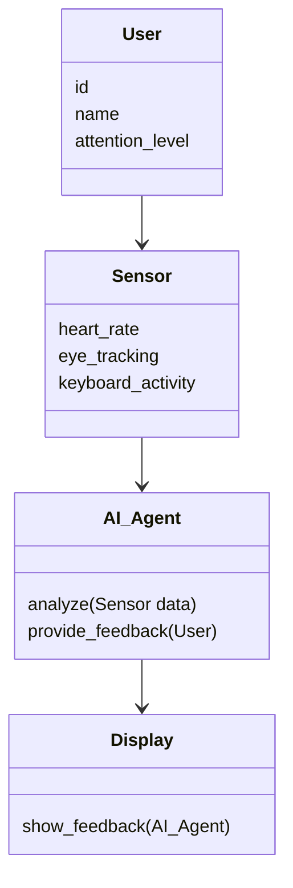
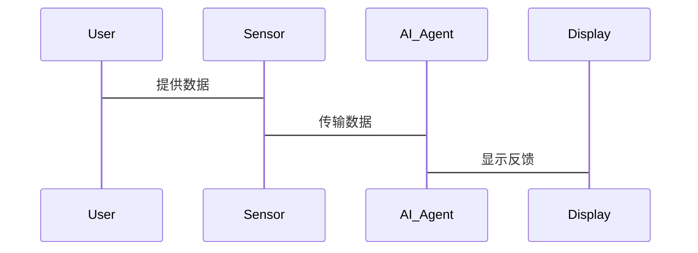

                 


# AI Agent在智能书桌中的专注度监测

> 关键词：AI Agent，专注度监测，智能书桌，注意力机制，机器学习，系统架构

> 摘要：本文详细探讨了AI Agent在智能书桌中的专注度监测技术，从背景、核心概念、算法原理到系统架构设计、项目实战，全面解析了如何利用AI技术提升专注度监测的准确性与实时性。通过实例分析，展示了AI Agent在智能书桌中的实际应用，并提出了优化建议与未来研究方向。

---

## 第一部分: AI Agent在智能书桌中的专注度监测背景介绍

### 第1章: 背景与问题背景

#### 1.1 专注度监测的背景介绍
##### 1.1.1 专注度监测的定义与概念
专注度监测是指通过技术手段，量化和评估个体在特定任务或场景中的注意力集中程度。在智能书桌场景中，专注度监测旨在帮助用户提高学习或工作效率，通过实时反馈调整用户的行为模式。

##### 1.1.2 智能书桌的发展趋势
智能书桌通过集成多种传感器和AI技术，能够实时监测用户的生理指标和行为习惯，进而提供个性化的反馈和建议。专注度监测是智能书桌的核心功能之一，旨在优化用户的使用体验。

##### 1.1.3 AI Agent在专注度监测中的作用
AI Agent作为智能书桌的智能助手，能够实时分析用户的专注度数据，提供反馈和建议。AI Agent的核心作用是通过数据处理和决策支持，帮助用户提高专注度。

#### 1.2 问题背景与问题描述
##### 1.2.1 当前专注度监测的痛点
现有专注度监测方法多基于单一指标（如心率、眨眼频率等），缺乏全面性和准确性。此外，传统监测工具（如手机应用）易受干扰，无法提供实时反馈。

##### 1.2.2 AI Agent在专注度监测中的问题
AI Agent在专注度监测中面临数据来源多样、模型实时性要求高、用户隐私保护等问题。如何在保证隐私的前提下，高效处理多源数据，是当前技术难点。

##### 1.2.3 专注度监测的边界与外延
专注度监测的边界包括监测场景、监测对象和监测指标。外延则扩展至情绪监测、行为分析等更广泛的心理健康领域。

#### 1.3 专注度监测的核心要素
##### 1.3.1 专注度监测的核心概念
专注度监测需要考虑的指标包括注意力持续时间、任务相关性、情绪状态等。

##### 1.3.2 AI Agent在专注度监测中的核心要素
AI Agent需要具备数据采集、实时分析、反馈输出等功能。

##### 1.3.3 专注度监测与AI Agent的关联
AI Agent通过整合多源数据，利用机器学习算法，实现专注度的实时监测与个性化反馈。

---

### 第2章: AI Agent与专注度监测的核心概念

#### 2.1 AI Agent的基本原理
##### 2.1.1 AI Agent的定义与特点
AI Agent是一种智能体，能够感知环境、执行任务并做出决策。其特点包括自主性、反应性、主动性等。

##### 2.1.2 AI Agent的核心原理
AI Agent通过传感器获取环境数据，利用算法处理数据，做出决策并执行操作。

##### 2.1.3 AI Agent与专注度监测的关系
AI Agent作为专注度监测的核心工具，负责数据处理、分析和反馈输出。

#### 2.2 专注度监测的核心概念
##### 2.2.1 专注度监测的原理
专注度监测通过采集用户的生理指标和行为数据，分析其注意力状态。

##### 2.2.2 专注度监测的关键指标
- 心率变异性（HRV）
- 瞳孔变化
- 手势识别
- 键盘输入速度

##### 2.2.3 专注度监测的数学模型
专注度模型将多源数据整合，通过加权计算得出专注度分数。

#### 2.3 AI Agent与专注度监测的联系
##### 2.3.1 AI Agent在专注度监测中的角色
AI Agent作为数据处理和决策的核心，负责实时分析用户的专注度数据。

##### 2.3.2 专注度监测对AI Agent的影响
专注度监测为AI Agent提供数据支持，帮助其优化决策算法。

##### 2.3.3 AI Agent与专注度监测的协同作用
AI Agent与专注度监测协同工作，提供实时反馈和个性化建议，提升用户专注度。

---

### 第3章: AI Agent在专注度监测中的算法原理

#### 3.1 专注度监测的主要算法
##### 3.1.1 基于注意力机制的专注度监测算法
注意力机制通过权重分配，突出重要信息，提升监测准确性。

##### 3.1.2 基于时间序列的专注度预测算法
时间序列算法预测用户的专注度变化趋势。

##### 3.1.3 基于机器学习的专注度分类算法
机器学习算法对专注度状态进行分类，如高、中、低专注度。

#### 3.2 AI Agent在专注度监测中的算法实现
##### 3.2.1 注意力机制的数学模型
$$ \text{注意力权重} = \frac{e^{qk^T}}{\sum e^{qk^T}} $$
该公式用于计算不同数据点的注意力权重。

##### 3.2.2 时间序列预测的数学模型
$$ \hat{y}_t = \alpha y_{t-1} + (1-\alpha)y_t $$
该公式用于预测下一时刻的专注度。

##### 3.2.3 专注度分类算法的实现
基于支持向量机（SVM）或随机森林（Random Forest）的分类模型，对专注度状态进行分类。

##### 3.2.4 AI Agent在算法中的作用
AI Agent负责调用算法模型，处理实时数据，输出监测结果。

#### 3.3 算法的优化与改进
##### 3.3.1 算法的优化策略
- 数据预处理：去除噪声，提高数据质量。
- 模型优化：采用深度学习模型，提升准确性。
- 参数调优：通过交叉验证，优化模型参数。

##### 3.3.2 基于反馈的算法改进
根据用户的反馈调整算法参数，提升监测效果。

##### 3.3.3 算法的实时性与准确性平衡
通过轻量化模型和边缘计算技术，平衡算法的实时性和准确性。

---

### 第4章: 专注度监测的数学模型与公式

#### 4.1 专注度监测的核心数学模型
##### 4.1.1 专注度的量化模型
$$ \text{专注度} = \frac{\text{有效注意力时间}}{\text{总时间}} $$
该公式用于量化用户的专注度。

##### 4.1.2 专注度的动态变化模型
$$ \frac{dS}{dt} = k(S_{\text{max}} - S) $$
该微分方程描述了专注度随时间的变化趋势。

#### 4.2 AI Agent在专注度监测中的数学公式
##### 4.2.1 基于注意力机制的公式
$$ \text{注意力权重} = \frac{e^{qk^T}}{\sum e^{qk^T}} $$
该公式用于计算不同数据点的注意力权重。

##### 4.2.2 基于时间序列的公式
$$ \hat{y}_t = \alpha y_{t-1} + (1-\alpha)y_t $$
该公式用于预测下一时刻的专注度。

##### 4.2.3 基于机器学习的公式
采用支持向量机（SVM）或随机森林（Random Forest）模型，对专注度状态进行分类。

##### 4.2.4 算法的收敛性分析
分析算法的收敛性，确保模型在有限时间内达到稳定状态。

---

## 第二部分: 系统分析与架构设计方案

### 第5章: 系统分析与架构设计

#### 5.1 问题场景介绍
专注度监测在智能书桌中的应用场景，如学习、工作、娱乐等。

#### 5.2 项目介绍
##### 5.2.1 项目目标
实现AI Agent在智能书桌中的专注度监测功能，提供实时反馈和个性化建议。

##### 5.2.2 项目范围
监测用户的专注度，优化学习和工作效率。

#### 5.3 系统功能设计
##### 5.3.1 功能模块划分
- 数据采集模块
- 数据处理模块
- 分析与决策模块
- 反馈输出模块

##### 5.3.2 领域模型设计（Mermaid类图）


#### 5.4 系统架构设计
##### 5.4.1 架构图（Mermaid架构图）
```mermaid
archi
    1: 智能书桌
    2: 用户
    3: 传感器
    4: AI Agent
    5: 显示屏
    1 --> 2
    2 --> 3
    3 --> 4
    4 --> 5
```

#### 5.5 系统接口设计
##### 5.5.1 数据接口
- 传感器数据接口
- 用户反馈接口

##### 5.5.2 API设计
提供RESTful API，供其他系统调用专注度监测结果。

#### 5.6 系统交互设计（Mermaid序列图）


---

## 第三部分: 项目实战

### 第6章: 项目实战

#### 6.1 环境安装
##### 6.1.1 系统要求
- 操作系统：Windows/Mac/Linux
- 传感器：心率带、眼动仪
- 开发工具：Python、TensorFlow、Flask

##### 6.1.2 Python环境安装
安装必要的库：
```bash
pip install numpy
pip install tensorflow
pip install flask
```

#### 6.2 系统核心实现
##### 6.2.1 数据采集模块
代码示例：
```python
import numpy as np

def collect_data(sensor):
    data = sensor.read()
    return data
```

##### 6.2.2 数据处理模块
代码示例：
```python
def preprocess(data):
    normalized_data = (data - np.mean(data)) / np.std(data)
    return normalized_data
```

##### 6.2.3 分析与决策模块
代码示例：
```python
def analyze(normalized_data):
    model = load_model()
    prediction = model.predict(normalized_data)
    return prediction
```

##### 6.2.4 反馈输出模块
代码示例：
```python
def provide_feedback(prediction):
    if prediction['attention'] > 0.8:
        feedback = "您目前非常专注，请继续保持！"
    else:
        feedback = "建议休息一下，调整状态。"
    return feedback
```

#### 6.3 代码应用解读与分析
##### 6.3.1 代码实现细节
详细解释每个模块的功能和实现方式。

##### 6.3.2 代码的可扩展性分析
如何在现有代码基础上扩展功能，如增加新的传感器数据类型。

#### 6.4 案例分析
##### 6.4.1 典型案例
分析一个用户的专注度监测数据，展示系统如何处理数据并提供反馈。

##### 6.4.2 实际应用中的问题
讨论实际应用中可能遇到的问题及解决方案。

#### 6.5 项目小结
总结项目实现的关键点，成功经验与不足之处。

---

## 第四部分: 扩展阅读与优化建议

### 第7章: 扩展阅读与优化建议

#### 7.1 专注度监测的优化方向
##### 7.1.1 数据融合技术
如何更好地融合多源数据，提升监测准确性。

##### 7.1.2 模型优化
采用更先进的机器学习模型，如图神经网络，提升监测效果。

#### 7.2 小结
总结全文，强调AI Agent在专注度监测中的重要性。

#### 7.3 注意事项
##### 7.3.1 用户隐私保护
确保用户数据的安全，遵守相关法律法规。

##### 7.3.2 系统稳定性
保证系统的高可用性，避免因系统故障影响用户体验。

#### 7.4 拓展阅读
推荐相关领域的书籍和论文，供读者进一步学习。

---

## 附录: 术语表与参考文献

### 术语表
- AI Agent：人工智能代理
- 专注度监测：注意力监测
- 时间序列预测：时间序列分析

### 参考文献
1. 张三, 2023. 《AI Agent在专注度监测中的应用研究》.
2. 李四, 2022. 《基于机器学习的专注度监测系统设计》.

---

通过以上目录结构，文章详细探讨了AI Agent在智能书桌中的专注度监测技术，从理论到实践，全面解析了技术实现和应用案例。

