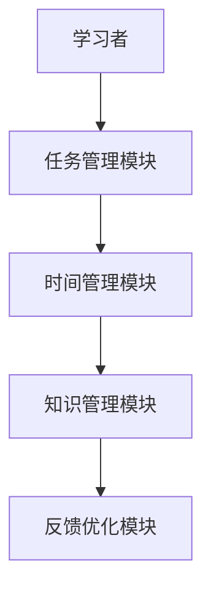
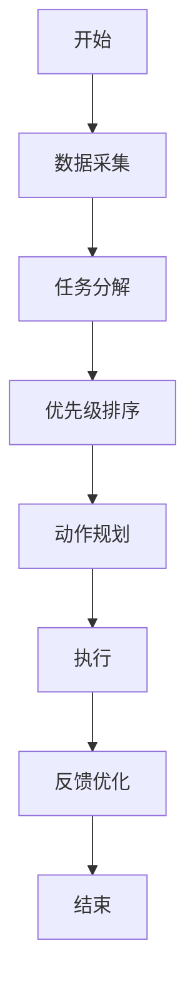
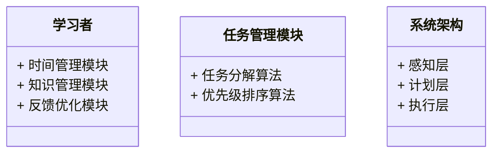
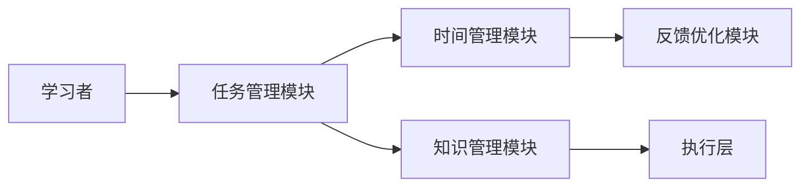
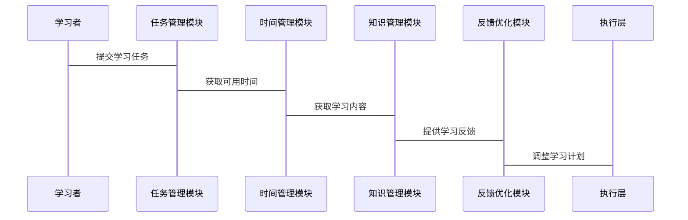

                 


# AI Agent在智能书桌中的学习效率分析

## 关键词：AI Agent, 智能书桌, 学习效率, 算法原理, 系统架构, 项目实战

## 摘要：本文详细分析了AI Agent在智能书桌中的学习效率提升机制，从概念、算法、系统架构到项目实战，全面探讨了如何通过AI技术优化学习过程。文章通过具体案例和系统设计，揭示了AI Agent在智能书桌中的工作原理及其对学习效率的显著提升。

---

## 第1章: AI Agent与智能书桌的背景介绍

### 1.1 AI Agent的基本概念

#### 1.1.1 什么是AI Agent
AI Agent（人工智能代理）是一种能够感知环境、自主决策并执行任务的智能实体。它通过传感器获取信息，利用算法处理数据，并通过执行器与环境交互。AI Agent的核心目标是帮助用户完成特定任务，优化决策过程。

#### 1.1.2 AI Agent的核心特征
- **自主性**：无需外部干预，自主决策。
- **反应性**：能够实时感知环境变化并调整行为。
- **目标导向**：基于目标驱动行动，优先处理关键任务。
- **学习能力**：通过数据反馈不断优化行为策略。

#### 1.1.3 AI Agent的分类与应用场景
AI Agent主要分为两类：
- **简单反射型**：基于预设规则执行任务，适用于环境简单、任务明确的场景。
- **目标驱动型**：具备目标设定和优先级排序功能，适用于复杂任务。

应用场景包括：
- 教育领域：帮助学生优化学习计划。
- 工作效率：协助用户管理时间，提升生产力。
- 健康管理：监测生活习惯，提供个性化建议。

### 1.2 智能书桌的概念与特点

#### 1.2.1 智能书桌的定义
智能书桌是一种集成AI技术的智能学习工具，结合传感器、语音交互和算法优化，帮助用户高效管理学习过程。

#### 1.2.2 智能书桌的功能模块
- **时间管理模块**：监控学习时间，提醒休息。
- **知识管理模块**：整理学习资料，推荐学习内容。
- **反馈优化模块**：分析学习效果，调整学习策略。

#### 1.2.3 智能书桌与传统书桌的区别
传统书桌仅提供物理支持，而智能书桌通过AI技术实现动态优化，提升学习效率。

### 1.3 学习效率分析的背景与意义

#### 1.3.1 当前学习效率问题的现状
- 学生普遍面临时间管理不善、学习计划不合理等问题。
- 信息过载导致注意力分散，影响学习效果。

#### 1.3.2 AI Agent在提升学习效率中的作用
AI Agent通过任务分解、优先级排序和反馈优化，帮助学生制定科学的学习计划，提升学习效率。

#### 1.3.3 智能书桌在教育领域的应用前景
智能书桌将AI技术与学习场景深度融合，为教育领域带来革命性的变化。

---

## 第2章: AI Agent的核心概念与工作原理

### 2.1 AI Agent的核心概念

#### 2.1.1 感知层: 数据采集与处理
AI Agent通过传感器采集环境数据，如时间、地点、用户行为等，利用自然语言处理和计算机视觉技术进行数据处理。

#### 2.1.2 计划层: 任务分解与优先级排序
AI Agent将复杂任务分解为简单子任务，并根据任务的重要性、紧急性进行排序，确保优先处理关键任务。

#### 2.1.3 执行层: 动作规划与反馈机制
AI Agent根据计划执行具体动作，同时实时收集反馈信息，动态调整执行策略。

### 2.2 AI Agent的实体关系图



### 2.3 AI Agent的算法原理



---

## 第3章: AI Agent在智能书桌中的算法实现

### 3.1 任务分解算法

#### 3.1.1 基于排列组合的任务分解方法
任务分解算法将复杂任务分解为多个子任务，通过排列组合计算最优执行顺序。

$$\text{任务总数} = \sum_{i=1}^{n} \text{子任务数}_i$$

#### 3.1.2 基于优先级的任务排序
优先级排序算法根据任务的重要性和紧急性进行排序，优先处理高优先级任务。

$$\text{优先级} = \text{重要性} \times \text{紧急性}$$

---

## 第4章: 系统分析与架构设计方案

### 4.1 问题场景介绍

#### 4.1.1 学习场景
用户在学习过程中面临时间管理、知识整理和学习效果评估等问题。

#### 4.1.2 工作场景
用户需要在工作场景中优化时间管理，提升工作效率。

### 4.2 系统功能设计

#### 4.2.1 领域模型类图


#### 4.2.2 系统架构图


#### 4.2.3 系统交互序列图


---

## 第5章: 项目实战

### 5.1 环境安装

```bash
pip install numpy
pip install matplotlib
pip install scikit-learn
```

### 5.2 系统核心实现

#### 5.2.1 任务分解代码示例
```python
import numpy as np

def task_decomposition(tasks):
    return np.random.permutation(tasks)

tasks = ['数学', '物理', '化学']
decomposed_tasks = task_decomposition(tasks)
print(decomposed_tasks)
```

#### 5.2.2 优先级排序代码示例
```python
def priority_sort(tasks):
    return sorted(tasks, key=lambda x: (x['重要性'], x['紧急性']))

tasks = [
    {'任务': '完成作业', '重要性': 3, '紧急性': 2},
    {'任务': '复习考试', '重要性': 4, '紧急性': 1}
]
sorted_tasks = priority_sort(tasks)
print(sorted_tasks)
```

### 5.3 案例分析与详细解读

#### 5.3.1 学习案例分析
假设用户需要完成数学和物理作业，系统通过任务分解和优先级排序，推荐先完成数学作业，再复习物理知识点。

#### 5.3.2 工作案例分析
用户需要完成报告撰写和会议准备，系统根据优先级排序，建议优先完成报告撰写，再进行会议准备。

### 5.4 项目小结
通过实际案例分析，展示了AI Agent在智能书桌中的具体应用，证明了其在提升学习和工作效率方面的显著优势。

---

## 第6章: 最佳实践

### 6.1 小结
本文全面分析了AI Agent在智能书桌中的学习效率提升机制，从概念、算法、系统架构到项目实战，为读者提供了全面的理论和实践指导。

### 6.2 注意事项
- 在实际应用中，需结合具体场景调整算法参数。
- 定期更新模型，确保AI Agent的适应性和优化能力。

### 6.3 拓展阅读
- 推荐阅读《AI算法实战》和《系统架构设计的艺术》，深入了解AI Agent和系统架构设计的更多细节。

---

## 总结
通过本文的详细分析，读者可以全面理解AI Agent在智能书桌中的应用，掌握其算法原理和系统架构设计方法。未来，随着AI技术的不断发展，智能书桌将为学习效率提升带来更大的可能性。

