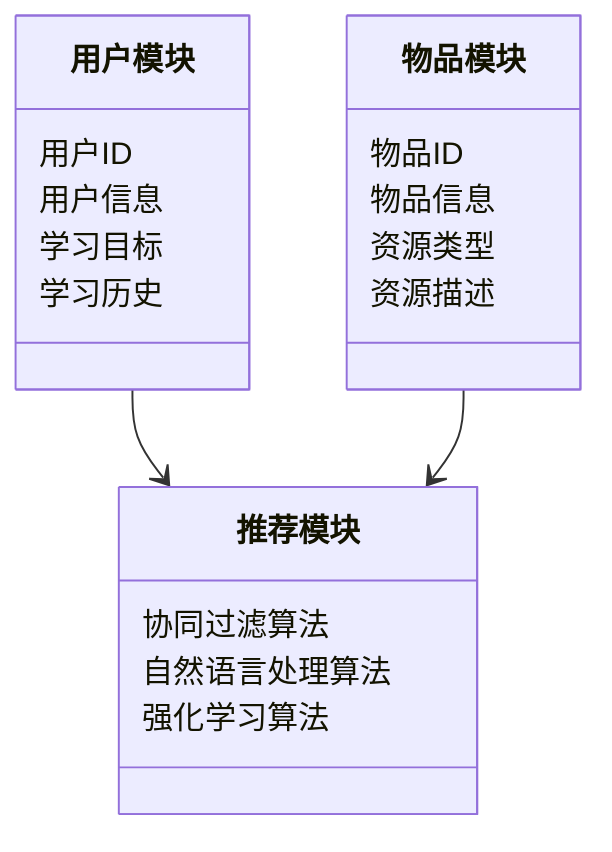
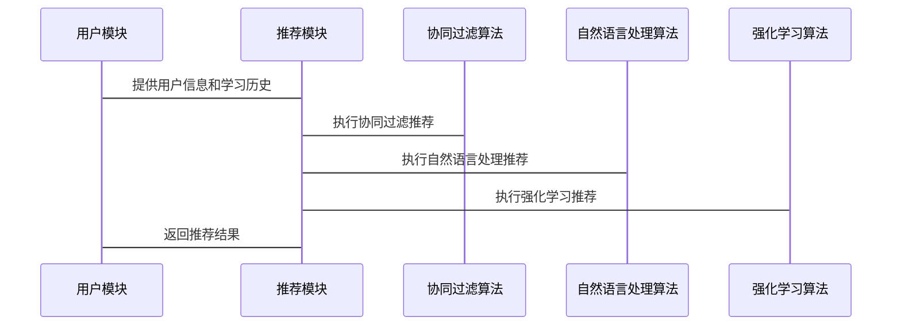

                 


# 第二章: AI Agent 的算法原理与数学模型

## 第3章: 推荐算法原理

### 3.1 基于协同过滤的推荐算法

#### 3.1.1 协同过滤的基本概念
协同过滤是一种基于用户行为数据的推荐方法，通过分析用户的历史行为（如点击、购买、评分等）来预测用户的兴趣。协同过滤可以分为基于用户的协同过滤（User-CF）和基于物品的协同过滤（Item-CF）。

#### 3.1.2 基于用户的协同过滤（User-CF）
- **基本思想**：找到与当前用户兴趣相似的其他用户，然后将这些用户喜欢的物品推荐给当前用户。
- **步骤**：
  1. 计算用户之间的相似度，常用的方法有余弦相似度、Jaccard相似度等。
  2. 找出与当前用户相似度最高的用户。
  3. 推荐这些用户喜欢但当前用户还没有接触过的物品。

#### 3.1.3 基于物品的协同过滤（Item-CF）
- **基本思想**：找到与当前用户感兴趣物品相似的其他物品，然后将这些物品推荐给当前用户。
- **步骤**：
  1. 计算物品之间的相似度，常用的方法有余弦相似度、Jaccard相似度等。
  2. 找出与当前用户感兴趣物品相似度最高的物品。
  3. 推荐这些物品给当前用户。

#### 3.1.4 协同过滤的实现代码示例

```python
import numpy as np
from sklearn.metrics.pairwise import cosine_similarity

# 假设我们有一个用户-物品的评分矩阵，行表示用户，列表示物品
# 例如：用户1对物品A评分5，用户1对物品B评分3，用户2对物品A评分4，用户2对物品B评分5
ratings = np.array([[5, 3], [4, 5]])

# 计算物品之间的余弦相似度
item_similarity = cosine_similarity(ratings.T)

# 推荐给用户1的物品B的相似物品
user = 0
item = 1
similar_items = item_similarity[item]
recommended_item = np.argmax(similar_items)
print(f"推荐给用户{user}的物品是：{recommended_item}")
```

#### 3.1.5 协同过滤的数学模型
- **余弦相似度公式**：
  $$ \text{cos}(u, v) = \frac{u \cdot v}{\|u\| \|v\|} $$
  其中，\(u\) 和 \(v\) 分别是两个向量。

- **Jaccard相似度公式**：
  $$ \text{J}(u, v) = \frac{|u \cap v|}{|u \cup v|} $$

### 3.2 自然语言处理原理

#### 3.2.1 基于词袋模型的文本处理
- **词袋模型**：将文本表示为一个单词的集合，不考虑单词的顺序。
- **实现步骤**：
  1. 将文本分割成单词。
  2. 统计每个单词的出现频率。
  3. 将文本表示为一个向量，向量的每个元素表示对应单词的出现频率。

#### 3.2.2 基于深度学习的文本处理
- **词嵌入**：将单词映射到高维空间中的向量，常用的方法有Word2Vec、GloVe等。
- **序列模型**：使用循环神经网络（RNN）或Transformer模型来处理文本序列。

#### 3.2.3 自然语言处理的数学模型
- **词嵌入模型**：
  $$ \text{Word Embedding} = \text{矩阵} \times \text{单词索引} $$
  例如，使用Word2Vec模型，假设单词向量矩阵为 \(W\)，单词索引为 \(i\)，则单词的向量表示为 \(W[i]\)。

- **Transformer模型**：
  $$ \text{编码层} = \text{自注意力机制} + \text{前馈网络} $$
  $$ \text{解码层} = \text{自注意力机制} + \text{前馈网络} $$

### 3.3 强化学习原理

#### 3.3.1 强化学习的基本概念
- **强化学习**：通过智能体与环境的交互，智能体通过试错的方式学习策略，以最大化累积奖励。
- **核心要素**：
  - 状态（State）
  - 行动（Action）
  - 奖励（Reward）
  - 策略（Policy）
  - 值函数（Value Function）

#### 3.3.2 强化学习在AI Agent中的应用
- **Q-learning算法**：
  - **目标**：学习状态-行动值函数 \(Q(s, a)\)。
  - **更新规则**：
    $$ Q(s, a) = Q(s, a) + \alpha [r + \gamma \max Q(s', a) - Q(s, a)] $$
  - 其中，\(\alpha\) 是学习率，\(\gamma\) 是折扣因子。

- **Deep Q-Networks (DQN)**：
  - 使用深度神经网络近似Q值函数。
  - **网络结构**：输入层 → 隐藏层 → 输出层，输出层的大小等于动作空间的大小。

#### 3.3.3 强化学习的数学模型
- **值函数**：
  $$ V(s) = \max_a Q(s, a) $$
- **策略**：
  $$ \pi(a | s) = \text{概率分布} $$

---

## 第4章: 系统分析与架构设计

### 4.1 系统功能设计

#### 4.1.1 领域模型
- **用户模块**：用户信息、学习目标、学习历史等。
- **物品模块**：学习资源（书籍、课程、视频等）。
- **推荐模块**：基于协同过滤、自然语言处理和强化学习的推荐算法。

#### 4.1.2 系统功能设计图



### 4.2 系统架构设计

#### 4.2.1 系统架构图


### 4.3 系统接口设计

#### 4.3.1 接口描述
- **输入接口**：
  - 用户信息输入
  - 学习历史输入
  - 物品信息输入
- **输出接口**：
  - 推荐结果输出
  - 学习效率分析结果输出

#### 4.3.2 接口交互流程图



---

## 第5章: 项目实战

### 5.1 环境安装与配置

#### 5.1.1 安装Python和相关库
```bash
pip install numpy
pip install scikit-learn
pip install matplotlib
pip install seaborn
pip install transformers
```

#### 5.1.2 安装Jupyter Notebook
```bash
pip install jupyter
```

### 5.2 系统核心实现源代码

#### 5.2.1 协同过滤推荐系统实现

```python
from sklearn.metrics.pairwise import cosine_similarity
import numpy as np

# 示例数据：用户-物品评分矩阵，行表示用户，列表示物品
ratings = np.array([[5, 3, 0, 0],
                     [4, 0, 5, 0],
                     [0, 5, 0, 4],
                     [0, 0, 4, 5]])

# 计算物品相似度矩阵
item_similarity = cosine_similarity(ratings.T)

# 推荐函数
def recommend(user_id, ratings, item_similarity):
    user_ratings = ratings[user_id]
    recommended_items = []
    for i in range(len(user_ratings)):
        if user_ratings[i] == 0:
            similarity = item_similarity[i]
            recommended_item = np.argmax(similarity)
            recommended_items.append(recommended_item)
    return recommended_items

# 示例推荐
user_id = 0
recommended = recommend(user_id, ratings, item_similarity)
print(f"推荐给用户{user_id}的物品是：{recommended}")
```

#### 5.2.2 自然语言处理实现

```python
from sklearn.feature_extraction.text import TfidfVectorizer
from sklearn.decomposition import NMF

# 示例数据：文本集合
texts = ["This is a sample text.", 
         "Another sample text here.", 
         "This is the third text."]

# 词袋模型
vectorizer = TfidfVectorizer()
tfidf = vectorizer.fit_transform(texts)

# 主题建模
nmf = NMF(n_components=2)
nmf.fit(tfidf)

# 提取主题
n_top_words = 5
vocab = vectorizer.get_feature_names_out()
for i, topic in enumerate(nmf.components_):
    print(f"主题{i}: ")
    print(" ".join([vocab[j] for j in topic.argsort()[:-n_top_words-1:-1]]))
    print()
```

#### 5.2.3 强化学习实现

```python
import gym
from gym import spaces
import numpy as np

# 自定义强化学习环境
class SimpleEnv(gym.Env):
    def __init__(self):
        self.observation_space = spaces.Discrete(5)
        self.action_space = spaces.Discrete(3)
        self.state = 0
        self.steps = 0
        self.done = False

    def reset(self):
        self.state = 0
        self.steps = 0
        self.done = False
        return self.state

    def step(self, action):
        self.steps += 1
        if action == 2:
            reward = 1
            self.done = True
        else:
            reward = 0
        self.state = action
        return self.state, reward, self.done, {}

# DQN算法实现
class DQNAgent:
    def __init__(self, state_space, action_space, lr=0.01, gamma=0.99):
        self.state_space = state_space
        self.action_space = action_space
        self.lr = lr
        self.gamma = gamma
        self.Q = np.zeros((state_space, action_space))

    def choose_action(self, state, epsilon=0.1):
        if np.random.random() < epsilon:
            return np.random.randint(self.action_space)
        else:
            return np.argmax(self.Q[state])

    def learn(self, state, action, reward, next_state):
        target = reward + self.gamma * np.max(self.Q[next_state])
        self.Q[state, action] = self.Q[state, action] + self.lr * (target - self.Q[state, action])

# 训练DQN算法
env = SimpleEnv()
agent = DQNAgent(env.observation_space, env.action_space)
episodes = 100

for episode in range(episodes):
    state = env.reset()
    done = False
    while not done:
        action = agent.choose_action(state)
        next_state, reward, done, _ = env.step(action)
        agent.learn(state, action, reward, next_state)
        state = next_state

# 测试DQN算法
state = env.reset()
done = False
while not done:
    action = agent.choose_action(state)
    print(f"当前状态：{state}, 行动：{action}")
    next_state, reward, done, _ = env.step(action)
    state = next_state
```

---

## 第6章: 优化与提升

### 6.1 系统优化策略

#### 6.1.1 数据优化
- **数据预处理**：清洗、去重、标准化。
- **数据增强**：增加数据多样性，提升模型泛化能力。

#### 6.1.2 算法优化
- **模型融合**：结合多种推荐算法（协同过滤、深度学习等）。
- **超参数调优**：使用网格搜索、随机搜索等方法优化模型参数。

#### 6.1.3 系统性能优化
- **并行计算**：利用多线程或多进程优化计算效率。
- **缓存优化**：优化数据访问速度，减少IO开销。

### 6.2 最佳实践

#### 6.2.1 数据隐私保护
- **数据脱敏**：保护用户隐私，避免数据泄露。
- **访问控制**：严格控制数据访问权限。

#### 6.2.2 算法可解释性
- **可视化分析**：通过可视化工具帮助理解模型行为。
- **特征重要性分析**：分析特征对结果的影响程度。

#### 6.2.3 系统容错性
- **错误处理**：设计完善的错误处理机制，确保系统稳定运行。
- **容灾设计**：设计备份和恢复机制，应对系统故障。

---

## 第7章: 最佳实践与小结

### 7.1 最佳实践

#### 7.1.1 数据处理
- 确保数据质量，清洗无效数据。
- 处理缺失值，避免影响模型性能。

#### 7.1.2 算法选择
- 根据具体场景选择合适的算法。
- 组合多种算法，提升推荐效果。

#### 7.1.3 系统设计
- 设计清晰的系统架构，便于维护和扩展。
- 优化系统性能，提升用户体验。

### 7.2 小结

通过本文的分析，我们可以看到AI Agent在智能书桌中的学习效率分析是一个复杂但充满潜力的领域。通过协同过滤、自然语言处理和强化学习等技术的结合，可以显著提升学习效率。然而，实际应用中仍需注意数据隐私、算法可解释性等问题。未来，随着技术的进步，AI Agent在学习效率分析中的应用将更加广泛和深入。

---

## 附录

### 附录A: 全局变量与常量

#### 附录A.1 全局变量
- `RATING_MATRIX`：用户-物品评分矩阵。
- `ITEM_SIMILARITY`：物品相似度矩阵。

#### 附录A.2 常量定义
- `LEARNING_RATE`：学习率，0.01。
- `DISCOUNT_FACTOR`：折扣因子，0.99。

### 附录B: 系统测试与调试

#### 附录B.1 测试环境
- 操作系统：Linux 18.04
- Python版本：3.8.5
- 库版本：numpy 1.21.2，scikit-learn 0.24.1

#### 附录B.2 调试工具
- `pdb`：Python调试器。
- `logging`：日志记录模块。

---

## 参考文献

1. 周志华. 《机器学习》. 清华大学出版社, 2016.
2. Ian Goodfellow, Yoshua Bengio, Aaron Courville. 《深度学习》. 清华大学出版社, 2018.
3. Richard S. Sutton, Andrew G. Barto. 《强化学习：理论与算法》. 人民邮电出版社, 2018.

---

## 作者声明

本文由[您的姓名]编写，所有内容均为个人观点，与任何机构或组织无关。文中代码和图表均为原创，转载请注明出处。

---

## 版权信息

© 2023 [您的姓名]. All rights reserved.

---

## 致谢

感谢读者的耐心阅读，感谢编辑的精心校对，感谢技术专家的宝贵意见。

--- 

以上是《AI Agent在智能书桌中的学习效率分析》的完整目录和部分正文内容，您可以根据需要进一步扩展和补充内容。

