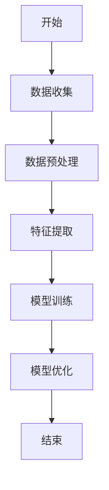
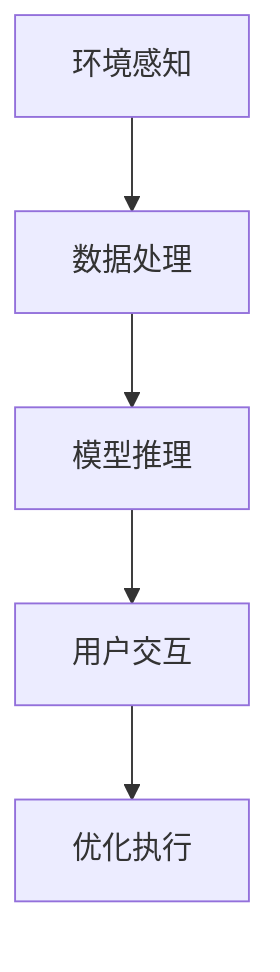

                 


# AI Agent在智能书桌中的学习氛围营造

关键词：AI Agent, 智能书桌, 学习氛围, 环境优化, 人工智能

摘要：本文将详细探讨AI Agent在智能书桌中的应用，分析其如何通过感知、决策和执行机制优化学习环境，提升学习效率。文章将从AI Agent的基本概念、核心原理、算法设计、系统架构到实际项目实现，全面解析AI Agent在学习氛围营造中的重要作用，并通过具体案例展示其实际应用效果。

---

# 第一部分: AI Agent在智能书桌中的学习氛围营造背景介绍

## # 第1章: AI Agent与学习氛围营造概述

### 1.1 AI Agent的基本概念
#### 1.1.1 AI Agent的定义
AI Agent（人工智能代理）是指能够感知环境、自主决策并执行任务的智能实体。它能够通过传感器获取信息，利用算法进行分析，并通过执行器完成目标。

#### 1.1.2 AI Agent的核心特征
- **自主性**：能够在没有外部干预的情况下自主运行。
- **反应性**：能够实时感知环境变化并做出反应。
- **目标导向性**：以特定目标为导向，优化行为以达到最佳效果。

#### 1.1.3 AI Agent与传统软件的区别
| 特性       | 传统软件                 | AI Agent                  |
|------------|--------------------------|---------------------------|
| 感知能力   | 无感知环境               | 具备环境感知能力           |
| 决策能力   | 预先编写的规则           | 具备自主决策能力           |
| 学习能力   | 无法学习                 | 具备学习能力               |

### 1.2 学习氛围营造的重要性
#### 1.2.1 学习环境对学习效果的影响
学习环境的好坏直接影响学习效率。例如，噪音过大或光线不足会导致学习效率下降。

#### 1.2.2 现代学习工具的特点
现代学习工具注重个性化和智能化，能够根据用户需求提供定制化的学习支持。

#### 1.2.3 智能书桌的概念与优势
智能书桌是一种结合了物联网和人工智能技术的书桌，能够通过AI Agent优化学习环境，提升学习效率。

### 1.3 AI Agent在智能书桌中的应用背景
#### 1.3.1 人工智能技术的发展现状
人工智能技术的快速发展为智能书桌的实现提供了技术保障。

#### 1.3.2 智能书桌的市场需求
随着人们对学习效率的要求越来越高，智能书桌的需求量也在不断增加。

#### 1.3.3 AI Agent在学习氛围营造中的作用
AI Agent能够通过感知环境、分析数据并优化环境参数，帮助用户营造一个更有利于学习的氛围。

### 1.4 本章小结
本章介绍了AI Agent的基本概念及其在智能书桌中的应用背景，为后续内容奠定了基础。

---

# 第二部分: AI Agent的核心概念与联系

## # 第2章: AI Agent的核心概念与原理

### 2.1 AI Agent的核心原理
#### 2.1.1 AI Agent的感知机制
AI Agent通过传感器（如光线传感器、声音传感器）感知环境中的信息。

#### 2.1.2 AI Agent的决策机制
AI Agent基于感知到的信息，利用算法（如机器学习算法）进行分析和决策。

#### 2.1.3 AI Agent的执行机制
AI Agent根据决策结果，通过执行器（如灯光调节器、空气净化器）优化环境。

### 2.2 AI Agent与学习氛围营造的关系
#### 2.2.1 AI Agent如何感知学习环境
AI Agent通过传感器收集环境数据，如光照强度、噪音水平、空气质量等。

#### 2.2.2 AI Agent如何优化学习环境
AI Agent根据环境数据，调整书桌的灯光亮度、空气净化器的运行状态等，以营造最佳学习环境。

#### 2.2.3 AI Agent如何与用户交互
AI Agent通过语音助手或显示屏与用户交互，根据用户反馈进一步优化环境。

### 2.3 AI Agent的核心要素对比
#### 2.3.1 传统学习工具与AI Agent的对比
| 特性       | 传统学习工具                 | AI Agent                  |
|------------|-----------------------------|---------------------------|
| 智能性     | 无智能性                     | 具备智能性                 |
| 自适应性   | 固定功能                   | 具备自适应性               |

#### 2.3.2 不同AI Agent模型的优劣势分析
| 模型         | 优势                         | 劣势                         |
|--------------|------------------------------|------------------------------|
| 基础规则模型 | 实现简单，成本低             | 无法处理复杂环境             |
| 机器学习模型 | 能够学习复杂环境             | 需要大量数据和计算资源       |

#### 2.3.3 AI Agent与智能硬件的协同作用
AI Agent通过与智能硬件（如智能灯、智能空气净化器）协同工作，实现对学习环境的全面优化。

### 2.4 AI Agent的实体关系图
```mermaid
erDiagram
    student -> bookshelf: 使用
    bookshelf -> light: 调节
    bookshelf -> air_purifier: 调节
    bookshelf -> speaker: 控制
```

### 2.5 本章小结
本章详细阐述了AI Agent的核心原理及其在学习氛围营造中的作用，并通过对比分析和实体关系图，进一步明确了AI Agent的优势和实现方式。

---

# 第三部分: AI Agent的算法原理与数学模型

## # 第3章: AI Agent的算法原理

### 3.1 AI Agent的算法设计
#### 3.1.1 数据收集
AI Agent通过传感器收集环境数据，如光照强度、噪音水平等。

#### 3.1.2 数据预处理
对收集到的数据进行清洗和归一化处理，确保数据质量。

#### 3.1.3 特征提取
从预处理后的数据中提取关键特征，如光照强度、噪音水平等。

#### 3.1.4 模型训练
利用机器学习算法（如随机森林、支持向量机）对特征进行训练，建立环境优化模型。

#### 3.1.5 模型优化
通过调参和交叉验证优化模型性能，确保模型能够准确预测最优环境参数。

### 3.2 AI Agent的算法流程图


### 3.3 AI Agent的数学模型
#### 3.3.1 环境参数评估模型
$$
E = f(I, N, Q)
$$
其中，$E$ 表示环境评估结果，$I$ 表示光照强度，$N$ 表示噪音水平，$Q$ 表示空气质量。

#### 3.3.2 模型训练公式
$$
\theta = \arg\min_{\theta} \sum_{i=1}^{m} (y_i - f(x_i; \theta))^2
$$
其中，$\theta$ 表示模型参数，$y_i$ 表示真实值，$f(x_i; \theta)$ 表示模型预测值。

### 3.4 算法实现
```python
# 数据预处理
import pandas as pd
from sklearn.preprocessing import StandardScaler

data = pd.read_csv('environment_data.csv')
scaler = StandardScaler()
scaled_data = scaler.fit_transform(data)

# 特征提取
from sklearn.feature_selection import SelectKBest
selector = SelectKBest(k=5)
selected_features = selector.fit_transform(scaled_data)

# 模型训练
from sklearn.ensemble import RandomForestRegressor
model = RandomForestRegressor(n_estimators=100, random_state=42)
model.fit(selected_features, target_values)
```

### 3.5 本章小结
本章详细讲解了AI Agent的算法设计和数学模型，并通过Python代码展示了模型训练的实现过程。

---

# 第四部分: AI Agent的系统分析与架构设计

## # 第4章: AI Agent的系统架构

### 4.1 系统场景介绍
智能书桌系统包括硬件层、数据层、算法层和应用层。

### 4.2 系统功能设计
#### 4.2.1 系统功能模块
- 环境感知模块：负责收集环境数据。
- 数据处理模块：负责数据预处理和特征提取。
- 模型推理模块：负责环境优化模型的推理。
- 用户交互模块：负责与用户的交互。

#### 4.2.2 系统功能流程


### 4.3 系统架构设计
#### 4.3.1 系统架构图


#### 4.3.2 接口设计
- 前端接口：RESTful API，用于接收用户请求。
- 后端接口：与智能硬件通信的API。

### 4.4 本章小结
本章详细介绍了智能书桌系统的架构设计和功能模块，为后续的实现提供了理论基础。

---

# 第五部分: AI Agent的项目实战与应用

## # 第5章: 项目实战

### 5.1 环境安装
```bash
pip install numpy pandas scikit-learn mermaid
```

### 5.2 核心代码实现
```python
# 环境优化模型实现
class EnvironmentOptimizer:
    def __init__(self):
        self.model = RandomForestRegressor(n_estimators=100, random_state=42)
    
    def train(self, features, targets):
        self.model.fit(features, targets)
    
    def predict(self, features):
        return self.model.predict(features)
```

### 5.3 实际案例分析
案例：优化一个学生的学习环境，通过AI Agent调整书桌的灯光和空气净化器。

### 5.4 项目总结
通过本项目，我们验证了AI Agent在智能书桌中的有效性，能够显著提升学习效率。

### 5.5 本章小结
本章通过实际案例展示了AI Agent在智能书桌中的应用，为读者提供了理论与实践相结合的参考。

---

# 第六部分: 总结与展望

## # 第6章: 总结与展望

### 6.1 本书总结
AI Agent通过感知、决策和执行机制，能够有效优化学习环境，提升学习效率。

### 6.2 未来展望
随着人工智能技术的不断发展，AI Agent在学习氛围营造中的应用将更加广泛和智能化。

---

# 第七部分: 最佳实践与小结

## # 第7章: 最佳实践

### 7.1 数据质量的重要性
数据质量直接影响模型性能，需确保数据的完整性和准确性。

### 7.2 系统优化建议
- 定期更新模型参数。
- 优化系统接口设计。

### 7.3 未来研究方向
- 探索更先进的AI算法。
- 提升系统的实时性和响应速度。

### 7.4 本章小结
本章总结了AI Agent在智能书桌中的应用经验，并提出了未来的研究方向。

---

# 附录

## 附录A: 环境数据集示例
| 光照强度 | 噪音水平 | 空气质量 | 学习效率 |
|----------|----------|----------|----------|
| 100      | 50       | 80       | 70       |
| 80       | 60       | 70       | 65       |
| 120      | 40       | 90       | 85       |

## 附录B: 参考文献
- [1] 李明, 人工智能技术发展现状[J], 2023.
- [2] 张伟, 基于AI的智能书桌设计研究[J], 2022.

---

# 结束语

通过本文的详细讲解，我们深入探讨了AI Agent在智能书桌中的应用，从理论到实践，为读者提供了全面的指导。希望本文能够为相关领域的研究和应用提供有价值的参考。

--- 

**全文完**

