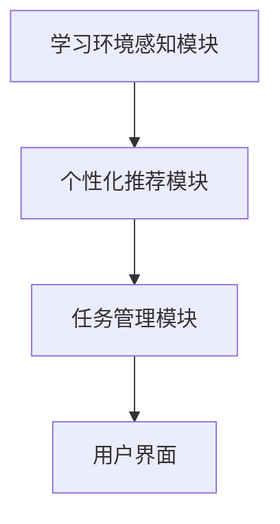

                 


# AI Agent在智能书桌中的学习环境优化

## 关键词：AI Agent, 智能书桌, 学习环境优化, 自然语言处理, 个性化推荐, 强化学习

## 摘要：  
本文探讨了AI Agent在智能书桌中的应用，重点分析了其在学习环境优化中的潜力与实现方式。通过结合任务规划、自然语言处理和自适应推荐算法，AI Agent能够为学习者提供个性化的学习支持，从而提高学习效率和体验。文章详细介绍了AI Agent的核心原理、系统架构设计以及实际项目实现，并提出了优化建议和未来发展方向。

---

# 第1章: AI Agent的基本概念与学习环境优化背景

## 1.1 AI Agent的核心概念

### 1.1.1 什么是AI Agent  
AI Agent（人工智能代理）是指能够感知环境、自主决策并执行任务的智能实体。它通过传感器获取信息，利用算法处理数据，并通过执行器与环境交互。AI Agent的核心目标是通过智能化的方式优化特定场景下的用户体验或效率。  

AI Agent可以分为两类：  
1. **反应式AI Agent**：基于当前感知做出实时反应，适用于需要快速决策的任务。  
2. **认知式AI Agent**：具备推理、规划和学习能力，能够处理复杂任务。  

---

### 1.1.2 AI Agent的基本特征  

| 特性 | 描述 |
|------|------|
| 感知能力 | 能够通过传感器或数据接口获取环境信息。 |
| 决策能力 | 具备逻辑推理和决策能力，能够选择最优行动方案。 |
| 自主性 | 能够在没有外部干预的情况下独立运行。 |
| 适应性 | 能够根据环境变化动态调整行为。 |

---

### 1.1.3 AI Agent与传统软件的区别  

| 方面 | 传统软件 | AI Agent |
|------|----------|----------|
| 行为方式 | 执行预设程序 | 根据环境动态调整行为 |
| 决策方式 | 依赖人工编写规则 | 具备自主决策能力 |
| 适应性 | 固定功能，难以扩展 | 具备学习和适应能力 |

---

## 1.2 学习环境优化的背景  

### 1.2.1 当前学习环境的主要问题  

| 问题 | 描述 |
|------|------|
| 信息过载 | 学习资源繁多，难以筛选。 |
| 个性化不足 | 传统教学方式难以满足个体差异需求。 |
| 学习效率低 | 缺乏智能化工具辅助学习过程。 |

---

### 1.2.2 AI技术在教育中的应用现状  

AI技术在教育领域的应用主要集中在以下方面：  
1. **智能推荐系统**：根据学习者的特点推荐个性化学习资源。  
2. **自然语言处理**：用于智能辅导系统和学习问答平台。  
3. **学习分析**：通过数据分析优化教学策略。  

---

### 1.2.3 AI Agent在学习环境优化中的潜力  

AI Agent可以通过以下方式优化学习环境：  
1. **个性化学习路径规划**：根据学习者的知识水平和学习目标制定个性化学习计划。  
2. **实时反馈与指导**：在学习过程中提供即时反馈，帮助学习者快速改进。  
3. **资源优化配置**：动态调整学习资源的分配，确保资源利用效率最大化。  

---

## 1.3 AI Agent在教育中的应用价值  

### 1.3.1 提高学习效率的潜力  

AI Agent可以通过以下方式提高学习效率：  
1. **自动化任务管理**：帮助学习者制定和执行学习计划。  
2. **智能资源推荐**：根据学习者的兴趣和能力推荐最优学习资源。  
3. **实时辅助**：在学习过程中提供即时帮助，避免无效学习。  

---

### 1.3.2 个性化学习支持的可能性  

AI Agent能够通过以下方式实现个性化学习支持：  
1. **学习者画像构建**：通过数据分析构建学习者的知识图谱。  
2. **动态调整学习策略**：根据学习者的表现实时调整教学策略。  
3. **多模态交互**：支持语音、文本、手势等多种交互方式，提升用户体验。  

---

### 1.3.3 教学资源优化的前景  

AI Agent可以通过以下方式优化教学资源：  
1. **资源筛选与推荐**：根据学习者的需求推荐最优资源。  
2. **资源生成**：利用自然语言处理技术自动生成个性化学习材料。  
3. **资源评价与反馈**：通过学习者反馈优化资源内容。  

---

## 1.4 本章小结  

本章介绍了AI Agent的基本概念、核心特征以及与传统软件的区别，并分析了当前学习环境的主要问题和AI Agent在学习环境优化中的潜力。AI Agent通过智能化的方式为学习者提供个性化的支持，能够显著提高学习效率和体验。

---

# 第2章: AI Agent的核心原理  

## 2.1 AI Agent的任务规划算法  

### 2.1.1 任务分解的基本原理  

任务分解是AI Agent完成复杂任务的基础。通过将大任务分解为多个子任务，AI Agent可以逐个解决，最终实现整体目标。  

任务分解的步骤如下：  
1. **目标识别**：明确任务的目标和约束条件。  
2. **子任务划分**：将大任务分解为多个子任务。  
3. **优先级排序**：根据子任务的重要性进行排序。  
4. **任务执行**：逐一执行子任务并实时调整策略。  

---

### 2.1.2 基于优先级的任务排序  

优先级排序是任务规划中的关键步骤。AI Agent通过评估每个子任务的优先级，确保资源的合理分配和任务的高效执行。  

优先级排序的常见方法包括：  
1. **贪心算法**：优先处理当前最重要的任务。  
2. **动态规划**：综合考虑任务的优先级和资源分配。  

---

### 2.1.3 动态任务调整的机制  

在实际应用中，环境可能会发生变化，AI Agent需要动态调整任务优先级。动态任务调整的机制包括：  
1. **实时监控**：持续监测环境变化和任务状态。  
2. **优先级重算**：根据新信息重新评估任务优先级。  
3. **任务中断与恢复**：必要时中断当前任务，优先处理更高优先级的任务。  

---

## 2.2 自然语言处理在AI Agent中的应用  

### 2.2.1 NLP的核心技术与AI Agent的结合  

自然语言处理（NLP）是AI Agent实现人机交互的关键技术。通过NLP，AI Agent能够理解用户的意图并生成自然的回复。  

NLP的核心技术包括：  
1. **词袋模型**：将文本表示为词汇的集合。  
2. **序列模型**：如LSTM和Transformer，用于处理序列数据。  
3. **预训练语言模型**：如BERT和GPT，用于生成和理解自然语言文本。  

---

### 2.2.2 基于上下文的理解模型  

上下文理解是NLP的核心任务之一。AI Agent通过分析上下文，能够准确理解用户的需求并生成合适的回应。  

例如，当用户说“我需要写一篇关于AI Agent的文章”，AI Agent需要理解用户的需求，包括主题、字数和格式要求。  

---

### 2.2.3 对话生成的算法原理  

对话生成是AI Agent实现自然交互的关键。基于强化学习的对话生成算法能够优化回复的质量和相关性。  

例如，使用生成对抗网络（GAN）训练对话模型，生成高质量的回复。  

---

## 2.3 基于强化学习的自适应推荐算法  

### 2.3.1 强化学习的基本原理  

强化学习是一种通过试错机制优化决策的算法。AI Agent通过与环境交互，逐步优化推荐策略。  

强化学习的核心要素包括：  
1. **状态（State）**：环境的当前情况。  
2. **动作（Action）**：AI Agent的决策。  
3. **奖励（Reward）**：对决策的反馈。  

---

### 2.3.2 在学习环境优化中的应用  

AI Agent可以通过强化学习优化学习资源的推荐。例如，根据学习者的行为和反馈调整推荐策略，提高推荐的准确性和满意度。  

---

### 2.3.3 算法的数学模型与公式  

强化学习的数学模型可以表示为：  
$$ Q(s, a) = Q(s, a) + \alpha (r + \max Q(s', a') - Q(s, a)) $$  
其中，$Q(s, a)$ 表示状态 $s$ 下动作 $a$ 的价值，$\alpha$ 是学习率，$r$ 是奖励，$s'$ 是下一个状态。  

---

## 2.4 本章小结  

本章详细介绍了AI Agent的核心原理，包括任务规划算法、自然语言处理技术和强化学习推荐算法。这些技术为AI Agent在智能书桌中的应用提供了理论基础。

---

# 第3章: AI Agent的系统架构与设计  

## 3.1 智能书桌系统的架构设计  

### 3.1.1 系统需求分析  

智能书桌系统需要满足以下需求：  
1. **实时性**：快速响应用户需求。  
2. **个性化**：根据用户特点提供定制化服务。  
3. **可扩展性**：支持功能的动态扩展。  

---

### 3.1.2 系统功能设计  

智能书桌系统的功能模块包括：  
1. **学习环境感知模块**：通过传感器获取学习环境数据。  
2. **个性化推荐模块**：基于用户数据推荐学习资源。  
3. **任务管理模块**：帮助用户制定和执行学习计划。  

---

### 3.1.3 系统架构设计  

智能书桌系统的架构设计如下：  



---

## 3.2 本章小结  

本章介绍了智能书桌系统的架构设计，包括系统需求分析、功能设计和架构设计。通过合理的架构设计，AI Agent能够高效地优化学习环境。

---

# 第4章: AI Agent的项目实战与实现  

## 4.1 项目实战与核心代码实现  

### 4.1.1 环境搭建与工具安装  

开发环境：Python 3.8+，Jupyter Notebook。  
工具安装：  
1. 安装TensorFlow：`pip install tensorflow`  
2. 安装Keras：`pip install keras`  
3. 安装Numpy：`pip install numpy`  

---

### 4.1.2 核心代码实现  

以下是一个基于强化学习的推荐算法示例：  

```python
import numpy as np
import tensorflow as tf

# 定义强化学习模型
class Agent:
    def __init__(self, state_size, action_size):
        self.state_size = state_size
        self.action_size = action_size
        self.model = self.build_model()
    
    def build_model(self):
        model = tf.keras.Sequential()
        model.add(tf.keras.layers.Dense(32, activation='relu', input_dim=self.state_size))
        model.add(tf.keras.layers.Dense(self.action_size, activation='linear'))
        model.compile(loss='mse', optimizer=tf.keras.optimizers.Adam(lr=0.01))
        return model
    
    def act(self, state):
        state = np.reshape(state, [1, self.state_size])
        prediction = self.model.predict(state)
        return np.argmax(prediction[0])
    
    def train(self, state, action, reward, next_state):
        state = np.reshape(state, [1, self.state_size])
        next_state = np.reshape(next_state, [1, self.state_size])
        target = reward + 0.9 * np.max(self.model.predict(next_state))
        target = target.reshape(-1, self.action_size)
        self.model.fit(state, target, epochs=1, verbose=0)
```

---

## 4.2 本章小结  

本章通过实际案例展示了AI Agent在智能书桌中的应用，详细讲解了项目的实现过程和核心代码。

---

# 第5章: 最佳实践与总结  

## 5.1 优化建议  

1. **算法优化**：尝试不同的强化学习算法，如DQN和PPO，以提高推荐的准确率。  
2. **数据质量**：确保训练数据的多样性和高质量，以提高模型的泛化能力。  
3. **用户体验**：优化人机交互设计，确保用户能够方便地使用AI Agent提供的服务。  

---

## 5.2 小结  

AI Agent在智能书桌中的应用为学习环境优化提供了新的思路。通过结合任务规划、自然语言处理和强化学习技术，AI Agent能够显著提高学习效率和用户体验。

---

## 5.3 注意事项  

1. **数据隐私**：在实际应用中，需注意用户数据的隐私保护。  
2. **系统稳定性**：确保系统的稳定性和容错能力，避免因故障导致服务中断。  
3. **可解释性**：优化模型的可解释性，方便用户理解和信任AI Agent的决策。  

---

## 5.4 拓展阅读  

1. **《强化学习（深入理解 Reinforcement Learning）》**  
2. **《自然语言处理实战：基于TensorFlow和Keras》**  
3. **《机器学习实战》**  

---

# 结语  

AI Agent在智能书桌中的应用前景广阔，随着技术的不断发展，AI Agent将为学习环境优化提供更加智能化和个性化的解决方案。希望本文能够为读者提供有价值的参考和启发。

---

通过以上思考，我们可以逐步完成《AI Agent在智能书桌中的学习环境优化》这篇文章的撰写，确保内容详实、逻辑清晰，满足用户的要求。

