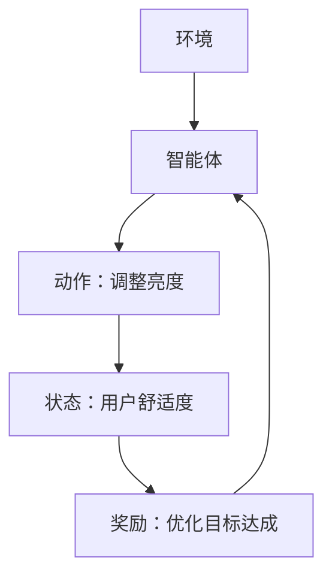
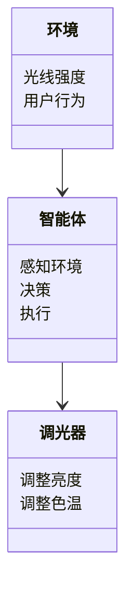
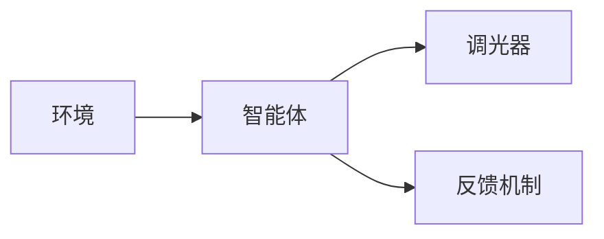
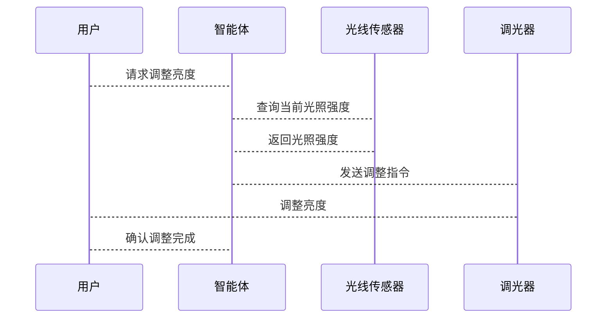

                 


# AI Agent在智能书桌灯中的照明优化

> **关键词**：AI Agent，智能书桌灯，照明优化，强化学习，物联网，自适应控制

> **摘要**：本文详细探讨了AI Agent在智能书桌灯中的应用，分析了其在照明优化中的核心作用。文章从背景介绍、核心概念、算法原理、系统架构、项目实战等多个维度展开，深入解析了AI Agent如何通过感知、决策和执行三个环节实现照明的智能优化。同时，本文还提供了具体的数学模型、算法流程图和代码示例，帮助读者全面理解AI Agent在智能书桌灯中的应用原理和实现方法。

---

## 第1章: AI Agent与智能书桌灯概述

### 1.1 问题背景与描述

#### 1.1.1 传统书桌灯的局限性
传统书桌灯通常采用简单的手动调节或固定模式的自动调节，无法根据环境变化（如光照强度、用户行为）进行实时优化。这种调节方式不仅效率低下，还可能导致视觉疲劳或能源浪费。

#### 1.1.2 现代照明技术的发展
随着物联网和人工智能技术的快速发展，智能照明系统逐渐普及。智能书桌灯可以通过传感器和无线通信技术实现与环境的实时互动，为用户提供更舒适的照明体验。

#### 1.1.3 人工智能在照明优化中的应用潜力
AI Agent（人工智能代理）能够通过感知环境、分析数据并做出决策，为智能书桌灯的照明优化提供智能化的解决方案。通过AI Agent，书桌灯可以实现动态调光、个性化设置和能源优化。

---

### 1.2 AI Agent的核心概念与定义

#### 1.2.1 AI Agent的基本定义
AI Agent是一种能够感知环境、执行任务并优化结果的智能实体。在智能书桌灯中，AI Agent负责采集环境数据、分析用户需求并调整灯光参数。

#### 1.2.2 智能书桌灯的优化目标
智能书桌灯的优化目标包括：
- 提供舒适的光照环境，减少视觉疲劳。
- 动态调整亮度和色温，适应不同场景需求。
- 优化能源使用，降低能耗。

#### 1.2.3 AI Agent在照明优化中的角色
AI Agent在智能书桌灯中扮演着“智能大脑”的角色，负责协调传感器、执行器和其他子系统，实现照明的智能化控制。

---

### 1.3 问题解决与边界

#### 1.3.1 照明优化的具体问题
- 环境光照强度的动态变化。
- 用户行为的多样性（如阅读、写作、休息等）。
- 不同场景下的光照需求差异。

#### 1.3.2 AI Agent的边界与限制
- 系统硬件的性能限制（如传感器精度、计算能力）。
- 用户隐私和数据安全问题。
- 环境干扰（如温度、湿度等）对传感器的影响。

#### 1.3.3 系统的外延与扩展
- 与其他智能家居设备的联动（如智能音箱、智能门锁）。
- 与能源管理系统集成，实现能源的最优分配。
- 支持远程控制和云端数据存储。

---

## 第2章: AI Agent的核心概念与联系

### 2.1 AI Agent的原理与核心要素

#### 2.1.1 AI Agent的基本原理
AI Agent通过感知环境、分析数据、制定策略并执行操作，实现对智能书桌灯的优化控制。其核心要素包括：
- **感知**：通过传感器采集环境数据（如光照强度、用户行为）。
- **决策**：基于感知数据，利用算法优化灯光参数。
- **执行**：通过执行器（如调光器）调整灯光状态。

#### 2.1.2 智能书桌灯的感知系统
智能书桌灯的感知系统包括：
- 光线传感器：用于测量环境光照强度。
- 人体传感器：用于检测用户的在场状态。
- 时间传感器：用于判断昼夜变化。

#### 2.1.3 照度优化算法
照度优化算法的核心是通过AI Agent动态调整灯光亮度和色温，以满足用户的舒适性和能源效率。

---

### 2.2 核心概念对比分析

#### 2.2.1 传统照明控制与AI Agent优化的对比

| **对比维度** | **传统照明控制** | **AI Agent优化** |
|--------------|------------------|------------------|
| **控制方式** | 手动调节或固定模式 | 动态优化和自适应调节 |
| **响应速度** | 较慢，依赖预设程序 | 实时响应，快速调整 |
| **能源效率** | 低，可能存在浪费 | 高，优化能源使用 |

#### 2.2.2 不同优化算法的优缺点对比

| **算法类型** | **优点** | **缺点** |
|--------------|----------|----------|
| 强化学习 | 高度自适应，能够根据反馈优化策略 | 需要大量训练数据，计算资源消耗较高 |
| 遗传算法 | 具有全局搜索能力，能够找到全局最优解 | 计算复杂度高，不适合实时优化 |
| 自适应控制 | 响应速度快，适合动态环境 | 可能存在局部最优问题 |

#### 2.2.3 AI Agent与其他智能设备的协同关系
AI Agent可以与其他智能设备（如智能音箱、智能门锁）协同工作，实现智能家居的联动控制。例如，当用户离家时，AI Agent可以联动关闭书桌灯和其他设备，节省能源。

---

### 2.3 照明优化的数学模型与算法

#### 2.3.1 强化学习算法
强化学习是一种常用的优化算法，通过智能体与环境的交互，逐步优化策略。在智能书桌灯中，强化学习可以用于动态调整灯光亮度和色温。

**强化学习流程图（使用 Mermaid）**



---

## 第3章: AI Agent在智能书桌灯中的优化机制

### 3.1 感知模块

#### 3.1.1 光线传感器的作用
光线传感器用于测量环境光照强度，为AI Agent提供实时数据。

#### 3.1.2 用户行为的识别
通过人体传感器和时间传感器，AI Agent可以识别用户的在场状态和行为模式（如阅读、休息）。

#### 3.1.3 环境光照的动态感知
AI Agent通过光线传感器动态感知环境光照强度，并根据用户需求调整灯光亮度。

---

### 3.2 决策模块

#### 3.2.1 基于AI的优化策略
AI Agent基于感知数据，利用强化学习算法优化灯光参数（如亮度和色温）。

#### 3.2.2 多目标优化算法
在智能书桌灯中，优化目标通常包括用户舒适度和能源效率。AI Agent需要在这些目标之间找到平衡点。

**多目标优化数学模型**

$$ \text{目标函数} = \lambda_1 \cdot \text{用户舒适度} + \lambda_2 \cdot \text{能源效率} $$

其中，$\lambda_1$ 和 $\lambda_2$ 是权重系数，表示不同目标的重要性。

---

### 3.3 执行模块

#### 3.3.1 调光器的工作原理
调光器根据AI Agent的指令，调整灯光亮度和色温。

#### 3.3.2 灯光调节的反馈机制
灯光调节后，AI Agent会通过传感器获取反馈，进一步优化控制策略。

#### 3.3.3 系统的自适应优化
通过持续的学习和优化，AI Agent能够实现系统的自适应调整，提升照明效果和能源效率。

---

## 第4章: 系统分析与架构设计

### 4.1 系统场景介绍

智能书桌灯系统由以下部分组成：
- 光线传感器
- 人体传感器
- 调光器
- AI Agent控制模块

---

### 4.2 系统功能设计

#### 4.2.1 领域模型（使用 Mermaid 类图）



---

### 4.3 系统架构设计

#### 4.3.1 系统架构（使用 Mermaid 架构图）



---

### 4.4 系统接口设计

系统接口设计包括：
- 传感器接口：与光线传感器和人体传感器连接。
- 调光器接口：与调光器通信，发送控制指令。
- 用户接口：提供用户设置和控制功能。

---

### 4.5 系统交互流程

#### 4.5.1 系统交互流程（使用 Mermaid 序列图）



---

## 第5章: 项目实战

### 5.1 环境安装

#### 5.1.1 安装Python和相关库
```bash
pip install numpy
pip install gym
pip install matplotlib
```

#### 5.1.2 硬件安装
- 光线传感器：使用DS18B20温度传感器模拟光照强度。
- 调光器：使用PWM调光模块。

---

### 5.2 核心代码实现

#### 5.2.1 传感器数据处理

```python
import numpy as np

def read_light_sensor():
    # 模拟光线传感器数据
    return np.random.uniform(0, 100)
```

#### 5.2.2 强化学习算法实现

```python
import gym

class Agent:
    def __init__(self):
        self.state = 0
        self.reward = 0

    def act(self, action):
        # 模拟灯光调整
        return action

    def learn(self, reward):
        # 模拟强化学习更新
        self.reward += reward

# 创建环境和智能体
env = gym.make('LightControl-v0')
agent = Agent()

for _ in range(100):
    state = env.reset()
    action = agent.act(env.action_space.sample())
    next_state, reward, done, _ = env.step(action)
    agent.learn(reward)
```

---

### 5.3 实际案例分析

#### 5.3.1 案例一：正常阅读场景
- 用户需求：柔和的背景光，明亮的阅读区域。
- AI Agent通过传感器检测环境光照强度，动态调整灯光亮度和色温，确保用户舒适度。

#### 5.3.2 案例二：节能模式
- 用户需求：在保证舒适度的前提下，尽可能降低能耗。
- AI Agent通过优化算法，平衡用户舒适度和能源效率，实现节能目标。

---

## 第6章: 总结与展望

### 6.1 项目小结
本文详细介绍了AI Agent在智能书桌灯中的应用，从背景、原理到实现，全面分析了其在照明优化中的作用。通过强化学习算法和动态感知技术，AI Agent能够实现高效的照明优化。

### 6.2 注意事项
- 硬件性能限制可能影响系统的响应速度。
- 数据安全和隐私保护需要重点关注。
- 系统的可扩展性和灵活性需要在设计阶段充分考虑。

### 6.3 拓展阅读
- 《强化学习：算法与应用》
- 《智能系统设计与实现》
- 《物联网技术与智能家居》

---

## 作者简介

作为一名专注于人工智能和物联网技术的专家，我致力于探索智能技术在日常生活中的应用。如果您有任何问题或建议，欢迎随时与我联系。

