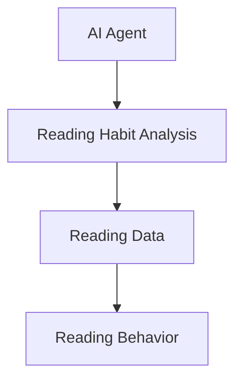
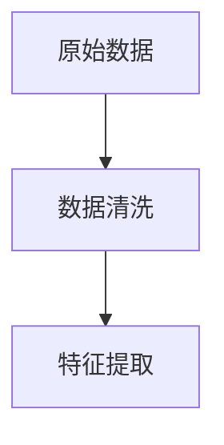
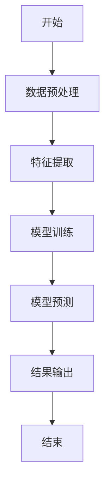
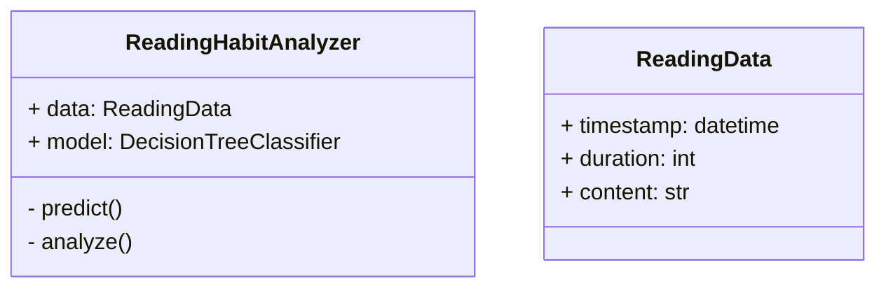
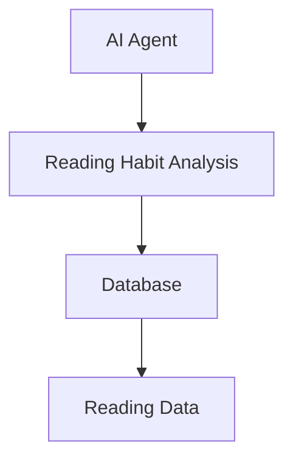
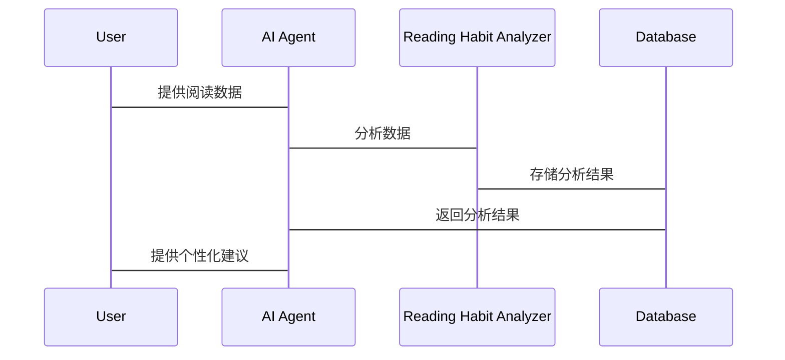

                 


# AI Agent在智能书立中的阅读习惯分析

## 关键词
- AI Agent, 智能书立, 阅读习惯分析, 机器学习, 算法原理, 系统架构, 项目实战

## 摘要
本文详细探讨AI Agent在智能书立中的应用，分析阅读习惯的核心概念、算法原理、系统架构及项目实战。通过理论与实践结合，帮助读者全面理解AI Agent如何赋能阅读习惯分析，提升智能书立的用户体验。

---

# 第1章: AI Agent与阅读习惯分析的背景

## 1.1 AI Agent的定义与核心概念

### 1.1.1 AI Agent的基本定义
AI Agent是一种能够感知环境、自主决策并执行任务的智能体。它具备自主性、反应性、目标驱动性和学习能力，能够在复杂环境中解决问题。

### 1.1.2 AI Agent的核心属性与特征
- **自主性**：AI Agent能够自主决策，无需外部干预。
- **反应性**：能够实时感知环境变化并做出反应。
- **目标驱动性**：具备明确的目标导向，能够优化决策以达到目标。
- **学习能力**：通过数据学习，不断优化自身的决策模型。

### 1.1.3 AI Agent在智能书立中的应用背景
AI Agent在智能书立中的应用，主要体现在阅读习惯分析、个性化推荐和阅读行为预测等方面。通过AI Agent，智能书立能够根据用户的阅读习惯，提供个性化的阅读建议和内容推荐。

## 1.2 阅读习惯分析的背景与意义

### 1.2.1 阅读习惯分析的定义
阅读习惯分析是指通过收集和分析用户的阅读行为数据，了解用户的阅读偏好、阅读频率、阅读时间等，从而提供个性化的阅读建议和内容推荐。

### 1.2.2 阅读习惯分析的核心目标
- 提供个性化的内容推荐，提升用户体验。
- 帮助用户发现潜在的阅读兴趣和习惯。
- 支持智能书立的运营策略，优化内容分发。

### 1.2.3 阅读习惯分析在智能书立中的应用价值
通过阅读习惯分析，智能书立能够更精准地了解用户需求，提供个性化服务，增强用户粘性，提升用户满意度。

## 1.3 AI Agent与阅读习惯分析的结合

### 1.3.1 AI Agent在阅读习惯分析中的作用
AI Agent能够实时感知用户的阅读行为，分析用户的阅读习惯，并根据分析结果提供个性化的阅读建议。

### 1.3.2 阅读习惯分析如何赋能智能书立
阅读习惯分析为智能书立提供了数据支持，帮助智能书立更好地了解用户需求，优化内容推荐和用户服务。

### 1.3.3 本章小结
本章介绍了AI Agent和阅读习惯分析的基本概念，分析了它们在智能书立中的应用背景和结合方式，为后续章节的深入探讨奠定了基础。

---

# 第2章: AI Agent与阅读习惯分析的核心概念

## 2.1 AI Agent的核心原理

### 2.1.1 AI Agent的基本工作原理
AI Agent通过感知环境、分析数据、制定决策并执行任务来实现目标。其核心在于数据的感知与分析能力。

### 2.1.2 AI Agent的感知与决策机制
AI Agent通过传感器或数据接口感知环境信息，利用算法进行数据处理和分析，生成决策，并通过执行器实现任务。

### 2.1.3 AI Agent的自我学习能力
AI Agent能够通过机器学习算法不断优化自身的决策模型，提升自身的智能水平。

## 2.2 阅读习惯分析的核心原理

### 2.2.1 阅读行为数据的采集与处理
通过收集用户的阅读时间、阅读频率、阅读时长等数据，进行数据清洗和特征提取。

### 2.2.2 阅读习惯的特征提取与建模
通过对阅读数据进行特征提取，构建阅读习惯分析的模型，用于预测用户的阅读偏好。

### 2.2.3 阅读习惯分析的算法选择
选择适合的算法，如决策树、随机森林、支持向量机等，进行阅读习惯的分类和预测。

## 2.3 AI Agent与阅读习惯分析的结合模型

### 2.3.1 AI Agent与阅读习惯分析的系统架构
AI Agent与阅读习惯分析结合的系统架构包括数据采集、数据处理、模型训练和决策执行四个模块。

### 2.3.2 阅读习惯分析对AI Agent的优化作用
阅读习惯分析为AI Agent提供了用户行为数据，帮助AI Agent更好地理解用户需求，优化决策模型。

### 2.3.3 本章小结
本章详细介绍了AI Agent和阅读习惯分析的核心原理，并分析了它们结合的系统架构和优化作用。

---

# 第3章: AI Agent与阅读习惯分析的核心概念对比

## 3.1 AI Agent与阅读习惯分析的属性对比

### 3.1.1 核心功能对比
| 功能 | AI Agent | 阅读习惯分析 |
|------|-----------|--------------|
| 数据处理 | 支持多种数据类型 | 专注于阅读行为数据 |
| 决策能力 | 具备自主决策能力 | 侧重于模式识别和分类 |

### 3.1.2 技术实现对比
| 技术 | AI Agent | 阅读习惯分析 |
|------|-----------|--------------|
| 数据源 | 多源数据 | 单一行为数据 |
| 处理方式 | 实时处理 | 离线分析为主 |

### 3.1.3 应用场景对比
| 场景 | AI Agent | 阅读习惯分析 |
|------|-----------|--------------|
| 实时交互 | 适合 | 适合 |
| 预测分析 | 适合 | 适合 |

## 3.2 AI Agent与阅读习惯分析的实体关系图

### 3.2.1 实体关系图的定义
实体关系图展示了系统中各个实体之间的关系，帮助我们更好地理解系统的组成和交互。

### 3.2.2 实体关系图的构建


### 3.2.3 实体关系图的分析
通过实体关系图可以看出，AI Agent与阅读习惯分析通过阅读数据进行交互，形成一个闭环系统。

---

# 第4章: AI Agent与阅读习惯分析的算法原理

## 4.1 数据预处理与特征提取

### 4.1.1 数据预处理


### 4.1.2 特征提取
通过特征提取，将原始数据转化为模型可识别的特征向量。

## 4.2 算法实现与流程

### 4.2.1 算法流程图


### 4.2.2 算法实现代码
```python
from sklearn.tree import DecisionTreeClassifier
from sklearn.model_selection import train_test_split

# 数据预处理
X = data.drop('target', axis=1)
y = data['target']

# 划分训练集和测试集
X_train, X_test, y_train, y_test = train_test_split(X, y, test_size=0.2)

# 模型训练
model = DecisionTreeClassifier()
model.fit(X_train, y_train)

# 模型预测
y_pred = model.predict(X_test)
```

### 4.2.3 算法数学模型
决策树分类的数学模型可以用以下公式表示：
$$ Gini = \sum_{i=1}^{n} P(i) \cdot (1 - P(i)) $$
其中，$P(i)$是第i个特征的概率。

---

# 第5章: AI Agent与阅读习惯分析的系统架构设计

## 5.1 问题场景介绍

### 5.1.1 系统目标
通过AI Agent分析用户的阅读习惯，提供个性化的阅读建议。

### 5.1.2 问题分析
用户阅读习惯分析需要考虑阅读时间、阅读频率、阅读内容等多个因素。

## 5.2 系统功能设计

### 5.2.1 领域模型类图


### 5.2.2 系统架构图


### 5.2.3 系统接口设计
系统接口包括数据接口、模型接口和用户接口。

### 5.2.4 系统交互流程图


---

# 第6章: AI Agent与阅读习惯分析的项目实战

## 6.1 环境安装与配置

### 6.1.1 安装Python
安装Python 3.8或更高版本。

### 6.1.2 安装机器学习库
安装scikit-learn、pandas、numpy等库。

## 6.2 系统核心实现代码

### 6.2.1 数据预处理代码
```python
import pandas as pd
import numpy as np

data = pd.read_csv('reading_data.csv')
data = data.dropna()
```

### 6.2.2 模型训练代码
```python
from sklearn.tree import DecisionTreeClassifier
from sklearn.model_selection import train_test_split

X = data.drop('target', axis=1)
y = data['target']

X_train, X_test, y_train, y_test = train_test_split(X, y, test_size=0.2)

model = DecisionTreeClassifier()
model.fit(X_train, y_train)
```

## 6.3 实际案例分析

### 6.3.1 数据分析与可视化
通过可视化工具分析用户的阅读时间分布、阅读频率等。

### 6.3.2 模型验证与优化
对模型进行验证，优化参数，提升准确率。

## 6.4 项目小结

### 6.4.1 项目总结
通过实际案例，展示了AI Agent在阅读习惯分析中的应用，验证了模型的有效性。

### 6.4.2 经验总结
数据预处理和特征提取是关键，模型选择和优化也非常重要。

---

# 第7章: AI Agent与阅读习惯分析的最佳实践

## 7.1 小结

### 7.1.1 核心内容回顾
总结了AI Agent与阅读习惯分析的核心概念、算法原理和系统架构。

## 7.2 注意事项

### 7.2.1 数据隐私保护
在实际应用中，需要注意用户的阅读数据隐私保护。

### 7.2.2 算法优化
根据实际需求，不断优化算法模型，提升准确率。

## 7.3 拓展阅读

### 7.3.1 推荐资源
推荐相关的书籍和论文，供读者进一步学习。

---

# 附录

## 附录A: 术语表
列出本文中使用的术语及其定义。

## 附录B: 工具安装指南
详细说明如何安装和配置开发环境。

## 附录C: 数据集信息
提供数据集的描述和获取方式。

---

通过以上大纲，我们可以系统地了解AI Agent在智能书立中的阅读习惯分析，从理论到实践，全面掌握相关知识。

