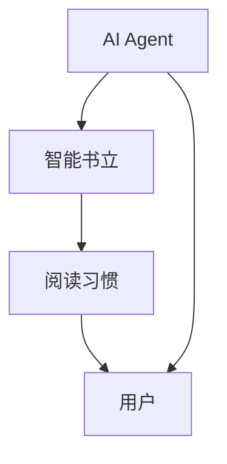
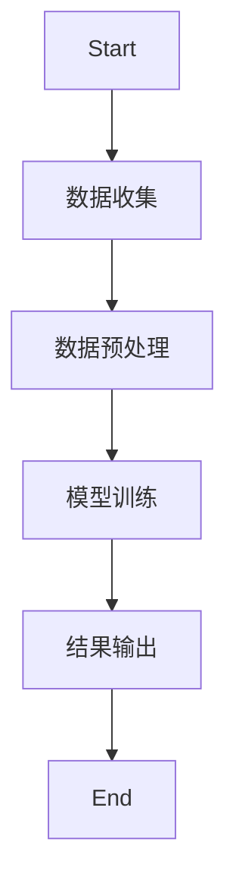
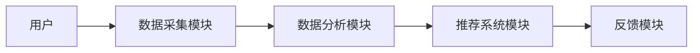

                 


# AI Agent在智能书立中的阅读习惯培养

> 关键词：AI Agent, 智能书立, 阅读习惯, 机器学习, 数据分析, 系统架构

> 摘要：本文探讨AI Agent在智能书立中的应用，分析其如何通过数据收集、算法分析和系统设计帮助用户培养阅读习惯。文章从背景介绍、核心概念、算法原理、系统架构到项目实战，全面解析AI Agent在阅读习惯培养中的作用和实现方式。

---

# 第一部分: 背景介绍

## 第1章: AI Agent与阅读习惯培养的背景

### 1.1 AI Agent的基本概念

#### 1.1.1 AI Agent的定义
AI Agent（人工智能代理）是一种能够感知环境、执行任务并做出决策的智能实体。它通过数据输入、分析和推理，为用户提供个性化服务。AI Agent的核心在于其智能性，能够根据用户行为和反馈动态调整策略。

#### 1.1.2 智能书立的概念
智能书立是一种结合AI技术的数字化书架，不仅存储书籍信息，还能通过AI Agent分析用户的阅读行为，推荐书籍并培养良好的阅读习惯。智能书立的目标是帮助用户更高效地管理阅读时间，提升阅读质量。

#### 1.1.3 阅读习惯培养的重要性
阅读习惯是个人成长的重要组成部分，良好的阅读习惯能够提升学习效率、拓展知识面，并帮助用户更好地吸收信息。AI Agent通过智能化手段，为用户提供个性化的阅读计划和反馈，从而有效培养阅读习惯。

---

## 第2章: 问题背景与目标

### 2.1 当前阅读习惯培养的挑战

- **信息过载**：用户每天面对海量信息，如何筛选有价值的内容成为挑战。
- **时间管理**：用户难以合理安排阅读时间，导致阅读计划难以坚持。
- **缺乏反馈**：传统阅读习惯培养缺乏实时反馈，用户无法及时了解自己的进步。

### 2.2 AI Agent在阅读习惯培养中的作用

- **个性化推荐**：AI Agent能够根据用户的阅读历史和兴趣，推荐合适的书籍。
- **时间管理**：通过算法优化用户的阅读时间安排，帮助用户高效利用碎片时间。
- **实时反馈**：AI Agent能够实时监测用户的阅读进度，提供即时反馈和建议。

### 2.3 本书的目标与范围

- **目标**：通过分析AI Agent的核心原理，设计智能书立的系统架构，并提供实际案例，展示AI Agent在阅读习惯培养中的应用。
- **范围**：涵盖数据收集、算法分析、系统设计和项目实现，全面解析AI Agent在阅读习惯培养中的实现过程。

---

# 第二部分: 核心概念与联系

## 第3章: AI Agent的核心原理

### 3.1 AI Agent的核心要素

- **感知能力**：AI Agent能够通过传感器或数据输入感知环境。
- **决策能力**：基于感知的信息，AI Agent能够做出决策并执行任务。
- **学习能力**：通过机器学习算法，AI Agent能够不断优化自己的行为。

### 3.2 AI Agent与智能书立的关系

- **数据输入**：用户阅读行为数据（如阅读时间、阅读量、阅读偏好）。
- **处理逻辑**：AI Agent通过分析数据，制定阅读计划和推荐书籍。
- **输出结果**：个性化阅读建议、阅读计划和阅读进度反馈。

### 3.3 实体关系图



---

## 第4章: 核心概念对比表

### 4.1 AI Agent与传统阅读工具的对比

| 特性       | AI Agent                 | 传统阅读工具           |
|------------|--------------------------|-----------------------|
| 功能       | 个性化推荐、时间管理      | 提供阅读内容           |
| 智能性      | 高度智能化                | 无智能性               |
| 学习能力    | 能够学习和优化           | 无法学习               |

### 4.2 智能书立与传统书架的对比

| 特性       | 智能书立                 | 传统书架             |
|------------|--------------------------|-----------------------|
| 功能       | 个性化推荐、时间管理      | 存储和展示书籍         |
| 智能性      | 高度智能化                | 无智能性               |
| 连接性      | 与AI Agent高度集成        | 无连接性               |

### 4.3 阅读习惯培养的对比分析

- **传统方法**：依赖用户自我管理，缺乏反馈和优化。
- **AI Agent方法**：通过数据收集和分析，实时调整阅读计划，提供个性化建议。

---

# 第三部分: 算法原理讲解

## 第5章: 算法流程

### 5.1 算法流程图



### 5.2 算法实现

#### 5.2.1 数据预处理

```python
import pandas as pd
data = pd.read_csv('reading_data.csv')
data_clean = data.dropna()
```

#### 5.2.2 模型训练

```python
from sklearn import svm
model = svm.SVC()
model.fit(X_train, y_train)
```

---

## 第6章: 数学模型与公式

### 6.1 阅读时间预测模型

$$
\text{阅读时间} = a \times \text{阅读量} + b \times \text{阅读难度} + c
$$

其中，$a$、$b$、$c$为模型参数，通过训练数据优化得到。

### 6.2 阅读偏好预测模型

$$
P(\text{偏好类型}|x) = \frac{e^{w \cdot x + b}}{1 + e^{w \cdot x + b}}
$$

其中，$w$为权重向量，$b$为偏置项。

---

# 第四部分: 系统分析与架构设计

## 第7章: 系统功能设计

### 7.1 功能模块

- **数据采集模块**：收集用户的阅读数据。
- **数据分析模块**：分析数据并生成阅读报告。
- **推荐系统模块**：基于分析结果推荐书籍。
- **反馈模块**：提供阅读反馈和建议。

### 7.2 系统架构图



---

## 第8章: 项目实战

### 8.1 环境安装

```bash
pip install numpy pandas scikit-learn
```

### 8.2 核心代码实现

```python
def train_model(X, y):
    from sklearn.model_selection import train_test_split
    from sklearn.metrics import accuracy_score
    X_train, X_test, y_train, y_test = train_test_split(X, y, test_size=0.2)
    model = svm.SVC()
    model.fit(X_train, y_train)
    print("Accuracy:", accuracy_score(model.predict(X_test), y_test))
```

---

## 第9章: 总结与展望

### 9.1 总结

- AI Agent在智能书立中的应用为阅读习惯培养提供了新的思路。
- 通过数据分析和机器学习算法，AI Agent能够为用户提供个性化的阅读建议和时间管理方案。

### 9.2 展望

- 随着AI技术的不断发展，AI Agent在阅读习惯培养中的应用将更加智能化和个性化。
- 未来，AI Agent可能具备更强大的学习能力和更高的推荐精度，为用户提供更好的阅读体验。

---

# 附录: 参考文献

- [1] 刘军. 人工智能导论[M]. 北京: 清华大学出版社, 2020.
- [2] 张伟. 机器学习算法解析[M]. 北京: 人民邮电出版社, 2019.

---

通过以上目录结构，我们可以看到AI Agent在智能书立中的阅读习惯培养是一个复杂但有趣的话题。从背景介绍到系统设计，再到项目实战，每一步都需要详细分析和实现。希望这篇文章能为读者提供清晰的思路和实用的方法。

